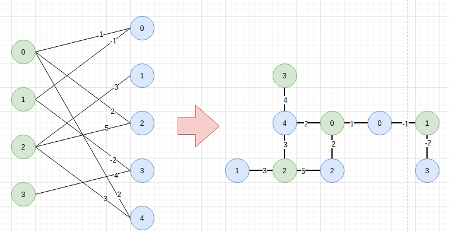
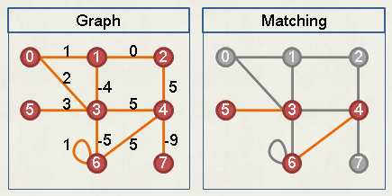
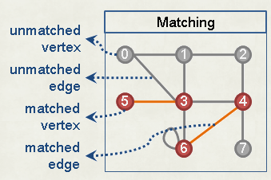
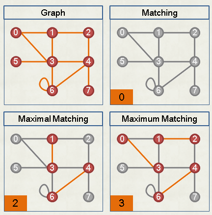
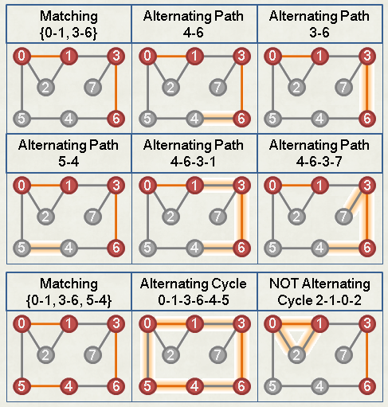
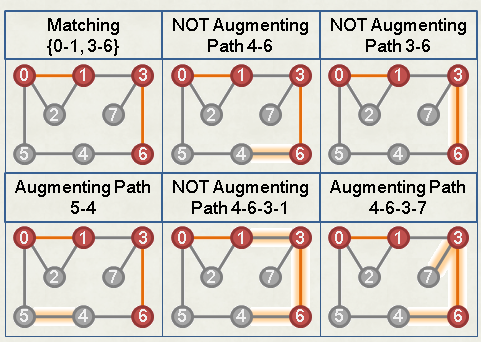

#程序算法 

[toc]

km算法是用于解决加权二分图中的最小匹配问题的,即所有边的权重和最小,它要求二分图两边的点数一样,即代价矩阵是一个方阵.若要解决的问题是最大匹配,可以将所有权重取反.

# 步骤
1. 构建代价矩阵
2. 预处理:每行减去当前行最小值,保证每行最少有一个0, 然后每列减去当前列最小值
3. 用最少的横线或者竖线覆盖所有 0. 
4. 若线数量等于节点数量,停止循环转第6步,否则转到第5步
5. 找到所有未被线覆盖的元素中最小值,然后所有未被线覆盖元素减去最小值,所有线的交叉点加上最小值,然后转第3步.
6. 对最终矩阵选出最小匹配,优先选每行唯一的0,这个代表了两个节点一一对应,然后忽略对应的行和类,即去除已经匹配的节点,重复这一步

# 实际数学编程步骤如下:
- <https://www.cnblogs.com/logosG/p/logos.html>
- <https://oi-wiki.org/graph/graph-matching/bigraph-weight-match/>
- <https://web.ntnu.edu.tw/~algo/Matching.html>

# 匈牙利树解 KM 算法

## 二分图
二分图是无向图的一种,判断一个无向图是不是二分图,即看点之间的染色是否可以间隔起来.

寻找二分图上最大权最大匹配可以转换成网络流来解决.

## 几个概念理解

**匹配(Matching)**  

一张无向图上挑选一些边,让图上每个点至多接触一条边,那么这些边构成的集合,就被称为**匹配**.    

**匹配点(matched vertex),未匹配点(unmatched vertex),匹配边(matched edge),未匹配边(unmatched edge)**  

图中接触一条匹配边的点是**匹配点**,零条匹配边的点是**未匹配点**,两个匹配点构成的边是**匹配边**,除此之后都是**未匹配边**.

**基数(cardinality)**
一个匹配拥有的匹配边的数目称为 **基数**,比如图2 中基数为2.

**极大匹配(maximal matching),最大匹配(maximum matching),完美匹配(perfect matching)**
- 一张图中,无法直接增加配对树的匹配叫**极大匹配**
- 一张图中,配对数最多的匹配叫**最大匹配**
- 一张图中,所有点都配上的匹配叫**完美匹配**,完美匹配一定是最大匹配.

**交错路径(Alternating Path),交错环(Alternating Cycle)**   
在一张存在匹配的图上,匹配边和未匹配边彼此相见的一条路径和一个环.  

交错换的一个特性是,颠倒环上匹配边和未匹配边,可以改变匹配,但是不影响基数.

**扩充路径(Augmenting Path)**  
属于交错路径,其中异地个点和最后一个点都是未匹配点.
   

其一个重要特性:颠倒扩充路径上匹配边和未匹配边,可以改变匹配并使基数+1.

## 扩充路径定理
任取图上一未匹配点,若找不到以此点作为端点的扩充路径,那么此图上一些最大匹配不会包含此点,即删除此点,依然可以从图上找到原图上的一些最大匹配.  

由此,我们可以想到,要找到图中最大匹配,可以不断的删除找不到扩充路径的未匹配点,直到所有的未匹配点消失,此时产生一个最大匹配.因为所有的未匹配点根据以上定理,要么变成匹配点,要么被删除.

另外一个角度理解,即一个匹配若找不到扩充路径,那么它就是最大匹配.   

这告诉我们可以不断找扩充路径,直到找不到为止,此时匹配就是最大匹配.  

找最大无权匹配算法,可以使用匈牙利算法,网络流,Hopcroft-Karp 算法(最快).

## Kuhn-Munkers 算法
用途:求一张二分图中其中一个最大权完美二分匹配.  

一个重要性质是:一个点链接的所有边,等量的增加或减少权重,都不会影响最大权完美匹配的为止.

这样,我们给每点都创建一个变数(vertex labeling),直接在点上调整权重,就可以替代在边上调整权重节省,调整权重的时间.  

我们建立一组 vertex labeling,让图上每一条边其两端点的权重综合,大于等于边的权重.那么所有点的权重和,是大于等于任意匹配的权重(所有匹配边的权重和).由此,我们尽量降低所有点的权重和,就能逼近最大权完美匹配的权重.即**求一组最小的 vertex labeling,可以得到最大权完美匹配.**

### 等边(Equality Edge)
两端点的权重相加等于边的权重.   

当 vertex labeling 的总和降低到极限,可以发现最大权完美匹配的所有匹配都是等边.

## 算法流程;
一、建立vertex labeling，使之滿足前述的大於等於性質。
二、一開始圖上所有點都是未匹配點。
三、X的每個未匹配點，依序嘗試作為等邊擴充路徑的端點。
　　以Graph Traversal建立等邊交錯樹。
　　（X的未匹配點一旦處理完畢，Y的未匹配點不會再有擴充路徑，故只需找X側。）
　甲、如果找得到等邊擴充路徑：
　　　沿著等邊擴充路徑修改現有匹配，以增加Cardinality。
　乙、如果找不到等邊擴充路徑，則製造新等邊：
　　　等邊交錯樹末梢的非等邊，算最小差值d。（有人稱作slack）
　　　樹上偶點減d，樹上奇點加d。樹梢新增了一條以上的等邊。

# 参考
- <https://www.bilibili.com/video/BV16K4y1X7Ph/?spm_id_from=trigger_reload>
- <https://github.com/mcximing/hungarian-algorithm-cpp>
