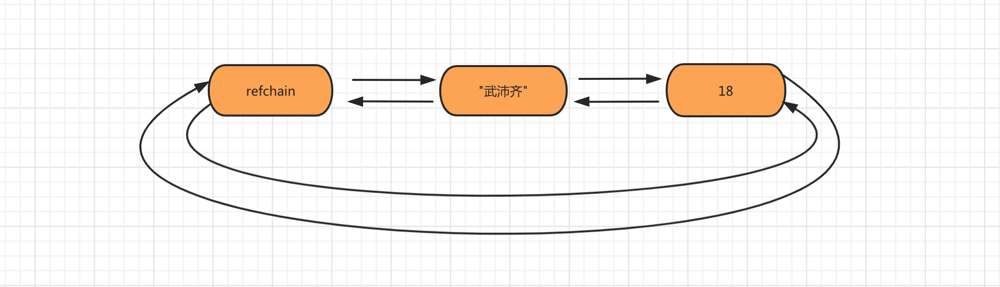
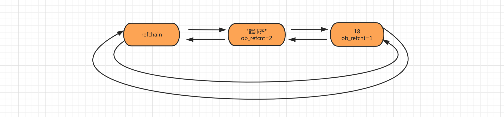
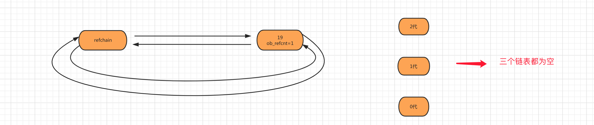
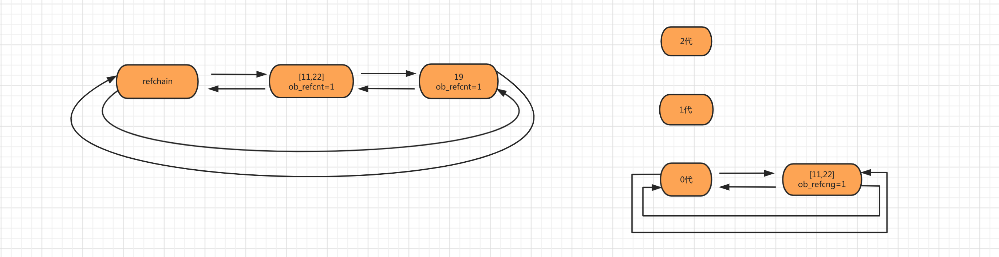
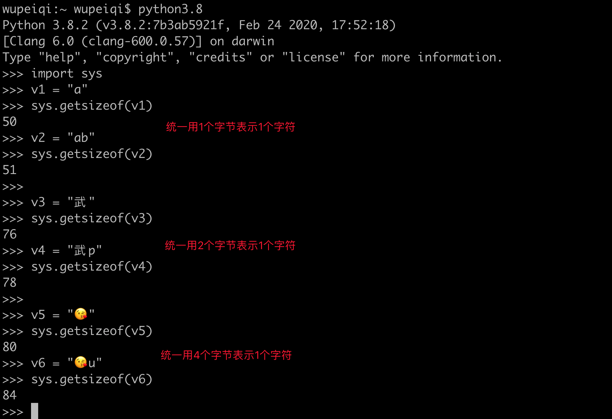

#python #垃圾回收
 原文地址:https://pythonav.com/wiki/detail/6/88/

[toc]

## 1. 白话垃圾回收

用通俗的语言解释内存管理和垃圾回收的过程，搞懂这一部分就可以去面试、去装逼了…

### 1.1 大管家 refchain

在 Python 的C源码中有一个名为 refchain 的`环状双向链表`，这个链表比较牛逼了，因为 Python 程序中一旦创建对象都会把这个对象添加到 refchain 这个链表中。也就是说他保存着所有的对象。例如：

```python
age = 18
name = "武沛齐"
```

[补图](https://raw.githubusercontent.com/captainfffsama/MarkDownPics/master/image/20201113100055.png)



### 1.2 引用计数器

在 refchain 中的所有对象内部都有一个 `ob_refcnt` 用来保存当前对象的引用计数器，顾名思义就是自己被引用的次数，例如：

```python
age = 18
name = "武沛齐"
nickname = name
```

上述代码表示内存中有 18 和 “武沛齐” 两个值，他们的引用计数器分别为：1、2 。

[补图2](https://raw.githubusercontent.com/captainfffsama/MarkDownPics/master/image/20201113100340.png)



当值被多次引用时候，不会在内存中重复创建数据，而是`引用计数器+1` 。 当对象被销毁时候同时会让`引用计数器-1`,如果引用计数器为0，则将对象从 refchain 链表中摘除，同时在内存中进行销毁（暂不考虑缓存等特殊情况）。

```python
age = 18
number = age  # 对象18的引用计数器 + 1
del age          # 对象18的引用计数器 - 1

def run(arg):
    print(arg)
    
run(number)   # 刚开始执行函数时，对象18引用计数器 + 1，当函数执行完毕之后，对象18引用计数器 - 1 。

num_list = [11,22,number] # 对象18的引用计数器 + 1
```

### 1.3 标记清除&分代回收

基于引用计数器进行垃圾回收非常方便和简单，但他还是存在 `循环引用` 的问题，导致无法正常的回收一些数据，例如：

```python
v1 = [11,22,33]        # refchain中创建一个列表对象，由于v1=对象，所以列表引对象用计数器为1.
v2 = [44,55,66]        # refchain中再创建一个列表对象，因v2=对象，所以列表对象引用计数器为1.

v1.append(v2)        # 把v2追加到v1中，则v2对应的[44,55,66]对象的引用计数器加1，最终为2.
v2.append(v1)        # 把v1追加到v1中，则v1对应的[11,22,33]对象的引用计数器加1，最终为2.

del v1    # 引用计数器-1
del v2    # 引用计数器-1
```

对于上述代码会发现，执行 `del` 操作之后，没有变量再会去使用那两个列表对象，但由于循环引用的问题，他们的引用计数器不为0，所以他们的状态：永远不会被使用、也不会被销毁。项目中如果这种代码太多，就会导致内存一直被消耗，直到内存被耗尽，程序崩溃。

为了解决循环引用的问题，引入了`标记清除`技术，专门针对那些可能存在循环引用的对象进行特殊处理，可能存在循环应用的类型有：列表、元组、字典、集合、自定义类等那些能进行数据嵌套的类型。

**标记清除**：创建特殊链表专门用于保存 列表、元组、字典、集合、自定义类等对象，之后再去检查这个链表中的对象是否存在循环引用，如果存在则让双方的引用计数器均 - 1 。

**分代回收**：对标记清除中的链表进行优化，将那些可能存在循引用的对象拆分到3个链表，链表称为：0/1/2三代，每代都可以存储对象和阈值，当达到阈值时，就会对相应的链表中的每个对象做一次扫描，除循环引用各自减1并且销毁引用计数器为0的对象。

```c
// 分代的C源码
#define NUM_GENERATIONS 3
struct gc_generation generations[NUM_GENERATIONS] = {    
    /* PyGC_Head,                                    threshold,    count */   
    {{(uintptr_t)_GEN_HEAD(0), (uintptr_t)_GEN_HEAD(0)},   700,        0}, // 0代    
    {{(uintptr_t)_GEN_HEAD(1), (uintptr_t)_GEN_HEAD(1)},   10,         0}, // 1代    
    {{(uintptr_t)_GEN_HEAD(2), (uintptr_t)_GEN_HEAD(2)},   10,         0}, // 2代
};
```

特别注意：0代和1、2代的 threshold 和 count 表示的意义不同。

- 0代，count 表示0代链表中对象的数量，threshold 表示0代链表对象个数阈值，超过则执行一次0代扫描检查。
- 1代，count 表示0代链表扫描的次数，threshold 表示0代链表扫描的次数阈值，超过则执行一次1代扫描检查。
- 2代，count 表示1代链表扫描的次数，threshold 表示1代链表扫描的次数阈值，超过则执行一2代扫描检查。

### 1.4 情景模拟

根据C语言底层并结合图来讲解内存管理和垃圾回收的详细过程。

第一步：当创建对象 `age=19` 时，会将对象添加到 refchain 链表中。

[补图3](https://raw.githubusercontent.com/captainfffsama/MarkDownPics/master/image/20201113101207.png)


第二步：当创建对象 `num_list = [11,22]` 时，会将列表对象添加到 refchain 和 generations 0代中。

[补图](https://raw.githubusercontent.com/captainfffsama/MarkDownPics/master/image/20201113101226.png)



第三步：新创建对象使 generations 的0代链表上的对象数量大于阈值700时，要对链表上的对象进行扫描检查。

当0代大于阈值后，底层不是直接扫描0代，而是先判断2、1是否也超过了阈值。

- 如果2、1代未达到阈值，则扫描0代，并让1代的 count + 1 。
- 如果2代已达到阈值，则将2、1、0三个链表拼接起来进行全扫描，并将2、1、0代的count重置为0.
- 如果1代已达到阈值，则讲1、0两个链表拼接起来进行扫描，并将所有1、0代的count重置为0.

对拼接起来的链表在进行扫描时，主要就是剔除循环引用和销毁垃圾，详细过程为：

- 扫描链表，把每个对象的引用计数器拷贝一份并保存到 `gc_refs` 中，保护原引用计数器。

- 再次扫描链表中的每个对象，并检查是否存在循环引用，如果存在则让各自的`gc_refs` 减 1 。

- 再次扫描链表，将 `gc_refs` 为 0 的对象移动到 `unreachable` 链表中；不为0的对象直接升级到下一代链表中。

- 处理 `unreachable` 链表中的对象的 析构函数 和 弱引用，不能被销毁的对象升级到下一代链表，能销毁的保留在此链表。

    - 析构函数，指的就是那些定义了 `__del__` 方法的对象，需要执行之后再进行销毁处理。
    - 弱引用.

- 最后将 `unreachable` 中的每个对象销毁并在 refchain 链表中移除（不考虑缓存机制）。

至此，垃圾回收的过程结束。

### 1.5 缓存机制

从上文大家可以了解到当对象的引用计数器为0时，就会被销毁并释放内存。而实际上他不是这么的简单粗暴，因为反复的创建和销毁会使程序的执行效率变低。Python 中引入了“缓存机制”机制。
例如：引用计数器为0时，不会真正销毁对象，而是将他放到一个名为 `free_list` 的链表中，之后会再创建对象时不会在重新开辟内存，而是在 free_list 中将之前的对象来并重置内部的值来使用。

- float 类型，维护的 free_list 链表最多可缓存100个 float 对象。

    ```python
    v1 = 3.14    # 开辟内存来存储float对象，并将对象添加到refchain链表。
    print( id(v1) ) # 内存地址：4436033488  
    del v1    # 引用计数器-1，如果为0则在rechain链表中移除，不销毁对象，而是将对象添加到float的free_list.  
    v2 = 9.999    # 优先去free_list中获取对象，并重置为9.999，如果free_list为空才重新开辟内存。  
    print( id(v2) ) # 内存地址：4436033488  
    
    # 注意：引用计数器为0时，会先判断free_list中缓存个数是否满了，未满则将对象缓存，已满则直接将对象销毁。
    ```
    
- int 类型，不是基于 free_list，而是维护一个 small_ints 链表保存常见数据（小数据池），小数据池范围：`-5 <= value < 257`。即：重复使用这个范围的整数时，不会重新开辟内存。

    ```python
    v1 = 38    # 去小数据池small_ints中获取38整数对象，将对象添加到refchain并让引用计数器+1。
    print( id(v1))  #内存地址：4514343712  
    v2 = 38 # 去小数据池small_ints中获取38整数对象，将refchain中的对象的引用计数器+1。  
    print( id(v2) ) #内存地址：4514343712  
    
    # 注意：在解释器启动时候-5~256就已经被加入到small_ints链表中且引用计数器初始化为1，代码中使用的值时直接去small_ints中拿来用并将引用计数器+1即可。另外，small_ints中的数据引用计数器永远不会为0（初始化时就设置为1了），所以也不会被销毁。
    ```

- str 类型，维护 `unicode_latin1[256]` 链表，内部将所有的 `ascii字符` 缓存起来，以后使用时就不再反复创建。

    ```python
    v1 = "A"  
    print( id(v1) ) # 输出：4517720496  
    del v1  
    v2 = "A"  
    print( id(v1) ) # 输出：4517720496  
    
    # 除此之外，Python内部还对字符串做了驻留机制，针对那么只含有字母、数字、下划线的字符串（见源码Objects/codeobject.c），如果内存中已存在则不会重新在创建而是使用原来的地址里（不会像free_list那样一直在内存存活，只有内存中有才能被重复利用）。  
    
    v1 = "wupeiqi"  
    v2 = "wupeiqi"  
    print(id(v1) == id(v2)) # 输出：True
    ```

- list 类型，维护的 free_list 数组最多可缓存80个list对象。

    ```python
    v1 = [11,22,33]  
    print( id(v1) ) # 输出：4517628816  
    del v1  
    v2 = ["武","沛齐"]  
    print( id(v2) ) # 输出：4517628816
    ```

- tuple 型，维护一个 free_list 数组且数组容量20，数组中元素可以是链表且每个链表最多可以容纳2000个元组对象。元组的 free_list 数组在存储数据时，是按照元组可以容纳的个数为索引找到 free_list 数组中对应的链表，并添加到链表中。

    ```python
    v1 = (1,2)  
    print( id(v1) )  
    del v1  # 因元组的数量为2，所以会把这个对象缓存到free_list[2]的链表中。  v2 = ("武沛齐","Alex")  # 不会重新开辟内存，而是去free_list[2]对应的链表中拿到一个对象来使用。  
    print( id(v2) )
    ```

- dict 类型，维护的 free_list 数组最多可缓存80个 dict 对象。

    ```python
    v1 = {"k1":123}  
    print( id(v1) )  # 输出：4515998128  
    del v1  
    v2 = {"name":"武沛齐","age":18,"gender":"男"}  
    print( id(v1) ) # 输出：4515998128
    ```

## 2. C语言源码分析

上文对 Python 的内存管理和垃圾回收进行了快速讲解，基本上已可以让你拿去装逼了。

接下来这一部分会让你更超神，我们要再在源码中来证实上文的内容。

### 2.1 两个重要的结构体

```c
#define PyObject_HEAD       PyObject ob_base;
#define PyObject_VAR_HEAD      PyVarObject ob_base;

// 宏定义，包含 上一个、下一个，用于构造双向链表用。(放到refchain链表中时，要用到)
#define _PyObject_HEAD_EXTRA            \
    struct _object *_ob_next;           \
    struct _object *_ob_prev;

typedef struct _object {    
    _PyObject_HEAD_EXTRA // 用于构造双向链表    
    Py_ssize_t ob_refcnt;  // 引用计数器    
    struct _typeobject *ob_type;    // 数据类型
} PyObject;

typedef struct {    
    PyObject ob_base;   // PyObject对象    
    Py_ssize_t ob_size; /* Number of items in variable part，即：元素个数 */
} PyVarObject;
```

这两个结构体 `PyObject` 和 `PyVarObject` 是基石，他们保存这其他数据类型公共部分，例如：每个类型的对象在创建时都有 PyObject 中的那4部分数据；list/set/tuple 等由多个元素组成对象创建时都有 PyVarObject 中的那5部分数据。

### 2.2 常见类型结构体

平时我们在创建一个对象时，本质上就是实例化一个相关类型的结构体，在内部保存值和引用计数器等。

- float 类型

    ```c
    typedef struct {      
        PyObject_HEAD      
        double ob_fval;  
    } PyFloatObject;
    ```

- int 类型

    ```c
    struct _longobject {      
        PyObject_VAR_HEAD      
        digit ob_digit[1];  
    };  
    /* Long (arbitrary precision) integer object interface */  
    
    typedef struct _longobject PyLongObject; /* Revealed in longintrepr.h */
    ```

- str 类型

    ```c
    typedef struct {      
        PyObject_HEAD      
        Py_ssize_t length;          /* Number of code points in the string */      
        Py_hash_t hash;             /* Hash value; -1 if not set */       
        struct {          
            unsigned int interned:2;          
            /* Character size:         
            - PyUnicode_WCHAR_KIND (0):           
                * character type = wchar_t (16 or 32 bits, depending on the platform)         
            - PyUnicode_1BYTE_KIND (1):           
                * character type = Py_UCS1 (8 bits, unsigned)  
                * all characters are in the range U+0000-U+00FF (latin1)
                * if ascii is set, all characters are in the range U+0000-U+007F             
                (ASCII), otherwise at least one character is in the range             
                U+0080-U+00FF          
            - PyUnicode_2BYTE_KIND (2):           
                * character type = Py_UCS2 (16 bits, unsigned)           
                * all characters are in the range U+0000-U+FFFF (BMP)           
                * at least one character is in the range U+0100-U+FFFF         
            - PyUnicode_4BYTE_KIND (4):           
                * character type = Py_UCS4 (32 bits, unsigned)           
                * all characters are in the range U+0000-U+10FFFF           
                * at least one character is in the range U+10000-U+10FFFF         
            */          
            unsigned int kind:3;          
            unsigned int compact:1;          
            unsigned int ascii:1;          
            unsigned int ready:1;          
            unsigned int :24;      
        } state;      
        wchar_t *wstr;              /* wchar_t representation (null-terminated) */  
    } PyASCIIObject;  
    
    typedef struct {      
        PyASCIIObject _base;      
        Py_ssize_t utf8_length;     
        /* Number of bytes in utf8, excluding the
        * terminating \0. */      
        char *utf8;                 /* UTF-8 representation (null-terminated) */      
        Py_ssize_t wstr_length;     
        /* Number of code points in wstr, possible
        * surrogates count as two code points. */  
    } PyCompactUnicodeObject;  
    
    typedef struct {      
        PyCompactUnicodeObject _base;      
        union {          
            void *any;          
            Py_UCS1 *latin1;          
            Py_UCS2 *ucs2;          
            Py_UCS4 *ucs4;      
        } data;                     /* Canonical, smallest-form Unicode buffer */  
    } PyUnicodeObject;
    ```

- list 类型

    ```c
    typedef struct {      
        PyObject_VAR_HEAD      
        PyObject **ob_item;      
        Py_ssize_t allocated;  
    } PyListObject;
    ```

- tuple 类型

    ```c
    typedef struct {      
        PyObject_VAR_HEAD      
        PyObject *ob_item[1];  
    } PyTupleObject;
    ```

- dict 类型

    ```c
    typedef struct {      
        PyObject_HEAD      
        Py_ssize_t ma_used;      
        PyDictKeysObject *ma_keys;      
        PyObject **ma_values;  
    } PyDictObject;
    ```

通过常见结构体可以基本了解到本质上每个对象内部会存储的数据。

扩展：在结构体部分你应该发现了 `str类型` 比较繁琐，那是因为 python 字符串在处理时需要考虑到编码的问题，在内部规定（见源码结构体）：

- 字符串只包含 ascii，则每个字符用1个字节表示，即：latin1
- 字符串包含中文等，则每个字符用2个字节表示，即：ucs2
- 字符串包含 emoji 等，则每个字符用4个字节表示，即：ucs4

[补图](https://raw.githubusercontent.com/captainfffsama/MarkDownPics/master/image/20201113102218.png)

### 2.3 Float 类型

#### 2.3.1 创建

```python
val = 3.14
```

类似于这样创建一个 float 对象时，会执行C源码中的如下代码：

```c
// Objects/floatobject.c

// 用于缓存float对象的链表
static PyFloatObject *free_list = NULL;
static int numfree = 0;

PyObject *PyFloat_FromDouble(double fval)
{
    // 如果free_list中有可用对象，则从free_list链表拿出来一个；否则为对象重新开辟内存。
    PyFloatObject *op = free_list;    
    if (op != NULL) {        
        free_list = (PyFloatObject *) Py_TYPE(op);        
        numfree--;    
    } 
    else {
        // 根据float类型的大小，为float对象新开辟内存。
        op = (PyFloatObject*) PyObject_MALLOC(sizeof(PyFloatObject));        
        if (!op)            
        return PyErr_NoMemory();    
    }    
    
    // 对float对象进行初始化，例如：引用计数器初始化为1、添加到refchain链表等。    
    /* Inline PyObject_New */    
    (void)PyObject_INIT(op, &PyFloat_Type);    
    
    // 对float对象赋值。即：op->ob_fval = 3.14    
    op->ob_fval = fval;    
    return (PyObject *) op;
}
```

```c
// Include/objimpl.h
#define PyObject_INIT(op, typeobj) \    
    ( Py_TYPE(op) = (typeobj), _Py_NewReference((PyObject *)(op)), (op) )
```

```c
// Objects/object.c

// 维护了所有对象的一个环状双向链表
static PyObject refchain = {&refchain, &refchain};

void _Py_AddToAllObjects(PyObject *op, int force)
{    
    if (force || op->_ob_prev == NULL) {        
        op->_ob_next = refchain._ob_next;
        op->_ob_prev = &refchain;        
        refchain._ob_next->_ob_prev = op;
        refchain._ob_next = op;    
    }
}

void _Py_NewReference(PyObject *op)
{    
    _Py_INC_REFTOTAL;    
    
    // 引用计数器初始化为1。    
    op->ob_refcnt = 1;    
    
    // 对象添加到双向链表refchain中。    
    _Py_AddToAllObjects(op, 1);    
    
    _Py_INC_TPALLOCS(op);}
```

#### 2.3.2 引用

```python
val = 3.14
data = val
```

在项目中如果出现这种引用关系时，会将原对象的引用计数器+1。
C源码执行流程如下：

```c
// Include/object.h

static inline void _Py_INCREF(PyObject *op)
{    
    _Py_INC_REFTOTAL;    
    
    // 对象的引用计数器 + 1    
    op->ob_refcnt++;
}

#define Py_INCREF(op) _Py_INCREF(_PyObject_CAST(op))
```

#### 2.3.3 销毁

```python
val = 3.14
del val
```

在项目中如果出现这种删除的语句，则内部会将引用计数器-1，如果引用计数器减为0，则进行缓存或垃圾回收。
C源码执行流程如下：

```c
// Include/object.h

static inline void _Py_DECREF(const char *filename, int lineno,
                              PyObject *op)
{
    (void)filename; /* may be unused, shut up -Wunused-parameter */
    (void)lineno; /* may be unused, shut up -Wunused-parameter */
    _Py_DEC_REFTOTAL;    
    // 引用计数器-1，如果引用计数器为0，则执行 _Py_Dealloc去缓存或垃圾回收。
    if (--op->ob_refcnt != 0) 
    {
#ifdef Py_REF_DEBUG        
        if (op->ob_refcnt < 0) {
            _Py_NegativeRefcount(filename, lineno, op);
        }
        
#endif
    }    
    else {        
        _Py_Dealloc(op);    
    }
}

#define Py_DECREF(op) _Py_DECREF(__FILE__, __LINE__, _PyObject_CAST(op))
```

```c
// Objects/object.c

void_Py_Dealloc(PyObject *op)
{    
    // 找到float类型的 tp_dealloc 函数    
    destructor dealloc = Py_TYPE(op)->tp_dealloc;    
    
    // 在refchain双向链表中摘除此对象。    
    _Py_ForgetReference(op);    
    
    // 执行float类型的 tp_dealloc 函数，去进行缓存或垃圾回收。    
    (*dealloc)(op);
}

void_Py_ForgetReference(PyObject *op)
{    
    ...    
    // 在refchain链表中移除此对象    
    op->_ob_next->_ob_prev = op->_ob_prev;    
    op->_ob_prev->_ob_next = op->_ob_next;    
    op->_ob_next = op->_ob_prev = NULL;    
    _Py_INC_TPFREES(op);
}
```

```c
// Objects/floatobject.c
#define PyFloat_MAXFREELIST    100
static int numfree = 0;
static PyFloatObject *free_list = NULL;

// float类型中函数的对应关系
PyTypeObject PyFloat_Type = {    
    PyVarObject_HEAD_INIT(&PyType_Type, 0)    
    "float",    
    sizeof(PyFloatObject),
    0,    
    // tp_dealloc表示执行float_dealloc方法    
    (destructor)float_dealloc,    /* tp_dealloc */    
    0,   /* tp_print */    
    ...
};

static void float_dealloc(PyFloatObject *op)
{    
    // 检测是否是float类型    
    if (PyFloat_CheckExact(op)) {        
        
        // 检测free_list中缓存的个数是否已满，如果已满，则直接将对象销毁。        
        if (numfree >= PyFloat_MAXFREELIST)  {            
            // 销毁            
            PyObject_FREE(op);            
            return;        
        }        
        // 将对象加入到free_list链表中        
        numfree++;        
        Py_TYPE(op) = (struct _typeobject *)free_list;        
        free_list = op;    
    }    
    else        
        Py_TYPE(op)->tp_free((PyObject *)op);
}
```

### 2.4 int 类型

#### 2.4.1 创建

```python
age = 19
```

当在 python 中创建一个整型数据时，底层会触发他的如下源码:

```c
PyObject *PyLong_FromLong(long ival)
{    
    PyLongObject *v;    
    ...    
    // 优先去小数据池中检查，如果在范围内则直接获取不再重新开辟内存。（ -5 <= value < 257）    
    CHECK_SMALL_INT(ival);    
    ...    
    // 非小数字池中的值，重新开辟内存并初始化    
    v = _PyLong_New(ndigits);    
    if (v != NULL) {        
        digit *p = v->ob_digit;        
        Py_SIZE(v) = ndigits*sign;        
        t = abs_ival;        
        ...    
    }    
    return (PyObject *)v;
}


#define NSMALLNEGINTS           5
#define NSMALLPOSINTS           257
#define CHECK_SMALL_INT(ival) \    
    do if (-NSMALLNEGINTS <= ival && ival < NSMALLPOSINTS) { \
        return get_small_int((sdigit)ival); \    
    } while(0)
    
static PyObject *get_small_int(sdigit ival)
{    
    PyObject *v;    
    v = (PyObject *)&small_ints[ival + NSMALLNEGINTS];    
    // 引用计数器 + 1    
    Py_INCREF(v);    
    ...    
    return v;
}

PyLongObject *_PyLong_New(Py_ssize_t size)
{    
    // 创建PyLongObject的指针变量    
    PyLongObject *result;    
    ...    
    // 根据长度进行开辟内存    
    result = PyObject_MALLOC(offsetof(PyLongObject, ob_digit) +
                                 size*sizeof(digit));    
    ...    
    // 对内存中的数据进行初始化并添加到refchain链表中。    
    return (PyLongObject*)PyObject_INIT_VAR(result, &PyLong_Type, size);
}
```

```c
// Include/objimpl.h

#define PyObject_NewVar(type, typeobj, n) \
                ( (type *) _PyObject_NewVar((typeobj), (n)) )
                
static inline PyVarObject *_PyObject_INIT_VAR(PyVarObject *op, PyTypeObject *typeobj, Py_ssize_t size)
{
    assert(op != NULL);
    Py_SIZE(op) = size;
    // 对象初始化
    PyObject_INIT((PyObject *)op, typeobj);
   return op;
}

#define PyObject_INIT(op, typeobj) \
    _PyObject_INIT(_PyObject_CAST(op), (typeobj))
    
static inline PyObject *_PyObject_INIT(PyObject *op, PyTypeObject *typeobj)
{
    assert(op != NULL);
    Py_TYPE(op) = typeobj;
    if (PyType_GetFlags(typeobj) & Py_TPFLAGS_HEAPTYPE) 
    {
        Py_INCREF(typeobj);
    }    
    // 对象初始化，并把对象加入到refchain链表。
    _Py_NewReference(op);
    return op;
}
```

```c
// Objects/object.c
// 维护了所有对象的一个环状双向链表
static PyObject refchain = {&refchain, &refchain};


void _Py_AddToAllObjects(PyObject *op, int force)
{    
    if (force || op->_ob_prev == NULL) 
    {
        op->_ob_next = refchain._ob_next;
        op->_ob_prev = &refchain;
        refchain._ob_next->_ob_prev = op;
        refchain._ob_next = op;
    }
}

void _Py_NewReference(PyObject *op)
{
    _Py_INC_REFTOTAL;    
    
    // 引用计数器初始化为1。
    op->ob_refcnt = 1;    
    
    // 对象添加到双向链表refchain中。
    _Py_AddToAllObjects(op, 1);

    _Py_INC_TPALLOCS(op);
}
```

#### 2.4.2 引用

```python
value = 69
data = value
```

类似于出现这种引用关系时，内部其实就是将对象的引用计数器+1，源码同 float 类型引用。

#### 2.4.3 销毁

```python
value = 699
del value
```

在项目中如果出现这种删除的语句，则内部会将引用计数器-1，如果引用计数器减为0，则直接进行垃圾回收。（int 类型是基于小数据池而不是 free_list 做的缓存，所以不会在销毁时缓存数据）。
C源码执行流程如下：

```c
// Include/object.h

static inline void _Py_DECREF(const char *filename, int lineno,
                              PyObject *op)
{
    (void)filename; /* may be unused, shut up -Wunused-parameter */
    (void)lineno; /* may be unused, shut up -Wunused-parameter */
    _Py_DEC_REFTOTAL;
    // 引用计数器-1，如果引用计数器为0，则执行 _Py_Dealloc去垃圾回收。
    if (--op->ob_refcnt != 0) 
    {
#ifdef Py_REF_DEBUG
        if (op->ob_refcnt < 0) 
        {
            _Py_NegativeRefcount(filename, lineno, op);
        }
#endif
    }
    else 
    {
        _Py_Dealloc(op);
    }
}

#define Py_DECREF(op) _Py_DECREF(__FILE__, __LINE__, _PyObject_CAST(op))
```

```c
// Objects/object.c

void _Py_Dealloc(PyObject *op)
{
    // 找到int类型的 tp_dealloc 函数（int类中没有定义tp_dealloc函数，需要去父级PyBaseObject_Type中找tp_dealloc函数）
    
    // 此处体现所有的类型都继承object
    destructor dealloc = Py_TYPE(op)->tp_dealloc;
    
    // 在refchain双向链表中摘除此对象。
    _Py_ForgetReference(op);
    
    // 执行int类型的 tp_dealloc 函数，去进行垃圾回收。
    (*dealloc)(op);
}

void _Py_ForgetReference(PyObject *op)
{
    ...
    // 在refchain链表中移除此对象
    op->_ob_next->_ob_prev = op->_ob_prev;
    op->_ob_prev->_ob_next = op->_ob_next;
    op->_ob_next = op->_ob_prev = NULL;
    _Py_INC_TPFREES(op);
}
```

```c
// Objects/longobjet.c

PyTypeObject PyLong_Type = {
    PyVarObject_HEAD_INIT(&PyType_Type, 0)
    "int",                                      /* tp_name */
    offsetof(PyLongObject, ob_digit),           /* tp_basicsize */
    sizeof(digit),                              /* tp_itemsize */
    0,                                          /* tp_dealloc */
      ...
    PyObject_Del,                               /* tp_free */
};
```

```c
Objects/typeobject.c
PyTypeObject PyBaseObject_Type = {
    PyVarObject_HEAD_INIT(&PyType_Type, 0)
    "object",                                   /* tp_name */
    sizeof(PyObject),                           /* tp_basicsize */
    0,                                          /* tp_itemsize */
    object_dealloc,                             /* tp_dealloc */
        ...
    PyObject_Del,                               /* tp_free */
};

static void object_dealloc(PyObject *self)
{
    // 调用int类型的 tp_free，即：PyObject_Del去销毁对象。
    Py_TYPE(self)->tp_free(self);
}
```

### 2.5 str 类型

#### 2.5.1 创建

```python
name = "武沛齐"
```

当在 python 中创建一个字符串数据时，底层会触发他的如下源码:

```c
Objects/unicodeobject.c

PyObject *PyUnicode_DecodeUTF8Stateful(const char *s,Py_ssize_t size,const char *errors,Py_ssize_t *consumed){
    return unicode_decode_utf8(s, size, _Py_ERROR_UNKNOWN, errors, consumed);
}

static PyObject *
unicode_decode_utf8(const char *s, Py_ssize_t size,_Py_error_handler error_handler, const char *errors,Py_ssize_t *consumed);
{
    ...
    // 如果字符串长度为1，并且是ascii字符，直接去缓存链表 *unicode_latin1[256] 中获取。
    if (size == 1 && (unsigned char)s[0] < 128) 
    {
        if (consumed)
            *consumed = 1;        
        return get_latin1_char((unsigned char)s[0]);
    }
    // 对传入的utf-8的字节进行处理，并选择合适的方式转换成unicode字符串。（latin2/ucs2/ucs4）。
    
        ...

    return _PyUnicodeWriter_Finish(&writer);
}

static PyObject 
*get_latin1_char(unsigned char ch)
{
    PyObject *unicode = unicode_latin1[ch];
    if (!unicode) 
    {
        unicode = PyUnicode_New(1, ch);
        if (!unicode)
            return NULL;
        PyUnicode_1BYTE_DATA(unicode)[0] = ch;
        assert(_PyUnicode_CheckConsistency(unicode, 1));
        unicode_latin1[ch] = unicode;
    }
    Py_INCREF(unicode);
    return unicode;
}

PyObject *
_PyUnicodeWriter_Finish(_PyUnicodeWriter *writer)
{
    PyObject *str;
    // 写入值到str
    str = writer->buffer;
    writer->buffer = NULL;
    
    if (writer->readonly) 
    {
        assert(PyUnicode_GET_LENGTH(str) == writer->pos);
        return str;
    }
    
    if (PyUnicode_GET_LENGTH(str) != writer->pos) 
    {
        PyObject *str2;
        // 创建对象
        str2 = resize_compact(str, writer->pos);
        if (str2 == NULL) 
        {
            Py_DECREF(str);
            return NULL;
        }
        str = str2;
    }
    
    assert(_PyUnicode_CheckConsistency(str, 1));
    return unicode_result_ready(str);
}

static PyObject 
*resize_compact(PyObject *unicode, Py_ssize_t length)
{
    ...
    // 开辟内存
    new_unicode = (PyObject *)PyObject_REALLOC(unicode, new_size);
    if (new_unicode == NULL) 
    {
        _Py_NewReference(unicode);
        PyErr_NoMemory();
        return NULL;    
    }
    unicode = new_unicode;
    // 把对象加入到refchain链表
    _Py_NewReference(unicode);
    ...
    return unicode;
}
```

在字符串中除了会执行上述代码之外，还会执行以下代码实现内部的驻留机制。为了更好的理解，你可以认为驻留机制：将字符串保存到一个名为 interned 的字典中，以后再使用时 `直接去字典中获取不再需要创建。`

实际在源码中每次都会创建新的字符串，只不过在内部检测是否已驻留到 interned 中，如果在则使用 interned 内部的原来的字符串，把新创建的字符串当做垃圾去回收。

```c
Objects/unicodeobject.c

void PyUnicode_InternInPlace(PyObject **p)
{
    PyObject *s = *p;
    PyObject *t;
#ifdef Py_DEBUG
    assert(s != NULL);
    assert(_PyUnicode_CHECK(s));
#else
    if (s == NULL || !PyUnicode_Check(s))
        return;
#endif
    /* If it's a subclass, we don't really know what putting
        it in the interned dict might do. */
    if (!PyUnicode_CheckExact(s))
        return;
    if (PyUnicode_CHECK_INTERNED(s))
        return;
    if (interned == NULL) 
    {
        interned = PyDict_New();
            if (interned == NULL) 
            {
                PyErr_Clear(); /* Don't leave an exception */
                return;
            }
    }

    Py_ALLOW_RECURSION
    // 将新字符串驻留到interned字典中，不存在则驻留，已存在则不再重复驻留。
    t = PyDict_SetDefault(interned, s, s);
    Py_END_ALLOW_RECURSION
    if (t == NULL) 
    {
        PyErr_Clear();
        return;
    }
    // 存在，使用已驻留的字符串 并 将引用计数器+1
    if (t != s) 
    {
        Py_INCREF(t);
        Py_SETREF(*p, t); // 处理临时对象
        return;
    }
    /* The two references in interned are not counted by refcnt.
       The deallocator will take care of this */
    Py_REFCNT(s) -= 2; // 让临时对象可被回收。
    _PyUnicode_STATE(s).interned = SSTATE_INTERNED_MORTAL;
}
```

#### 2.5.2 引用

同上，引用计数器 + 1 .

#### 2.5.3 销毁

```python
val = "武沛齐"
del val
```

在项目中如果出现这种删除的语句，则内部会将引用计数器-1，如果引用计数器减为0，则进行缓存或垃圾回收。

```c
// Include/object.h

static inline void _Py_DECREF(const char *filename, int lineno,
                              PyObject *op)
{
    (void)filename; /* may be unused, shut up -Wunused-parameter */
    (void)lineno; /* may be unused, shut up -Wunused-parameter */
    _Py_DEC_REFTOTAL;
    // 引用计数器-1，如果引用计数器为0，则执行 _Py_Dealloc去缓存或垃圾回收。
    if (--op->ob_refcnt != 0) 
    {
#ifdef Py_REF_DEBUG
        if (op->ob_refcnt < 0) 
        {
            _Py_NegativeRefcount(filename, lineno, op);
        }
#endif
    }
    else 
    {
        _Py_Dealloc(op);
    }
}
#define Py_DECREF(op) _Py_DECREF(__FILE__, __LINE__, _PyObject_CAST(op))
```

```c
// Objects/object.c

void 
_Py_Dealloc(PyObject *op)
{
    // 找到str类型的 tp_dealloc 函数
    destructor dealloc = Py_TYPE(op)->tp_dealloc;
    // 在refchain双向链表中摘除此对象。
    _Py_ForgetReference(op);
    // 执行float类型的 tp_dealloc 函数，去进行缓存或垃圾回收。
    (*dealloc)(op);
}

void 
_Py_ForgetReference(PyObject *op)
{
    ...
    // 在refchain链表中移除此对象
    op->_ob_next->_ob_prev = op->_ob_prev;
    op->_ob_prev->_ob_next = op->_ob_next;
    op->_ob_next = op->_ob_prev = NULL;
    _Py_INC_TPFREES(op);
}
```

```c
// Objects/unicodeobject.c

PyTypeObject PyUnicode_Type = {
    PyVarObject_HEAD_INIT(&PyType_Type, 0)
    "str",                        /* tp_name */
    sizeof(PyUnicodeObject),      /* tp_basicsize */
    0,                            /* tp_itemsize */
    /* Slots */
    (destructor)unicode_dealloc,  /* tp_dealloc */
       ...
    PyObject_Del,                 /* tp_free */
};

static void 
unicode_dealloc(PyObject *unicode)
{
    switch (PyUnicode_CHECK_INTERNED(unicode)) {
        case SSTATE_NOT_INTERNED:
            break;

        case SSTATE_INTERNED_MORTAL:
            /* revive dead object temporarily for DelItem */
            Py_REFCNT(unicode) = 3;
            // 在interned中删除驻留的字符串
            if (PyDict_DelItem(interned, unicode) != 0)
                Py_FatalError(
                    "deletion of interned string failed");
            break;
    
        case SSTATE_INTERNED_IMMORTAL:
            Py_FatalError("Immortal interned string died.");
            /* fall through */
            
        default:
            Py_FatalError("Inconsistent interned string state.");
    }
    
    if (_PyUnicode_HAS_WSTR_MEMORY(unicode))
        PyObject_DEL(_PyUnicode_WSTR(unicode));
    
    if (_PyUnicode_HAS_UTF8_MEMORY(unicode))
        PyObject_DEL(_PyUnicode_UTF8(unicode));

    if (!PyUnicode_IS_COMPACT(unicode) && _PyUnicode_DATA_ANY(unicode))
        PyObject_DEL(_PyUnicode_DATA_ANY(unicode));
    // 内存中销毁对象    
    Py_TYPE(unicode)->tp_free(unicode);
}
```

### 2.6 list 类型

#### 2.6.1 创建

```python
v = [11,22,33]
```

当创建一个列表时候，内部的C源码会执行如下：

```c
// Objects/listobject.c

#define PyList_MAXFREELIST 80

// free_list用于对list对象进行缓存，最多可缓存80个对象
static PyListObject *free_list[PyList_MAXFREELIST];
// free_list中可用的对象
static int numfree = 0;

PyObject *
PyList_New(Py_ssize_t size)
{
    PyListObject *op;
    
    if (size < 0) 
    {
        PyErr_BadInternalCall();
        return NULL;
    }
    
    if (numfree) 
    {
        // 如果free_list中有缓存的对象，则直接从free_list中获取一个对象来使用。
        numfree--;
        op = free_list[numfree];
        _Py_NewReference((PyObject *)op);
    }
    else 
    {
        // 缓存中没有，则需要 开辟内存 & 初始化对象
        op = PyObject_GC_New(PyListObject, &PyList_Type);
        if (op == NULL)
            return NULL;
    }
    
    if (size <= 0)
        op->ob_item = NULL;
    else 
    {
        op->ob_item = (PyObject **) PyMem_Calloc(size, sizeof(PyObject *));
        if (op->ob_item == NULL) 
        {
            Py_DECREF(op);
            return PyErr_NoMemory();
        }
    }
    
    Py_SIZE(op) = size;
    op->allocated = size;
    // 把对象加入到分代回收的三代中的0代链表中。
    _PyObject_GC_TRACK(op);
    return (PyObject *) op;
}
```

```c
static inline void _PyObject_GC_TRACK_impl(const char *filename, int lineno,
                                           PyObject *op)
{
    _PyObject_ASSERT_FROM(op, !_PyObject_GC_IS_TRACKED(op),
                          "object already tracked by the garbage collector",
                          filename, lineno, "_PyObject_GC_TRACK");

    PyGC_Head *gc = _Py_AS_GC(op);
    _PyObject_ASSERT_FROM(op,
             (gc->_gc_prev & _PyGC_PREV_MASK_COLLECTING) == 0,
              "object is in generation which is garbage collected",
              filename, lineno, "_PyObject_GC_TRACK");
    
    // 把对象加入到链表中，链表尾部还是gc.generation0。
    PyGC_Head *last = (PyGC_Head*)(_PyRuntime.gc.generation0->_gc_prev);
    _PyGCHead_SET_NEXT(last, gc);
    _PyGCHead_SET_PREV(gc, last);
    _PyGCHead_SET_NEXT(gc, _PyRuntime.gc.generation0);
    _PyRuntime.gc.generation0->_gc_prev = (uintptr_t)gc;
}

#define _PyObject_GC_TRACK(op) \
    _PyObject_GC_TRACK_impl(__FILE__, __LINE__, _PyObject_CAST(op))
```

```c
Include/objimpl.h

#define PyObject_GC_New(type, typeobj) \
        ( (type *) _PyObject_GC_New(typeobj) )
```

```c
//Modules/gcmodule.c

PyObject * 
_PyObject_GC_New(PyTypeObject *tp)
{
    // 创建对象
    PyObject *op = _PyObject_GC_Malloc(_PyObject_SIZE(tp));
    if (op != NULL)
        // 初始化对象并把对象加入到refchain链表中。
        op = PyObject_INIT(op, tp);
    return op;
}

PyObject *
_PyObject_GC_Malloc(size_t basicsize)
{
    return _PyObject_GC_Alloc(0, basicsize);
}

static PyObject *
_PyObject_GC_Alloc(int use_calloc, size_t basicsize)
{
    // 包含分代回收的三代链表
    struct _gc_runtime_state *state = &_PyRuntime.gc;
    PyObject *op;
    PyGC_Head *g;
    size_t size;
    if (basicsize > PY_SSIZE_T_MAX - sizeof(PyGC_Head))
        return PyErr_NoMemory();
    size = sizeof(PyGC_Head) + basicsize;
    
    // 创建 gc head
    if (use_calloc)
        g = (PyGC_Head *)PyObject_Calloc(1, size);
    else
        g = (PyGC_Head *)PyObject_Malloc(size);
    if (g == NULL)
        return PyErr_NoMemory();
    assert(((uintptr_t)g & 3) == 0);  // g must be aligned 4bytes boundary
    g->_gc_next = 0;
    g->_gc_prev = 0;
    
    // 分代回收的0代数量+1
    state->generations[0].count++; /* number of allocated GC objects */
    
    // 如果0代超出自己的阈值，进行垃圾分代回收。
    if (state->generations[0].count > state->generations[0].threshold && state->enabled && state->generations[0].threshold && !state->collecting && !PyErr_Occurred())
    {
        // 正在收集
        state->collecting = 1;
        // 去进行垃圾回收收集
        collect_generations(state);
        // 结束收集
        state->collecting = 0;
    }
    op = FROM_GC(g);
    return op;
}

/* Get the object given the GC head */
#define FROM_GC(g) ((PyObject *)(((PyGC_Head *)g)+1))

static Py_ssize_t
collect_generations(struct _gc_runtime_state *state)
{
    Py_ssize_t n = 0;
    // 倒序循环三代，按照：2、1、0顺序
    for (int i = NUM_GENERATIONS-1; i >= 0; i--) 
    {
        if (state->generations[i].count > state->generations[i].threshold) 
        {
            if (i == NUM_GENERATIONS - 1 && state->long_lived_pending < state->long_lived_total / 4)
            continue;
            // 去进行回收，回收当前代之前的所有代。
            n = collect_with_callback(state, i);
            break;
        }
    }
    return n;
}

static Py_ssize_tcollect_with_callback(struct _gc_runtime_state *state, int generation)
{
    ...
    // 回收，0、1、2代（通过引用传参获取 已回收的和未回收的链表）
    result = collect(state, generation, &collected, &uncollectable, 0);
       ...
    return result;
}

/* This is the main function.  Read this to understand how the collection process works. */
static Py_ssize_t 
collect(struct _gc_runtime_state *state, int generation,
    Py_ssize_t *n_collected, Py_ssize_t *n_uncollectable, int nofail)
{
    int i;
    Py_ssize_t m = 0; /* # objects collected */
    Py_ssize_t n = 0; /* # unreachable objects that couldn't be collected */
    PyGC_Head *young; /* the generation we are examining */
    PyGC_Head *old; /* next older generation */
    PyGC_Head unreachable; /* non-problematic unreachable trash */
    PyGC_Head finalizers;  /* objects with, & reachable from, __del__ */
    PyGC_Head *gc;
    _PyTime_t t1 = 0;
    
    /* initialize to prevent a compiler warning */
    /* update collection and allocation counters */
    // generation分别会是 0 1 2
    // 让当前执行收集的代的更高级的代的count加1 ？例如：0带时，让1代的count+1
    // 因为当前带扫描一次，则更高级代count+1，当前带扫描到10次时，更高级的带要扫描一次。
    if (generation+1 < NUM_GENERATIONS)
        state->generations[generation+1].count += 1;
        
    // 比当前代低的代的count设置为0，因为当前带扫描时候会携带年轻带一起扫描，本次扫描之后对象都会升级到高级别的带，年轻代则为0
    for (i = 0; i <= generation; i++)
        state->generations[i].count = 0;
    // 总结：比当前扫描的代高的带count+1，自己和比自己低的代count设置为0.

    // 将比自己代低的所有代，搞到一个链表中
    // #define GEN_HEAD(state, n) (&(state)->generations[n].head)
    for (i = 0; i < generation; i++) {
        gc_list_merge(GEN_HEAD(state, i), GEN_HEAD(state, generation));
    }
    // 获取当前代的head（链表头）
    // #define GEN_HEAD(state, n) (&(state)->generations[n].head)
    young = GEN_HEAD(state, generation);
    
    // 比当前代老的head（链表头），如果是0、1、2中的2代时，则两个值相等。
    if (generation < NUM_GENERATIONS-1)
        //0、1代
        old = GEN_HEAD(state, generation+1);
    else
        //2代
        old = young;
        
    // 循环当前代（包含比自己年轻的代的链表）重的每个元素，将引用计数器拷贝到gc_refs中。
    // 拷贝出来的用于以后做计数器的计算，不回去更改原来的引用计数器的值。
    update_refs(young);  // gc_prev is used for gc_refs
    // 处理循环引用，把循环引用的位置值为0.
    subtract_refs(young);
    
    // 将链表中所有引用计数器为0的，移动到unreachable链表（不可达链表）。
    // 循环young链表中的每个元素，并根据拷贝的引用计数器gc_refs进行判断，如果为0则放入不可达链表；
    gc_list_init(&unreachable);
    move_unreachable(young, &unreachable);  // gc_prev is pointer again
    validate_list(young, 0);
    untrack_tuples(young);
    /* Move reachable objects to next generation. */
    // 将可达对象加入到下一代。
    if (young != old) 
    {
        // 如果是0、1代，则升级到下一代。
        if (generation == NUM_GENERATIONS - 2) 
        {
            // 如果是1代，则更新
            state->long_lived_pending += gc_list_size(young);
        }
        // 把young链表拼接到old链表中。
        gc_list_merge(young, old);
    }
    else 
    {
        /* We only untrack dicts in full collections, to avoid quadratic
         dict build-up. See issue #14775. */
        // 如果是2代，则更新long_lived_total和long_lived_pending
        untrack_dicts(young);
        state->long_lived_pending = 0;
        state->long_lived_total = gc_list_size(young);
    }
    
    // 循环所有不可达的元素，把具有 __del__ 方法对象放到finalizers链表中。
    // 调用__del__之后，再会进行让他们在销毁。
    gc_list_init(&finalizers);
    // NEXT_MASK_UNREACHABLE is cleared here.
    // After move_legacy_finalizers(), unreachable is normal list.
    move_legacy_finalizers(&unreachable, &finalizers);
    /* finalizers contains the unreachable objects with a legacy finalizer;
    * unreachable objects reachable *from* those are also uncollectable,
    * and we move those into the finalizers list too.
    */
    move_legacy_finalizer_reachable(&finalizers);
    
    validate_list(&finalizers, 0);
    validate_list(&unreachable, PREV_MASK_COLLECTING);
        ...
    /* Clear weakrefs and invoke callbacks as necessary. */
    // 循环所有的不可达元素，处理所有弱引用到unreachable，如果弱引用对象仍然生存则放回old链表中。
    m += handle_weakrefs(&unreachable, old);
    
    validate_list(old, 0);
    validate_list(&unreachable, PREV_MASK_COLLECTING);
    
    /* Call tp_finalize on objects which have one. */
    // 执行那些具有的__del__方法的对象。
    finalize_garbage(&unreachable);
    
    // 最后，进行进行对垃圾的清除。
    if (check_garbage(&unreachable)) 
    {
        // clear PREV_MASK_COLLECTING here
        gc_list_merge(&unreachable, old);
    }
    else 
    {
        /* Call tp_clear on objects in the unreachable set.  This will cause
         * the reference cycles to be broken.  It may also cause some objects
         * in finalizers to be freed.
        */
        m += gc_list_size(&unreachable);
        delete_garbage(state, &unreachable, old);
    }
    
    /* Collect statistics on uncollectable objects found and print   * debugging information. */
    for (gc = GC_NEXT(&finalizers); gc != &finalizers; gc = GC_NEXT(gc)) 
    {
        n++;
        if (state->debug & DEBUG_UNCOLLECTABLE)
            debug_cycle("uncollectable", FROM_GC(gc));
    }
    if (state->debug & DEBUG_STATS) 
    {
        double d = _PyTime_AsSecondsDouble(_PyTime_GetMonotonicClock() - t1);
        PySys_WriteStderr(
            "gc: done, %" PY_FORMAT_SIZE_T "d unreachable, "
            "%" PY_FORMAT_SIZE_T "d uncollectable, %.4fs elapsed\n",
            n+m, n, d);
    }
    
    /* Append instances in the uncollectable set to a Python
    * reachable list of garbage.  The programmer has to deal with
    * this if they insist on creating this type of structure.
    */
    // 执行完 __del__没有，不应该被删除的对象，再重新加入到可达链表中。
    handle_legacy_finalizers(state, &finalizers, old);
    validate_list(old, 0);

    /* Clear free list only during the collection of the highest
    * generation */
    if (generation == NUM_GENERATIONS-1) 
    {
        clear_freelists();
    }
        ...
    return n+m;}
```

#### 2.6.2 引用

```python
v1 = [11,22,33]v2 = v1
```

当对对象进行引用时候，内部引用计数器+1，原理同上。

#### 2.6.3 销毁

```python
v1 = [11,22,33]del v1
```

对列表对象进行销毁时，本质上就会执行引用计数器-1（同上），但当引用计数器为0时候，会执行 list 对象的`tp_dealloc`，即：

```c
// Object/listobject.c

PyTypeObject PyList_Type = {
    PyVarObject_HEAD_INIT(&PyType_Type, 0)
    "list",
    sizeof(PyListObject),
    0,
    (destructor)list_dealloc,                   /* tp_dealloc */
    ...
    PyObject_GC_Del,                            /* tp_free */
};

/* Empty list reuse scheme to save calls to malloc and free */
#ifndef PyList_MAXFREELIST
#define PyList_MAXFREELIST 80
#endif
static PyListObject *free_list[PyList_MAXFREELIST];static int numfree = 0;

static void 
list_dealloc(PyListObject *op)
{
    Py_ssize_t i;    // 从分代回收的的代中移除
    PyObject_GC_UnTrack(op);
    Py_TRASHCAN_BEGIN(op, list_dealloc)
    if (op->ob_item != NULL) 
    {
        /* Do it backwards, for Christian Tismer.
            There's a simple test case where somehow this reduces
            thrashing when a *very* large list is created and
            immediately deleted. */
        i = Py_SIZE(op);
        while (--i >= 0) {
            Py_XDECREF(op->ob_item[i]);
        }
        PyMem_FREE(op->ob_item);
    }
    if (numfree < PyList_MAXFREELIST && PyList_CheckExact(op))
    // free_list中还么有占满80，不销毁并缓冲在free_list中
        free_list[numfree++] = op;
    else
        // 销毁并在refchain中移除
        Py_TYPE(op)->tp_free((PyObject *)op);

    Py_TRASHCAN_END}
```

### 2.7 tuple 类型

#### 2.7.1 创建

```python
v = (11,22,33)
```

当创建元组时候，会执行如下源码：

```c
// Objects/tupleobject.c

#define PyTuple_MAXSAVESIZE     20  /* Largest tuple to save on free list */
#define PyTuple_MAXFREELIST  2000  /* Maximum number of tuples of each size to save */

static PyTupleObject *free_list[PyTuple_MAXSAVESIZE]; // free_list[20] = {链表、链表..}
static int numfree[PyTuple_MAXSAVESIZE]; // numfree[2000]表示每个链表的长度

PyObject *
PyTuple_New(Py_ssize_t size)
{
    PyTupleObject *op;
    ...
    // free_list第0个元素存储的是空元祖
    if (size == 0 && free_list[0]) 
    {
        op = free_list[0];
        Py_INCREF(op);
        return (PyObject *) op;
    }
    // 有缓存的tuple对象，则从free_list中获取
    if (size < PyTuple_MAXSAVESIZE && (op = free_list[size]) != NULL) 
    {
        // 获取对象并初始化
        free_list[size] = (PyTupleObject *) op->ob_item[0];
        numfree[size]--;
        Py_SIZE(op) = size;
        Py_TYPE(op) = &PyTuple_Type;
        // 对象加入到refchain链表。
        _Py_NewReference((PyObject *)op);
    }
    else
    {
        ..
        // 没有缓存数据，则创建对象
        op = PyObject_GC_NewVar(PyTupleObject, &PyTuple_Type, size);
        if (op == NULL)
            return NULL;
    }
    for (i=0; i < size; i++)
        op->ob_item[i] = NULL;
    if (size == 0) 
    {
        free_list[0] = op;
        ++numfree[0];
        Py_INCREF(op);          /* extra INCREF so that this is never freed */
    }
    // 对象加入到分代的链表。
    _PyObject_GC_TRACK(op);
    return (PyObject *) op;
}
```

```c
// Includes/objimpl.h

#define PyObject_GC_NewVar(type, typeobj, n) \
        ( (type *) _PyObject_GC_NewVar((typeobj), (n)) )
```

```c
Objects/gcmodules.c

PyVarObject *
_PyObject_GC_NewVar(PyTypeObject *tp, Py_ssize_t nitems)
{
    size_t size;
    PyVarObject *op;
    if (nitems < 0) 
    {
        PyErr_BadInternalCall();
        return NULL;
    }
    size = _PyObject_VAR_SIZE(tp, nitems);
    // 开内存 & 分代 & 超过阈值则垃圾回收（流程同上述 列表过程）
    op = (PyVarObject *) _PyObject_GC_Malloc(size);
    if (op != NULL)
        op = PyObject_INIT_VAR(op, tp, nitems);
    return op;
}
```

#### 2.7.2 引用

```python
v1 = (11,22,33)
v2 = v1
```

引用时会触发引用计数器 + 1，具体流程同上。

#### 2.7.3 销毁

```python
v = (11,22,33)
del v
```

销毁对象时候，执行引用计数器-1，如果计数器减为0，则触发 tuple 类型的`tp_dealloc`，详细如下：

```c
PyTypeObject PyTuple_Type = {
    PyVarObject_HEAD_INIT(&PyType_Type, 0)
    "tuple",
    sizeof(PyTupleObject) - sizeof(PyObject *), 
    sizeof(PyObject *),
    (destructor)tupledealloc,                   /* tp_dealloc */
    ...
    PyObject_GC_Del,                            /* tp_free */
};

static voidtupledealloc(PyTupleObject *op)
{
    Py_ssize_t i;
    Py_ssize_t len =  Py_SIZE(op);
    // 从分代的链表中移除
    PyObject_GC_UnTrack(op);
    Py_TRASHCAN_BEGIN(op, tupledealloc)
    if (len > 0) 
    {
        i = len;
        while (--i >= 0)
            Py_XDECREF(op->ob_item[i]);
        
        // 缓存到free_list中
        if (len < PyTuple_MAXSAVESIZE && numfree[len] < PyTuple_MAXFREELIST &&
            Py_TYPE(op) == &PyTuple_Type)
        {
            op->ob_item[0] = (PyObject *) free_list[len];
            numfree[len]++;
            free_list[len] = op;
            // 结束
            goto done; /* return */
        }
    }
    // 不缓存，则直接销毁对象并在refchain链表中移除。
    Py_TYPE(op)->tp_free((PyObject *)op);
done:
    Py_TRASHCAN_END
}
```

### 2.8 dict 类型

#### 2.8.1 创建

```python
v = {"name":"武沛齐","age":18}
```

当创建一个字典对象时，Python 底层会执行如下源码：

```c
#define PyDict_MAXFREELIST 80
// 缓存dict对象的free_list
static PyDictObject *free_list[PyDict_MAXFREELIST];static int numfree = 0;

PyObject *PyDict_New(void)
{
    dictkeys_incref(Py_EMPTY_KEYS);
    return new_dict(Py_EMPTY_KEYS, empty_values);
}

/* Consumes a reference to the keys object */
static PyObject *
new_dict(PyDictKeysObject *keys, PyObject **values)
{
    PyDictObject *mp;
    assert(keys != NULL);
    // 如果有缓存，则从缓存区获取一个对象
    if (numfree) {
        mp = free_list[--numfree];
        assert (mp != NULL);
        assert (Py_TYPE(mp) == &PyDict_Type);
        _Py_NewReference((PyObject *)mp);
    }
    else {
        // 没有缓存，则去创建字典对象。（源码流程同list类型）
        mp = PyObject_GC_New(PyDictObject, &PyDict_Type);
        if (mp == NULL) {
            dictkeys_decref(keys);
            if (values != empty_values) {
                free_values(values);
            }
            return NULL;
        }
    }
    mp->ma_keys = keys;
    mp->ma_values = values;
    mp->ma_used = 0;
    mp->ma_version_tag = DICT_NEXT_VERSION();
    ASSERT_CONSISTENT(mp);
    return (PyObject *)mp;
}
```

#### 2.8.2 引用

```python
v1 = {"name":"武沛齐","age":18}
v2 = v1
```

出现引用，则应用计数器+1（同上）。

#### 2.8.3 销毁

```python
v1 = {"name":"武沛齐","age":18}
del v1
```

销毁一个对象时候，引用计数器-1，当减到0时候，则触发 dict 类型的`tp_dealloc`，源码如下：

```c
// Object/dictobject.c

PyTypeObject PyDict_Type = {
    PyVarObject_HEAD_INIT(&PyType_Type, 0)
    "dict",
    sizeof(PyDictObject),
    0,
    (destructor)dict_dealloc,                   /* tp_dealloc */
    ...
    PyObject_GC_Del,                            /* tp_free */
};

static void 
dict_dealloc(PyDictObject *mp)
{
    PyObject **values = mp->ma_values;
    PyDictKeysObject *keys = mp->ma_keys;
    Py_ssize_t i, n;

    // 从分代链表中移除
    PyObject_GC_UnTrack(mp);
    Py_TRASHCAN_BEGIN(mp, dict_dealloc)
    ...
    // 缓存区为满，则缓存
    if (numfree < PyDict_MAXFREELIST && Py_TYPE(mp) == &PyDict_Type)
        free_list[numfree++] = mp;
    else
        // 已满则销毁，并在refchain中移除。
        Py_TYPE(mp)->tp_free((PyObject *)mp);
    Py_TRASHCAN_END
}
```

## 写在最后

上述的过程是基于 Python3.8.2 的源码来进行剖析，好了，学会之后拿去尽情的装逼吧，哈哈哈哈哈。。。。。。