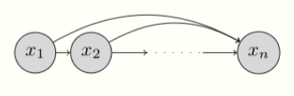
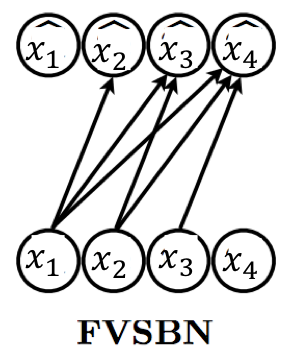
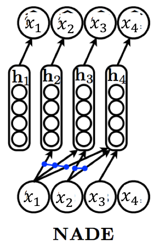

#生成模型

[原文](https://deepgenerativemodels.github.io/notes/autoregressive/)

[toc]

# 自回归模型
我们开始学习生成模型中的自回归模型.在此之前,我们假设我们有一个给定数据集 $D$.其数据点 $x$ 的维度为 $n$.为了简化问题,我们假设数据点是二进制的,即, $x \in {0,1}^n$.  

# 表示
根据概率的链式法则,我们可以将联合分布分解为:
$$
p(x)=\prod^n_{i=1} p(x_i|x_1,x_2,...,x_{i-1})=\prod^n_{i=1} p(x_i|x_{<i})
$$

这里 $x_{<i} = [x_1,x_2,...,x_{i-1}]$.

以上链式分解可以用贝叶斯网络表示,其图像化表示如下:

> 无条件独立假设的自回归贝叶斯网络模型图示

这种无条件独立假设的贝叶斯网络服从自回归性质.自回归这个术语来源于时序模型的文献中,即通过观察以往时间步来预测当前时间步的值.我们假设变量的顺序是 $x_1,x_2,...,x_n$,且第 $i$ 个随机变量取决于前$i-1$个随机变量 $x_1,x_2...,x_{i-1}$

若我们可以将每个条件概率 $p(x_i|x_{<i})$ 确定并组织成一个表格的样式(即可以求出每个 $p(x_i)$ 的边缘概率?),那么这个表示是可以表示任何 n 维的概率分布的.但是其空间复杂度随 n 增长.  

我们来看看为何会这样.考虑最后一位的条件概率 $p(x_n|x_{ < n})$.为了确定这个条件概率,我们必须知道关于变量 $x_1,x_2...,x_{n-1}$ 所有的 $2^{n-1}$ 个组合的概率.这些概率和为1,那么确定这个条件概率还需要 $2
^{n-1} -1$ 个参数.通过链式法则来学习到联合概率是不切实际的,我们也无法通过表格表示来得到所有的边缘概率.

在自回归模型中,条件概率是通过一组有着固定参数的表达式来表示的.比如,我们假定条件分布概率 $p(x_i|x_{<i})$ 每个值都对应一个伯努利随机变量,我们需要学习一个映射将 $x_1,x_2...,x_{i-1}$ 变换到这个分布的期望.由此,我们可以得到:
$$
p_{\theta_i}(x_i|x_{<i})=Bern(f_i(x_1,x_2...,x_{n-1}))
$$

这里 $\theta_i$ 表示参数集,用来确定这个期望函数 $f_i: \{0,1\}^{i-1} \to [0,1]$

自回归模型的参数数量是 $ \sum ^n_{i=1} |\theta_i|$ 个.正如我们接下来要看的例子,这里参数的数量比表格设置的要少得多.不同于表格设定,自回归模型并不能表征所有概率模型.这是由于我们限制条件概率分布对应于指定期望的伯努利随机变量,我们是通过设置一类受限制的参数化函数来实现这一点.

> 典型的sigmoid置信网络,它有4个变量,其条件分布使用 $\hat{x_1},\hat{x_2},\hat{x_3},\hat{x_4}$

简单起见,我们指定函数是输入元素的线性组合后跟上一个 sigmoid(用来将输出约束到0到1).由此我们得到了完全 sigmoid 置信网络 (fully-visible sigmoid belief network,FVSBN).
$$
f_i(x_1,x_2,...,x_{i-1})=\sigma(\alpha_0^{(i)}+\alpha_1^{(i)}x_1+...+\alpha_{i-1}^{(i)}x_{i-1} )
$$

这里 $\sigma$ 是 sigmoid 函数,$\theta_i=\{\alpha_0^{(i)},\alpha_1^{(i)},...,\alpha_{i-1}^{(i)}\}$ 是期望函数的参数. $i$ 个变量需要 $i$ 个参数,模型的参数总量为 $\sum^n_{i=1} i=O(n^2)$ 个. 这个参数量显然比表格设置的潜在参数量要小得多.

使用更加灵活的可参数化期望函数,比如 MLP 可以增加自回归生成模型表征能力.我们考虑仅1层隐藏层的神经网络,变量 i 的期望函数可以表示为:
$$
h_i=\sigma(A_ix_{<i}+c_i) 
$$
$$
f_i(x_1,x_2,...,x_{i-1})=\sigma(\alpha^{(i)}h_i+b_i)
$$

$h_i \in R^d$ 表示 MLP 的隐层激活函数, $\theta_i=\{A_i \in R^{d \times (i-1)}, c_i \in R^d, \alpha^{(i)} \in R^d,b_i \in R \}$ 是期望函数 $u_i( \cdot)$  的参数集.整个模型的参数数量是受矩阵 $A_i$ 影响的,大约参数量是 $O(n^2d)$.

>   四变量的自回归神经网络密度估计器.条件用$\hat{x_1},\hat{x_2},\hat{x_3},\hat{x_4}$ 表示,蓝色链接表示用于计算隐藏层的绑定权重 $W[.,i]$

