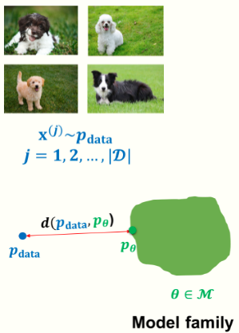

#生成模型

[toc]

[原文](https://deepgenerativemodels.github.io/notes/introduction/)

# 引言
智能终端总是不断的生成,获取和处理数据.这些数据可能是我们从手机上接收的图片,和朋友分享的文字消息,社交媒体上进行互动的图表,记录重要事件的视频等等.人类可以从这些数据中发现模式,提取知识,并依据观察到的数据进行复杂的推理.那我们可否构建一个人工学习系统来做同样的事情呢?

本课,我们将学习生成类模型,尝试从概率的角度来看世界.在这张视角下,我们将我们可以观察到的数据标记为 $D$,将来自于一个潜在分布的有限样本集标记为 $p_{data}$.那么生成类模型的目标便是,根据给定的数据集 $D$ 来逼近最终的真实数据分布.理想情况下是我们可以学习到一个好的生成模型,使用此模型来进行下游的推理.

# 学习
我们将对近似数据分布的参数感兴趣,这些有限的参数包含了数据集 $D$ 的所有信息.相比于非参的方法,有参模型可以在大型数据集中进行更加有效的缩放,但是它们的表征能力会收到参数的限制.

仅考虑有参方法,我们可以认为学习生成模型的目标是从一族的模型分布参数中选出一组参数,该参数下,模型分布和数据分布的某种距离 [1](./Introduction.md#^f74d12)最小.  

举个例子,我们有一个狗的图像数据集 $D$,我们期望在模型分布族 $M$ 中学习一个参数为 $theta$ 的生成模型,使得模型分布 $p_{theta}$ 尽量靠近数据分布 $p_{data}$. 将这个目标用数学表达式写出来,如下:
$$
\underset{\theta \in M}{min} d(p_{data},p_{\theta})  \tag{1}
$$

这里 $p_{data}$ 是可以通过数据集 $D$ 获得的, $d( \cdot)$ 表示概率分布之间的某种距离.  

稍加分析,我们会发现这个问题并不容易.常见的手机摄像机拍摄的图片分辨率大约是 $700 \times 1400$,有三个通道,每个通道的取值是 0 到 255.因此这种图片的可能性有 $256^{700 \times 1400 \times 3} \approx 10^{800000}$ 种.要知道, ImageNet 也不过包含了1千5百万张图片.因此,在有限数据集上学习一个生成模型是一个高度不定的问题.  

幸运的是,真实世界通常是高度结构化的,因此发现并学习这种潜在结构,就是训练生成模型的关键.例如,我们都知道狗一般有:两只眼睛,两个耳朵,四条腿等等.当然,我们希望模型能够从数据中学习到这些潜在结构而非直接结合这些先验知识.当然,事情仍有难度,想成功学习一个生成模型,我们仍需要考虑如何以一个合适的方式来优化公式1.本节课,我们将主要关注以下几个问题:  

- 每类生成模型族 $M$ 的表示是什么?
- 目标函数中的 $d( \cdot )$ 怎么选?
- 如何优化目标函数?  

在接下来几节课中,我们将深入研究几类常见的生成模型.对于每类生成模型,我们要重点注意其学习目标和优化过程的区别.  

# 推理
诸如逻辑回归之类的判别模型,它们推理任务可以描述为给定一个数据点,输出其预测标签.而对于生成模型,则是学习整个数据集的联合分布 [2](./Introduction.md#^5e2bd2).  

尽管生成模型的应用范围还在不断扩大,但是我们基本可以从以下三个方面来考量评估生成模型:
- 密度估计:给定数据点 $x$,对于模型而言,其出现概率 $p_{\theta}(x)$ 为多少?
- 采样:我们如何从模型分布中生成一个新颖的数据 $x_{new} \backsim p_{\theta}(x)$?
- 无监督表征学习:我们如何从数据点 $x$ 中学到富有意义的特征?

回到我们之前狗狗生成的例子中,对上述任务进行具体化.对于密度估计,我们希望狗图片的概率高而非狗图片的概率低.而对于采样,我们期望生成新的狗狗图片,这种生成的图片应该不会包含在我们之前学习用的数据集中.对于表征学习,我们希望模型可以发现数据中的潜在高层结构,比如狗的种类.  

综上,对生成模型在这些任务上进行定量的评估是很有意义的(尤其是采样和表征学习),并且这一领域目前还在积极的发展.虽然已经有了一些定量评估的方法,但是这些方法有时并不能定量分析出生成样本和学习到的表征性能.其次,并非每类生成类模型都能够适用在这所有的任务上.事实上,正是由于针对不同的任务,生成模型做了不同的推理过程中的权衡,导致了其方法的多样化,在后面的课程中,我们将进一步展开.

# 脚注  
1. 正如我们稍后看到的,一些不满足所有距离度量属性的方法,在实践中也可能用上,比如KL散度. ^f74d12
2. 某种意义上,其实概率判别模型也是一种以数据为条件的标签生成模型.但是我们所说的生成模型,一般是生成高维数据的. ^5e2bd2
