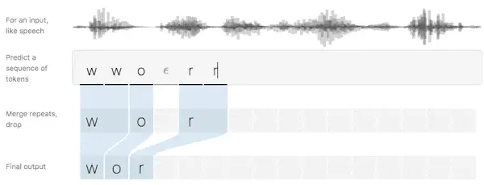

P #CTC损失 #文字识别

[Read on Omnivore](https://omnivore.app/me/80-71-ctc-190480927eb)

[Read Original](https://www.zhihu.com/question/47642307)

可以看 Hannun Awni 的经典文章 [Sequence Modeling with CTC（Distill, 2017）](https://link.zhihu.com/?target=https%3A//distill.pub/2017/ctc/)

以下是经论智编译的原文：



# 简介

谈及语音识别，如果这里有一个剪辑音频的数据集和对应的转录，而我们不知道怎么把转录中的字符和音频中的音素对齐，这会大大增加了训练语音识别器的难度。

如果不对数据进行调整处理，那就意味着不能用一些简单方法进行训练。

对此，我们可以选择的第一个方法是制定一项规则，如“一个字符对应十个音素输入”，但人们的语速千差万别，这种做法很容易出现纰漏。为了保证模型的可靠性，第二种方法，即手动对齐每个字符在音频中的位置，训练的模型性能效果更佳，因为我们能知道每个输入时间步长的真实信息。但它的缺点也很明显——即便是大小合适的数据集，这样的做法依然非常耗时。

事实上，制定规则准确率不佳、手动调试用时过长不仅仅出现在语音识别领域，其他工作，如手写识别、在视频中添加动作标记，同样会面对这些问题。


>手写识别：输入的坐标由笔画/像素在图中位置决定；语音识别：输入可以是声谱图或是基于其他频率提取的特征

这种场景下，正是**CTC（Connectionist Temporal Classification**用武之地。CTC 是一种让网络自动学会对齐的好方法，十分适合语音识别和书写识别。

为了描述地更形象一些，我们可以把输入序列（音频）映射为 X=\[x 1, x 2,…, xT\]，其相应的输出序列（转录）即为 Y=\[y 1, y 2,…, yU\]。这之后，将字符与音素对齐的操作就相当于在 X 和 Y 之间建立一个准确的映射。

如果想直接用非监督学习算法，我们还有 3 个难点：

* X 和 Y 的长度是可变化的；
* X 和 Y 的长度比例也是可变化的；
* X 和 Y 没有严格对齐。

而 [CTC算法](https://www.zhihu.com/search?q=CTC%E7%AE%97%E6%B3%95&search%5Fsource=Entity&hybrid%5Fsearch%5Fsource=Entity&hybrid%5Fsearch%5Fextra=%7B%22sourceType%22%3A%22answer%22%2C%22sourceId%22%3A458514202%7D) 刚好能解决这些问题，给定一个 X，它能基于所有可能是准确映射的 Y 给出输出分布。根据这个分布，我们可以推理最可能的输出，或计算分布内各字符的可能性概率。

CTC 在损失计算和推理上十分高效。

**损失函数:** 为了给出准确的输出，经训练的模型必须在分布中最大化正确输出的概率，为此，我们需要计算概率 $p(Y|X)$ （输入 X 后输出为 Y 的概率），这个 $p(Y|X)$ 应该是可微的，所以才能使用 [梯度下降法](https://www.zhihu.com/search?q=%E6%A2%AF%E5%BA%A6%E4%B8%8B%E9%99%8D%E6%B3%95&search%5Fsource=Entity&hybrid%5Fsearch%5Fsource=Entity&hybrid%5Fsearch%5Fextra=%7B%22sourceType%22%3A%22answer%22%2C%22sourceId%22%3A458514202%7D)。

**推理:** 一般而言，如果已经训练好了一个模型，我们就应该针对输入 X 推理一个可能的 Y，这就意味着要解决这个问题：

$$
Y^*=\underset{Y}{argmax} \quad  p(Y|X)
$$

理想情况下，这个 $Y^*$ 可以被快速找到。有了 CTC，就意味着我们能在低投入情况下迅速找到一个近似的输出。

# 算法

CTC 算法可以根据输入 X 映射一些带有概率的 Y，而计算概率的关键在于算法如何看待输入和输出之间的一致性。在讨论它是如何计算损失和进行推理前，我们先来看一下什么叫对齐。

## 对齐

CTC 算法不要求输入和输出的严格对齐，但是为了计算概率大小，总结两者的一些对齐规律的必要的，这之中涉及一些损失计算。

我们可以实验一个简单的例子。假设输入 X 长度为 6，输出 Y=\[c, a, t\]，那么对齐 X 和 Y 的一种有效方法是为每个输入长度分配一个输出字符并重复折叠：


这样做会出现两个问题：

* 通常情况下，强制要求输入与输出的严格对齐是没有意义的。例如在语音识别中，输入可以有一些静音，但模型不必给出相应的输出；
* 无法产生连续多个相同字符。如果输入是 \[ h, h, e, l, l, l, o \]，CTC 会折叠重复的字符输出“helo”，而不是“hello”。

为了解决这些问题，CTC 加入了一个空白符号——blank。在这个语音识别问题里，我们暂时把它设为ϵ，它不对应任何输入，最后会从输出中被删除。

由于 CTC 允许路径长度和输入长度等长，映射到 Y 的相邻ϵ可以合并整合，最后统一去除：


如果 Y 在同一行中的相邻位置有两个相同的字符，为了做到有效对齐，它们之间必须插入一个 [空白符号](https://www.zhihu.com/search?q=%E7%A9%BA%E7%99%BD%E7%AC%A6%E5%8F%B7&search%5Fsource=Entity&hybrid%5Fsearch%5Fsource=Entity&hybrid%5Fsearch%5Fextra=%7B%22sourceType%22%3A%22answer%22%2C%22sourceId%22%3A458514202%7D) ϵ。有了这个规则，模型才能准确区分 collapse 到“hello”的路径和 collapse 到“helo”的路径。

让我们回到之前\[c, a, t\] 的例子，以下是它的两个 [无效对齐](https://www.zhihu.com/search?q=%E6%97%A0%E6%95%88%E5%AF%B9%E9%BD%90&search%5Fsource=Entity&hybrid%5Fsearch%5Fsource=Entity&hybrid%5Fsearch%5Fextra=%7B%22sourceType%22%3A%22answer%22%2C%22sourceId%22%3A458514202%7D) 示例：


可以发现，CTC 选择的路径有一些明显的性质。首先，整个对齐过程是单调（monotonic）的，如果我们前进到下一个输入，输出会保持现状或显示下一个输出；其次，X 到 Y 的对齐形式是多对一，一个或多个输入只能对齐到一个输出。第三，由第二个特征可得，输出 Y 的长度不得大于输入 X。

# 损失函数

CTC 的对齐方式展示了一种利用时间步长概率推测输出概率的方法。


确切地说，如果 CTC 的目标是一对输入输出 (X, Y)，那 Y 的路径的概率之和为：


> Y 的概率；所有可能路径概率求和； 逐个计算单个路径概率

用 CTC 训练的模型通常用 [递归神经网络](https://www.zhihu.com/search?q=%E9%80%92%E5%BD%92%E7%A5%9E%E7%BB%8F%E7%BD%91%E7%BB%9C&search%5Fsource=Entity&hybrid%5Fsearch%5Fsource=Entity&hybrid%5Fsearch%5Fextra=%7B%22sourceType%22%3A%22answer%22%2C%22sourceId%22%3A458514202%7D)（RNN）来预测每个时间步长概率： $p_t(a_t|X)$ 。由于 RNN 能考虑输入中的上下文，它的表现可圈可点，但我们也可以自由选用一些学习算法，让算法在给定固定输入片段的情况下产生输出分布。

当然，如果操作不当，CTC 计算损失占用的资源会很惊人。一种简单的方法是逐一计算每种对齐路径的概率，之后再进行求和，但它的缺点是路径数量往往非常惊人，这样做对于大多数任务来说太慢了。

值得庆幸的是，我们能用动态规划算法快速计算 loss，其关键思路是如果两种路径用相同步长映射到同一输出，那它们就能被合并。


> 左：总结所有路径会占用大量资源；右：动态规划算法合并了路径，计算更快

因为 CTC 允许在 Y 中的字符前任意加入 $\epsilon$ ，所以为了更直观地描述算法，我们可以把输出序列设为：

$$
Z= [ \epsilon,y_1,\epsilon,y_2,...,\epsilon,y_U,\epsilon ]
$$

设 $\alpha$ 为相同对齐路径合并后的 CTC 得分（概率），更准确地说，即 $\alpha_{s,t}$ 是输入 t 后子序列 $Z_{1: s}$ 的得分。可以发现，如果要获得 $p(Y|X)$ ，我们可以从 ${\alpha}$ 最后那个时间步长开始计算。只要能算出最后时间步长时 $\alpha$ 的值，我们就能得到 $\alpha_{s,t}$ 。有两种情形:

**情形 1**


如上图所示，在这一情形下，我们不能跳过 $z_{s−1}$ ，Z 中的前一个 token. 第一个理由是，之前的 token 可能是 Y 中的元素，而我们不能跳过 Y 中的元素。由于 Y 中的每个元素后面跟着一个 $\epsilon$ ，当 $z_s=\epsilon$ 时我们可以推断出这一点。第二个理由是，Y 中的重复元素间，必然有一个 $\epsilon$ . 当 $z_s = z_{s-2}$ 时我们可以推断出这一点。

为了保证没有跳过 $z_{s-1}$ ，我们或者在前一时步，或者已经通过了之前的时步。因此，我们转换之前的位置有两种可能：


> 第 t-1 个输入时输出对齐路径 CTC 得分；第 t 个输入时当前路径的概率

**情形 2**


在这一情形下，我们可以跳过 Z 中之前的 token. 当 $z_{s-1}$ 为位于两个不同字符间的 $\epsilon$ 时，构成这一情形。因此，我们转换之前的位置有三种可能：


> 第 t-1 个输入时之后 3 个有效子序列的 CTC 得分；第 t 个输入时当前路径的概率

以下是一个用 [动态编程算法](https://www.zhihu.com/search?q=%E5%8A%A8%E6%80%81%E7%BC%96%E7%A8%8B%E7%AE%97%E6%B3%95&search%5Fsource=Entity&hybrid%5Fsearch%5Fsource=Entity&hybrid%5Fsearch%5Fextra=%7B%22sourceType%22%3A%22answer%22%2C%22sourceId%22%3A458514202%7D) 执行计算的示例，每个有效对齐对应图中的一条路径。


> $(s, t)$ 表示第 t 个输入时 $Z_{1: s}$ 的 CTC 得分 $\alpha_{s, t}$

如上图所示，它有两个有效起始节点和两个最终节点，排除空白标记，总概率即两个最终节点之和。

现在我们可以有效地计算 [损失函数](https://www.zhihu.com/search?q=%E6%8D%9F%E5%A4%B1%E5%87%BD%E6%95%B0&search%5Fsource=Entity&hybrid%5Fsearch%5Fsource=Entity&hybrid%5Fsearch%5Fextra=%7B%22sourceType%22%3A%22answer%22%2C%22sourceId%22%3A458514202%7D)，下一步就是计算一个梯度并训练模型。CTC 损失函数对于每个时间步长输出概率是可微的，因为它只是它们的总和和乘积。鉴于此，我们可以分析计算相对于（非标准化）输出概率的损失函数的梯度，并像往常那样从那里运行反向传播。

对于 [训练集](https://www.zhihu.com/search?q=%E8%AE%AD%E7%BB%83%E9%9B%86&search%5Fsource=Entity&hybrid%5Fsearch%5Fsource=Entity&hybrid%5Fsearch%5Fextra=%7B%22sourceType%22%3A%22answer%22%2C%22sourceId%22%3A458514202%7D) D，模型参数先要调整以使负对数似然值最小化：

$$
\sum_{(X,Y) \in D}{-log \; p(Y|X)}
$$

而不是直接使似然值最大化。

# 推理 

训练好模型后，我们就需要根据给定输入计算可能的输出，更准确地说，我们需要计算：

$$
Y^*=\underset{Y}{argmax} \quad  p(Y|X)
$$

一种启发式方法是根据每个时间步长计算路径的可能性，它能计算最高概率：

$$
A^*=\underset{A}{argmax} \quad \prod^T_{t=1}{p_t(a_t|X)}
$$

之后，我们反复折叠并删除空白标记 $\epsilon$ 得到 Y。

这种启发式方法对于大多数程序都运行良好，尤其是当概率集中于某条路径时。但是，由于没有考虑到单个输出可能有多个对齐的事实，它有时也会错过真正的高概率输出。

对此我可以举个例子。假设输出\[a, a, ϵ\] 和\[a, a, a\] 的概率比\[b，b，b\] 低，但它们的概率之和高于后者。在这种情况下，[启发式方法](https://www.zhihu.com/search?q=%E5%90%AF%E5%8F%91%E5%BC%8F%E6%96%B9%E6%B3%95&search%5Fsource=Entity&hybrid%5Fsearch%5Fsource=Entity&hybrid%5Fsearch%5Fextra=%7B%22sourceType%22%3A%22answer%22%2C%22sourceId%22%3A458514202%7D) 会给出 Y=\[b\] 这样的错误结论，因为它忽视了\[a, a,   ϵ\] 和\[a, a, a\] 可以折叠为一个输出，而真正的答案应该是 Y=\[a\]。

对于这个问题，我们可以通过修改集束搜索来解决。基于有限的计算，集束搜索不一定能找到最优可能的 Y，但它至少具有一个良好的性质，让我们可以在更多计算（更大的集束尺寸）和渐近更优解之间折衷。

常规的集束搜索算法会在每个输入中计算一组假设路径。这组假设基于原路径集合产生，通过 [扩展路径](https://www.zhihu.com/search?q=%E6%89%A9%E5%B1%95%E8%B7%AF%E5%BE%84&search%5Fsource=Entity&hybrid%5Fsearch%5Fsource=Entity&hybrid%5Fsearch%5Fextra=%7B%22sourceType%22%3A%22answer%22%2C%22sourceId%22%3A458514202%7D)，算法会选择其中得分最高的几种路径作为当前路径。


> 常规的集束搜索算法：输入大小为{ϵ, a, b}，集束宽度为 3

如果要处理多个对齐映射到同一输出这种情况，我们可以修改原始集束搜索，即不保留束中的对齐列表，而是存储折叠重复字符并移除ϵ后的输出前缀。在搜索的每一步，我们都会基于映射到给定前缀的所有对齐为该前缀累计分数。


> CTC 集束搜索算法：输入大小为{ϵ, a, b}，集束宽度为 3

出现重复字符时，提议扩展可以映射到两个输出，如上图 T 3 所示，其中红 'a' 是前缀蓝\[a\] 的提议扩展，对该扩展而言，\[a\] 和\[a, a\] 都是有效输出。

当我们将\[a\] 扩展为\[a, a\] 时，我们只需统计之前以空白标记ϵ结尾的所有路径的概率（位于字符中间的ϵ也要统计）。同样的，如果是扩展到\[a\]，那我们计算的就是不以ϵ结尾的所有路径概率。

鉴于此，我们需要跟踪当前输出在搜索树中前两处输出。无论是以ϵ结尾还是不以ϵ结尾，如果我们在剪枝时为每一种假设做好得分排序，我们就能在计算中使用 [组合分数](https://www.zhihu.com/search?q=%E7%BB%84%E5%90%88%E5%88%86%E6%95%B0&search%5Fsource=Entity&hybrid%5Fsearch%5Fsource=Entity&hybrid%5Fsearch%5Fextra=%7B%22sourceType%22%3A%22answer%22%2C%22sourceId%22%3A458514202%7D)。


> 这个算法的实现并不需要太多代码，而且它十分巧妙，我用 Python 写了一个 [示例](https://link.zhihu.com/?target=https%3A//gist.github.com/awni/56369a90d03953e370f3964c826ed4b0)。

在一些语言识别问题中，也会有人在输出中加入语言模型来提高准确率，所以我们也可以把语言模型作为推理的一个考虑因素：


 L (Y) 以语言模型 token 为单位，计算 Y 的长度，起到单词插入奖励的作用。如果 L (Y) 是一个基于单词的语言模型，那它计数的是 Y 中的单词数量；如果是一个基于字符的语言模型，那它计数的就是 Y 中的字符数。语言模型的一个突出特点是它只为单词/字符扩展前的形式计分，不会 [统计算法](https://www.zhihu.com/search?q=%E7%BB%9F%E8%AE%A1%E7%AE%97%E6%B3%95&search%5Fsource=Entity&hybrid%5Fsearch%5Fsource=Entity&hybrid%5Fsearch%5Fextra=%7B%22sourceType%22%3A%22answer%22%2C%22sourceId%22%3A458514202%7D) 每一步扩展时的输出，这一点有利于短前缀词汇的搜索，因为它们在形式上更稳定。

集束搜索可以添加语言模型得分和单词插入项奖励，当提出 [扩展字符](https://www.zhihu.com/search?q=%E6%89%A9%E5%B1%95%E5%AD%97%E7%AC%A6&search%5Fsource=Entity&hybrid%5Fsearch%5Fsource=Entity&hybrid%5Fsearch%5Fextra=%7B%22sourceType%22%3A%22answer%22%2C%22sourceId%22%3A458514202%7D) 时，我们可以在给定前缀下为新字符添加语言模型评分。

# CTC 的性质

到目前为止，我们提到了 CTC 的一些重要性质，在这个章节中，我们将更深入地了解这些性质及它们带来的影响。

**有条件的独立**

CTC 最广为人知的一个缺点是它的条件独立假设。


> CTC 模型图示

模型假设，对给定输入而言，每个输出与其他输出条件独立。在许多 [序列排序](https://www.zhihu.com/search?q=%E5%BA%8F%E5%88%97%E6%8E%92%E5%BA%8F&search%5Fsource=Entity&hybrid%5Fsearch%5Fsource=Entity&hybrid%5Fsearch%5Fextra=%7B%22sourceType%22%3A%22answer%22%2C%22sourceId%22%3A458514202%7D) 问题中，这一假设有问题。

假如我们有一个音频，内容为“三个 A（triple A）”，那么一个有效的转录可能是“AAA”，如果 CTC 预测转录的第一个字母是‘A’，那下一个字母是‘A’的概率应该远高于‘r’，但是条件独立性假设不允许 CTC 这样做。


> 如果预测转录的第一个字母是‘A’，那下一个字母是‘A’的概率应该远高于‘r’；相反地，如果转录的第一个字母是‘t’，那第二个应该是‘r’

事实上，利用 CTC 建立的 [语音识别器](https://www.zhihu.com/search?q=%E8%AF%AD%E9%9F%B3%E8%AF%86%E5%88%AB%E5%99%A8&search%5Fsource=Entity&hybrid%5Fsearch%5Fsource=Entity&hybrid%5Fsearch%5Fextra=%7B%22sourceType%22%3A%22answer%22%2C%22sourceId%22%3A458514202%7D) 既不能根据输出学习语言模型，也不能学习条件依赖语言模型，它只能通过包含独立语言模型来提高准确性。

当然，这种假设虽然会产生不小的麻烦，但也不是一无是处，它能使模型迅速适应相互对立的新场景。如果我们用和朋友的通话录音训练识别器生成语音答复信息，由于领域不同，同一模型可能会把语音内容归类为完全不同的两个领域，而 CTC 的模型可以弥补这一点，它能在领域转换时更换新的语言模型。

**对齐属性**

CTC 算法不要求对齐，目标函数在所有路径上都是边缘化的，虽然它确实对输入 X 和输出 Y 之间的对齐规律做了一系列假设，并计算了相关概率，但模型并不知道它们之间的概率分布。在一些问题中，CTC 最终会把大部分概率集中到具体某一条路径中。当然，也有例外。

如上文所述，CTC 只允许单调对齐，这在语音识别问题中可能是一个有效的假设，但对于机器翻译等其他问题而言，目标语句中的 future word 可以与其在源语句中的形式相对应，这种 [单调对齐](https://www.zhihu.com/search?q=%E5%8D%95%E8%B0%83%E5%AF%B9%E9%BD%90&search%5Fsource=Entity&hybrid%5Fsearch%5Fsource=Entity&hybrid%5Fsearch%5Fextra=%7B%22sourceType%22%3A%22answer%22%2C%22sourceId%22%3A458514202%7D) 的假设是不准确的。

CTC 的另一个重要特征是输入和输出的关系是多对一。在某些情况下，这种设定并不理想，因为有时我们会希望输入 X 和输出 Y 之间是严格的一对一关系，或者一个输入能对应到多个输出。例如，字符‘th’可以对齐到单个音素输入，但 CTC 不允许这种操作。

多对一的特性意味着输出的时间步长要比输入短，这对于语音识别和手写识别没有太大影响，因为输入会比输出长很多，但在一些 Y 比 X 长的问题里，CTC 就不奏效了。

## CTC 和其他算法

在这一节中，我会探讨 CTC 和其他 [序列建模算法](https://www.zhihu.com/search?q=%E5%BA%8F%E5%88%97%E5%BB%BA%E6%A8%A1%E7%AE%97%E6%B3%95&search%5Fsource=Entity&hybrid%5Fsearch%5Fsource=Entity&hybrid%5Fsearch%5Fextra=%7B%22sourceType%22%3A%22answer%22%2C%22sourceId%22%3A458514202%7D) 之间的联系。

**HMM 模型**

乍一看，[隐马尔可夫模型](https://www.zhihu.com/search?q=%E9%9A%90%E9%A9%AC%E5%B0%94%E5%8F%AF%E5%A4%AB%E6%A8%A1%E5%9E%8B&search%5Fsource=Entity&hybrid%5Fsearch%5Fsource=Entity&hybrid%5Fsearch%5Fextra=%7B%22sourceType%22%3A%22answer%22%2C%22sourceId%22%3A458514202%7D)（Hidden M [ar](https://link.zhihu.com/?target=https%3A//www.jqr.com/service/company%3Fbusiness%3D17) kov Model，HMM）似乎和 CTC 完全不同，但是，它们在本质上还是很相似的。了解它们之间的关系将有助于我们把握 CTC 在序列建模中的优势，同时掌握在各种情况下调整 CTC 的方法。

让我们继续沿用之间的符号，X 是输入序列，Y 是长度从 T 到 U 的输出序列，p (Y|X) 是输入 X 后输出为 Y 的概率。为了计算 p (Y|X)，我们可以用 [贝叶斯定理](https://www.zhihu.com/search?q=%E8%B4%9D%E5%8F%B6%E6%96%AF%E5%AE%9A%E7%90%86&search%5Fsource=Entity&hybrid%5Fsearch%5Fsource=Entity&hybrid%5Fsearch%5Fextra=%7B%22sourceType%22%3A%22answer%22%2C%22sourceId%22%3A458514202%7D) 简化这个问题：


由于 p (Y) 可以是任何语言模型，让我们把关注点放在 p (Y|X)。就像之前做的，我们同样设 A 为 X 与 Y 之间所有路径的集合，路径长度均为 T，通过对齐我们可得到：


为了简化符号，我们先不考虑 Y 的条件限制，它将在所有 p (·) 中出现，这样我们就能利用两个假设列出一个标准的 HMM：


第一个假设是平常的 [马尔可夫性质](https://www.zhihu.com/search?q=%E9%A9%AC%E5%B0%94%E5%8F%AF%E5%A4%AB%E6%80%A7%E8%B4%A8&search%5Fsource=Entity&hybrid%5Fsearch%5Fsource=Entity&hybrid%5Fsearch%5Fextra=%7B%22sourceType%22%3A%22answer%22%2C%22sourceId%22%3A458514202%7D)， ata\_t 独立于扩展前状态 at−1 a\_{t-1} ；第二个假设则是当输入为 ata\_t 时， xtx\_t 有条件地独立于其他所有输出。


> HMM 模型图示

现在我们只需要几个步骤就可以将 HMM 转换成 CTC. 

首先，我们假设转录概率 p (at∣at−1) 是统一的，即：


这个算式和 CTC 计算损失的算式只有两处不同，一是我们需要计算的是模型输入 X 后输出 Y 的概率，而不是针对 Y 计算 X；二是如何产生集合 A。对于这两个问题，我们依次来解决。

HMM 可以用于估算 p (a|x) 的判别模型，要做到这一点，我们需要应用贝叶斯定理来改写模型：


假定以 X 中的所有元素为条件的状态 a 有一个统一的先验（而不是每次一个元素），我们有：


假定集合 A\\mathcal{A} 相同，这时等式基本上已经是 CTC 的损失函数了。事实上，HMM 框架并没有规定集合 A\\mathcal{A}该由什么组成，模型的这部分可以根据具体问题进行设计。在很多情况下，这个模型可能并不取决于 Y，而集合 A\\mathcal{A}包含输出字母表的所有可能的长度为 T 的序列。这时我们就可以把 HMM 看做一个**遍历**[转录图](https://www.zhihu.com/search?q=%E8%BD%AC%E5%BD%95%E5%9B%BE&search%5Fsource=Entity&hybrid%5Fsearch%5Fsource=Entity&hybrid%5Fsearch%5Fextra=%7B%22sourceType%22%3A%22answer%22%2C%22sourceId%22%3A458514202%7D)，其中每个状态都和其他所有状态相连接。下图展示了模型在输入{ a ，b ，c }后各字符间的“[隐状态](https://www.zhihu.com/search?q=%E9%9A%90%E7%8A%B6%E6%80%81&search%5Fsource=Entity&hybrid%5Fsearch%5Fsource=Entity&hybrid%5Fsearch%5Fextra=%7B%22sourceType%22%3A%22answer%22%2C%22sourceId%22%3A458514202%7D)”。

在我们的例子中，这个模型的转录需要与输出 Y 强烈相关，所以 HMM 应当能反映这一点。对此，一个可能的模型是一个简单的线性 [状态转换图](https://www.zhihu.com/search?q=%E7%8A%B6%E6%80%81%E8%BD%AC%E6%8D%A2%E5%9B%BE&search%5Fsource=Entity&hybrid%5Fsearch%5Fsource=Entity&hybrid%5Fsearch%5Fextra=%7B%22sourceType%22%3A%22answer%22%2C%22sourceId%22%3A458514202%7D)，如下图所示，图中得出的结论是 Y= \[a, b\]，另外的常用模型还有 Bakis 和左右 HMM。


在 CTC 算法中，我们有空白标记ϵ；而在 HMM 里，我们有允许交换子集的左右模型。CTC 和 HMM 都有两个起始状态和两个接受状态。

容易造成混淆的一个原因可能是在 HMM 中，模型会因不同的输出 Y 而出现差异，事实上，这在语音识别领域是准确的，模型状态图的确会因输出 Y 出现一定变化。转录过程中的观察预计和概率函数是共享的。

最后就是如何用 CTC 对原始 HMM 模型做一些改进。首先，我们可以将 [CTC状态图](https://www.zhihu.com/search?q=CTC%E7%8A%B6%E6%80%81%E5%9B%BE&search%5Fsource=Entity&hybrid%5Fsearch%5Fsource=Entity&hybrid%5Fsearch%5Fextra=%7B%22sourceType%22%3A%22answer%22%2C%22sourceId%22%3A458514202%7D) 看做一个特殊情况下的 HMM，可以用来解决很多有趣的问题；因为 [空白标记](https://www.zhihu.com/search?q=%E7%A9%BA%E7%99%BD%E6%A0%87%E8%AE%B0&search%5Fsource=Entity&hybrid%5Fsearch%5Fsource=Entity&hybrid%5Fsearch%5Fextra=%7B%22sourceType%22%3A%22answer%22%2C%22sourceId%22%3A458514202%7D) 可以被作为“隐状态”结合到 HMM 中，所以我们可以用 Y 表示其他“隐状态”。在一些问题中，这个模型可以给出一些可行的路径。

当然，也许最重要的是，CTC 和 HMM 还是有一些区别的，它直接为 p (X|Y) 建模。判别式训练允许我们用 RNN 等方法解决问题。

**Encoder-Decoder 模型**

Encoder-Decoder（编码 - 解码）模型可能是利用神经网络进行序列建模最常用的框架，它有一个编码器和一个解码器，其中编码器能把输入序列 X 映射为隐序列，解码器则消耗隐序列的表示产生输出的概率分配：


encode (⋅) 和 decode (⋅) 通常是 RNN，解码器可以有选择性地配备**attention mechanism（[注意力机制](https://www.zhihu.com/search?q=%E6%B3%A8%E6%84%8F%E5%8A%9B%E6%9C%BA%E5%88%B6&search%5Fsource=Entity&hybrid%5Fsearch%5Fsource=Entity&hybrid%5Fsearch%5Fextra=%7B%22sourceType%22%3A%22answer%22%2C%22sourceId%22%3A458514202%7D)）**，已知隐序列 H 长度为 T，解码器 [二次抽样](https://www.zhihu.com/search?q=%E4%BA%8C%E6%AC%A1%E6%8A%BD%E6%A0%B7&search%5Fsource=Entity&hybrid%5Fsearch%5Fsource=Entity&hybrid%5Fsearch%5Fextra=%7B%22sourceType%22%3A%22answer%22%2C%22sourceId%22%3A458514202%7D) 后，H 中路径的时间步长会变为 T/s。

**编码器:** CTC 模型的编码器可以是常用 Encoder-Decoder 模型中的任意一种编码器，如，它可以是多层双向卷积网络。当然，它也有一个限制，就是经多次取样的输入长度 T/s 不能小于输出长度。

**解码器:** 我们可以把 CTC 模型的解码器视为一种简单的 [线性变换](https://www.zhihu.com/search?q=%E7%BA%BF%E6%80%A7%E5%8F%98%E6%8D%A2&search%5Fsource=Entity&hybrid%5Fsearch%5Fsource=Entity&hybrid%5Fsearch%5Fextra=%7B%22sourceType%22%3A%22answer%22%2C%22sourceId%22%3A458514202%7D)，然后用 softmax 归一化。

正如之前提到的，CTC 建设输出序列中的字符都是有条件独立的，这是其他 Encoder-Decoder 相对于 CTC 的最大优势之一——它们可以模拟对输出的依赖。然而在实践中，CTC 在语音识别等任务中仍然比较常用，因为我们可以通过外部语言模型来部分弥补条件独立假设的缺陷。

## 一些实用技巧

现在我们对 CTC 已经有了概念上的理解，接下来，我会介绍一些从业人员常用的实用技巧。

**软件**

即便你对 CTC 有深刻了解，自己写代码实现还是非常困难的，因此，一些 [开源软件](https://www.zhihu.com/search?q=%E5%BC%80%E6%BA%90%E8%BD%AF%E4%BB%B6&search%5Fsource=Entity&hybrid%5Fsearch%5Fsource=Entity&hybrid%5Fsearch%5Fextra=%7B%22sourceType%22%3A%22answer%22%2C%22sourceId%22%3A458514202%7D) 工具必不可少：

* warp-ctc。百度的开源软件 [warp-ctc](https://www.zhihu.com/search?q=warp-ctc&search%5Fsource=Entity&hybrid%5Fsearch%5Fsource=Entity&hybrid%5Fsearch%5Fextra=%7B%22sourceType%22%3A%22answer%22%2C%22sourceId%22%3A458514202%7D) 是用 C ++ 和 CUDA 编写，它可以在 CPU 和 GPU 上运行，支持 Torch、TensorFlow 和 PyTorch。
* TensorFlow 内置 CTC 损失和 CTC 集束搜索，可以在 CPU 上跑；
* Nvidia 也有一些支持 CTC 的开源工具，需要 cuDNN 7.0 及以上环境。

**数值稳定性**

直接计算 CTC 损失是很不稳定的，而避免这种情况的一种方面就是在每个时间步长规范α。具体的操作细节可以参考一些教材，那上面还会涉及渐变调整。在具体实践中，对于中等长度的序列，这种方法效果显著，但如果面对的较长的序列，那可以用 [log-sum-exp](https://www.zhihu.com/search?q=log-sum-exp&search%5Fsource=Entity&hybrid%5Fsearch%5Fsource=Entity&hybrid%5Fsearch%5Fextra=%7B%22sourceType%22%3A%22answer%22%2C%22sourceId%22%3A458514202%7D) 计算对数空间中的损失，并用 log-sum-exp 进行推理。

**集束搜索**

关于如何使用集束搜索，以下是一些小技巧：

* 任意输入一个 X，然后进行集束搜索；
* 保存推理得到的输出¯Y 及相应分数¯c；
* 计算¯Y 的 CTC 实际得分 c；
* 检查¯c 是否约等于 c，且前者是否小于后者。随着集束宽度增加，输出¯Y 可能会发生变化，而¯c 和 c 会越来越接近。

使用集束搜索的一个常见问题就是集束宽度大小，它是精度和运行时间之间的一个折衷。

# 参考文献

* Listen, Attend and Spell: A Neural Network for Large Vocabulary Conversational Speech Recognition [\[PDF\]]( https://link.zhihu.com/?target=http%3A//arxiv.org/abs/1508.01211 )  
Chan, W., Jaitly, N., Le, Q.V. and Vinyals, O., 2016\. ICASSP.
* Exploring Neural Transducers for End-to-End Speech Recognition [\[PDF\]]( https://link.zhihu.com/?target=http%3A//arxiv.org/abs/1707.07413 )  
Battenberg,  
 E., Chen, J., Child, R., Coates, A., Gaur, Y., Li, Y., Liu, H.,  
Satheesh, S., Seetapun, D., Sriram, A. and Zhu, Z., 2017\.
* Large scale discriminative training of hidden Markov models for speech recognition  
Woodland, P. and Povey, D.. Computer Speech & Language, pp. 25--47\. Academic Press. [DOI: 10.1006/csla.2001.0182](https://link.zhihu.com/?target=https%3A//doi.org/10.1006/csla.2001.0182)
* Connectionist Temporal Classification : Labelling Unsegmented Sequence Data with Recurrent Neural Networks [\[PDF\]]( https://link.zhihu.com/?target=ftp%3A//ftp.idsia.ch/pub/juergen/icml2006.pdf )  
Graves,  
 A., Fernandez, S., Gomez, F. and Schmidhuber, J., 2006\. Proceedings of  
the 23 rd international conference on Machine Learning, pp. 369--376\. [DOI: 10.1145/1143844.1143891](https://link.zhihu.com/?target=https%3A//doi.org/10.1145/1143844.1143891)
* Phone recognition on the TIMIT database [\[link\]]( https://link.zhihu.com/?target=https%3A//www.intechopen.com/books/speech-technologies/phoneme-recognition-on-the-timit-database/ )  
Lopes, C. and Perdigão, F., 2011\. Speech Technologies, Vol 1, pp. 285--302\. [DOI: 10.5772/17600](https://link.zhihu.com/?target=https%3A//doi.org/10.5772/17600)
* Supervised Sequence Labelling with Recurrent Neural Networks [\[link\]]( https://link.zhihu.com/?target=http%3A//link.springer.com/10.1007/978-3-642-24797-2 )  
Graves, A., 2012\. Springer, Vol 385\. [DOI: 10.1007/978-3-642-24797-2](https://link.zhihu.com/?target=https%3A//doi.org/10.1007/978-3-642-24797-2)
* Towards End-To-End Speech Recognition with Recurrent Neural Networks [\[PDF\]]( https://link.zhihu.com/?target=http%3A//jmlr.org/proceedings/papers/v32/graves14.pdf )  
Graves,  
 A. and Jaitly, N., 2014\. Proceedings of the 31 st International  
Conference on Machine Learning (ICML-14), Vol 32 (1), pp. 1764--1772\. [DOI: 10.1145/1143844.1143891](https://link.zhihu.com/?target=https%3A//doi.org/10.1145/1143844.1143891)
* Deep Speech: Scaling up end-to-end speech recognition [\[PDF\]]( https://link.zhihu.com/?target=http%3A//arxiv.org/abs/1412.5567 )  
Hannun,  
 A.Y., Case, C., Casper, J., Catanzaro, B., Diamos, G., Elsen, E.,  
Prenger, R., Satheesh, S., Sengupta, S., Coates, A. and Ng, A.Y., 2014\. ,  
 Vol abs/1412.5\.
* A novel approach to on-line handwriting recognition based on bidirectional long short-term memory networks [\[PDF\]]( https://link.zhihu.com/?target=https%3A//www.cs.toronto.edu/~graves/icdar%5F2007.pdf )  
Liwicki,  
 M., Graves, A., Bunke, H. and Schmidhuber, J., 2007\. Proceedings - 9 th  
Int. Conf. On Document Analysis and Recognition, Vol 1, pp. 367--371\. [DOI: 10.1.1.139.5852](https://link.zhihu.com/?target=https%3A//doi.org/10.1.1.139.5852)
* LipNet: End-to-End Sentence-level Lipreading [\[PDF\]]( https://link.zhihu.com/?target=http%3A//arxiv.org/abs/1611.01599 )  
Assael, Y.M., Shillingford, B., Whiteson, S. and de Freitas, N., 2016\.
* Connectionist Temporal Modeling for Weakly Supervised Action Labeling [\[PDF\]]( https://link.zhihu.com/?target=http%3A//arxiv.org/abs/1607.08584 )  
Huang, D., Fei-Fei, L. and Niebles, J.C., 2016\. European Conference on Computer Vision, pp. 137--153\. [DOI: 10.1007/978-3-319-46493-0](https://link.zhihu.com/?target=https%3A//doi.org/10.1007/978-3-319-46493-0)
* An application of recurrent neural networks to discriminative keyword spotting [\[link\]]( https://link.zhihu.com/?target=http%3A//link.springer.com/10.1007/978-3-540-74695-9%5F23 )  
Fernández,  
 S., Graves, A. and Schmidhuber, J., 2007\. The 17 th international  
conference on Artificial neural networks, pp. 220--229\. [DOI: 10.1007/978-3-540-74695-9\_23](https://link.zhihu.com/?target=https%3A//doi.org/10.1007/978-3-540-74695-9%5F23)
* An End-to-End Architecture for Keyword Spotting and Voice Activity Detection [\[PDF\]]( https://link.zhihu.com/?target=http%3A//arxiv.org/abs/1611.09405 )  
Lengerich, C. and Hannun, A., 2016\. NIPS 2016 End-to-End Learning for Speech and Audio Processing Workshop.
* Sequence Transduction with Recurrent Neural Networks [\[PDF\]]( https://link.zhihu.com/?target=http%3A//arxiv.org/abs/1211.3711 )  
Graves, A., 2012\. [DOI: 10.1145/2661829.2661935](https://link.zhihu.com/?target=https%3A//doi.org/10.1145/2661829.2661935)
* Gram-CTC: Automatic Unit Selection and Target Decomposition for Sequence Labelling [\[PDF\]]( https://link.zhihu.com/?target=http%3A//arxiv.org/abs/1703.00096 )  
Liu, H., Zhu, Z., Li, X. and Satheesh, S., 2017\. Proceedings of the 34 th International Conference on Machine Learning.
* Sequence Modeling via Segmentations [\[PDF\]]( https://link.zhihu.com/?target=http%3A//arxiv.org/abs/1702.07463 )  
Wang, C., Wang, Y., Huang, P., Mohamed, A., Zhou, D. and Deng, L., 2017\.
* Segmental Recurrent Neural Networks [\[PDF\]]( https://link.zhihu.com/?target=http%3A//arxiv.org/abs/1511.06018 )  
Kong, L., Dyer, C. and Smith, N.A., 2016\. ICLR. [DOI: 10.21437/Interspeech.2016-40](https://link.zhihu.com/?target=https%3A//doi.org/10.21437/Interspeech.2016-40)
* Tutorial on Hidden Markov Models and Selected Applications in Speech Recognition [\[link\]]( https://link.zhihu.com/?target=http%3A//ieeexplore.ieee.org/abstract/document/18626/ )  
Rabiner, L.R., 1989\. Proceedings of the IEEE, Vol 77 (2), pp. P 257--286\. [DOI: 10.1109/5.18626](https://link.zhihu.com/?target=https%3A//doi.org/10.1109/5.18626)
* Learning Phrase Representations using RNN Encoder-Decoder for Statistical Machine Translation [\[PDF\]]( https://link.zhihu.com/?target=http%3A//arxiv.org/abs/1406.1078 )  
Cho, K., van Merrienboer, B., Gulcehre, C., Bahdanau, D., Bougares, F., Schwenk, H. and Bengio, Y., 2014\. EMNLP. [DOI: 10.3115/v1/D14-1179](https://link.zhihu.com/?target=https%3A//doi.org/10.3115/v1/D14-1179)
* Sequence to Sequence Learning with Neural Networks [\[PDF\]]( https://link.zhihu.com/?target=http%3A//arxiv.org/abs/1409.3215 )  
Sutskever, I., Vinyals, O. and Le, Q.V., 2014\. Advances in neural information processing systems.
* Attention and Augmented Recurrent Neural Networks [\[link\]]( https://link.zhihu.com/?target=http%3A//distill.pub/2016/augmented-rnns )  
Olah, C. and Carter, S., 2016\. Distill. [DOI: 10.23915/distill.00001](https://link.zhihu.com/?target=https%3A//doi.org/10.23915/distill.00001)

# Python CTC Decoder 实现
来自 <https://gist.github.com/awni/56369a90d03953e370f3964c826ed4b0>
```python
"""
Author: Awni Hannun
This is an example CTC decoder written in Python. The code is
intended to be a simple example and is not designed to be
especially efficient.
The algorithm is a prefix beam search for a model trained
with the CTC loss function.
For more details checkout either of these references:
  https://distill.pub/2017/ctc/#inference
  https://arxiv.org/abs/1408.2873
"""

import numpy as np
import math
import collections

NEG_INF = -float("inf")

def make_new_beam():
  fn = lambda : (NEG_INF, NEG_INF)
  return collections.defaultdict(fn)

def logsumexp(*args):
  """
  Stable log sum exp.
  """
  if all(a == NEG_INF for a in args):
      return NEG_INF
  a_max = max(args)
  lsp = math.log(sum(math.exp(a - a_max)
                      for a in args))
  return a_max + lsp

def decode(probs, beam_size=100, blank=0):
  """
  Performs inference for the given output probabilities.
  Arguments:
      probs: The output probabilities (e.g. post-softmax) for each
        time step. Should be an array of shape (time x output dim).
      beam_size (int): Size of the beam to use during inference.
      blank (int): Index of the CTC blank label.
  Returns the output label sequence and the corresponding negative
  log-likelihood estimated by the decoder.
  """
  T, S = probs.shape
  probs = np.log(probs)

  # Elements in the beam are (prefix, (p_blank, p_no_blank))
  # Initialize the beam with the empty sequence, a probability of
  # 1 for ending in blank and zero for ending in non-blank
  # (in log space).
  beam = [(tuple(), (0.0, NEG_INF))]

  for t in range(T): # Loop over time

    # A default dictionary to store the next step candidates.
    next_beam = make_new_beam()

    for s in range(S): # Loop over vocab
      p = probs[t, s]

      # The variables p_b and p_nb are respectively the
      # probabilities for the prefix given that it ends in a
      # blank and does not end in a blank at this time step.
      for prefix, (p_b, p_nb) in beam: # Loop over beam

        # If we propose a blank the prefix doesn't change.
        # Only the probability of ending in blank gets updated.
        if s == blank:
          n_p_b, n_p_nb = next_beam[prefix]
          n_p_b = logsumexp(n_p_b, p_b + p, p_nb + p)
          next_beam[prefix] = (n_p_b, n_p_nb)
          continue

        # Extend the prefix by the new character s and add it to
        # the beam. Only the probability of not ending in blank
        # gets updated.
        end_t = prefix[-1] if prefix else None
        n_prefix = prefix + (s,)
        n_p_b, n_p_nb = next_beam[n_prefix]
        if s != end_t:
          n_p_nb = logsumexp(n_p_nb, p_b + p, p_nb + p)
        else:
          # We don't include the previous probability of not ending
          # in blank (p_nb) if s is repeated at the end. The CTC
          # algorithm merges characters not separated by a blank.
          n_p_nb = logsumexp(n_p_nb, p_b + p)
          
        # *NB* this would be a good place to include an LM score.
        next_beam[n_prefix] = (n_p_b, n_p_nb)

        # If s is repeated at the end we also update the unchanged
        # prefix. This is the merging case.
        if s == end_t:
          n_p_b, n_p_nb = next_beam[prefix]
          n_p_nb = logsumexp(n_p_nb, p_nb + p)
          next_beam[prefix] = (n_p_b, n_p_nb)

    # Sort and trim the beam before moving on to the
    # next time-step.
    beam = sorted(next_beam.items(),
            key=lambda x : logsumexp(*x[1]),
            reverse=True)
    beam = beam[:beam_size]

  best = beam[0]
  return best[0], -logsumexp(*best[1])

if __name__ == "__main__":
  np.random.seed(3)

  time = 50
  output_dim = 20

  probs = np.random.rand(time, output_dim)
  probs = probs / np.sum(probs, axis=1, keepdims=True)

  labels, score = decode(probs)
  print("Score {:.3f}".format(score))


