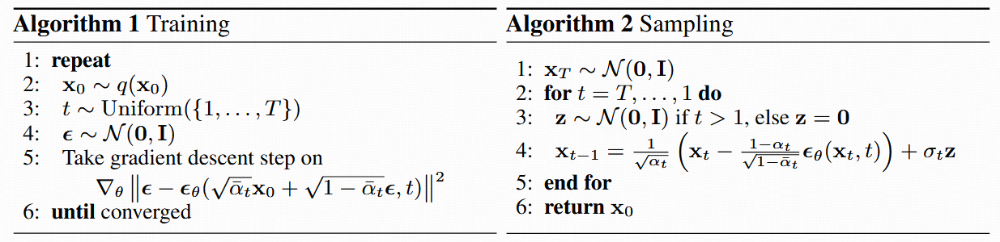

#扩散模型 

以下内容来自苏神博客中问题的补充解释：

# 为何 DDPM 的反传公式是那样？

按照原始论文伪代码：

原始论文 DDPM 前向加噪公式如下：

$$
x_t=\sqrt{\bar{\alpha}_t} x_0+\sqrt{1-\bar{\alpha}_t} \epsilon
$$

反传公式如下：

$$
x_{t - 1}=\frac{1}{\sqrt{\alpha_t}}\left(x_t-\frac{1 - \alpha_t}{\sqrt{1 - \bar{\alpha}_t}}\epsilon_{\theta}(x_t,t)\right)+\sigma_t\cdot z
$$

参见苏神博客 [生成扩散模型漫谈（三）：DDPM = 贝叶斯 + 去噪](https://spaces.ac.cn/archives/9164) 。以下苏神博客中实际是将原文中的 $\alpha$ 和 $\beta$ 写作了平方，这样少算根号。

DDPM 建模正向为**样本数据 $x$ 逐渐变为随机噪声 $z$ 的过程**,反向是将**随机噪声 $z$ 逐渐变为样本数据 $x$ 的过程。**   
反传过程中我们想要找到给定 $x_t$ ,得到 $x_{t-1}$ 的条件概率分布，这样就可以一步步推导出 $x_0$ ，即生成图片。

从贝叶斯角度：

$$
p(\boldsymbol{x}_{t-1}|\boldsymbol{x}_t) = \frac{p(\boldsymbol{x}_t|\boldsymbol{x}_{t-1})p(\boldsymbol{x}_{t-1})}{p(\boldsymbol{x}_t)}   \tag{1}
$$ 然而由于不知 $p(\boldsymbol{x}_{t-1}),p(\boldsymbol{x}_t)$ ,因此退而求其次，在给定 $x_0$ 条件下使用贝叶斯：
$$

p(\boldsymbol{x}_{t-1}|\boldsymbol{x}_t, \boldsymbol{x}_0) = \frac{p(\boldsymbol{x}_t|\boldsymbol{x}_{t-1})p(\boldsymbol{x}_{t-1}|\boldsymbol{x}_0)}{p(\boldsymbol{x}_t|\boldsymbol{x}_0)}  \tag{2}

$$
这里：
1. $p(x_t | x_{t-1}) = \mathcal{N}(x_t; \alpha_t x_{t-1}, \beta_t^2 I)$，即：  
   $x_t = \alpha_t x_{t-1} + \beta_t \epsilon_t, \quad \epsilon_t \sim \mathcal{N}(0, I)$
2. $p(x_{t-1} | x_0) = \mathcal{N}(x_{t-1}; \bar{\alpha}_{t-1} x_0, \bar{\beta}_{t-1}^2 I)$ ，即：  
   $x_{t-1} = \bar{\alpha}_{t-1} x_0 + \bar{\beta}_{t-1} \epsilon_{t-1}, \quad \epsilon_{t-1} \sim \mathcal{N}(0, I)$
3. $p(x_t | x_0) = \mathcal{N}(x_t; \bar{\alpha}_{t} x_0, \bar{\beta}_{t}^2 I)$ ，即：  
   $x_t = \bar{\alpha}_{t} x_0 + \bar{\beta}_{t} \epsilon, \quad \epsilon \sim \mathcal{N}(0, I)$
   其中， $\bar{\alpha}_{t} = \prod_{i=1}^t \alpha_i$ ， $\bar{\beta}_{t} = \sqrt{1 - \bar{\alpha}_{t}^2}$ ，且满足 $\alpha_t^2 + \beta_t^2 = 1$ 。
且三者仍为正态分布，其乘积和商仍为正态分布（正态分布的共轭性）。接下来需通过指数项推导联合分布的均值和方差。
三者的概率密度函数 (PDF) 如下：

- $p(x_t | x_{t-1}) \propto \exp\left\{ -\frac{1}{2\beta_t^2} \| x_t - \alpha_t x_{t-1} \|^2 \right\}$
- $p(x_{t-1} | x_0) \propto \exp\left\{ -\frac{1}{2\bar{\beta}_{t-1}^2} \| x_{t-1} - \bar{\alpha}_{t-1} x_0 \|^2 \right\}$
- $p(x_t | x_0) \propto \exp\left\{ -\frac{1}{2\bar{\beta}_{t}^2} \| x_t - \bar{\alpha}_{t} x_0 \|^2 \right\}$  
带入公式(2), 将分子分母指数项相减（忽略常数项 $\frac{1}{2}$ ）, 则：
$$

\text{指数项} = -\frac{1}{\beta_t^2} \| x_t - \alpha_t x_{t-1} \|^2 - \frac{1}{\bar{\beta}_{t-1}^2} \| x_{t-1} - \bar{\alpha}_{t-1} x_0 \|^2 + \frac{1}{\bar{\beta}_{t}^2} \| x_t - \bar{\alpha}_{t} x_0 \|^2 \tag{3}

$$
将公式 (3) 三项展开合并，然后仅保留与 $x_{t-1}$  相关的二次项和一次项（常数项可忽略）：
$$

\begin{align*}

\text{指数项} \propto &\ x_{t-1}^\top \left( -\frac{\alpha_t^2}{\beta_t^2} - \frac{1}{\bar{\beta}_{t-1}^2} \right) x_{t-1} \\

&+ x_{t-1}^\top \left( \frac{2\alpha_t}{\beta_t^2} x_t + \frac{2\bar{\alpha}_{t-1}}{\bar{\beta}_{t-1}^2} x_0 \right) + \text{常数项}  \tag{4}

\end{align*}

$$

由公式 (3)，我们知道了 $p(\boldsymbol{x}_{t-1}|\boldsymbol{x}_t, \boldsymbol{x}_0)$ 概率密度函数的指数项表达式。接下来就是依据该表达式求出分布的均值和方差，即可得到[苏神博客]((https://spaces.ac.cn/archives/9164)中的公式 6.
正态分布的指数项可表示为 $-\frac{1}{2} (x - \mu)^\top \Sigma^{-1} (x - \mu)$，其中 $\Sigma$是协方差矩阵。对于二次项系数 $A = -\frac{\alpha_t^2}{\beta_t^2} - \frac{1}{\beta_{\bar{t}-1}^2}$，有：  
$$

\Sigma^{-1} = -2A I \quad \Rightarrow \quad \Sigma = \frac{1}{-2A} I

$$
代入 $A$并利用 $\alpha_t^2 + \beta_t^2 = 1$和 $\beta_{\bar{t}}^2 = \beta_t^2 + \alpha_t^2 \beta_{\bar{t}-1}^2$（由 $\alpha_{\bar{t}} = \alpha_t \alpha_{\bar{t}-1}$推导）：  
$$

\begin{align*}

-2A &= 2\left( \frac{\alpha_t^2}{\beta_t^2} + \frac{1}{\bar{\beta}_{t-1}^2} \right) = \frac{2(\alpha_t^2 \bar{\beta}_{t-1}^2 + \beta_t^2)}{\beta_t^2 \bar{\beta}_{t-1}^2} = \frac{2\bar{\beta}_{t}^2}{\beta_t^2 \bar{\beta}_{t-1}^2} \\

\Rightarrow \Sigma &= \frac{\beta_t^2 \bar{\beta}_{t-1}^2}{2\bar{\beta}_{t}^2} \cdot 2 I = \frac{\bar{\beta}_{t-1}^2 \beta_t^2}{\bar{\beta}_{t}^2} I

\end{align*}

$$
这对应于[苏神博客]((https://spaces.ac.cn/archives/9164)中公式 (6) 方差项。

一次项系数为 $2\left( \frac{\alpha_t}{\beta_t^2} x_t + \frac{\bar{\alpha}_{t-1}}{\bar{\beta}_{t-1}^2} x_0 \right)$ ，在正态分布中，一次项系数等于 $2\mu^\top \Sigma^{-1}$ （参见[多元正态分布中一次项与均值关系](Math_concepts/多元正态分布中一次项与均值关系.md)），因此：  
$$

\mu^\top \Sigma^{-1} = \frac{\alpha_t}{\beta_t^2} x_t + \frac{\bar{\alpha}_{t-1}}{\bar{\beta}_{t-1}^2} x_0

$$
代入 $\Sigma^{-1} = \frac{2\bar{\beta}_{t}^2}{\beta_t^2 \bar{\beta}_{t-1}^2} I$ ，解得均值 $\mu$ ：  
$$

\mu = \left( \frac{\alpha_t}{\beta_t^2} x_t + \frac{\bar{\alpha}_{t-1}}{\bar{\beta}_{t-1}^2} x_0 \right) \cdot \frac{\beta_t^2 \bar{\beta}_{t-1}^2}{2\bar{\beta}_{t}^2} \cdot 2 = \frac{\alpha_t \bar{\beta}_{t-1}^2}{\bar{\beta}_{t}^2} x_t + \frac{\bar{\alpha}_{t-1} \beta_t^2}{\bar{\beta}_{t}^2} x_0

$$
这对应[苏神博客]((https://spaces.ac.cn/archives/9164)中公式 (6)中的均值项。

将均值和方差代入正态分布表达式，可得：  
$$

p(x_{t-1} | x_t, x_0) = \mathcal{N}\left( x_{t-1}; \frac{\alpha_t \bar{\beta}_{t-1}^2}{\bar{\beta}_{t}^2} x_t + \frac{\bar{\alpha}_{t-1} \beta_t^2}{\bar{\beta}_{t}^2} x_0, \frac{\bar{\beta}_{t-1}^2 \beta_t^2}{\bar{\beta}_{t}^2} I \right) \tag{5}

$$

我们现在有了给定 $x_0$ 和 $x_t$ ,然后得到 $x_{t-1}$ 的条件概率分布了。但是在事实去噪过程应用中， $x_0$ 其实是我们想要的最终结果，在过程中，其实我们只能通过 $x_t$ 来预测 $x_{t-1}$ ，一步步来。
那么假如我们能使用 $x_t$ 来大致估算出 $x_0$ ，那么是不是可以消除公式 (5) 中 $x_0$ ，在每一步去噪时，只依赖于 $x_t$ 了。

这里[苏神博客]((https://spaces.ac.cn/archives/9164)中记录非常详细，建议直接看他原文。
简而言之，就是我们使用一个去噪模型 $\bar{\boldsymbol{\mu}}(\boldsymbol{x}_t)$ ，替换公式 (5) 中 $x_0$ .

由于 $p(x_t | x_0) = \mathcal{N}(x_t; \bar{\alpha}_{t} x_0, \bar{\beta}_{t}^2 I)$ ，即：  $x_t = \bar{\alpha}_{t} x_0 + \bar{\beta}_{t} \epsilon, \quad \epsilon \sim \mathcal{N}(0, I)$   得到 $x_0=\frac{1}{\bar{\alpha}_{t}}(x_t-\bar{\beta}_{t} \epsilon)$ ,仿照这样的形式，我们可以把去操模型参数化成类似形式，也就是从当前带噪样本中去除一点噪声：
$$

\bar{\boldsymbol{\mu}}(\boldsymbol{x}_t) = \frac{1}{\bar{\alpha}_t}\left(\boldsymbol{x}_t   - \bar{\beta}_t \boldsymbol{\epsilon}_{\boldsymbol{\theta}}(\boldsymbol{x}_t, t)\right)   \tag{6}

$$
用公式 (6) 替换公式 (5) 中 $x_0$ 得到：
$$

p(\boldsymbol{x}_{t-1}|\boldsymbol{x}_t) \approx p(\boldsymbol{x}_{t-1}|\boldsymbol{x}_t, \boldsymbol{x}_0=\bar{\boldsymbol{\mu}}(\boldsymbol{x}_t)) = \mathcal{N}\left(\boldsymbol{x}_{t-1}; \frac{1}{\alpha_t}\left(\boldsymbol{x}_t - \frac{\beta_t^2}{\bar{\beta}_t}\boldsymbol{\epsilon}_{\boldsymbol{\theta}}(\boldsymbol{x}_t, t)\right),\frac{\bar{\beta}_{t-1}^2\beta_t^2}{\bar{\beta}_t^2} \boldsymbol{I}\right)   \tag{7}

$$
这里利用 $\alpha_{\bar{t}} = \alpha_t \cdot \alpha_{\bar{t}-1}$ 和 $\beta_{\bar{t}}^2 = 1 - \alpha_{\bar{t}}^2 = \beta_t^2 + \alpha_t^2\beta_{\bar{t}-1}^2$ 将均值项乘进去，得到：
$$

\frac{1}{\alpha_t}\left(\boldsymbol{x}_t - \frac{\beta_t^2}{\bar{\beta}_t}\boldsymbol{\epsilon}_{\boldsymbol{\theta}}(\boldsymbol{x}_t, t)\right)   =  
\frac{\alpha_t}{\sqrt{\bar{\alpha}_{t}}}x_t + \frac{\beta_t\sqrt{\bar{\alpha}_{t-1}}}{\bar{\beta}_{t}}\epsilon_\theta(x_t, t)

$$
方差为 $\sigma^2 = \frac{\bar{\beta}_{t-1}^2 \beta_t^2}{\bar{\beta}_{t}^2}$ 。
采样公式是分布的具体抽样方法，将理论分布转化为可计算的数值操作：
- 前两项为确定性去噪计算，对应分布的均值；
- 第三项为随机噪声注入，噪声强度由方差的平方根 $\sigma_t$ 控制，确保采样结果符合分布特性。

即最终的采样公式为：
$$

x_{t-1}=\frac{\alpha_t}{\sqrt{\bar{\alpha}_{t}}}x_t + \frac{\beta_t\sqrt{\bar{\alpha}_{t-1}}}{\bar{\beta}_{t}}\epsilon_\theta(x_t, t) + \frac{\bar{\beta}_{t-1} \beta_t}{\bar{\beta}_{t}} z

$$
令 $A=\alpha^2,B=\beta^2$ ,替换上式即可得到原始论文中的采样公式。代码实现可以参见: https://github.com/chunyu-li/ddpm/blob/b4c8ef5a10b3941e2878ff1b65a86c985bbeaf0c/sampling.py#L35

## 其他参考
- [狗都能看懂的DDPM论文详解-CSDN博客](https://blog.csdn.net/weixin_42392454/article/details/137458318)
- [(27 封私信 / 15 条消息) DDIM详解 - 知乎](https://zhuanlan.zhihu.com/p/674142410?share_code=irC2lzLid8VN&utm_psn=1925330542204794024)