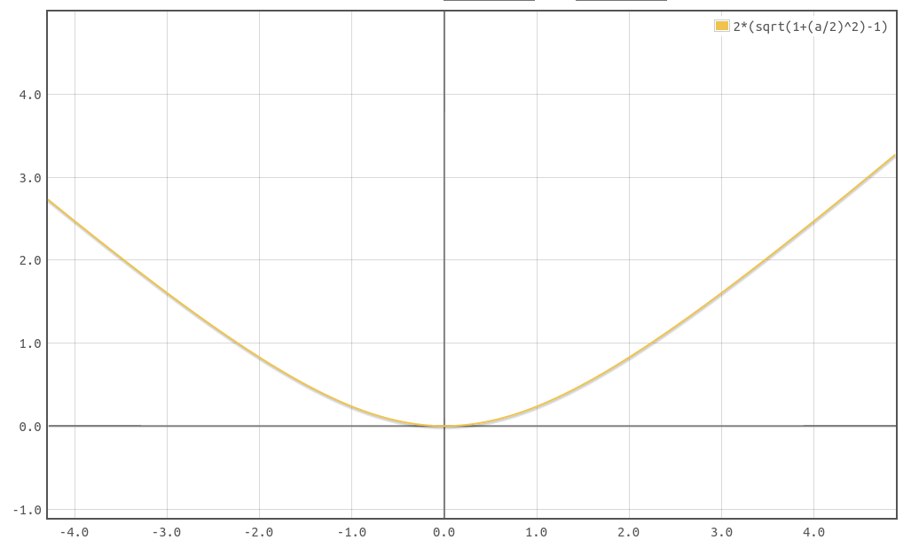

#损失函数

常在计量经济学中使用,比最小二乘法受离群点影响更小,有时也被用为分类的变体.  

# Huder Loss

^88e5f1

公式如下:

$$
L_{\delta }(a)={\begin{cases}{\frac {1}{2}}{a^{2}}&{\text{for }}|a|\leq \delta ,\\\delta (|a|-{\frac {1}{2}}\delta ),&{\text{otherwise.}}\end{cases}}
$$

a 较小的时候,整个函数是二次的抛物线,而当 a 较大时,函数变为线性的,下图中取 $\delta=1$ 时的图像, a 较小时是蓝色段,较大时是绿色段.当 $|a|=\delta$ 时,两段的值相等,但是斜率不同.

  

若令 a 为标签和预测点的差值,那么公式可以变为:

$$
L_{\delta }(y,f(x))={\begin{cases}{\frac {1}{2}}(y-f(x))^{2}&{\textrm {for}}|y-f(x)|\leq \delta ,\\\delta \,|y-f(x)|-{\frac {1}{2}}\delta ^{2}&{\textrm {otherwise.}}\end{cases}}

$$

显然,在 $(-\delta,\delta)$ 区间,函数使用的是平方误差,而对于叫远的点,函数使用线性误差,即比起 MSE,Huder Loss 降低了离群点的惩罚.

# Pseudo-Huber loss function

是 [Huder Loss](#Huder%20Loss) 的一个平滑版本,继承了 L2 和 L1 loss 的优点,在目标周围,具有强凸性,产生较大的惩罚,而对于原理目标远点的极值点,产生较小的惩罚,其公式如下:

$$
L_{\delta }(a)=\delta ^{2}\left({\sqrt {1+(a/\delta )^{2}}}-1\right).
$$

使用 $\delta$ 可以控制函数对远近点惩罚的力度  
以下是 $\delta=2$ 时函数图像:

# huber loss 在分类上的应用

在分类上常使用 huber loss 的一个变体,设 $f(x)$ 为预测,$y \in \{-1,+1\}$ 为标签,则其公式为:

$$
L(y,f(x))={\begin{cases}\max(0,1-y\,f(x))^{2}&{\textrm {for}}\,\,y\,f(x)\geq -1,\\-4y\,f(x)&{\textrm {otherwise.}}\end{cases}}
$$

 其中 $\max(0,1-y\,f(x))^{2}$ 是常用于 SVM 中 Hinge loss

# 参考
- <https://chih-sheng-huang821.medium.com/%E6%A9%9F%E5%99%A8-%E6%B7%B1%E5%BA%A6%E5%AD%B8%E7%BF%92-%E6%90%8D%E5%A4%B1%E5%87%BD%E6%95%B8-loss-function-huber-loss%E5%92%8C-focal-loss-bb757494f85e>
- <https://en.wikipedia.org/wiki/Huber_loss>
- <https://www.cnblogs.com/nowgood/p/Huber-Loss.html>