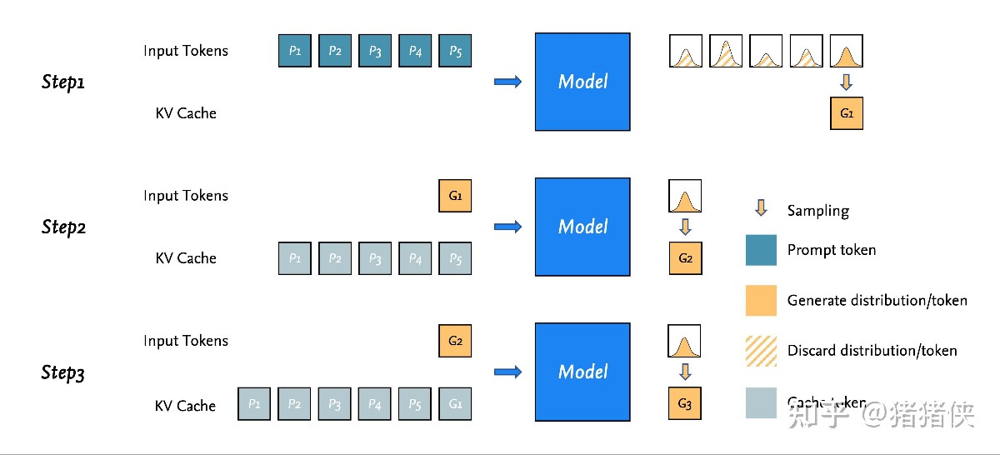

#LLM

- 第一步， N 个 prompt tokens 同时输入到模型，并得到 N 个 distribution（用于预测下一个 token 的），仅最后一个为我们需要的分布，其余计算得到的分布会被忽略。（图 Step1 右侧，仅最后一个分布执行进一步的采样）
- 同时，输入模型中的 prompt tokens 的一部分计算结果会被缓存到 kv cache 中（图 Step2 左侧灰色块），因此之后的自回归采样只需要输入上一次采样预测得到的 token 便可完成计算。
- 重复这个过程，直到生成代表着结束的 token 或者生成的序列超过模型设定的最大序列长度。
