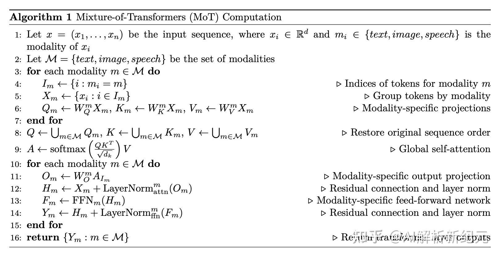

来自论文 Mixture-of-Transformers: A Sparse and Scalable Architecture for Multi-Modal Foundation Models.

用来解决多模态融合时，使用 MoE 容易出现路由负载不均，训练不稳定问题。设计思路是，不同模态的 q，k，v，o 的投影层，FFN 以及 layernorm 各自算，但是 attention 放一起算。具体步骤如下：

即：

1. 分组：先把输入 $X$ 按照模态分组
2. 投影：分别使用 $W^{text},W^{image},W^{speech}$ 进行投影
3. 合并做注意力：将投影后 $Q,K,V$ 拼回原顺序，一起进行 self-attention。保证不同模态之间信息可以互相关注
4. 输出&FFN: 把 attention 输出再次按模态分组，分别经过模态特定的投影 $W_O$ 和 $FFN$

# 参考
- <https://zhuanlan.zhihu.com/p/2003243161728861577>