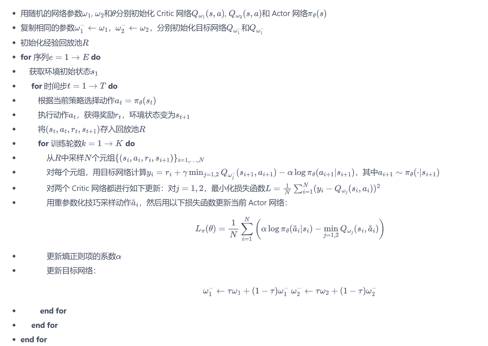

#强化学习 #AI回答 

以下回答来自 Gemini 3 pro：

SAC(Soft Actor-Critic) 是目前深度强化学习（DRL）领域最受欢迎的算法之一，尤其在机器人控制（如你关注的 Isaac Sim/Lab 场景）中表现极佳。它由伯克利大学的 Tuomas Haarnoja 等人在 2018 年提出。

简单来说，SAC 就像是一个**既想拿高分、又想尝试新花样**的聪明学生。

# 1. 核心思想：为什么要“软” (Soft)？

传统的强化学习目标是**最大化累积奖励**。而 SAC 的目标是**最大化累积奖励 + 策略的熵 (Entropy)**。

- **奖励 (Reward)：** 告诉机器人“你要完成任务”。
- **熵 (Entropy)：** 衡量动作的随机程度。熵越高，动作越多样化。

**为什么要加熵？**

如果只看奖励，机器人很容易在找到一个“还凑合”的办法后就停止探索（陷入局部最优）。加入熵之后，算法会鼓励机器人在保证得分的前提下，动作尽量“随机”一点。

- **好处：** 探索更充分、抗干扰能力强（鲁棒性高）、训练更稳定。

# 2. SAC 与 Q-Learning 的关系

SAC 本质上是 **Q-Learning 的升级版**，它巧妙地结合了 **Q-Learning** 和 **Actor-Critic** 的优点：

1. **根源：** 它起源于 **Soft Q-Learning**。传统的 Q-Learning 是选 $Q$ 值最大的动作（贪婪），而 Soft Q-Learning 是根据 $Q$ 值的分布来选动作（越好的动作概率越高，但不绝对）。
2. **Actor-Critic 架构：** 为了处理连续动作空间（比如控制机器人手臂的扭矩），SAC 引入了 Actor（策略网络）来直接输出动作概率分布，而 Critic（价值网络）则用来评估这个分布的好坏。
3. **离策 (Off-policy)：** 和 DQN 或 DDPG 一样，SAC 可以利用经验回放池（Replay Buffer）学习过去的数据，数据利用率极高。

# 3. 核心公式详解

在 SAC 中，有几个关键公式定义了它的运行逻辑：

## (1) 目标函数 (Maximum Entropy Objective)

$$J(\pi) = \sum_{t=0}^{T} \mathbb{E}_{(s_t, a_t) \sim \rho_\pi} [r(s_t, a_t) + \alpha H(\pi(\cdot|s_t))]$$

- **$r(s_t, a_t)$**：即时奖励。
- **$H(\pi(\cdot|s_t))$**：熵项，公式为 $-\log \pi(a|s)$。
- **$\alpha$ (温度参数)**：决定了“探索”和“拿分”的比例。$\alpha$ 越大，机器人越爱乱动；$\alpha$ 越小，越倾向于只拿高分。
## (2) 软 Bellman 方程 (Soft Bellman Equation)

Critic 网络学习的目标是：

$$Q(s, a) = r(s, a) + \gamma \mathbb{E}_{s' \sim P, a' \sim \pi} [Q(s', a') - \alpha \log \pi(a'|s')]$$

- 这里的 $Q$ 值不仅包含未来的奖励，还包含了未来的“熵”。
- 注意减去 $\log \pi$ 的项，这实际上就是在 $Q$ 值中计入了熵的收益。


# 4. SAC 的计算步骤

SAC 在训练时通常包含 **1 个 Actor 网络** ($\pi$) 和 **2 个 Critic 网络** ($Q_1, Q_2$)。使用双 Critic 是为了解决 $Q$ 值过估计的问题（借鉴了 TD3）。

## 第一步：数据收集

机器人根据当前策略 $\pi$ 在环境中采样 $(s, a, r, s', d)$，存入 **Replay Buffer**。

## 第二步：更新 Critic（评估者）

从 Buffer 中随机抽取一簇数据（Batch）：

- 计算目标值 $y$ ：

    $$y = r + \gamma \left( \min(Q_{target1}(s', a'), Q_{target2}(s', a')) - \alpha \log \pi(a'|s') \right)$$

    _这里用了两个目标 Q 网络取最小值，保证评估不过于乐观。_

- 更新网络： 通过最小化均方误差 (MSE) 来更新 $Q_1$ 和 $Q_2$ 的参数。
## 第三步：更新 Actor（决策者）

Actor 的目标是让输出的动作能得到更高的 $Q$ 值和更高的熵：

$$\text{Loss}_{\pi} = \mathbb{E}_{s \sim D, a \sim \pi} [\alpha \log \pi(a|s) - Q_{min}(s, a)]$$

- **重参数化技巧 (Reparameterization Trick)：** 这是一个技术细节。为了让梯度能传回 Actor 网络，我们不直接采样动作，而是输出高斯分布的均值和标准差，再通过一个小公式 $a = \mu + \sigma \cdot \epsilon$ 算出动作。

## 第四步：更新温度参数 $\alpha$（可选但常用）

现代 SAC 通常会自动调整 $\alpha$。如果发现熵太低了，就调大 $\alpha$ 鼓励探索；如果熵已经够高了，就调小 $\alpha$ 让策略更专注。

## 第五步：软更新 (Soft Update)

以极小的比例（如 $\tau=0.005$）更新目标网络，保证训练过程平滑，不乱跳。

# 5. 总结

| **特性**   | **说明**                       |
| -------- | ---------------------------- |
| **样本效率** | 极高 (Off-policy，数据反复利用)       |
| **稳定性**  | 极佳 (双 Critic + 熵正则化)         |
| **动作空间** | 完美支持连续空间 (Continuous Action) |
| **核心卖点** | 自动探索，不容易陷入局部最优               |

# 伪代码实现
## SAC 算法简易伪代码

```Python
# 1. 初始化
初始化 策略网络 (Actor) π_phi
初始化 两个价值网络 (Critics) Q_theta1, Q_theta2
初始化 两个目标价值网络 Q_target1, Q_target2 (参数复制自 Critics)
初始化 经验回放池 (Replay Buffer) D
初始化 熵系数 alpha (通常设为 0.2 或可学习)

# 2. 训练主循环
for 每一个 episode do:
    for 每一个 timestep t do:
        # --- 交互阶段 ---
        s = 当前环境状态
        a = 从 π_phi(s) 中采样得到的动作 (包含随机性，用于探索)
        执行动作 a，获得奖励 r，下一状态 s', 结束标志 done
        将 (s, a, r, s', done) 存入 D

        # --- 学习阶段 (当 Buffer 里的数据够多时) ---
        从 D 中随机抽取一个 Batch 的经验数据

        # (A) 更新 Critic 网络 (让评估更准)
        1. 采样下一状态的动作: a' ~ π_phi(s')
        2. 计算目标 Q 值 (Target Y):
           y = r + gamma * (1 - done) * (min(Q_target1(s', a'), Q_target2(s', a')) - alpha * log(π_phi(a'|s')))
           # 注：这里减去 log(π) 就是为了奖励“高熵/多样性”
        3. 计算 Critic 损失:
           Loss_Q1 = Mean((Q_theta1(s, a) - y)^2)
           Loss_Q2 = Mean((Q_theta2(s, a) - y)^2)
        4. 梯度下降更新 Q_theta1 和 Q_theta2

        # (B) 更新 Actor 网络 (让决策更强)
        1. 采样当前状态的新动作: a_new ~ π_phi(s)
        2. 计算 Actor 损失 (最大化 Q 值 + 最大化熵):
           Loss_pi = Mean(alpha * log(π_phi(a_new|s)) - min(Q_theta1(s, a_new), Q_theta2(s, a_new)))
        3. 梯度下降更新 π_phi

        # (C) 软更新目标网络 (Soft Update)
        Q_target1 = tau * Q_theta1 + (1 - tau) * Q_target1
        Q_target2 = tau * Q_theta2 + (1 - tau) * Q_target2
```

## 具体计算步骤



## 关键点直击：为什么代码里要这么写？

### 1. 为什么有两个 $Q$ 网络？

为了防止**过估计 (Overestimation)**。在计算目标 $y$ 时，我们取两个 $Q$ 网络中的最小值。这能防止机器人“蜜汁自信”，认为某个动作能拿高分而实际上并不能。

### 2. `log(π_phi(a'|s'))` 是干嘛的？

这就是**熵 (Entropy)** 的体现。

- 如果概率 $\pi$ 很大（动作很确定），则 $\log(\pi)$ 接近 0。
- 如果概率 $\pi$ 很小（动作很多样），则 $\log(\pi)$ 是一个很大的负数。
- 在公式里是 `- alpha * log(π)`，所以 $\log(\pi)$ 越小（负得越多），整体数值越大，相当于给了额外的奖励。
### 3. 重参数化 (Reparameterization Trick)

虽然伪代码写的是 `a ~ π_phi(s)`，但在实际代码中，为了让梯度能通过采样过程传给 Actor，我们会这样做：

- 网络输出均值 $\mu$ 和标准差 $\sigma$。
- 动作 $a = \mu + \sigma \cdot \epsilon$，其中 $\epsilon$ 是从标准正态分布 $N(0, 1)$ 中采样的噪声。
    这样，误差就能顺着 $a$ 传回到 $\mu$ 和 $\sigma$。
    

# PPO 和 SAC 分别适用的场景

## 1. 核心差异：PPO vs. SAC

|**特性**|**PPO (Proximal Policy Optimization)**|**SAC (Soft Actor-Critic)**|
|---|---|---|
|**算法类型**|**On-policy** (在线策略)|**Off-policy** (离线策略)|
|**数据利用率**|低。数据用完即弃，不能回头看。|**高**。有经验回放池，数据反复揉碎了学。|
|**稳定性**|**极强**。几乎不崩，调参友好。|较强。比 DDPG 稳得多，但不如 PPO 佛系。|
|**探索能力**|靠动作空间的噪声，容易陷入局部最优。|**极强**。自带“熵最大化”，主动尝试新花样。|
|**实现难度**|相对简单，逻辑直观。|复杂。涉及双 Critic、重参数化、自动调温。|

## 2. 优劣势深度分析

### PPO 的优劣势

- **优势：稳如老狗。** PPO 通过“剪切功能 (Clipping)”限制了策略更新的幅度，确保机器人不会因为一次错误的尝试就彻底“学废了”。在复杂的足式机器人（Locomotion）任务中，它是首选。
- **劣势：数据饥渴。** 因为它不使用 Replay Buffer，为了学到一个动作，它需要海量的采样。如果你是在真机上练，PPO 会让你的机器人磨损到报废。
### SAC 的优劣势
- **优势：样本专家 & 探索大师。** 对于像“双臂合力抱起箱子”这种需要精细操作且解空间很窄的任务，SAC 的熵正则化能帮它更快找到那个“精妙的动作”。它的样本效率通常比 PPO 高出 10-100 倍。
- **劣势：计算开销大。** 每次更新都要从 Buffer 里随机采样并计算梯度，由于你手握 **RTX 5090**，这个缺点对你来说几乎可以忽略不计。

## 3. 场景选择：你应该选哪一个？
### 适合使用 PPO 的场景：
1. **大规模并行仿真：** 如果你在 Isaac Lab 里同时跑 4096 个机器人（这对 5090 来说很轻松），PPO 的样本利用率低就不再是问题，因为“量大管饱”。
2. **足式行走 (Locomotion)：** 这种任务对稳定性要求极高，PPO 的单调提升特性更不容易让机器人摔得稀碎。
3. **Sim-to-Real：** 工业界更喜欢 PPO，因为它训练出的策略通常更鲁棒，迁移到真机上更安全。

### 适合使用 SAC 的场景：
1. **复杂操纵 (Manipulation)：** **你的双臂搬箱子任务正属于此类。** SAC 擅长处理这种需要多关节协同、精细力控的场景。
2. **稀疏奖励任务：** 如果搬完箱子才有奖励，SAC 的高探索性更有可能碰巧完成任务。
3. **真实机器人训练：** 如果你打算直接在物理双臂机器人上微调，必须选 SAC，否则你会等训练结果等到天荒地老。


## 4. 给团长的实战建议

对于你的**双臂机器人搬运项目**，我建议的策略是：

1. **初期尝试：** 先用 **PPO**。因为 PPO 容易跑通，能帮你快速验证你的 Observation（观测）和 Reward（奖励）写得对不对。
    
2. **性能冲刺：** 当 PPO 遇到瓶颈（比如成功率卡在 70% 升不上去，或者动作太机械），果断切换到 **SAC**。SAC 挖掘出的策略往往更加细腻、更像“人”。
    

> **小贴士：** 既然你关注 **Isaac Lab**，要注意 SAC 在极大规模并行采样（如数万个环境）时，其梯度更新的开销可能会让 5090 的显存压力增大，此时需要微调 Batch Size。


