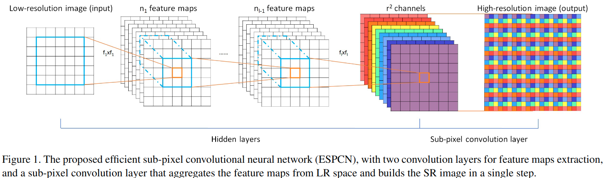

来源文章: [Real-Time Single Image and Video Super-Resolution Using an Efficient Sub-Pixel Convolutional Neural Network](https://paperswithcode.com/paper/real-time-single-image-and-video-super#code)   
又叫Pixel Shuffle,像素洗牌? 大致思想就是保存像素总数不变,将缩小的分辨率融到通道到,然后在最后上采样时,将通道按照周期性排列成大图.下图显示了这个操作的一个总体流程.   

pytorch 的 API 参见:https://pytorch.org/docs/stable/generated/torch.nn.PixelShuffle.html
