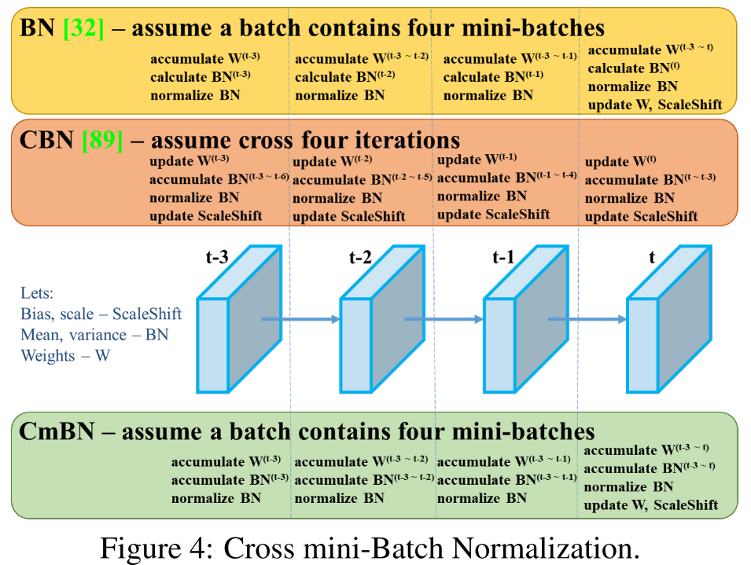

#目标检测 
#yolo

[toc]

最早来源于 yolov4,示意图如下:  

这里 accumulate 代表积累,即对第 t 时刻的梯度或者 BN 参数进行累加(梯度不清零), calculate $BN^t$ 表示 t 时刻的 BN 统计量,即均值和方差. normalize $BN$ 表示 BN 的前项过程.

# 常规 BN
黄色部分显示了常规的 BN 技巧,即每累积 4 个迭代才更新一次权重.注意 bn 操作每次仅考虑当前迭代的 batch 的统计量,无法实现等价的扩大.

# CBN
来源于论文 [Cross-Iiteration Batch Normalization](https://github.com/Howal/Cross-iterationBatchNorm)  
其 BN 的统计量均值和方差计算方式如下:
$$
\bar{u}^l_{t,k}(\theta_t)=\frac{1}{k}\sum_{\tau=0}^{k-1} u^l_{t,k}(\theta_t),  \tag{9}
$$
$$
\bar{v}^l_{t,k}(\theta_t)=\frac{1}{k}\sum_{\tau=0}^{k-1} max[v^l_{t-\tau}(\theta_t),u^l_{t-\tau}(\theta_t)^2],  \tag{10}
$$
$$
\bar{\sigma}^l_{t,k}(\theta_t)=\sqrt{\bar{v}^l_{t,k}(\theta_t)-\bar{u}^l_{t,k}(\theta_t)^2},  \tag{11}
$$

结合途中橙色部分就是,
先更新权重,然后每个迭代在计算统计量时,会按照上述公式结合前 3 个迭代和当前迭代的统计值作为当前统计值,然后 BN 前馈,然后更新偏置.
总体思想其实就是对 BN 统计量计算时进行一定的补偿

# CmBN
来源于 yolov4,实际是 CBN 的一种简化.
结合绿色图,先累加梯度,然后按照 CBN 公式计算当前 cross mini-batch 中的 BN 统计量, 最后在 mini-batch 最后一个迭代中更新参数. 注意这里在计算统计量,仅仅考虑当前 mini-batch 中的统计量,这点和 CBN 略有不一样.

# 相关参考
- https://zhuanlan.zhihu.com/p/141533907
