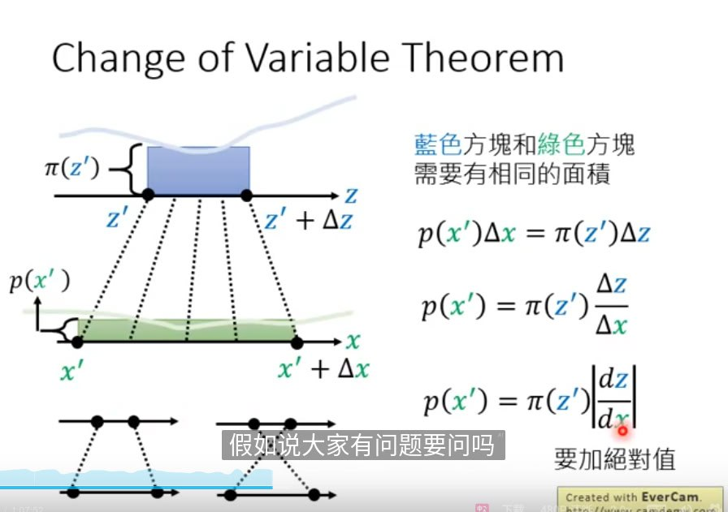
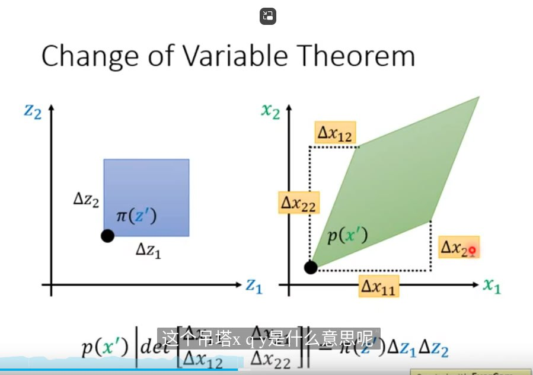
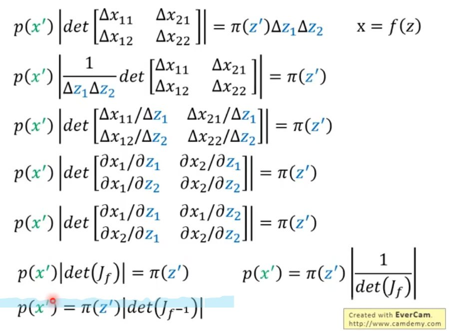

#生成模型 

文章:

- <https://lilianweng.github.io/lil-log/2018/10/13/flow-based-deep-generative-models.html>
- <https://kexue.fm/archives/5776>
- <https://kexue.fm/archives/5807>
- <https://kexue.fm/archives/5977>
- <https://kexue.fm/archives/6482>
- <https://github.com/2019ChenGong/Machine-Learning-Notes/blob/master/White_2020_06_27_Flow_Model.pdf>
- <https://www.gwylab.com/note-flow_based_model.html>

视频:

- <https://youtu.be/uXY18nzdSsM?list=PLJV_el3uVTsOK_ZK5L0Iv_EQoL1JefRL4>
- <https://www.bilibili.com/video/BV18E411w7Jh>
- <https://www.bilibili.com/video/av46561029/?p=59&vd_source=c6acf7e2d08361599bddd176f227d590>

# 关于李宏毅 2019 Flow-based Generative Model 笔记
## 雅可比矩阵（jacobian matrix）

假设 $y=f(x)$ ,那么函数 $f$ 的 jacobian matrix 就是 $y$ 的每一维对 $x$ 的每一维求偏导所形成的矩阵：

比如假设：

$$
z=\begin{bmatrix} z_1 \\ z_2 \end{bmatrix},x=\begin{bmatrix} x_1 \\ x_2 \end{bmatrix},x=f(z)
$$

那么：

$$
J_f=\begin{bmatrix} \partial{x_1}/\partial{z_1} & \partial{x_1}/\partial{z_2} \\ \partial{x_2}/\partial{z_1} & \partial{x_2}/\partial{z_2}  \end{bmatrix}
$$

矩阵的横轴是输入，纵轴是输出

## 行列式 (Determinant)

含义：一个 $n \times n$ 大小的行列式，表示了每行作为一个向量， $n$ 个向量所构成的 $n$ 维超体图形的体积。

## 变量替换定理 (Change of Variables Theorem)

想要解决的问题：

假设现有两个分布 $\pi{(z)}$ 和 $p(x)$ ，已知 $x=f(z)$ ,求 $\pi{(z)}$ 和 $p(x)$ 的关系。

这里由于是微分， $\Delta$ 很小，因此在这个小范围内，我们可以认为 $z'$ 到 $z'+\Delta z$ 是一个平均分布。那么如果知道 $x=f(z)$ ，那么就可以求出 $\frac{dz}{dx}$ 。

多维的情况下如下图：

即 $z$ 空间下变化的超体积等于变化后对应于 $x$ 空间的图像超体积。

整理以上式子得到：

## Flow-based Model 的一些基本限定

由于要求 generator 的逆 $G^{-1}$ ，因此 x 和 z 的维度必须得一样。另外 generator 的架构有限制，肯定能力有限，因此会叠加多个。

 具体在训练时，由于上式子中仅有 $G^{-1}$ 。因此我们通常是训练 $G^{-1}$ ,然后推理时用 $G$ ，即从真实分布中采样一个样本 $x^i$ ，然后得到 $z^i=G^{-1}(x^i)$ ,然后使 $\pi (z^i)$ 最大。

 由于 $\pi (z^i) \backsim (0,1)$ ，因此它会驱使 $z$ 趋向 0，而当 $z=0$ ，则 $J_{G^{-1}}$ 为一个 0 矩阵，其行列式也为 0，因此会导致最大化的目标函数后半段趋于 $-inf$ 。

## Flow-based model 常见基础架构
**Coupling Layer**
### 前向推理模式 ：

即，将正太分布抽样出来的 $z$ 按照 $d$ 维来分成两段，第一段 $z_{i \leq d}$ 直接复制得到 $x_{i \leq d}$  ,然后将 $z_{i \leq d}$ 分别经过两个网络 F 和 H，得到 $\beta_{D}$ 和 $\gamma_{D}$ ,然后 $x_{i > d}=\beta_{i} z_i+\gamma_{i}$ 。

依据 [苏神 blog](https://kexue.fm/archives/5776) 中说法，H 为加性耦合层，F 为尺度变换层（乘性耦合层）。尺度变换层一个重要作用就是识别各维度的重要性，等价于将先验分布的方差作为了训练参数，如果先验分布的方差很小，意味着改分布坍缩成一个点，意味着流形可以减少一维，进而有缓解 flow 模型在维度上浪费的可能。

### 求逆 

以上网络求逆，即知道 $x$ 求 $z$ 时，则： $z_{i \leq d}=x_{i \leq d}$ , $z_{i>d}=\frac{x_i-\gamma_i}{\beta_i}$ 

### 求雅可比矩阵的行列式

$z_{i \leq d}=x_{i \leq d}$ ，所以左上角的块中矩阵是一个单位矩阵， $z_{i \leq d}$ 和 $x_{i > d}$ 没有关系，所以右上角块中是 0 矩阵。由于这两块分别是单位矩阵和 0 矩阵，因此整个矩阵的行列式等于右下角块中矩阵的行列式。而这里由于 $x_{i>d}=\beta_i z_i+\gamma_i$ ,所以 $z_i$ 仅和 $x_i$ 有关系，因此整个右下角块中矩阵为一个对角矩阵，其行列式等于 $\prod_{i=d}^D \beta_i$ 。

另外通常为了保证整个 G 的可逆性，意味着整个雅可比矩阵的行列式应该不为 0，因此这里一般我们不妨约束右下角矩阵各个元素均大于零。故一般直接用神经网络输出 $logz$ 然后取指数形式 $e^{logz}$

### Coupling Layer 堆叠方法

多个 coupling layer 堆叠时，通常会交替反向。即第一个 coupling layer 的输入前 d 维直接 copy，后 d 维转换，到下一个 coupling layer，输入前 d 维转换，后 d 维 copy，这样就避免了第一个 coupling layer 的前 d 维会被直接传到最后一个 coupling layer 的前 d 维。

在 NICE 中采用的是交替方法。而在 RealNVP 中发现将向量打乱可以使信息混合更加充分，因此它会在每次完成之后将 $x_{i \leq d}$ 和 $x_{i>d}$ 拼接起来成为 $x$ ，然后将该向量重新随机排序，然后作为下一阶段输出。

在实际进行图像生成时，通常会从空间维度或者通道维度划分 d 维。空间维比如奇数的维度直接 copy，偶数维度进行转换；通道维可能是前两通道进行 copy，第三通道进行转换。这两种划分维度的方式也可以互相混用。

依据 [苏神 blog](https://kexue.fm/archives/5807#%E5%BC%95%E5%85%A5%E5%8D%B7%E7%A7%AF%E5%B1%82)，在 RealNVP 中为了引入卷积，需要保持数据在空间维度上的局部关联性，因此上述所说的随机排序仅在通道维度进行。

另外为了增加通道轴的维度，RealNVP 还采用了类似 Swin Transformer 中类似 Patch merging 的做法, 即将图片下采样一倍，将下采样的像素转移到通道维，即 $h  \times w \times c$ 变为 $h/2 \times w/2 \times 4c$ 。

## GLOW 中的方法

论文： <https://arxiv.org/abs/1807.03039>

更进一步，假设输出图像中每个像素仅与前一个输入中对应位置像素有关，那只需让模型来学习如何将各通道进行混合就好, 由于图像是 3 通道，那么引入一个 $3 \times 3$ 大小的矩阵来指导模型如何混合通道信息即可。

由于只要矩阵行列式不为 0，那么矩阵即可逆，所以以一个可逆矩阵来初始化，学习出来的矩阵行列式为 0 的概率还是很小的，因此 W 可逆这件事很容易达成。

其雅可比矩阵就是 W 的权重。那么其整个的雅可比矩阵的行列式就为：

## 应用

一种可行的应用用来做图像元素中的控制，比如如何让图片中的人笑起来。那么可以收集一堆笑的人的图片 dataA 和一堆不笑的人的图片 dataB，然后把 dataA 经过 $G^{-1}$ 得到 $Z_A$ ,然后取平均得到 $z_{Amean}$ ，同理得到 $z_{Bmean}$ 。然后得到笑到不笑的残差向量 $z_smile=z_{Bmean}-z_{Amean}$ 。

然后将待变换图片经过 $G^{-1}$ 得到 $z_{test}$ ,然后加上微笑残差向量送入到 $G$ ,即可得到笑的人脸。（感觉类似 GAN 的反演）