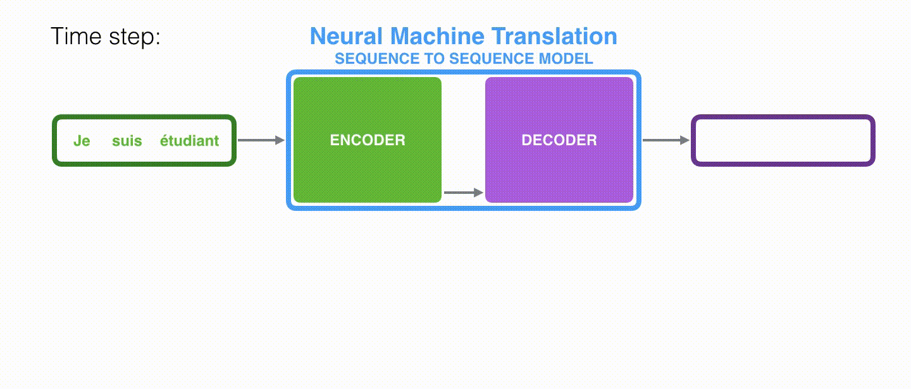
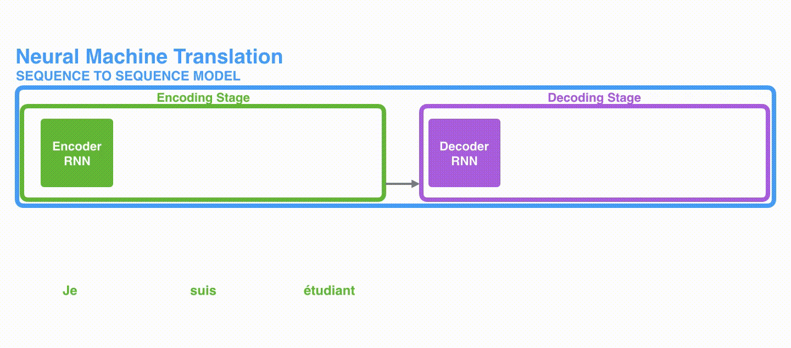
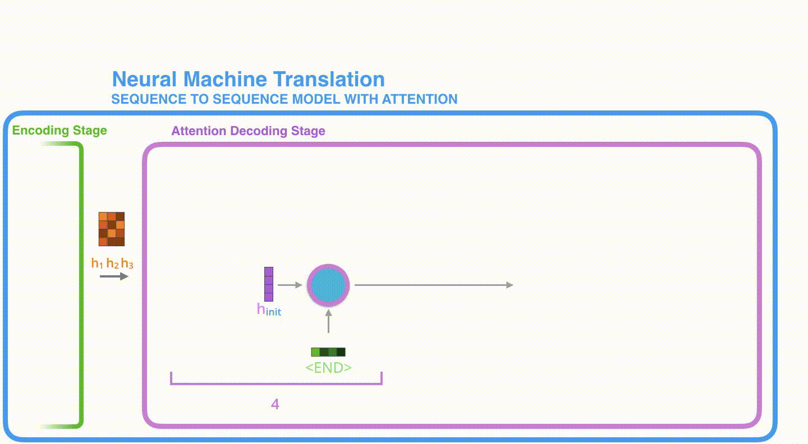

## 图解Attention
内容组织：
- 图解Attention
  - seq2seq框架
  - seq2seq细节
  - Attention
  - 致谢

篇章1中我们对Transformers在NLP中的兴起做了概述。本教程的学习路径是：Attention->Transformer->BERT->NLP应用。因此，本篇章将从attention开始，逐步对Transformer结构所涉及的知识进行深入讲解，希望能给读者以形象生动的描述。

问题：Attention出现的原因是什么？
潜在的答案：基于循环神经网络（RNN）一类的seq2seq模型，在处理长文本时遇到了挑战，而对长文本中不同位置的信息进行attention有助于提升RNN的模型效果。

于是学习的问题就拆解为：1. 什么是seq2seq模型？2. 基于RNN的seq2seq模型如何处理文本/长文本序列？3. seq2seq模型处理长文本序列时遇到了什么问题？4.基于RNN的seq2seq模型如何结合attention来改善模型效果？

## seq2seq框架

seq2seq是一种常见的NLP模型结构，全称是：sequence to sequence，翻译为“序列到序列”。顾名思义：从一个文本序列得到一个新的文本序列。典型的任务有：机器翻译任务，文本摘要任务。谷歌翻译在2016年末开始使用seq2seq模型，并发表了2篇开创性的论文：[Sutskever等2014年发表的Sequence to Sequence Learning
with Neural Networks](https://papers.nips.cc/paper/5346-sequence-to-sequence-learning-with-neural-networks.pdf)和[Cho等2014年发表的Learning Phrase Representations using RNN Encoder–Decoder
for Statistical Machine Translation](http://emnlp2014.org/papers/pdf/EMNLP2014179.pdf)，感兴趣的读者可以阅读原文进行学习。

无论读者是否读过上述两篇谷歌的文章，NLP初学者想要充分理解并实现seq2seq模型很不容易。因为，我们需要拆解一系列相关的NLP概念，而这些NLP概念又是是层层递进的，所以想要清晰的对seq2seq模型有一个清晰的认识并不容易。但是，如果能够把这些复杂生涩的NLP概念可视化，理解起来其实就更简单了。因此，本文希望通过一系列图片、动态图帮助NLP初学者学习seq2seq以及attention相关的概念和知识。

首先看seq2seq干了什么事情？seq2seq模型的输入可以是一个（单词、字母或者图像特征）序列，输出是另外一个（单词、字母或者图像特征）序列。一个训练好的seq2seq模型如下图所示（注释：将鼠标放在图上，图就会动起来）：

动态图：seq2seq

如下图所示，以NLP中的机器翻译任务为例，序列指的是一连串的单词，输出也是一连串单词。
动态图：translation

## seq2seq细节
将上图中蓝色的seq2seq模型进行拆解，如下图所示：seq2seq模型由编码器（Encoder）和解码器（Decoder）组成。绿色的编码器会处理输入序列中的每个元素并获得输入信息，这些信息会被转换成为一个黄色的向量（称为context向量）。当我们处理完整个输入序列后，编码器把 context向量 发送给紫色的解码器，解码器通过context向量中的信息，逐个元素输出新的序列。

动态图：seq2seq中的encoder-decoder

由于seq2seq模型可以用来解决机器翻译任务，因此机器翻译被任务seq2seq模型解决过程如下图所示，当作seq2seq模型的一个具体例子来学习。

动态图：seq2seq中的encoder-decoder，机器翻译的例子

深入学习机器翻译任务中的seq2seq模型，如下图所示。seq2seq模型中的编码器和解码器一般采用的是循环神经网络RNN（Transformer模型还没出现的过去时代）。编码器将输入的法语单词序列编码成context向量（在绿色encoder和紫色decoder中间出现），然后解码器根据context向量解码出英语单词序列。*关于循环神经网络，本文建议阅读 [Luis Serrano写的循环神经网络精彩介绍](https://www.youtube.com/watch?v=UNmqTiOnRfg).*

图：context向量对应上图中间浮点数向量。在下文中，我们会可视化这些数字向量，使用更明亮的色彩来表示更高的值，如上图右边所示

如上图所示，我们来看一下黄色的context向量是什么？本质上是一组浮点数。而这个context的数组长度是基于编码器RNN的隐藏层神经元数量的。上图展示了长度为4的context向量，但在实际应用中，context向量的长度是自定义的，比如可能是256，512或者1024。

那么RNN是如何具体地处理输入序列的呢？

1. 假设序列输入是一个句子，这个句子可以由$n$个词表示：$sentence = \{w_1, w_2,...,w_n\}$。
2. RNN首先将句子中的每一个词映射成为一个向量得到一个向量序列：$X = \{x_1, x_2,...,x_n\}$，每个单词映射得到的向量通常又叫做：word embedding。
3. 然后在处理第$t \in [1,n]$个时间步的序列输入$x_t$时，RNN网络的输入和输出可以表示为：$h_{t} = RNN(x_t, h_{t-1})$

    - 输入：RNN在时间步$t$的输入之一为单词$w_t$经过映射得到的向量$x_t$。
    - 输入：RNN另一个输入为上一个时间步$t-1$得到的hidden state向量$h_{t-1}$，同样是一个向量。
    - 输出：RNN在时间步$t$的输出为$h_t$ hidden state向量。

 图：word embedding例子。我们在处理单词之前，需要将单词映射成为向量，通常使用 word embedding 算法来完成。一般来说，我们可以使用提前训练好的 word embeddings，或者在自有的数据集上训练word embedding。为了简单起见，上图展示的word embedding维度是4。上图左边每个单词经过word embedding算法之后得到中间一个对应的4维的向量。

让我们来进一步可视化一下基于RNN的seq2seq模型中的编码器在第1个时间步是如何工作：

 动态图：如图所示，RNN在第2个时间步，采用第1个时间步得到hidden state#10（隐藏层状态）和第2个时间步的输入向量input#1，来得到新的输出hidden state#1。

看下面的动态图，让我们详细观察一下编码器如何在每个时间步得到hidden sate，并将最终的hidden state传输给解码器，解码器根据编码器所给予的最后一个hidden state信息解码处输出序列。注意，最后一个 hidden state实际上是我们上文提到的context向量。
 动态图：编码器逐步得到hidden state并传输最后一个hidden state给解码器。

接着，结合编码器处理输入序列，一起来看下解码器如何一步步得到输出序列的l。与编码器类似，解码器在每个时间步也会得到 hidden state（隐藏层状态），而且也需要把 hidden state（隐藏层状态）从一个时间步传递到下一个时间步。

 动态图：编码器首先按照时间步依次编码每个法语单词，最终将最后一个hidden state也就是context向量传递给解码器，解码器根据context向量逐步解码得到英文输出。

目前为止，希望你已经明白了本文开头提出的前两个问题：1. 什么是seq2seq模型？2. seq2seq模型如何处理文本/长文本序列？那么请思考第3、4个问题：3. seq2seq模型处理文本序列（特别是长文本序列）时会遇到什么问题？4.基于RNN的seq2seq模型如何结合attention来解决问题3并提升模型效果？

## Attention
基于RNN的seq2seq模型编码器所有信息都编码到了一个context向量中，便是这类模型的瓶颈。一方面单个向量很难包含所有文本序列的信息，另一方面RNN递归地编码文本序列使得模型在处理长文本时面临非常大的挑战（比如RNN处理到第500个单词的时候，很难再包含1-499个单词中的所有信息了）。

面对以上问题，Bahdanau等2014发布的[Neural Machine Translation by Jointly Learning to Align and Translate](https://arxiv.org/abs/1409.0473) 和 Luong等2015年发布的[Effective Approaches to Attention-based Neural Machine Translation
](https://arxiv.org/abs/1508.04025)两篇论文中，提出了一种叫做注意力**attetion**的技术。通过attention技术，seq2seq模型极大地提高了机器翻译的质量。归其原因是：attention注意力机制，使得seq2seq模型可以有区分度、有重点地关注输入序列。

下图依旧是机器翻译的例子：

 图：在第 7 个时间步，注意力机制使得解码器在产生英语翻译student英文翻译之前，可以将注意力集中在法语输入序列的：étudiant。这种有区分度得attention到输入序列的重要信息，使得模型有更好的效果。

让我们继续来理解带有注意力的seq2seq模型：一个注意力模型与经典的seq2seq模型主要有2点不同：

- A. 首先，编码器会把更多的数据传递给解码器。编码器把所有时间步的 hidden state（隐藏层状态）传递给解码器，而不是只传递最后一个 hidden state（隐藏层状态），如下面的动态图所示:
 动态图: 更多的信息传递给decoder

- B. 注意力模型的解码器在产生输出之前，做了一个额外的attention处理。如下图所示，具体为：

  - 1. 由于编码器中每个 hidden state（隐藏层状态）都对应到输入句子中一个单词，那么解码器要查看所有接收到的编码器的 hidden state（隐藏层状态）。
  - 2. 给每个 hidden state（隐藏层状态）计算出一个分数（我们先忽略这个分数的计算过程）。
  - 3. 所有hidden state（隐藏层状态）的分数经过softmax进行归一化。
  - 4. 将每个 hidden state（隐藏层状态）乘以所对应的分数，从而能够让高分对应的  hidden state（隐藏层状态）会被放大，而低分对应的  hidden state（隐藏层状态）会被缩小。
  - 5. 将所有hidden state根据对应分数进行加权求和，得到对应时间步的context向量。
   动态图：在第4个时间步，编码器结合attention得到context向量的5个步骤。

所以，attention可以简单理解为：一种有效的加权求和技术，其艺术在于如何获得权重。

现在，让我们把所有内容都融合到下面的图中，来看看结合注意力的seq2seq模型解码器全流程，动态图展示的是第4个时间步：

1. 注意力模型的解码器 RNN 的输入包括：一个word embedding 向量，和一个初始化好的解码器 hidden state，图中是$h_{init}$。
2. RNN 处理上述的 2 个输入，产生一个输出和一个新的 hidden state，图中为h4。
3. 注意力的步骤：我们使用编码器的所有 hidden state向量和 h4 向量来计算这个时间步的context向量（C4）。
4. 我们把 h4 和 C4 拼接起来，得到一个橙色向量。
5. 我们把这个橙色向量输入一个前馈神经网络（这个网络是和整个模型一起训练的）。
6. 根据前馈神经网络的输出向量得到输出单词：假设输出序列可能的单词有N个，那么这个前馈神经网络的输出向量通常是N维的，每个维度的下标对应一个输出单词，每个维度的数值对应的是该单词的输出概率。
7. 在下一个时间步重复1-6步骤。
 动态图：解码器结合attention全过程

到目前为止，希望你已经知道本文开头提出的3、4问题的答案啦：3、seq2seq处理长文本序列的挑战是什么？4、seq2seq是如何结合attention来解决问题3中的挑战的？

最后，我们可视化一下注意力机制，看看在解码器在每个时间步关注了输入序列的哪些部分：
 动态图：解码步骤时候attention关注的词

需要注意的是：注意力模型不是无意识地把输出的第一个单词对应到输入的第一个单词，它是在训练阶段学习到如何对两种语言的单词进行对应（在我们的例子中，是法语和英语）。

下图还展示了注意力机制的准确程度（图片来自于上面提到的论文）：
 图：可以看到模型在输出 "European Economic Area" 时，注意力分布情况。在法语中，这些单词的顺序，相对于英语，是颠倒的（"européenne économique zone"）。而其他词的顺序是类似的。

读懂了attention和seq2seq模型就去github点个**star**打卡一下吧～～

## 致谢
主要由哈尔滨工业大学张贤同学翻译（经原作者 [@JayAlammmar](https://twitter.com/JayAlammar) 授权）撰写，由多多同学、datawhale学习者重新组织和整理。最后，期待您的阅读反馈和star哦。

