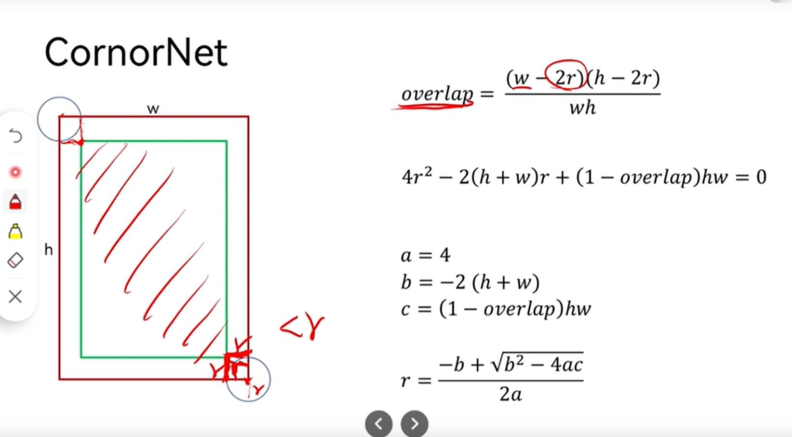

#目标检测

源自 [CornetNet](https://discuss.pytorch.org/t/discussion-about-the-paper-of-name-centernet/80658/2?u=hqabcxyxz)

官方实现代码：
```python
def gaussian_radius(det_size, min_overlap=0.7):
    height, width = det_size

    a1 = 1
    b1 = (height + width)
    c1 = width * height * (1 - min_overlap) / (1 + min_overlap)
    sq1 = np.sqrt(b1 ** 2 - 4 * a1 * c1)
    r1 = (b1 + sq1) / 2

    a2 = 4
    b2 = 2 * (height + width)
    c2 = (1 - min_overlap) * width * height
    sq2 = np.sqrt(b2 ** 2 - 4 * a2 * c2)
    r2 = (b2 + sq2) / 2

    a3 = 4 * min_overlap
    b3 = -2 * min_overlap * (height + width)
    c3 = (min_overlap - 1) * width * height
    sq3 = np.sqrt(b3 ** 2 - 4 * a3 * c3)
    r3 = (b3 + sq3) / 2
    return min(r1, r2, r3)

def draw_gaussian(heatmap, center, radius, k=1):
    diameter = 2 * radius + 1
    gaussian = gaussian2D((diameter, diameter), sigma=diameter / 6)

    x, y = int(center[0]), int(center[1])

    height, width = heatmap.shape[0:2]

    left, right = min(x, radius), min(width - x, radius + 1)
    top, bottom = min(y, radius), min(height - y, radius + 1)

    masked_heatmap = heatmap[y - top:y + bottom, x - left:x + right]
    masked_gaussian = gaussian[radius - top:radius + bottom, radius - left:radius + right]
    if min(masked_gaussian.shape) > 0 and min(masked_heatmap.shape) > 0:  # TODO debug
        np.maximum(masked_heatmap, masked_gaussian * k, out=masked_heatmap)
    return heatmap
```

[视频讲解](https://www.bilibili.com/video/BV1r44y1a75j?p=1&t=1734.8)

# 计算方法讲解：
## 情况1：
假设是在原始框上往外扩，此时
$$
overlap=\frac{wh}{(w+2r)(h+2r)}
$$
变形一下：
$$
4overlap \cdot r^2+2overlap(h+w)r+(overlap-1)hw=0
$$
将 $r$ 视为未知数，求上述方程：  
$a= 4overlap$,   
$b= 2overlap(h+w)$    
$c= (overlap-1)hw$    
$r=\frac{-b+\sqrt{b^2-4ac}}{2a}$

## 情况2
原始框往里缩，解析：  


## 其他情况
类似以上：

