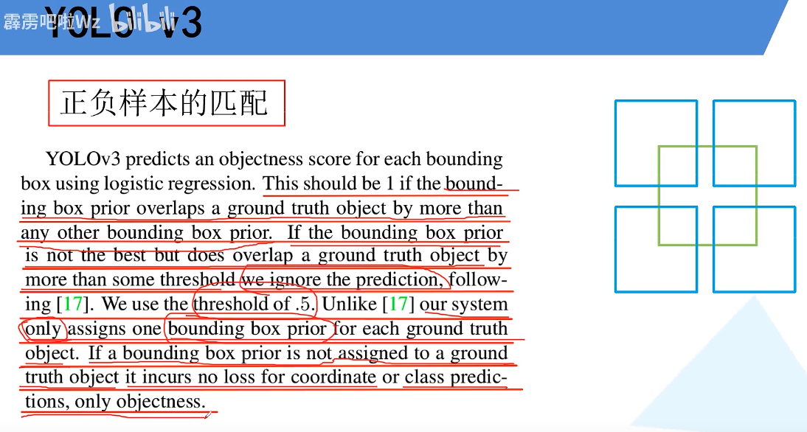
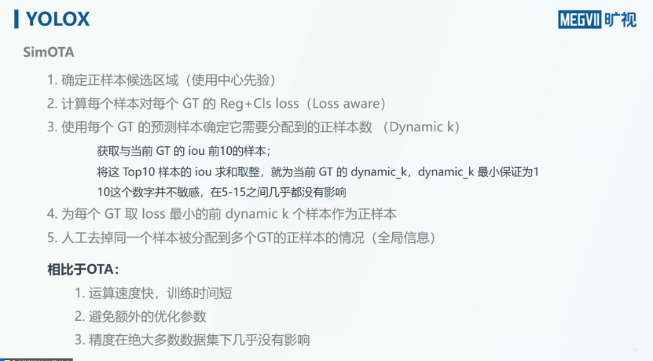

#目标检测 

[toc]
相关知识参见[目标检测中标签分配的一些要点思考](目标检测中标签分配的一些要点思考.md)

一些分享可以参见[YOLOX 视频](https://www.bilibili.com/video/BV1jo4y1D7CF?t=1235.1)

# YOLOV3
每个GT 对应一个 anchor, 该正样本 anchor为所有中和GT IOU最大的,大于一定阈值但是不是最大的anchor会被丢弃,剩下的anchor视为 GT的负样本.若一个anchor 不是正样本,那么该 anchor 不计算IOU损失和类别损失,仅仅计算目标损失.

对于 u 版中的实现,它取了阈值大于0.3的所有anchor作为正样本,这样可以增加正样本数量,提升性能.具体讲解可以参考 [B站](https://www.bilibili.com/video/BV1yi4y1g7ro?p=3&t=1300.6)

# YOLOV5
<https://zhuanlan.zhihu.com/p/543160484>

# YOLOX
参考博文:<https://zhuanlan.zhihu.com/p/394392992>
