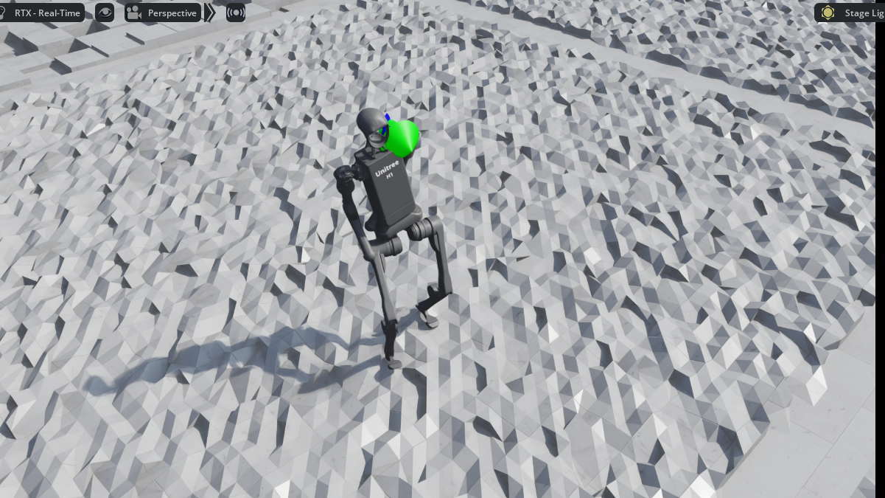
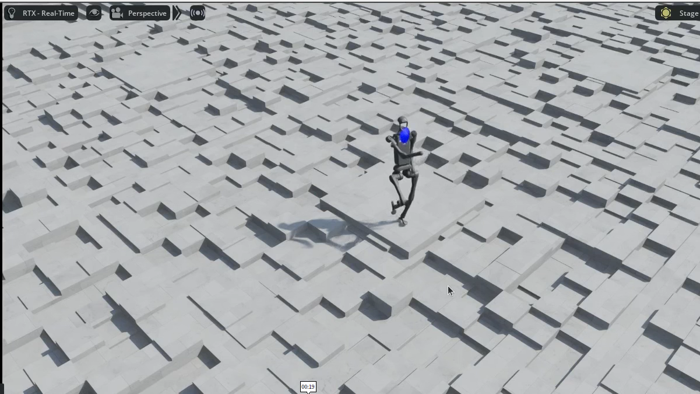

#IsaacLab #强化学习 

# 背景说明

调试 isaaclab 自带的 Isaac-Velocity-Rough-H1-v0 任务，尝试复现人走路，然后详细研究其 reward 写法

# 环境信息
- Issacsim: 5.1
- IsaacLab: 2.3.0
- 5090

# 实验 1

官方默认参数，没有任何改变。参照 [agent.yaml](IsaacLab_Isaac-Velocity-Rough-H1-v0_params/agent.yaml.md)

机器人行走如僵尸步

# 实验 2

官方默认参数，没有任何改变。环境数 32768

机器人变成单脚跳

