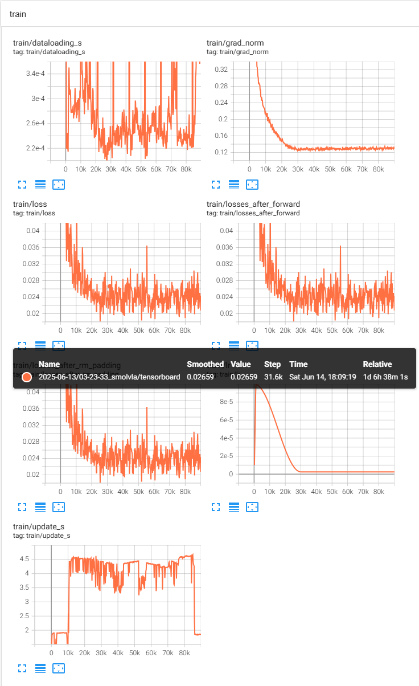

#具身智能 #VLA #实验记录

# 模型训练情况
## 数据

2000 组实验台抓取绝缘子的数据，其中 action 和 state 都是从臂的状态信息，action 是下一时刻的 state，保存都是 joint

## 配置

参数如下：

```bash
{
    "batch_size": 64,
    "dataset": {
        "episodes": None,
        "image_transforms": {
            "enable": False,
            "max_num_transforms": 3,
            "random_order": False,
            "tfs": {
                "brightness": {"kwargs": {"brightness": [0.8, 1.2]}, "type": "ColorJitter", "weight": 1.0},
                "contrast": {"kwargs": {"contrast": [0.8, 1.2]}, "type": "ColorJitter", "weight": 1.0},
                "hue": {"kwargs": {"hue": [-0.05, 0.05]}, "type": "ColorJitter", "weight": 1.0},
                "saturation": {"kwargs": {"saturation": [0.5, 1.5]}, "type": "ColorJitter", "weight": 1.0},
                "sharpness": {"kwargs": {"sharpness": [0.5, 1.5]}, "type": "SharpnessJitter", "weight": 1.0},
            },
        },
        "repo_id": "base",
        "revision": None,
        "root": "/data1/datasets/ur_grasp_db/ur_grasp_v2_2000/",
        "use_imagenet_stats": True,
        "video_backend": "torchcodec",
    },
    "env": None,
    "eval": {"batch_size": 50, "n_episodes": 50, "use_async_envs": False},
    "eval_freq": 20000,
    "job_name": "smolvla",
    "log_freq": 200,
    "num_workers": 16,
    "optimizer": {
        "betas": [0.9, 0.95],
        "eps": 1e-08,
        "grad_clip_norm": 10.0,
        "lr": 0.0001,
        "type": "adamw",
        "weight_decay": 1e-10,
    },
    "output_dir": "outputs/train/2025-06-13/03-23-33_smolvla",
    "policy": {
        "adapt_to_pi_aloha": False,
        "add_image_special_tokens": False,
        "attention_mode": "cross_attn",
        "chunk_size": 50,
        "device": "cuda",
        "empty_cameras": 0,
        "expert_width_multiplier": 0.75,
        "freeze_vision_encoder": True,
        "input_features": {
            "observation.image": {"shape": [3, 256, 256], "type": "<featuretype.visual: 'visual'=>"},
            "observation.image2": {"shape": [3, 256, 256], "type": "<featuretype.visual: 'visual'=>"},
            "observation.image3": {"shape": [3, 256, 256], "type": "<featuretype.visual: 'visual'=>"},
            "observation.state": {"shape": [6], "type": "<featuretype.state: 'state'=>"},
        },
        "load_vlm_weights": False,
        "max_action_dim": 32,
        "max_period": 4.0,
        "max_state_dim": 32,
        "min_period": 0.004,
        "n_action_steps": 1,
        "n_obs_steps": 1,
        "normalization_mapping": {
            "ACTION": "<normalizationmode.mean_std: 'mean_std'=>",
            "STATE": "<normalizationmode.mean_std: 'mean_std'=>",
            "VISUAL": "<normalizationmode.identity: 'identity'=>",
        },
        "num_expert_layers": 0,
        "num_steps": 10,
        "num_vlm_layers": 16,
        "optimizer_betas": [0.9, 0.95],
        "optimizer_eps": 1e-08,
        "optimizer_grad_clip_norm": 10.0,
        "optimizer_lr": 0.0001,
        "optimizer_weight_decay": 1e-10,
        "output_features": {"action": {"shape": [6], "type": "<featuretype.action: 'action'=\"\">"}},
        "pad_language_to": "max_length",
        "prefix_length": 0,
        "resize_imgs_with_padding": [512, 512],
        "scheduler_decay_lr": 2.5e-06,
        "scheduler_decay_steps": 30000,
        "scheduler_warmup_steps": 1000,
        "self_attn_every_n_layers": 2,
        "tokenizer_max_length": 48,
        "train_expert_only": True,
        "train_state_proj": True,
        "type": "smolvla",
        "use_amp": False,
        "use_cache": True,
        "use_delta_joint_actions_aloha": False,
        "vlm_model_name": "/data1/model_weight/pretrain_weight/SmolVLM2-500M-Video-Instruct/",
    },
    "resume": False,
    "save_checkpoint": True,
    "save_freq": 20000,
    "scheduler": {
        "decay_lr": 2.5e-06,
        "num_decay_steps": 30000,
        "num_warmup_steps": 1000,
        "peak_lr": 0.0001,
        "type": "cosine_decay_with_warmup",
    },
    "seed": 1000,
    "steps": 200000,
    "use_policy_training_preset": True,
    "wandb": {
        "disable_artifact": False,
        "enable": True,
        "entity": None,
        "mode": "offline",
        "notes": None,
        "project": "smolvla_test",
        "run_id": None,
    },
}
```

## Loss



# 现象

动作轨迹基本不太对，起始会猛然上抬，然后做出尝试下探找物体的趋势，然后在上抬手臂