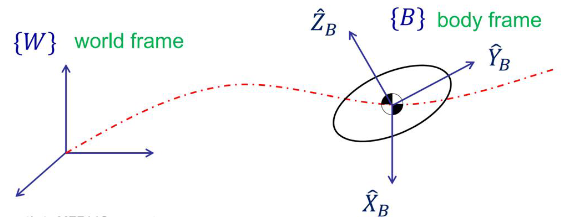
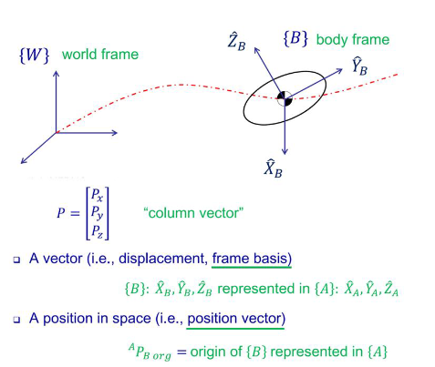
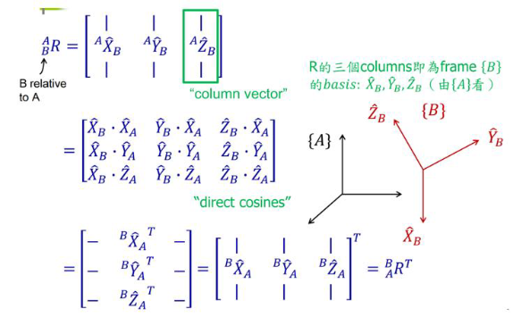
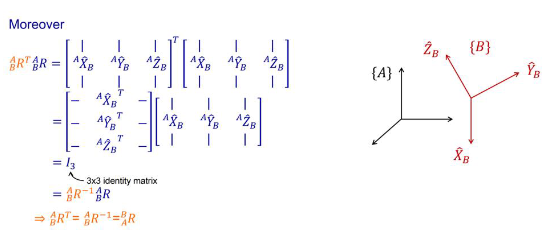
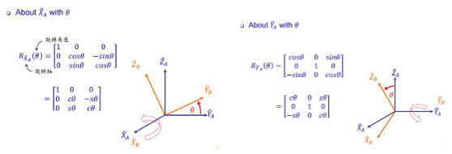
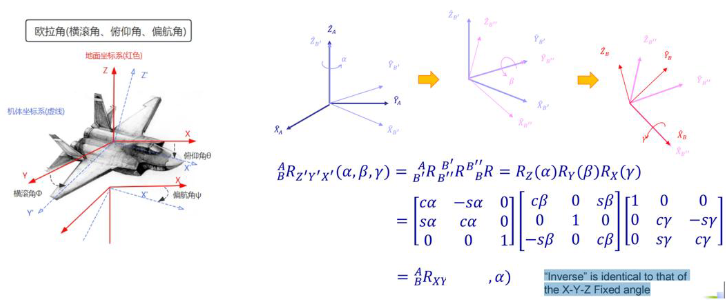
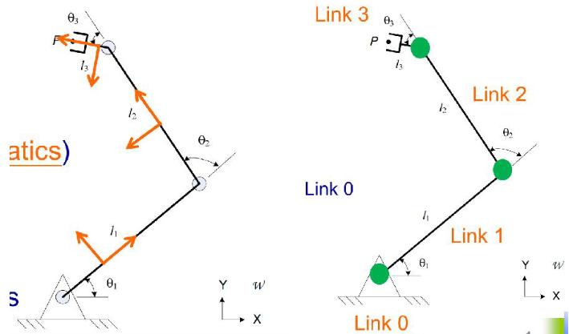
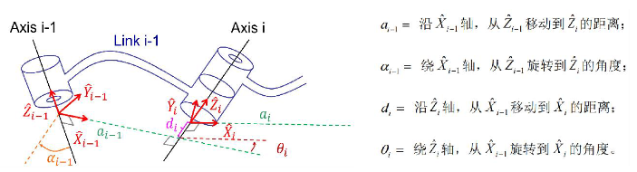
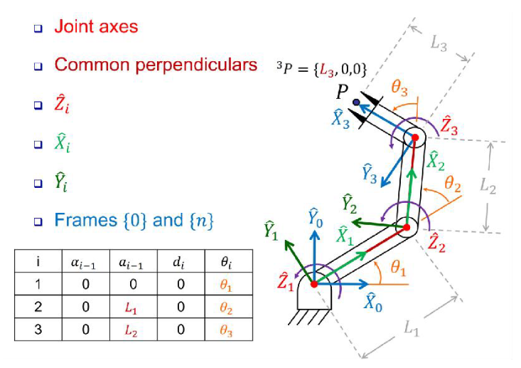

#具身智能 

[原文]([机器人基础——坐标系与位姿变换(1).docx - 飞书云文档](https://yv6uc1awtjc.feishu.cn/wiki/CIuTwmBOoip1cQk31wgc81Tanvd))

本文将介绍机器人坐标系与位姿变换、姿态描述之旋转矩阵、欧拉角、四元数、机器人正运动学、机器人逆运动学等内容

# 一、机器人坐标系与位姿变换

在机器人技术中，坐标系与位姿变换是理解机器人运动的基础。通过对刚体的平移和旋转进行描述，我们能够准确地掌握机器人的位置和姿态。本节将介绍机器人坐标系的基本概念，重点分析平移和旋转的数学表示，以及它们在机器人运动控制中的重要性。接下来，我们将通过图示进一步阐明这些概念，以帮助读者更好地理解机器人在三维空间中的运动与操作。

**1.刚体运动状态描述** 


## 平移

平移描述的是物体在空间中位置的变化，即物体在某个方向上移动而不改变其形状和姿态。这种移动可以理解为物体的每个点都沿着相同的方向和距离移动。



## 旋转

旋转则是物体围绕某个固定点或轴的转动。物体在旋转过程中，其位置和方向会发生变化，但形状和大小保持不变。旋转描述了物体相对于某个参考点的朝向变化，通常用于表示物体的姿态调整。





## 旋转举例



# 二、姿态描述之旋转矩阵、欧拉角、四元数

在机器人技术和计算机图形学中，准确描述物体的姿态至关重要。本章节将重点介绍三种常见的姿态描述方式：旋转矩阵、欧拉角和四元数。每种方法都有其独特的优缺点，适用于不同的应用场景。我们将通过图示来直观展示这些描述方式的工作原理，帮助读者理解如何在三维空间中有效地表示和转换物体的姿态。

### 旋转矩阵

旋转矩阵是一个用于表示三维空间中物体旋转的数学工具。它由三个行和三个列组成，可以有效地描述绕坐标轴的旋转。旋转矩阵具有良好的线性特性，方便进行复合旋转和坐标变换

### 欧拉角

欧拉角是一种通过三个角度（通常称为滚转、俯仰和偏航）来描述物体姿态的方法。这些角度表示物体围绕三个主轴的旋转。虽然欧拉角直观且易于理解，但在某些情况下会出现“万向锁”问题，使得旋转的表示不够灵活。



### 四元数

四元数是四个自由度，比欧拉角多出一个自由度：

$Q=a+bi+cj+dk$ ，其中 $a,b,c,d$ 是实数， $i,j,k$ 是虚数， $i^2=j^2=k^2=-1$ 

四元数：以另外一种方法来表述三维旋转。

优点：演算快捷，避免万向节死锁问题 (即当旋转角度接近某些特定值时，欧拉角表示会出现无限循环，换句话说就是两个轴重合，失去一个自由度，然后再旋转也没啥意义了)

缺点：没有欧拉角来的直观，难以理解。欧拉角和四元数都是用于描述旋转和方向的方法，但它们在表示旋转的方式和数学结构上有所不同。

## 旋转矩阵、欧拉角、四元数相互转换

下面展示了旋转矩阵、欧拉角、四元数相互转换的 python 代码:

### 欧拉角转旋转矩阵

```python
import math
import numpy as np

def euler_to_matrix(theta):
    R_x = np.array([[1, 0, 0], 
    				[0, math.cos(theta), -math.sin(theta)], 
    				[0, math.sin(theta), math.cos(theta)]])

    R_y = np.array([[math.cos(theta), 0, math.sin(theta)], 
    				[0, 1, 0], 
    				[-math.sin(theta), 0, math.cos(theta)]])

    R_z = np.array([[math.cos(theta), -math.sin(theta), 0], 
    				[math.sin(theta), math.cos(theta), 0], 
    				[0, 0, 1]])

    R = np.dot(R_z, np.dot(R_y, R_x))
    return R
    
```

### 欧拉角转四元数

```python
import math

def euler_to_quaternion(roll, pitch, yaw):
    """
    Convert Euler angles (roll, pitch, yaw) to a quaternion.
    Angles are in radians.
    """
    cy = math.cos(yaw * 0.5)
    sy = math.sin(yaw * 0.5)
    cp = math.cos(pitch * 0.5)
    sp = math.sin(pitch * 0.5)
    cr = math.cos(roll * 0.5)
    sr = math.sin(roll * 0.5)

    w = cr * cp * cy + sr * sp * sy
    x = sr * cp * cy - cr * sp * sy
    y = cr * sp * cy + sr * cp * sy
    z = cr * cp * sy - sr * sp * cy

    return [x, y, z, w]
```

### 旋转矩阵

```python
import math

def rotation_matrix_to_euler(R):
    """
    Convert a rotation matrix to Euler angles (roll, pitch, yaw).
    :param R: Rotation matrix (3x3)
    :return: Euler angles (roll, pitch, yaw)
    """
    assert R.shape == (3, 3), "Rotation matrix must be 3x3"
    sy = math.sqrt(R[0, 0] * R[0, 0] + R[1, 0] * R[1, 0])
    singular = sy < 1e-6

    if not singular:
        x = math.atan2(R[2, 1], R[2, 2])
        y = math.atan2(-R[2, 0], sy)
        z = math.atan2(R[1, 0], R[0, 0])
    else:
        x = math.atan2(-R[1, 2], R[1, 1])
        y = math.atan2(-R[2, 0], sy)
        z = 0

    return np.array([x, y, z])
```

`transforms3d` 或 `scipy` 中亦有实现。

# 三、机器人正运动学
## 正运动学与逆运动学概念



1.机器人正运动学：由关节转角、连杆等参数计算机器人末端相对基坐标系位姿。
2.机器人逆运动学：已知末端相对于机器人基坐标系位姿，求解各关节角。

## 正运动学建模之 DH 参数法
### MDH 建模

MDH（ModifiedDenavit-Hartenberg）建模法是用于描述机器人关节和链接之间几何关系的一种常用方法。该方法通过定义一组参数来简化正运动学建模，包括：

1. 连杆长度（ $a$ ）：相邻两个关节之间的距离。
2. 连杆扭转角（ $\alpha$ ）：相邻两个连杆之间的角度。
3. 关节角（ $\theta$ ）：当前关节相对于前一个关节的旋转角度。
4. 关节偏移（ $d$ ）：沿着前一个关节的轴线的偏移量。

MDH 法相较于传统的 DH 法，通过明确区分关节的旋转和连杆的位移，提供了更为直观的建模方式。它允许机器人设计者有效地构建每个关节的运动关系，并将其转化为齐次变换矩阵，从而实现对机器人整体运动的描述。MDH 参数法广泛应用于机械臂和其他机器人系统的运动学分析与控制。



1. 确定坐标系原点。
2. 确定 Z 轴及 X 轴方向，右手坐标系确定 Y 轴方向。
3. 确定 DH 参数。


### 齐次变换矩阵

$$
{}_{i-1}^{i}\mathbf{T} = \begin{bmatrix}
c\theta_i & -s\theta_i & 0 & a_{i-1} \\
s\theta_i c\alpha_{i-1} & c\theta_i c\alpha_{i-1} & -s\alpha_{i-1} & -s\alpha_{i-1} d_i \\
s\theta_i s\alpha_{i-1} & c\theta_i s\alpha_{i-1} & c\alpha_{i-1} & c\alpha_{i-1} d_i \\
0 & 0 & 0 & 1
\end{bmatrix}
$$

$c$ 表示 $\cos$ ， $s$ 表示 $\sin$ 。

$$
{}^{0}_{N}\mathbf{T} = {}^{0}_{1}\mathbf{T} \, {}^{1}_{2}\mathbf{T} \, {}^{2}_{3}\mathbf{T} \cdots \, {}^{N-1}_{N}\mathbf{T}
$$

$$

{}^{0}_{1}\mathbf{T} = \begin{bmatrix}
c_1 & -s_1 & 0 & 0 \\
s_1 & c_1 & 0 & 0 \\
0 & 0 & 1 & 0 \\
0 & 0 & 0 & 1
\end{bmatrix}, \quad
{}^{1}_{2}\mathbf{T} = \begin{bmatrix}
c_2 & -s_2 & 0 & l_1 \\
s_2 & c_2 & 0 & 0 \\
0 & 0 & 1 & 0 \\
0 & 0 & 0 & 1
\end{bmatrix}, \quad
{}^{2}_{3}\mathbf{T} = \begin{bmatrix}
c_3 & -s_3 & 0 & l_2 \\
s_3 & c_3 & 0 & 0 \\
0 & 0 & 1 & 0 \\
0 & 0 & 0 & 1
\end{bmatrix}

$$

由 ${}_3^0T={}_1^0T{}_2^1T{}_3^2T$ 可计算出该平面 3 连杆机械臂的正运动学方程：

$$

{}^{0}_{3}\mathbf{T} = \begin{bmatrix}
c_{123} & -s_{123} & 0 & l_1 c_1 + l_2 c_{12} \\
s_{123} & c_{123} & 0 & l_1 s_1 + l_2 s_{12} \\
0 & 0 & 1 & 0 \\
0 & 0 & 0 & 1
\end{bmatrix}

$$

# 四、机器人逆运动学

机器人逆运动学是计算机器人末端执行器所需的关节角度，以实现特定位置和姿态的一种方法。主要有两种求解方式：解析法和数值迭代法。

## 解析法

解析法通过建立逆运动学方程，直接求解关节角度。这种方法通常适用于结构较简单的机器人，如具有较少自由度的机械臂。解析法的优点是计算速度快，且能得到精确解，但在某些情况下可能会有多个解或无解的情况。

给定末端位姿矩阵：

$$
{}^{0}_{3}\mathbf{T} = \begin{bmatrix}
c_{\theta} & -s_{\theta} & 0 & x \\
s_{\theta} & c_{\theta} & 0 & y \\
0 & 0 & 1 & 0 \\
0 & 0 & 0 & 1
\end{bmatrix}
$$

$$
{}^{0}_{3}\mathbf{T} = \begin{bmatrix}
c_{123} & -s_{123} & 0 & l_1 c_1 + l_2 c_{12} \\
s_{123} & c_{123} & 0 & l_1 s_1 + l_2 s_{12} \\
0 & 0 & 1 & 0 \\
0 & 0 & 0 & 1
\end{bmatrix}
$$

## 数值迭代法

数值迭代法则是通过迭代优化算法逐步逼近目标姿态。这种方法适用于结构复杂或自由度较高的机器人，能够处理较为复杂的逆运动学问题。常见的数值方法包括牛顿 - 拉夫森法和梯度下降法。尽管数值迭代法灵活性更高，但其收敛速度和计算时间通常较慢，并且可能陷入局部最优解。

在机器人逆运动学求解中，常用的库包括 KDL、Track-IK（数值迭代法）和 IKFast（解析算法库），它们各自具有不同的优势和应用场景，为机器人运动控制提供了强有力的支持。