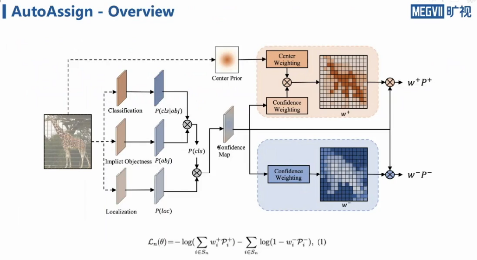

#目标检测 

[toc]
# 标签分配中的一些要点 (Insights)
- Center prior is the guarantee fo label assignment
    大部分正样本其实是围绕在 GT 中心点附近的.

- Label assignment needs to tackle both spatial and scale assignment
    标签分配需要考虑空间上和尺度上的分配.
    
- Number of assigned locations/anchors isnt the most critical part
    每个 GT 得到的前景点的数目并不是很关键,FCOS 仅仅有 6~7 个前景作为正样本也可以 work.

- Inter-stage balance is significant
    网络不同 block 之间前景点的分布需要平衡,这个很重要,平衡保证才能保证该层可以被充分训练.

# AutoAssign 的动机
1. 传统方式超参多,调整起来很麻烦
2. 部分图片按照既定规则来选取前景背景并不合理,比如一个类环形的弯物体中间可能是空的背景,但是按照 FCOS 等传统方式规则来选,它靠近 GT 中心点,那么它会是一个高的置信度正样本.
3. 传统方式将空间和尺度信息分开处理,而这两点应该是可以统一的.

## AutoAssign结构

注意 $P^+$ 是包含分类和回归的, $P^-$ 仅包含分类

### center weighting
很重要一点是本方法是使用预测框和 GT 来计算proposal的,训练初期网络能力很差,因此需要 center weighting 来辅助网络.另外 center weighting 也需要能够学习到不同的目标中心先验不一样的特征.  
另外在网络所有 block 上尺度上都进行 center weighting.  其实就是 80个类,每个类有标准差和期望.

### confidence weighting
这个是解决实例的问题,这样就可以动态的学习每个实例的外观形状.

#### Implict objectness 的必要性
这个是在判断当前位置是属于前景还是背景,为何这里可以是 cls 和 implict 部分相乘,因为:
$$
P(cls|\theta)=P(cls|obj,\theta)P(obj|\theta)
$$
另外这里直接使用的是 GT 整个范围内的点,所以有些目标中可能存在大量的背景,所以这里需要这一部分来做筛选.

#### 关于 w+ 怎么算
这里其实是一个类似 softmax .

$$
C(P)=e^{\frac{P(\theta)}{\tau}}  \\
w^+=\frac{C(P)G(d)}{\sum C(P)G(d)}
$$

#### w- 算法
- Background has no obvious patterns
- To suppress background locations and eliminate false positive
- For a position within GT box, we prefer it to be foreground.
- Although only classification confidence exists fro background locations, we can also use the proposal as indirect indication for assessing proposal quality.
- Focal loss has already been applied on to background locations
- Put lower weights on better proposals

$$
w^-=1-f(iou)
f(iou)=1/(1-iou)
$$
因为 GT 框中所有位置都会被作为 proposal,都会计算一个分类和回归的概率,但是一个地方可能是背景,它的proposal很差,所以需要抑制不好的 proposal.  
不好的作为负样本的 proposal 其实是不需要考虑回归部分的.但是为了统一做法,我们使用了 iou 来作为间接参考来认为一个地方是前景还是背景.即一个地方预测出来的框和 GT iou越小,我们越认为这个地方是背景.  

# 相关资料
1. https://www.bilibili.com/video/BV1Mf4y197Ba?spm_id_from=333.999.0.0
