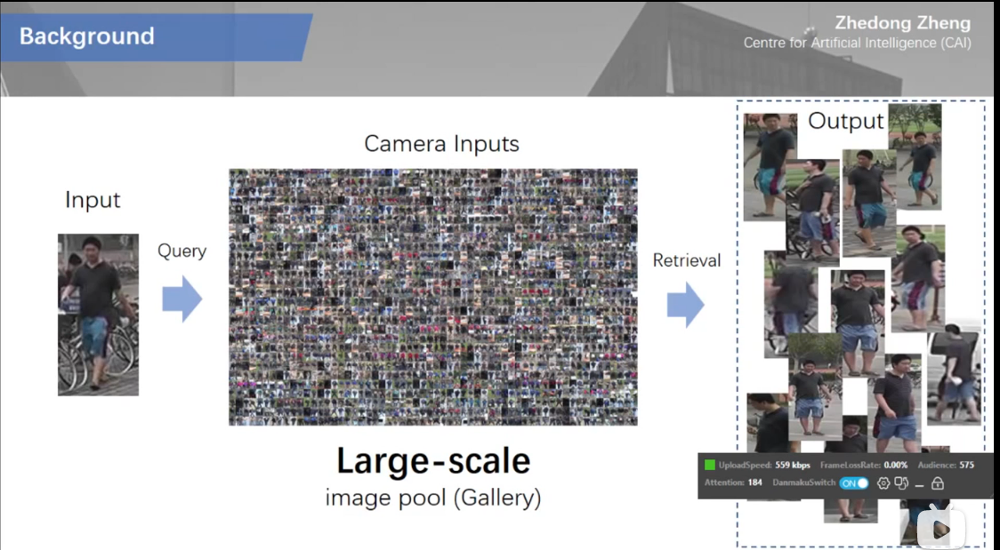

#行人重识别

[toc]
# 主要解决问题
其实是一个图片检索问题,给定一个目标图片,如何从大规模图片种检索出对应的图

# 主要挑战
1. 类内目标变化多.比如跨摄像头,一个人出现时姿态不同.
2. 类见目标差异小,比如不同人穿的衣服颜色搭配相似
3. 待查图片图规模大
# 相关资料
1. https://www.bilibili.com/video/av13796843/
2. https://www.bilibili.com/video/BV11K4y1f7eQ?spm_id_from=333.999.0.0
