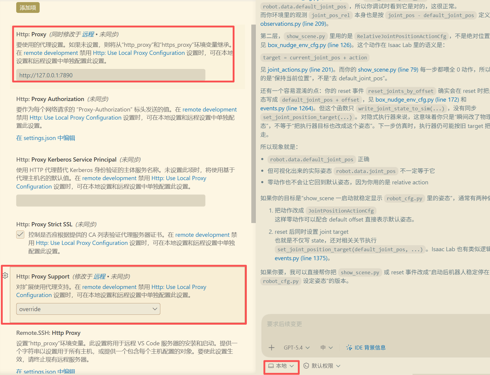
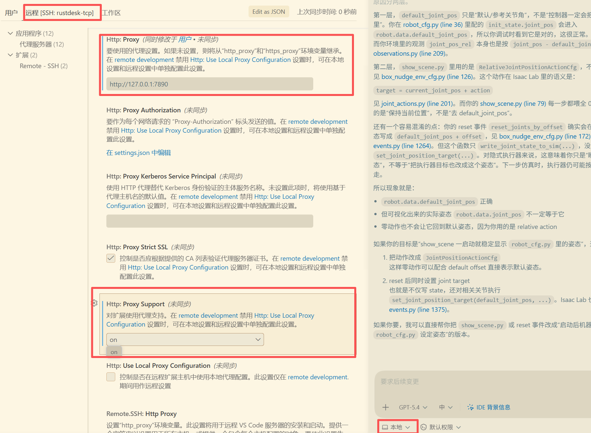

#codex

# Codex cli 使用

```bash
# 更新
npm i -g @openai/codex@latest
```

Linux 端设置，终端设置 `http_proxy,https_proxy,all_proxy,no_proxy` 这些环境变量，我这里的做法是，编写了一个 utils.sh,里面有以下函数：

```bash
function proxy_on() {
    # 接收参数：$1为IP（默认127.0.0.1），$2为端口（默认7890）
    local ip=${1:-127.0.0.1}
    local port=${2:-7890}

    # 设置小写环境变量
    export http_proxy="http://${ip}:${port}"
    export https_proxy="http://${ip}:${port}"
    export all_proxy="socks5://${ip}:${port}"
    export no_proxy="localhost,127.0.0.1"

    # 设置大写环境变量 (提高程序兼容性)
    export HTTP_PROXY="http://${ip}:${port}"
    export HTTPS_PROXY="http://${ip}:${port}"
    export ALL_PROXY="socks5://${ip}:${port}"
    export NO_PROXY="localhost,127.0.0.1"

    echo "✅ 终端代理已开启 (地址: ${ip}:${port})"
}

# 2. 关闭代理
# 使用方法: proxy_off
function proxy_off() {
    # 移除小写环境变量
    unset http_proxy
    unset https_proxy
    unset all_proxy
    unset no_proxy

    # 移除大写环境变量
    unset HTTP_PROXY
    unset HTTPS_PROXY
    unset ALL_PROXY
    unset NO_PROXY

    echo "❌ 终端代理已关闭"
}
```

然后在 `.bashrc` 文件中 `source utils.sh` ,然后添加 `proxy_on` ,执行 `echo $http_proxy` 若显示你的设置的代理 ip 和终端，那么就是设置成功了，可以在终端中使用

## 相关问题


# Codex vscode 插件使用相关

Windows 端配置：

在 vscode 中安装完 codex 插件，在设置中搜索 proxy，其中 `Http:Proxy` 设置为：`http://127.0.0.1:7890` （我的代理软件使用的这个端口）

然后 `Http:Proxy Support` 设置 `override`

若有远程，点击远程 Tab 页 `Http:Proxy` 设置为：`http://127.0.0.1:7890`（我远端的 linux 本机的 clash 也是使用这个端口），`Http:Proxy Support` 设置 `on`





## 相关问题：
### 之前 team 掉了，需要重新登录，重新登录显示 Sign-in could not be completed

参考：[vscode中使用codex插件登录openai被拒绝啦. - 搞七捻三 - LINUX DO](https://linux.do/t/topic/1702783)  [求助下佬们，vscode插件codex登录相关问题 - 开发调优 - LINUX DO](https://linux.do/t/topic/935524)

删除 window 端：C:\Users\Administrator\.codex 文件夹