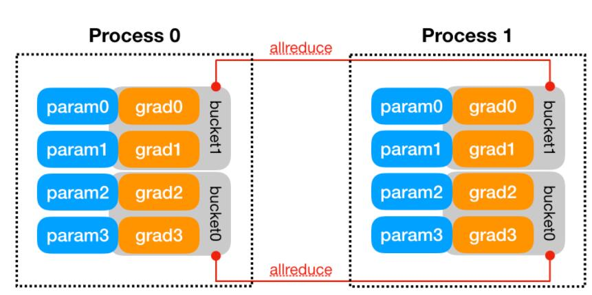

#pytorch #分布式

[toc]

本文内容主要来自于:https://pytorch.org/docs/stable/notes/ddp.html

distributed_data_parallel 采用的是数据并行，同步更新，Ring AllReduce 算法更新梯度的方法。
而 data_parallel 的梯度更新使用的是 Parameter Server 算法。


# 官方示例
```python
import torch
import torch.distributed as dist
import torch.multiprocessing as mp
import torch.nn as nn
import torch.optim as optim
from torch.nn.parallel import DistributedDataParallel as DDP


def example(rank, world_size):
    # create default process group
    dist.init_process_group("gloo", rank=rank, world_size=world_size)
    # create local model
    model = nn.Linear(10, 10).to(rank)
    # construct DDP model
    ddp_model = DDP(model, device_ids=[rank])
    # define loss function and optimizer
    loss_fn = nn.MSELoss()
    optimizer = optim.SGD(ddp_model.parameters(), lr=0.001)

    # forward pass
    outputs = ddp_model(torch.randn(20, 10).to(rank))
    labels = torch.randn(20, 10).to(rank)
    # backward pass
    loss_fn(outputs, labels).backward()
    # update parameters
    optimizer.step()

def main():
    world_size = 2
    mp.spawn(example,
        args=(world_size,),
        nprocs=world_size,
        join=True)

if __name__=="__main__":
    main()
```

# 内部设计
- **前提**: 由于 DDP 是借助 c10d 的 `ProcessGroup` 来进行通信,因此,程序在构建 DDP 前须先创建 `ProcessGroup`

- **构建**: DDP 的构建函数将引用本地模型，并且将模型参数 `state_dict` 从0号进程广播到每个 DDP 进程，以此保证所有的模型初始状态一致。然后每个 DDP 进程都会创建一个自己本地的 [`Reducer`](../../BasicProgramming/Reducer.md),这个 `Reducer` 是用来管理梯度同步的。`Reducer`使用 buckets (哈希桶)数据结构来组织参数的梯度，并且一次更新参数时仅更新一个 bucket 中的参数。通过设定 DDP 构造器中的 `bucket_cap_mb` 参数，可以调整桶数量。每个 bucket 中放置哪些参数，这个在 DDP 构建时期就已经确定了。通常情况下，buckets 中的顺序大致是 `Model.parameters()` 返回顺序的逆序。这样在反传阶段，每个参数梯度计算好的顺序就大致和桶的顺序一致，可以减少 hash 中桶在寻址时的时间。如下图， `bucket1` 中存有 `grad0`,`grad1`,`bucket2`中存有 `grad2`,`grad3`.另外， `Reducer` 在创建时还会注册 autograd hooks，每个参数对应一个钩子函数，这些钩子函数将在反传时，梯度计算好时触发。



- **前向传播**：每个 DDP 将分得的输入传输到自己本地模型中。若此时 `find_unused_parameters` 设置为 `True`，这种模式允许 DDP 在一个子计算图上进行反传， DDP 将遍历模型输出的 autograd graph，然后将所有没有参数反传的参数标记为 ready。这显然会增加额外的计算量，所以仅当必要时，才建议使用此模式。在反传时，`Reducer` 仅会等待那些 unready 的参数，但是仍然会更新所有的 bucket。将一个参数设置成 ready，并不会让 DDP 跳过桶，但是可以防止 DDP 一直等待一个不存在的梯度。

- **反传**: 注意这里 `backward()` 函数时直接应用在损失张量上的，不受 DDP 控制，因此 DDP 只能使用创建时注册的自动求导钩子函数来触发梯度的通过。当一个参数梯度变成 ready，其对应的梯度累加器的钩子函数将被触发，对应参数将被 DDP 标记为 ready。当一个 bucket 内所有参数梯度都 ready 时， `Reducer` 将触发异步的[`allreduce`](https://zhuanlan.zhihu.com/p/158886284),计算对应桶中参数在所有进程上的平均值。当所有 bucket 都处在 ready 计算时，`Reducer`将阻塞，等待所有的 `allreauce`完成。在这期间，每个参数的平局梯度将被写入到其对应的 `param.grad` 中。这样每个 DDP 的参数梯度变化将保持一致。
    
- **梯度更新**: 从每个 DDP 模型的优化器角度来看，优化器并不涉及交互，仅仅就是更新自己本地的模型参数。因为在每部迭代时，它们都进行了同步，其变化量是一致的

**注意事项：**  
各个进程的 `Reducer` 实例在调用 `allreduce`的顺序应该是完全相同的，都是按照 bucket 索引的顺序而非 bucket ready的顺序。若是 `allreduce` 顺序不一致，那么各个进程在同一时间里，`Reducer` 汇总的参数就不是同一个参数，这样显然会导致错误或是使得 DDP 向后挂起。

# 其余参考文献
- https://zhuanlan.zhihu.com/p/158886284