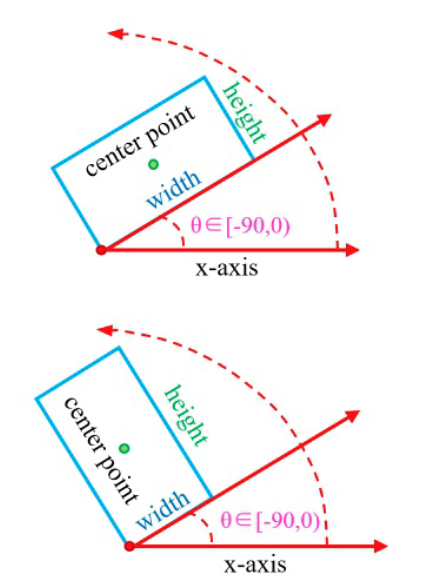
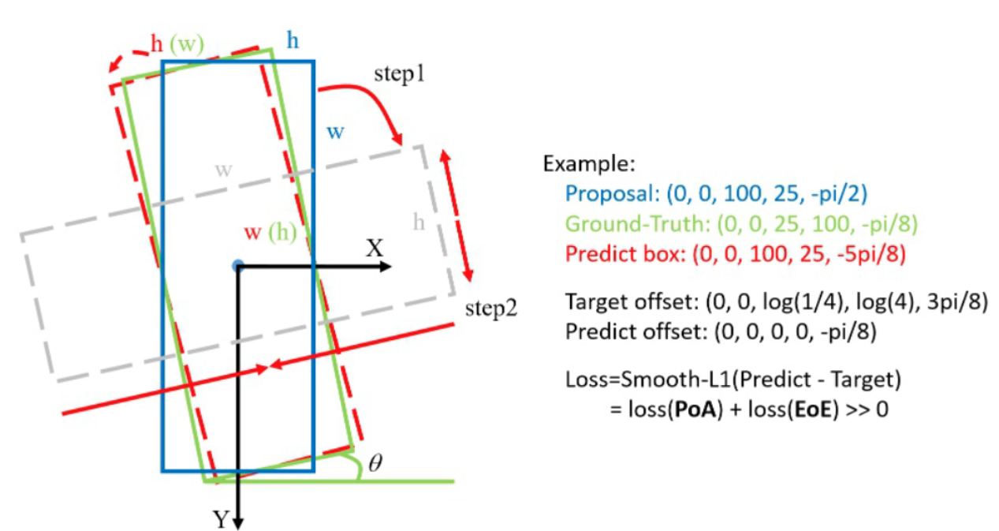
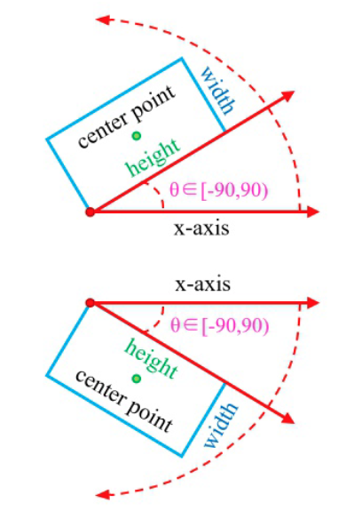
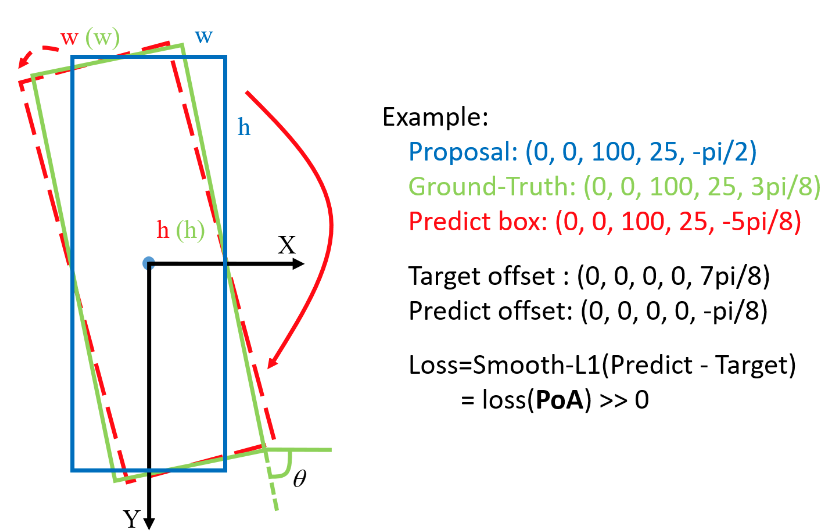
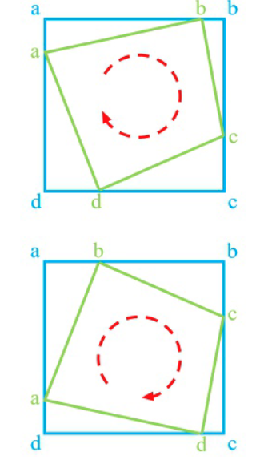
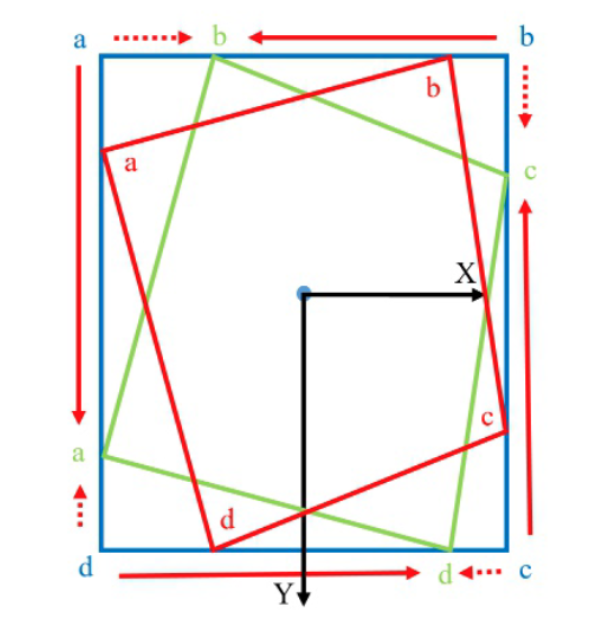
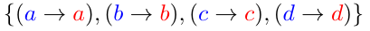
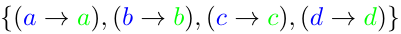
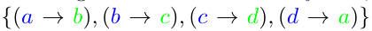

#目标检测

[toc]
# 四点+角度表示方法
## opencv 表示法
   

以中心点座标,长宽,和角度表示 $(x,y,w,h,\theta)$, $\theta$表示框的边和 x 轴的逆时针夹角,被用来算角度的边记为$w$,注意这里角度范围是 $[-90,0)$,取不到0,可以取到-90.

### opencv  表示法存在的问题

最理想的角度回归路线是由蓝色框逆时针旋转到红色框，但由于角度的周期性，导致按照这个回归方式的损失非常大（参见上图右边的 Example）。此时模型必须以更复杂的形式回归（例如蓝色框顺时针旋转，同时缩放 w 和 h），增加了回归的难度。通过下图（a）右边的 example，我们可以发现损失值的突增来源于两部分，一个是角度周期性（periodicity of angular，PoA），另一个是边的交换性（exchangeability of edges，EoE）。

## 长边表示法
    

和 opencv 表示法类似,依然是$(x,y,w,h,\theta)$,但是角度$\theta$ 表示长边到 x 轴的最小角度.注意这里角度方位是$[-90,90)$  

### 长边表示法存在的问题

和 opencv 表示法问题类似,由于角度的周期性,导致按照目前的表示法,矩形需要转一个较大角度来(红色实线)拟合到理想的红色虚线框.

# 八点法

最左边的点（如果水平矩形的话有两个点满足取上面的那个）为起始点，逆时针排列。$(x_i,y_i,x_2,y_2,x_3,y_3,x_4,y_4)$

### 八点法存在的问题

如果是蓝框是 anchor，红框是 ground-truth，那么通过点的排序之后，实际和理想的回归方式是一样的（按照回归的距离定义），都是:

而绿框是 ground-truth 时，实际是：

理想情况是：

# 参考:
- https://zhuanlan.zhihu.com/p/107400817
- https://zhuanlan.zhihu.com/p/108185873
- https://zhuanlan.zhihu.com/p/111493759
- https://arxiv.org/abs/2003.05597