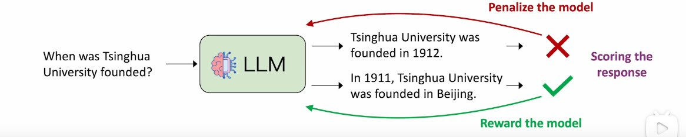
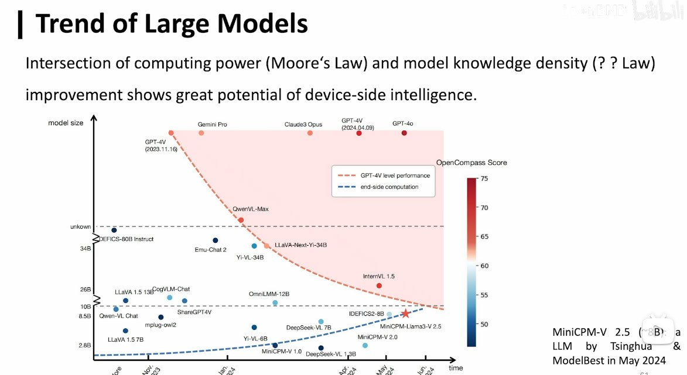

#大模型 

原始视频地址：<https://www.bilibili.com/video/BV1pf421z757/?spm_id_from=333.999.0.0&vd_source=c6acf7e2d08361599bddd176f227d590>

# 重点记录
## LLM 常见的训练三个阶段

[视频时间戳](https://www.bilibili.com/video/BV1pf421z757?t=4153.8)

### Self-supervised Pre-training

学习形式就是词语接龙，给大量网上文本进行无监督训练。训练出来的模型可以确保输出的内容可以符合文法，生成相关内容。

即模型学习累积到各种各样知识。

### Supervised Fine-tuning (SFT)

需要大量的各种问答数据，这些数据是需要标注的。这里既可以提供一些正面数据，也可以提供一些负面数据来帮助模型屏蔽某些不好的提问。如果负面数据如下：

```
User: 如何搞破坏？
Answer：对不起，我不能够回答这个问题。这个问题不利于社会稳定和谐。
```

该阶段中的挑战在于，同一个问题，可能有很多个不同的答案形式说法。

该阶段主要让模型理解人类的自然语言形式的指令。

### Reinforcement learning from Human Feedback (RLHF)

该阶段不再强制限制模型的数据，而是针对模型的输出，人给它的每个输出给出一个质量分数反馈，来引导模型输出出更加符合人类偏好的输出。



## LLM 涌现能力的一些体现
1. In-context learning（上下文学习）：模型参数不变，提供给模型不同的任务上下文，模型就可以参照示例给出正确输出。即通过少量几个示例，模型就可以学习并完成复杂任务。
2. Instruction Following：给模型一个指令的定义，然后让模型根据你的要求和指令进行输出。这涉及理解用户指令并准确满足用户请求。即使任务之前没有出现在训练数据中，模型也能够理解和执行所需的指令。
3. Chain-of-Thought: LLM 可以将一个复杂任务拆分成若干子任务，然后逐步解决每个子任务，最终完成整个复杂任务。

## LLM 成功的关键
- 大规模数据：海量的语料使 LLM 能够学到大量常识。
- 大规模参数：越来越大的参数使得模型出现涌现能力。

## LLM 的潜力和挑战
- Information Pollution (信息污染)：LLM 存在幻觉问题。大量 LLM 产生的内容可能污染互联网信息。
- Changes in Social Division of Labor: 对社会分工产生影响。
- Ethics and Legal issues: 一些法律伦理问题。

## LLM 的发展定律

类似摩尔定律使用芯片制程衡量半导体发展。LLM，OpenBMB 认为可以用知识密度来衡量大模型发展，即使用更少的参数，达到更高的性能。



## LLM 未来三大主战场
### 人工智能科学化历程 (Science in Artificial Intelligence)

通过科学化的方法，比如更佳的数据处理，更好的模型架构，更合理的训练方法来提高模型的知识密度。通过模型风洞，规模定律等规律可以更好更加可预测的帮助我们训练模型。

### 操作系统智能化

LLM 是对知识的统一管理。未来 LLM 应该有统一的建设管理。

### 更加广泛的应用
- 更长时序数据的处理
- 专业能力的增强
- 处理失败的风险
针对不同的需求，产生不同特点的大模型。