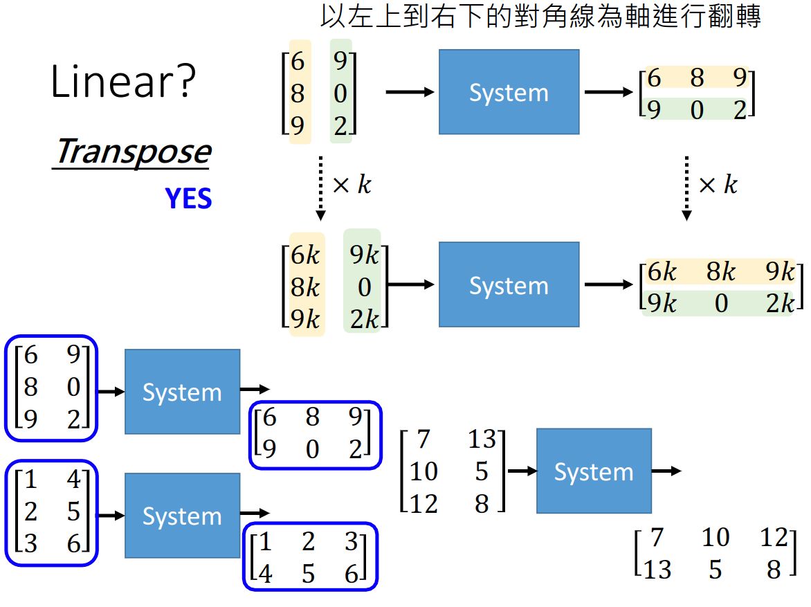

#线性代数
#李宏毅 

[toc]

# 资料
- 视频: <https://www.youtube.com/watch?v=SNT7LAGsLDY&list=PLJV_el3uVTsNQkZFHfcdncAzoesmI6jju>  
- ppt: <https://www.youtube.com/redirect?event=video_description&redir_token=QUFFLUhqbHRwdzU2ZGZydDFOZXFoMkItbnNSMzZVNDlEd3xBQ3Jtc0trSDFjX0Z3ekFxcEg5bFNyN0RkeVQyQzhpMlVkT1dqSTE3VkNxNXdDVkRPRmFzNHRCWm5NZW9MTVU2RW1oTkl5S2xXb3hCLU81NEs5Nk9ESTZTWHZvRkxQY0dfM1RpODhsSXA4cDI5MmtUQ0J0V1ZuOA&q=http%3A%2F%2Fspeech.ee.ntu.edu.tw%2F%7Etlkagk%2Fcourses%2FLA_2020%2Flinear.pdf>

# 线性系统特征
1. Persevering Multiplication
```
x -> Linear System -> y

kx -> Linear System -> ky
```
2. Persevering Addition
```
x -> Linear System -> y
a -> Linear System -> v

x+a -> Linear System -> y+v
```

**注意:**  
转置操作是线性的.


求导操作也是线性的.

$$
f \to f'
$$
$$
kf \to kf'
$$
$$
f+g \to f'+g'
$$

积分也是线性的.
