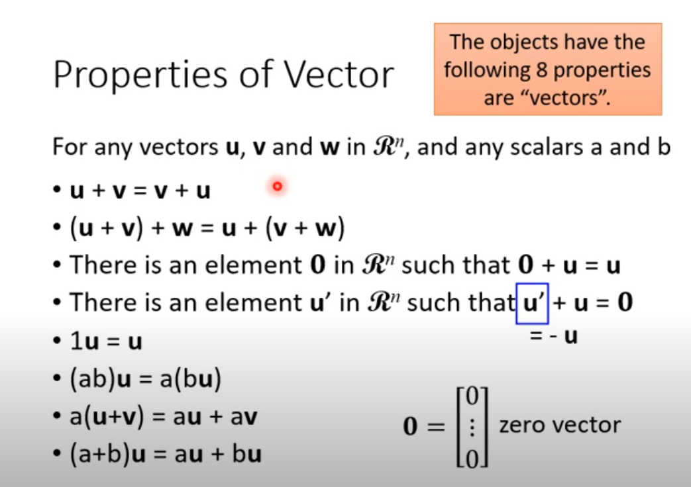

#线性代数
#李宏毅 

# 资料
-  视频: <https://www.youtube.com/watch?v=I3hyvWN78Is&list=PLJV_el3uVTsNQkZFHfcdncAzoesmI6jju&index=4>
- ppt: <https://www.youtube.com/redirect?event=video_description&redir_token=QUFFLUhqbTdDeVBfcFY0dHgtcGxmRmcxeEpxdjgwNk1rd3xBQ3Jtc0tsVU5YdVpoUDRFcVlRUGVzakF2XzFQN2w4Nzc5QmZtOXVMYUhXQTBYX0d1Yko0WUdDWDJ2bE1QWWJ0Zmp2Nlh2bjFOT0hEYmp4aWFpR3BZMFhpa29QVVc4VXNEaDRwc1ZIX2JQVl9XcWJQdG4xejNEWQ&q=https%3A%2F%2Fdrive.google.com%2Ffile%2Fd%2F1oMOMvqDt3pXYDDWujoPWZ-svW5shMooP%2Fview%3Fusp%3Dsharing>

# 向量 Vectors
- 向量是数的集合
- 向量中每个元素叫component

# 向量的集合 Vector Set
- 所有有 n 个元素的向量组成的集合记为 $R^n$

# 向量的性质
注意:满足这8个特性的东西就是向量
 
