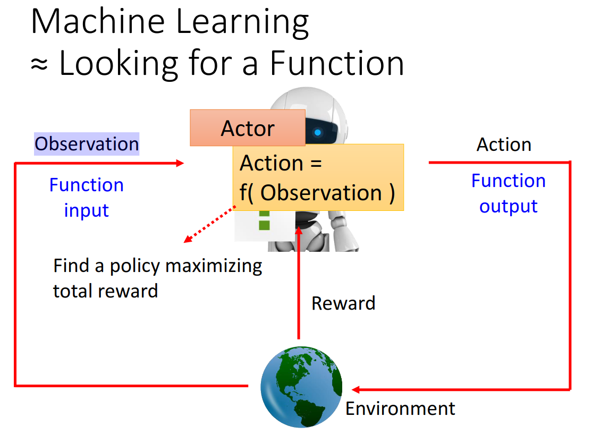
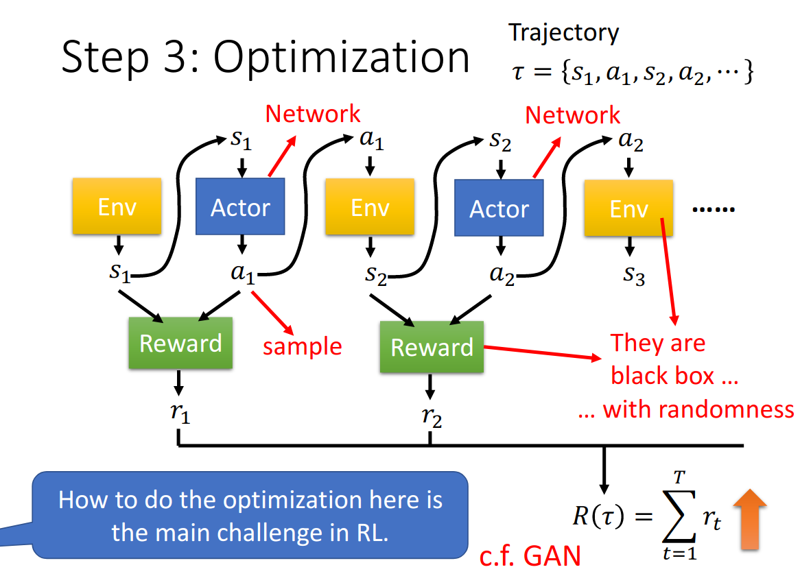
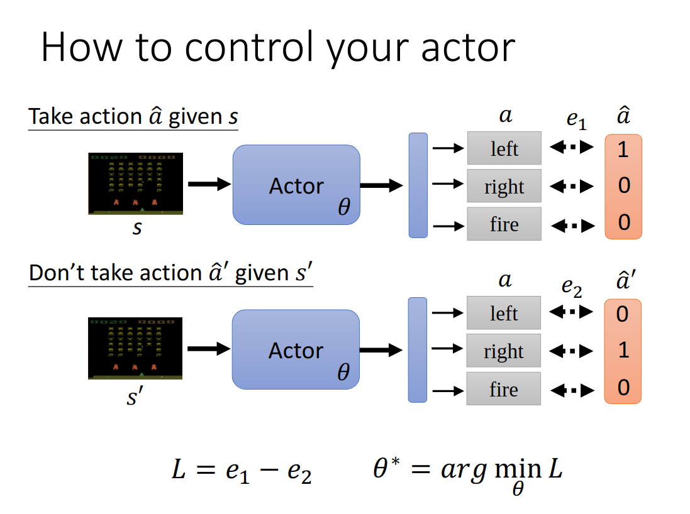
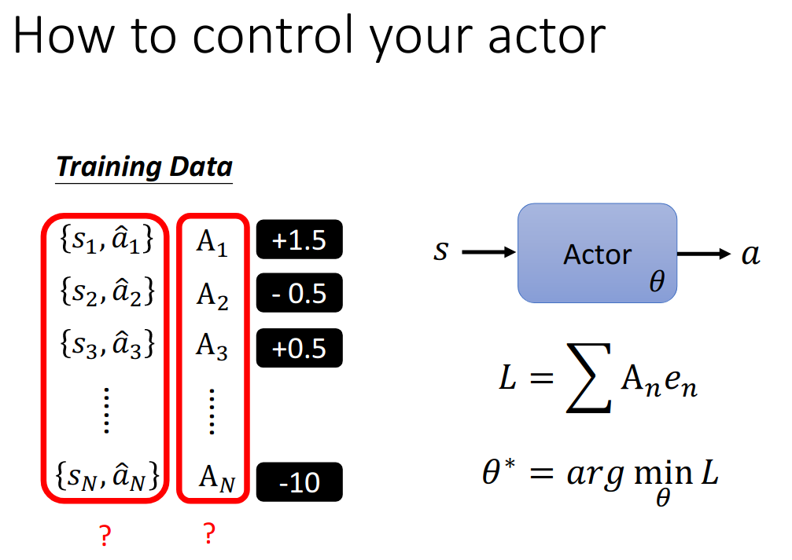
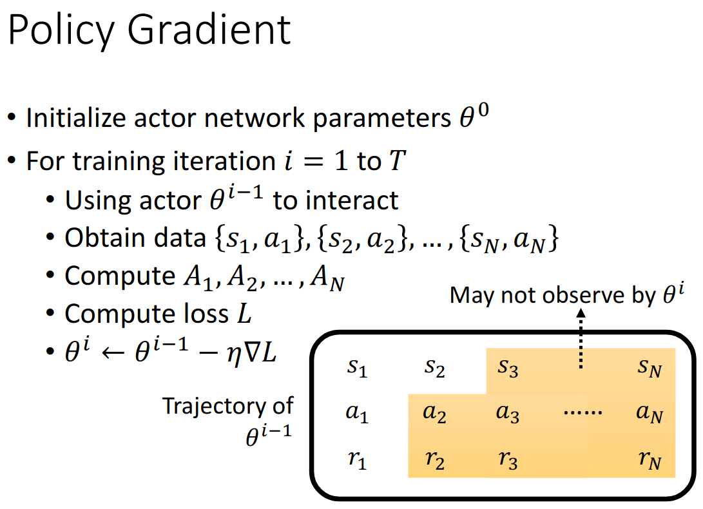
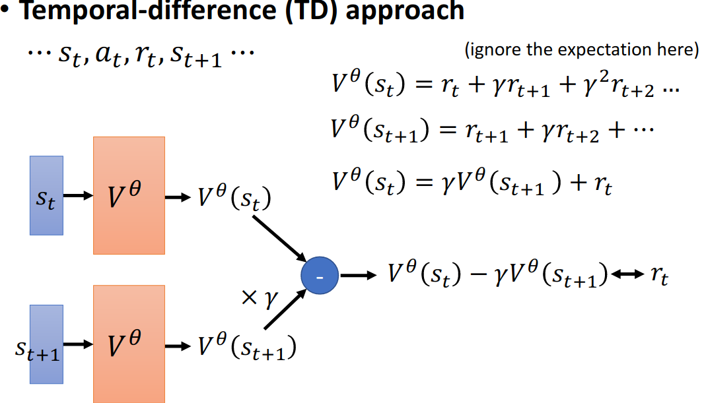

#强化学习
#李宏毅 

[toc]

视频: <https://www.youtube.com/watch?v=XWukX-ayIrs&list=PLJV_el3uVTsMhtt7_Y6sgTHGHp1Vb2P2J&index=29>

# 何为 RL

核心和普通 ML 一样,需要找到一个函数作为 Actor 来帮助决策.

## 模型
模型或者函数的形式就是 Actor, 这个 Actor 是一个神经网络,也被称为 Policy Network

## 策略 损失函数
一般涉及 RL,我们还会有一个规则或者是环境,首先我们从环境得到当前环境状态 obervation,当我们给出一个动作之后,环境或者规则给我们一个奖励 (reward).经过若干次这用循环之后,一次游戏或者行动结束,我们称之为 episode.

然后我们将所有 reward 累加起来,得到 Total reward,也叫 return,我们的策略目标就是将之最大化.

## 算法 优化过程

### 优化的难点
这里我们可以参考 GAN,将 Actor 看作是生成器, Env 和 Reward 是判别器.但是这里不同之处在于, GAN 中判别器是一个神经网络,可以使用梯度下降,而这里 Env 和 Reward 是一个黑盒,没法直接使用梯度下降,且 Env 和 Actor 输出的 $s,a$ 是通过控制比例采样出来的,具有随机性.

# Policy Gradient

其余 <https://www.youtube.com/watch?v=W8XF3ME8G2I&list=PLJV_el3uVTsPy9oCRY30oBPNLCo89yu49&index=33>

## 控制 actor 的方法
可以从分类的角度来看这个事情.  

我们将所有可能采取的动作都设定一个分类标签,那么想采取一个行为,就最小化输出和期望动作的交叉熵,如果不想采取某个行为,就最小化输出和期望动作的交叉熵的负值.

其实更进一步,可以给每个训练数据对设置一个分数,来 train.

那么现在的难点就是如何构建训练用的 $s,a,A$

## policy gradient 方法

^755764

## online-policy vs. offline-policy

### online-policy
即训练的 Actor 和环境互动的 Actor 是同一个 Actor,但是这样要求每次训练一次,就需要重新搜集一次训练资料.

### offline-policy
训练的 Actor 和环境互动的 Actor 不是同一个 Actor.经典做法是 Proximal Policy Optimization,PPO

## exploration
这个概念表示 Actor 的动作是采样出来的,具有随机性,这样可以保证样本的多样性,有些人甚至会在 Actor 参数上添加噪声来使得一些很少见的动作被执行.

# Actor-Critic
## 何为 Critic
给定一个 actor,那么根据看到的 observing 和 action 预测出一个分数 reward

常见的一种叫 Value function $V^{\theta}(s)$,基于给定参数 $\theta$ 的 actor,在看到 s 之后预测 discounted cumulated reward.

这里的 discounted cumulated reward 是之前 Total reward 的 加权改版版本,常见的形式如下:
$$
G_1'=r_1+\gamma r_2+ \gamma^2 r_3 +...+\gamma^{i-1} r_i  ,\\
\gamma < 1
$$

**计算 $V^{\theta}(s)$ 的方法  
- Monte-Carlo (MC) based approach  
    即玩很多次游戏,每次都可以得到 discounted cumulated reward $G_1'$,然后直接使用这些数据来监督学习一个 $V^{\theta}(s)$

- Temporal difference (TD) approach
	

其实这里的 V 代表的是一个期望值,即当前 S 下各个 action 的平均实力,那么执行一个 action 之后若其实际的 reward 大于 V,就可以认为当前 action 较好,若小于 reward,就可以认为当前 action较差.

那么使用 Advantage Actor-Critic 来处理强化学习,整个过程可以描述为.  
假设 $s_i$ 代表第 $i$ 次环境的状态,比如游戏画面, $a_i$ 表示第 $i$ 次互动执行的动作, $r_i$ 表示第 $i$ 次互动得到的 reward.    

那么结合 [Policy gradient](#^755764) 中方法, 此时的 $A_t=r_t+V^{\theta}(S_{t+1})-V^{\theta}(S_t)$

这样就可以训练 actor 和 critic 了.

一个常见的 tip 是由于 actor 和 critic 网络的输入一样,且任务之间有关联性,所以其前几层一般是共享权值的.

除开 Actor-Critic 方法,常见的方法还有 Deep Q Network,DQN,相关视频见:
- <https://youtu.be/o_g9JUMw1Oc>
- <https://youtu.be/2-zGCx4iv_k>

# Reward Shaping
现在还存在的一个问题是:  假如一些游戏,你大多数情况下采取的 action 最后执行得到的 reward 都是0,这意味着 $A_N$ 多数情况下也都是0,该怎么办?

这就是 Sparse Reward 问题.

那么一个解法就是定义一些额外的 reward,用来引导 agent 学习.

# No Reward: Learning from Demonstration  
现存环境,如果当前环境中连 Reward 都没有怎么办?

解法 Imitation Learning
即从示范中学习,一般方法就是我们先有专家 expert 和环境互动的一些数据 action,然后我们使用这些 action 来学习一个reward function,reward function 应该会给 expert 的 action 高分,给 actor的动作低分.然后使用学习好的 reward function 来训练一个 actor 在此上面取得一个尽量高的分数.然后再训练 reward function,过程类似 GAN.

