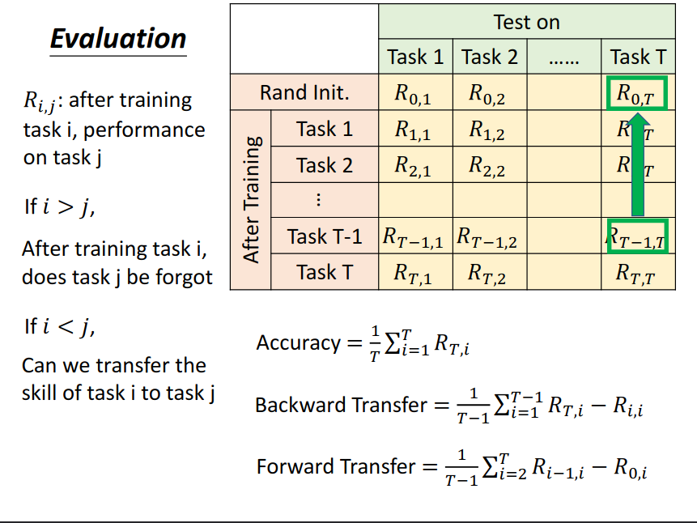

#终生学习
#李宏毅

[toc]

# 资料
视频: <https://www.youtube.com/watch?v=rWF9sg5w6Zk&list=PLJV_el3uVTsMhtt7_Y6sgTHGHp1Vb2P2J&index=34>

ppt: <https://www.youtube.com/redirect?event=video_description&redir_token=QUFFLUhqbUc3YlB3SGJuWXpscDJOYURuNFQwU2VwcDlXQXxBQ3Jtc0tuNzVZRng0QnZiV3dySGlEVE9IQ2ZlMnRvZnc4bVZKX3RJMU1vRFdFMnhVLVZ5aDlrVVNpNl83bVhNMVJTXzltVGV1clRScklLQ0cyUWJKVC1mRjBTRC1fUDZyTENQUXRjZjlPRXB4Wk00LTBlbHpLYw&q=https%3A%2F%2Fspeech.ee.ntu.edu.tw%2F%7Ehylee%2Fml%2Fml2021-course-data%2Flife_v2.pdf>

# les 34 要点

## life long learning 难点
网络有能力可以同时学好两份资料,但是两份资料依序学习,网络会忘记第一个任务,即 catastrophic forgetting.

将两份资料放在一起同时学，网络可以同时学习好两个任务，这个叫做 Multi-task training。它是 lll 的 upper bound（上界），通常在进行 lll 任务研究前，会先使用 Multi-task training 来跑一下，了解数据任务的极限。

## lll 评价方式
准备 n 个任务，通常这 n 个任务都很简单，比如在 mnist 上，把机器辨别 0,1 作为任务1，辨别2,3作为任务2，依此类推。
然后依次进行训练学习，然后每次学习完后在所有的任务上都进行一次平均，即可得到下图 ppt 中的表格，那么其评价方式计算也如 ppt 所说。

# les 35 要点
## 灾难遗忘的主要解法
- selective synaptic plasticity 
    基于正则化的方法，也是现在发展最完备，最常用的方法

- additional neural resource allocation
- memory reply

## selective synaptic plasticity
即给模型参数人为设置一个权重 $b_i$，表示它对上一个任务的重要性,然后将原始的损失函数 $L(\theta)$ 改写为：
$$
L'(\theta)=L(\theta)+\lambda \sum b_i(\theta_i-\theta_i^b)^2
$$

这里权重的确定不同方法不一样
- Elastic Weight Consolidation (EWC)
    https://arxiv.org/abs/1612.00796
- Synaptic Intelligence (SI)
    https://arxiv.org/abs/1703.04200
- Memory Aware Synapses (MAS)
    https://arxiv.org/abs/1711.09601
- RWalk
    https://arxiv.org/abs/1801.10112
- Sliced Cramer Preservation (SCP)
    https://openreview.net/forum?id=BJge3TNKwH

## additional neural resource allocation
- progressive neural networks
- packnet
- CPG

