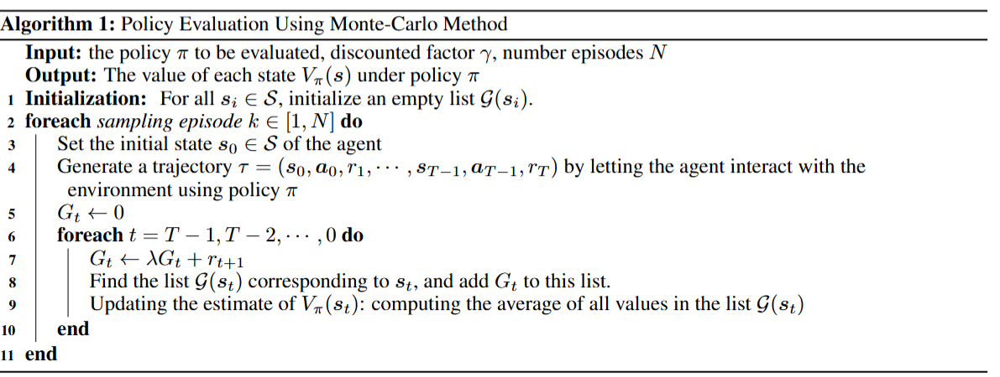

#强化学习 #教程

# A Practical Introduction to Deep Reinforcement Learning
- Paper：[[2505.08295v1] A Practical Introduction to Deep Reinforcement Learning](https://arxiv.org/abs/2505.08295v1)
以下为其中内容的注解

## Alg1 注解

这里就是将 $s_t$ 所有的回报都存起来，然后最后求平均就是 $V_{\pi}(s_t)$ 
