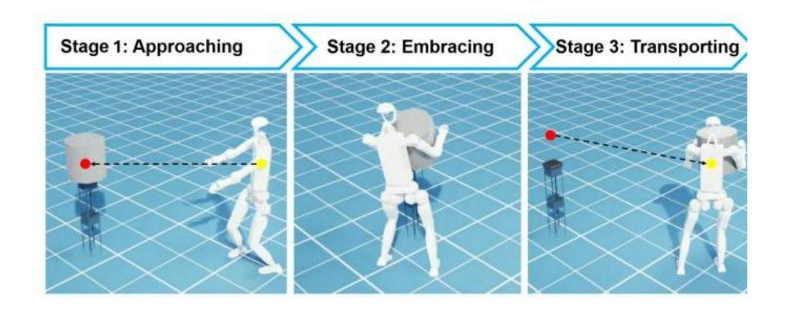
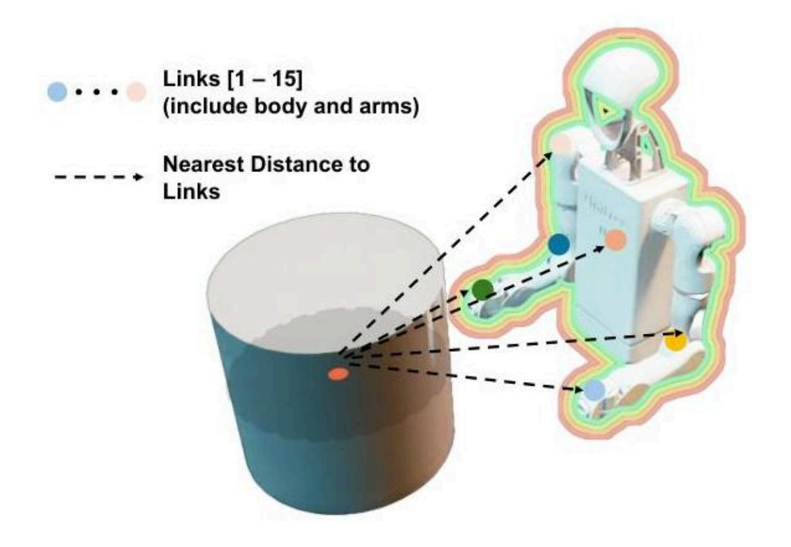

# ⼈形机器⼈抱持笨重物体: 基于强化 学习的全⾝操纵

#具身智能 #manipulation #alphaXiv

[toc]

# 摘要

⾹港科技⼤学的研究⼈员开发了⼀个强化学习框架,使类⼈机器⼈能够对笨重物体进⾏全⾝抱 持。该⽅法将⼈类运动先验与神经符号距离场 (NSDF) 相结合,以实现鲁棒的多点接触操作, 在模拟中实现了对不同物体属性的适应性,并成功部署在物理 Unitree H1-2 机器⼈上。

# 1. 理解挑战

⼈形机器⼈在操纵超出其末端执⾏器 (夹持器和⼿) 能⼒的⼤型笨重物体⽅⾯⼀直⾯临困难。虽 然⼈类可以⾃然地⽤整个⾝体抱起超⼤物品,但机器⼈⼀直局限于只能⽤指尖或夹持器抓取的⼩ 物体。这项研究通过使⼈形机器⼈能够执⾏全⾝环抱任务——协调其⼿臂、躯⼲和整个上半⾝以牢 固地抱持和运输笨重物体——弥补了机器⼈操作中的⼀个基本空⽩。

全⾝环抱任务包括三个连续阶段: 接近物体、通过协调⼿臂和躯⼲运动环抱物体,以及将其运输 到⽬标位置。

挑战远不⽌简单的抓取。全⾝操作需要多个接触点之间的持续协调、精确的空间意识以及在⻓期 任务中保持稳定接触的能⼒。传统的基于模型的⽅法难以处理⾼维度和复杂的接触动⼒学,⽽现 有的基于学习的⽅法往往⽆法为这种接触丰富的场景⽣成连贯、稳定的⾏为。

# 2. 技术架构与⽅法

研究⼈员开发了⼀个强化学习框架,将⼈类运动先验知识与先进的⼏何感知相结合,以实现稳健 的全⾝操作。该系统通过⼀个三阶段管道运⾏,该管道处理⼈类运动数据,将其提炼为紧凑的表 ⽰,然后训练特定任务的策略。

完整的训练框架,展⽰了 (a) 从动作捕捉数据到环抱策略的整体流程,(b) 基于 VAE 的运动先验提 炼过程,以及 (c) 最终的环抱策略训练架构。

## 2.1. ⼈类运动先验集成

该框架⾸先处理来⾃ AMASS 数据集的⼤规模⼈类动作捕捉数据。这些数据经过过滤以去除运动学 ⽆效的序列 (如⾃碰撞或⾜部打滑),然后进⾏重定向以匹配⽬标⼈形机器⼈的特定形态。然后, ⼀个教师 - 学⽣学习⽅案使⽤变分⾃编码器 (VAE) 将这些类⼈运动模式提炼成紧凑的潜在表⽰。

#### VAE 由三个组件组成:

- ⼀个编码器,将机器⼈状态映射到潜在运动分布
- ⼀个解码器,从潜在代码重建机器⼈动作
- ⼀个先验⽹络,学习有意义运动模式的分布

训练⽬标结合了动作重建损失、时间⼀致性正则化和 KL 散度,以确保潜在空间捕获有意义、平滑 的运动模式:

$$L_{total} = L_{action} + \lambda_{regu} L_{regu} + \lambda_{KL} L_{KL}$$

## 2.2. 神经符号距离场集成

⼀个关键创新是集成了神经符号距离场 (NSDF),以提供精确的⼏何感知。NSDF 评估⽬标物体中 ⼼与代表机器⼈上半⾝连杆的多个⽹格⽚段之间的最短距离。这提供了连续、可微分的距离信 息,从⽽在操作过程中实现准确的接触感知。

NSDF 系统计算物体中⼼与 15 个机器⼈⾝体节段之间的距离,为接触丰富的操作提供详细的⼏何 感知。

## 2.3. 多阶段训练策略

为了处理拥抱任务的⻓期性,训练采⽤了三个不同阶段的随机初始化:

- 1. 接近 (Approaching): 机器⼈从远离物体的地⽅开始,学习导航。
- 2. 拥抱 (Embracing): 机器⼈从靠近物体的地⽅开始,专注于建⽴接触。
- 3. 搬运 (Transporting): 机器⼈从已经抱住物体的地⽅开始,学习稳定地搬运。

这种策略确保了在所有任务阶段的平衡学习,并显著提⾼了收敛速度和稳定性。

# 3. 实验验证与结果

研究⼈员进⾏了全⾯的评估,以验证其框架的每个组成部分并展⽰其实际有效性。

## 3.1. 组件有效性分析

通过消融研究清晰地证明了 NSDF 模块的关键作⽤。使⽤ NSDF 训练的策略成功地利⽤各种上半⾝ 关节建⽴了多点接触,⽽没有 NSDF 的策略未能正确拥抱物体,仅有躯⼲接触⽽没有⼿臂协调。

⽐较显⽰,使⽤ NSDF 成功实现多点接触 (左) 与没有 NSDF 失败的拥抱 (右)。红⾊球体表⽰接触 点。

随机初始化策略也证明⾄关重要,训练曲线显⽰,与固定初始化⽅法相⽐,收敛更平滑,稳定性 更⾼。

训练性能⽐较显⽰,随机初始化 (蓝⾊) 与固定初始化 (红⾊) 相⽐,收敛性和稳定性有所改 善。

## 3.2. 泛化能⼒

尽管仅对单个圆柱形物体进⾏了训练,但该策略对不同的物体特性表现出卓越的适应性。在不同 形状 (圆柱体、⻓⽅体、球体)、质量 (1-7 千克) 和尺⼨下进⾏测试,结果显⽰,在包含 NSDF 的 情况下,成功率始终很⾼,⽽没有 NSDF 时则为 0% 成功率。

训练有素的策略成功处理了不同质量 (1-7 千克) 和不同形状 (包括⻓⽅体、球体和圆柱体) 的物 体。

即使是处理明显更重的物体 (7 千克) 和不同的⼏何形状,该策略也能保持 80% 以上的成功率,这 表明其具有强⼤的泛化能⼒,对于实际部署⾄关重要。

## 3.3. 真实世界验证

最终的验证是通过在 Unitree H1-2 ⼈形机器⼈上以 50 赫兹的实时频率成功部署实现的。机器⼈成 功执⾏了完整的拥抱序列——接近⼀个笨重的圆柱体 (直径 40 厘⽶×⾼ 60 厘⽶),建⽴稳定的全⾝ 接触,并将物体运到⽬标位置。

真实世界演⽰显⽰ Unitree H1-2 ⼈形机器⼈在完整的任务序列中成功拥抱并搬运⼀个⼤型圆柱形物 体。

# 4. 更⼴泛的启⽰和未来⽅向

这项⼯作代表了⼈形机器⼈能⼒上的重⼤进步,解决了限制机器⼈只能进⾏⼩物体操作的基本局 限性。通过实现全⾝拥抱⾏为,该研究为机器⼈在物流、制造、家庭辅助和紧急响应场景中处理 笨重物体开辟了新的可能性。

成功整合⼈类运动先验知识与⼏何感知为开发其他复杂操作技能提供了范本。这种提炼⼈类专业 知识同时增强精确环境感知的⽅法可以扩展到搬运家具、建筑辅助或⼈机协作操作等任务。

所展⽰的虚实迁移和泛化能⼒表明了该框架在实际部署中的鲁棒性。未来的⼯作可以探索扩展拥 抱策略的范围、处理可变形物体或整合触觉反馈,以实现更复杂的操纵⾏为。

这项研究还强调了结合多种互补⽅法的重要性——⽤于⾃然运动模式的⼈类运动先验知识、⽤于准 确接触感知的⼏何感知,以及⽤于复杂、⻓周期任务的结构化训练策略。这种多⽅⾯的⽅法为解 决⼈形机器⼈领域的其他具有挑战性的操纵问题提供了蓝图。

# 5. 相关引⽤

#### 通⽤⼈形运动表征⽤于基于物理的控制

这篇论⽂⾄关重要,因为它提供了作者们所采⽤的、基于 VAE 的特定蒸馏⽅法 (PULSE),⽤于将 教师策略的复杂动作空间蒸馏成⼀个紧凑的、潜在的⼈体运动先验。这个运动先验是所提出框架 的核⼼组成部分,它能为下游操作任务实现⾼效且类⼈的策略学习。

Z. Luo, J. Cao, J. Merel, A. Winkler, J. Huang, K. M. Kitani, and W. Xu, "Universal humanoid motion representations for physics-based control," in The Twelfth International Conference on Learning Representations, 2024.

#### 针对实时模拟虚拟⼈的永续⼈形控制

这个引⽂⾄关重要,因为主论⽂明确地基于这项⼯作中提出的 PHC 框架构建其运动追踪教师策 略。该教师策略是该⽅法学的第⼀个主要步骤,负责准确追踪重定向的⼈体运动,然后将其提炼 成运动先验。

Z. Luo, J. Cao, A. Winkler, K. Kitani, and W. Xu, "Perpetual humanoid control for real-time simulated avatars," in 2023 IEEE/CVF International Conference on Computer Vision (ICCV), 2023, pp. 10 861–10 870.

#### SAMP: ⽤于碰撞感知机器⼈机械臂的空间锚定运动策略

这项⼯作直接⽤于框架的⼀个关键技术组件: 神经符号距离场 (NSDF)。主论⽂利⽤此引⽤中预 训练的⽹络来计算 NSDF 特征,这些特征对于增强机器⼈的空间感知⾄关重要,并被⽤于观察空 间和奖励函数中以引导接触。

K. Chen, Z. Bi, G. Zhao, C. Zheng, Y. Li, H. Zhao, and J. Ma, "SAMP: Spatial anchor-based motion policy for collision-aware robotic manipulators," arXiv: 2509.11185, 2025.

#### 基于样例引导强化学习的复杂接触全⾝操控学习

这篇参考⽂献代表了基于学习的全⾝操作领域的最新技术,集成了强化学习与触觉感知。它具有 ⾼度相关性,因为它为主论⽂的研究奠定了背景并阐明了其意义,⽽主论⽂也采⽤了基于学习的 ⽅法来处理⼈形机器⼈的富接触全⾝操作任务。

J. A. Barreiros, A. ¨Ozg¨un ¨Onol, M. Zhang, S. Creasey, A. Goncalves, A. Beaulieu, A. Bhat, K. M. Tsui, and A. Alspach, "Learning contact-rich whole-body manipulation with exampleguided reinforcement learning," Science Robotics, vol. 10, no. 105, p. eads6790, 2025.