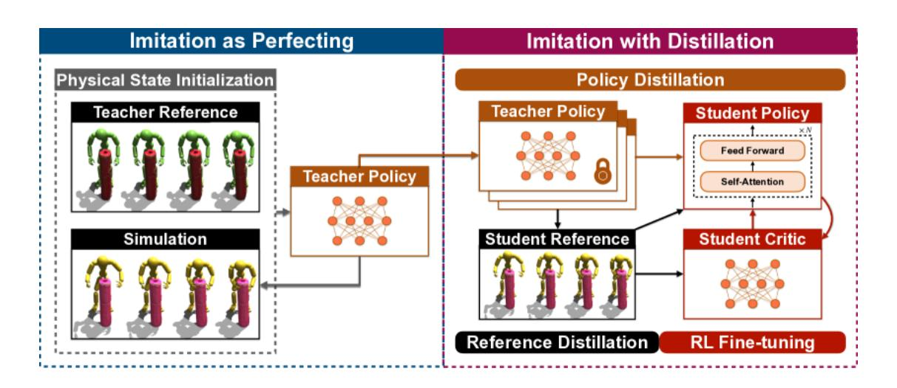
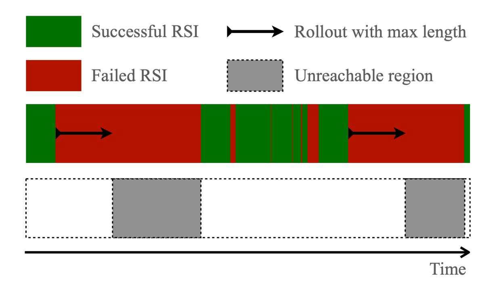
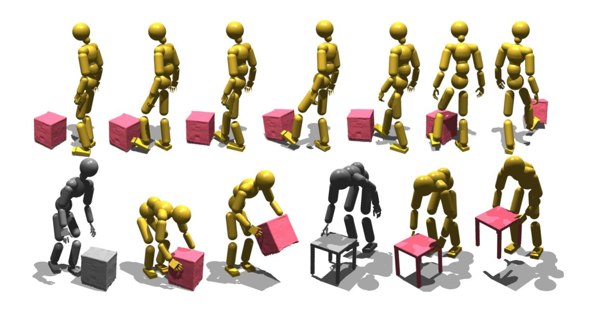
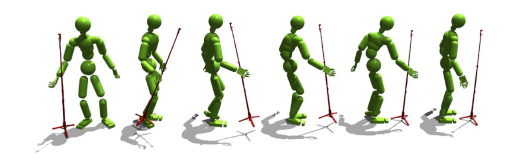
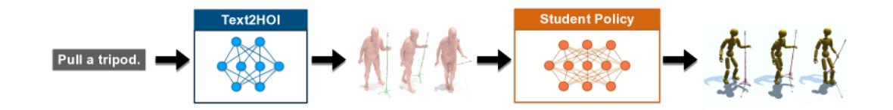
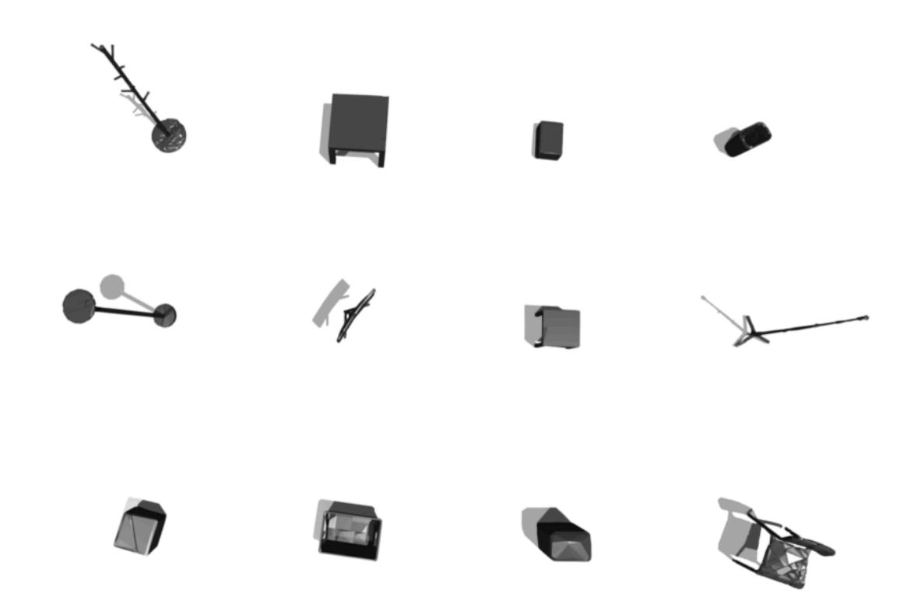
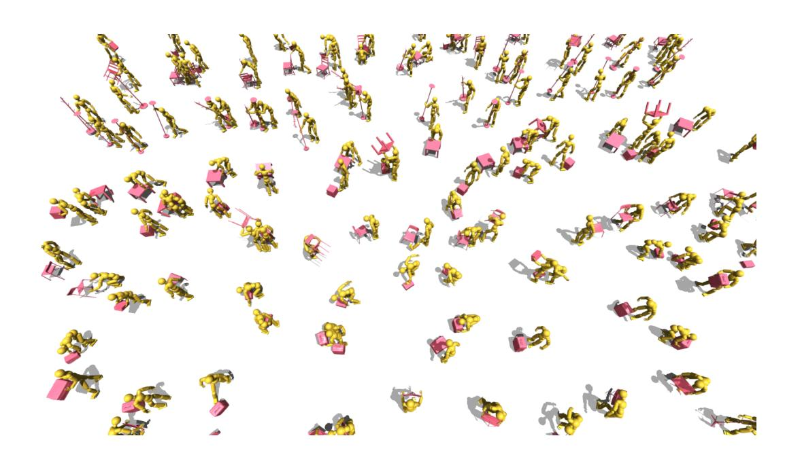

# INTERMIMIC: 面向基于物理的人与物 体交互的通用全身控制

#具身智能 #manipulation #alphaXiv

#### 摘要

伊利诺伊大学厄巴纳 - 香槟分校和艺电公司的研究人员推出了 InterMimic,这是一个突破性的两 阶段框架,它使物理模拟角色能够根据不完美的动作捕捉数据执行多样化的对象交互,实现对 新场景的零样本泛化,同时成功将技能迁移到人形机器人上而无需外部重定向。

[toc]

## 1. 简介


图 1:InterMimic 能够实现广泛的、物理上合理的人与物体交互,包括高度动态的交互 (滑板)、 多物体交互以及跨多种场景的可扩展的交互技能。

基于物理的人与物体交互 (HOI) 对于创建逼真的人物动画、虚拟环境和机器人行为至关重要。然而,创建控制策略,使物理模拟的人能够与动态物体进行各种复杂全身交互仍然是一个重大挑战。当前的方法要么依赖于缺乏物理真实感的运动学方法,要么依赖于仅限于特定任务或物体的基于物理的控制器。

InterMimic 是一个新颖的框架,通过开发一种通用控制策略来解决这些局限性,该策略能够处理 范围广泛的全身人与物体交互。该框架解决了使用不完美的运动捕捉数据中的关键挑战,包括接 触伪影、跨不同人体形状的运动重定向以及对鲁棒控制策略的需求。通过采用一种新颖的师生训 练策略,InterMimic 允许物理模拟的人在与各种物体进行逼真的交互时,保持物理上的合理性。

# 2. 背景与挑战

创建逼真的人与物体交互涉及多个跨学科领域,包括计算机动画、机器人技术和机器学习。传统方法分为两类:

- 1. 运动学方法: 这些方法直接操纵关节位置和旋转,但缺乏物理真实感,并且无法适应动态环 境。
- 2. 基于物理的控制器: 这些方法生成物理上合理的运动,但通常侧重于狭窄的任务或特定的物 体类型。

开发通用型基于物理的 HOI 控制器的主要挑战包括:

- 运动捕捉的不完善: 真实的 MoCap 数据通常包含接触伪影、穿透和物理上不合理的运动。
- 跨不同身体的重定向: 将来自不同人类主体的运动适应到规范的模拟模型。

- 学习效率: 传统的强化学习方法在全身交互的复杂性和多样性方面存在困难。
- 泛化: 创建一个控制器,使其能够跨未见过的物体、交互和场景工作。

# 3. InterMimic 框架

InterMimic 将 HOI 控制问题表述为马尔可夫决策过程 (MDP),其目标是训练一种策略,使物理模 拟的人能够与物体进行逼真的交互。状态空间包括人类本体感觉 (关节位置、速度)、物体观察 (位置、方向、速度)、触觉感知 (接触力) 以及来自参考运动的目标状态。



图 2:InterMimic 框架由两个主要阶段组成:" 模仿即完善 ",其中教师策略学习优化 MoCap 数 据; 以及 " 模仿与提炼 ",其中知识被转移到一个统一的学生策略。

该框架的创新之处在于其两阶段方法:

- 1. 模仿即完善: 多个教师策略在交互数据的子集上进行训练,每个策略专注于特定的技能或化 身。这些教师将不完美的 MoCap 参考优化为物理上合理的动作。
- 2. 模仿与提炼: 一个统一的学生策略通过参考提炼和强化学习 (RL) 微调,从教师那里提炼知 识。

这种方法解决了基于物理的角色控制中的根本矛盾: 在参考动作的保真度与模拟的物理约束之间 取得平衡。

# 4. 师生训练策略

师生策略是 InterMimic 有效性的核心。该过程包括:

#### 4.1. 教师策略训练

教师策略是在交互数据的子集上训练的专用网络。每位教师旨在:

- 1. 学习模仿和完善一组特定的交互
- 2. 处理跨不同人体形状的重定向
- 3. 纠正参考运动中的物理不合理性

#### 训练目标结合了:

体现感知的奖励: 鼓励匹配参考运动的关节位置和速度

体现不可知的奖励: 专注于实现交互的高级目标,而不管具体的关节配置

#### 奖励函数表示为:

```
R = w_pos * r_pos + w_vel * r_vel + w_body * r_body + w_obj * r_obj + w_contact * r_contact
```

其中每个组成部分奖励动作的不同方面,从关节定位到成功的目标操纵。

#### 4.2. 学生策略提炼

学生策略通过以下方式从所有教师策略中学习:

1. 参考提炼: 教师生成优化的参考动作,作为学生的目标

2. 策略提炼: 学生使用行为克隆和 RL 来获得教师的技能

3. 课程学习: 训练从繁重的演示指导进展到更高的自主性

这种方法使学生能够开发一种通用的控制策略,该策略可以推广到不同的交互,同时保持物理合 理性。

# 5. 物理状态初始化和交互提前终止

InterMimic 的一个关键贡献是通过两种新颖技术实现高效训练的方法:



图 3: 物理状态初始化 (PSI) 通过从高质量状态开始 rollout,避免在不成功的尝试中浪费计算,从 而显着提高训练效率。

#### 5.1. 物理状态初始化 (PSI)

用于基于物理的角色控制的传统 RL 通常会将计算浪费在重复失败的 episode 上。PSI 通过以下方 式解决此问题:

- 1. 维护先前 rollout 中成功状态的缓冲区
- 2. 从这些高质量状态初始化新的 episode
- 3. 随着训练的进行,逐渐增加难度

这种方法极大地提高了样本效率,使策略能够专注于学习具有挑战性的交互,而不是反复掌握基 本动作。

# 5.2. 交互提前终止 (IET)

IET 通过以下方式补充 PSI:

- 1. 检测交互何时已不可逆转地失败 (例如,掉落的物体、摔倒的角色)
- 2. 提前终止 episode 以避免从无效状态中学习
- 3. 提供适当的负面奖励以阻止失败模式

PSI 和 IET 共同作用,使得 InterMimic 能够高效地学习复杂的交互技能,即使是从不完美的演示 数据中学习。

# 6. 策略架构和实现细节

InterMimic 框架对教师策略和学生策略使用了不同的网络架构:

#### 6.1. 教师策略

具有 3 个隐藏层 (每层 512 个单元) 的多层感知器 (MLP)

专门针对特定交互类型和实体

输入: 人类状态、物体状态、触觉感知、目标状态

输出: 所有关节的 PD 目标

# 6.2. 学生策略

基于 Transformer 的架构,以实现更好的序列建模

具有自注意力机制的前馈网络

处理当前状态和状态历史

可以处理各种交互类型的统一策略

#### 实现细节包括:

在 Isaac Gym 模拟器中进行训练,以实现并行物理模拟

模拟具有铰接关节的 28-DoF 人形角色

具有各种属性 (质量、摩擦等) 的动态物体

在多样化的人与物体交互数据集上进行训练

# 7. 结果与应用

InterMimic 在各种场景中展示了令人印象深刻的能力:



图 4:InterMimic 可以生成多样化的交互序列,包括举起、推动和操纵各种物体,同时保持物理 上的合理性。

#### 7.1. 定量评估

与基线方法相比,InterMimic 实现了:

- 在测试交互中更高的成功率 (87% 对比最近竞争者的 62%)
- 更低的跟踪误差,同时保持物理上的合理性
- 更好地泛化到未见过的物体和交互类型

## 7.2. 应用

该框架实现了几个引人注目的应用:

1. MoCap 优化: 纠正捕捉数据中物理上不合理的动作



图 5:InterMimic 可以优化不完美的动作捕捉数据,以创建物理上有效的交互。

2. 文本到交互: 从文本描述生成基于物理的 HOI

输入:" 举起木椅。"

输出:[角色举起椅子的基于物理的动画]

3. 交互预测: 预测交互将如何在初始条件下演变



图 6: 该框架可以从初始状态预测真实的交互结果。

4. 新颖物体泛化: 处理以前未见过的物体



图 7:InterMimic 可以泛化到训练期间未见过的各种物体类型和形状。

5. 多物体交互: 管理具有多个动态物体的复杂场景



图 8: 该系统可以处理具有多个智能体和物体的复杂环境。

# 8. 局限性和未来工作

尽管 InterMimic 具有令人印象深刻的能力,但它仍存在一些局限性:

1. 计算要求: 师生训练需要大量的计算资源,但这只是一次性的成本。

2. 物体多样性: 虽然该框架泛化效果良好,但物体几何或物理上的极端变化仍可能带来挑战。

3. 复杂社交互动: 当前的实现侧重于个体的人与物体交互,而不是合作或竞争性的多智能体场 景。

4. 精细操作: 用于精细操作的精确手指控制仍然具有挑战性,并且将受益于更高保真度的手部 模型。

未来工作可以通过以下方式解决这些局限性:

- 整合分层控制,以实现更复杂的交互序列
- 扩展到多智能体协作任务
- 改进手指控制,以进行精细操作
- 与更复杂的感知系统集成,以进行实际部署

# 9. 结论

InterMimic 代表了基于物理的人与物体交互方面的重大进展。通过采用一种新颖的师生训练策 略,该框架成功地解决了使用不完善的动作捕捉数据所带来的挑战,并实现了一种统一的策略, 能够处理与动态物体的各种全身交互。

从运动学参考生成物理上合理的交互的能力弥合了传统动画和基于物理的控制之间的差距,为角色动画、机器人技术和交互式系统开辟了新的可能性。该框架成功推广到新对象和场景,证明了 其作为人与物体交互通用控制器的潜力。

InterMimic 生成逼真且多样化交互的能力,以及其在 MoCap 改进、文本到交互生成和交互预测中的应用,使其成为计算机图形学、机器人技术和人工智能领域的研究人员和从业人员的宝贵工具。

通过解决基于物理的 HOI 的基本挑战,InterMimic 朝着更自然和更有能力的虚拟人和人形机器人迈出了一大步,他们能够以物理上真实的方式与环境互动。

#### 10. 相关引用

Bharat Lal Bhatnagar、Xianghui Xie、Ilya Petrov、Cristian Sminchisescu、Christian

Theobalt 和 Gerard Pons-Moll。 **BEHAVE: Dataset and Method for Tracking Human Ob…**6 在 CVPR, 2022.

• 本文介绍了 BEHAVE 数据集,该数据集在 InterMimic 论文中用于训练和评估模型处理人与物体交互的能力。BEHAVE 数据集专门为跟踪人与物体交互而设计,因此与 InterMimic 项目高度相关。

Jiaman Li、Jiajun Wu 和 C Karen Liu。 **Object Motion Guided Human Motion Synthesis** 。 ACM Transactions on Graphics (TOG), 42(6):1–11, 2023.

• 此引用介绍了一种通过物体运动引导合成人类运动的方法,这是 InterMimic 项目的一个关键方面。InterMimic 框架旨在创建逼真的人与物体交互模拟,使这项被引用的工作具有相关性。

Xue Bin Peng、Pieter Abbeel、Sergey Levine 和 Michiel Van de Panne。Deepmimic: 基于物理的角色技能的示例引导深度强化学习。ACM Transactions On Graphics (TOG), 37(4):1–14, 2018.

• InterMimic 使用 DeepMimic 作为其基础,调整和扩展了角色控制技术,以专注于与物体的交互。DeepMimic 为应用于基于物理的角色动画的强化学习提供了基础,这对于 InterMimic 的方法至关重要。

Sirui Xu、Zhengyuan Li、Yu-Xiong Wang 和 Liang-Yan Gui。

InterDiff: Generating 3D Human-Object Interactions … 。在 ICCV, 2023.

• InterDiff 在 InterMimic 论文中被提及为一种生成 3D 人与物体交互的方法,这与 InterMimic

创建逼真交互模拟的目标直接相关。InterDiff 的物理信息扩散模型为生成交互序列提供了一 种相关的方法。

Viktor Makoviychuk、Lukasz Wawrzyniak、Yunrong Guo、Michelle Lu、Kier Storey、Miles Macklin、David Hoeller、Nikita Rudin、Arthur Allshire、Ankur Handa 等。Isaac gym: 用于机 器人学习的高性能基于 GPU 的物理模拟。在 NeurIPS, 2021.

Isaac Gym 是 InterMimic 项目中使用的模拟器,用于基于物理的人与物体交互模拟。该模拟器 对于 InterMimic 的训练和评估过程至关重要,因为它为交互提供了物理环境。