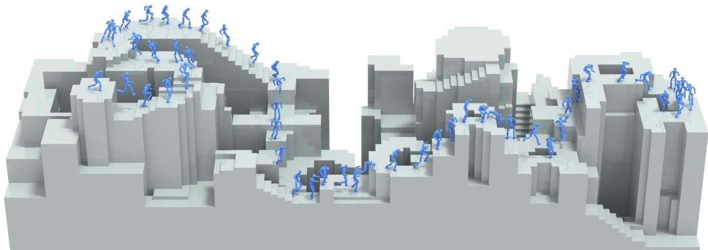
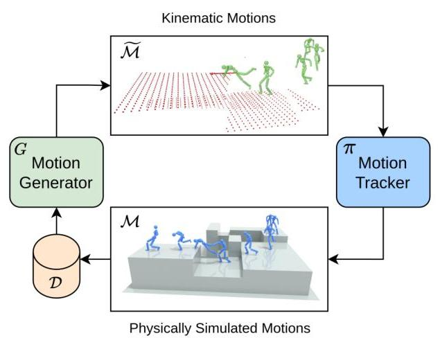
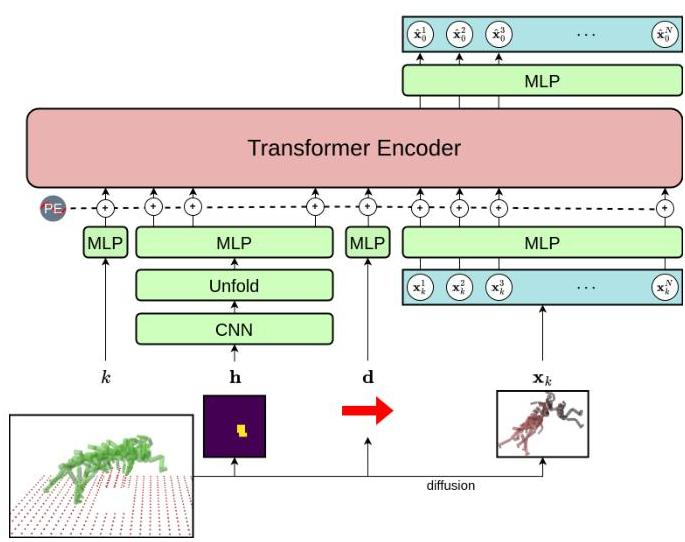
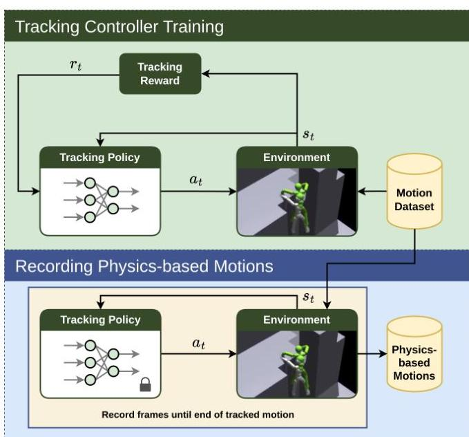
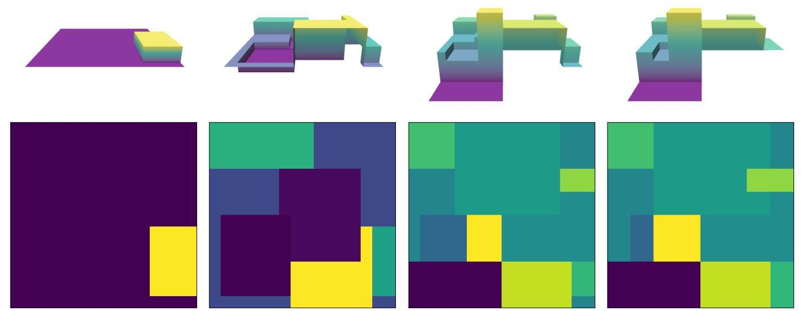
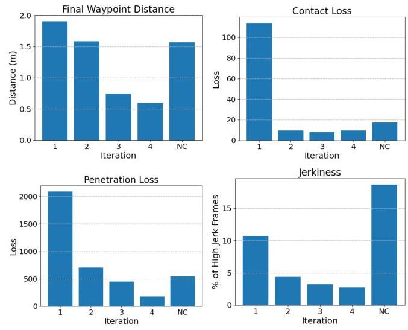

#论文AI速读 #AI回答 #alphaXiv #强化学习 #具身智能 #数据生成

# PARC: Physics-based Augmentation with Reinforcement Learning for Character Controllers
- 论文：[[2505.04002] PARC: Physics-based Augmentation with Reinforcement Learning for Character Controllers](https://arxiv.org/abs/2505.04002)
- 代码：[mshoe/PARC: PARC: Physics-based Augmentation with Reinforcement Learning for Character Controllers](https://github.com/mshoe/PARC/tree/main)
# 简介

创建能够在复杂环境中导航的敏捷和多功能的角色控制器仍然是计算机动画和机器人领域的一项重大挑战。传统方法通常严重依赖大量的动作捕捉数据，这些数据生产成本高昂且范围有限，特别是对于在各种地形上进行复杂的跑酷式运动。



 _图 1：使用 PARC 训练的角色展示了在复杂环境中进行敏捷的穿越，并具有逼真的基于物理的运动。_

PARC（Physics-based Augmentation with Reinforcement Learning for Character Controllers，基于物理的增强与强化学习的角色控制器）框架通过一种创新的迭代方法解决了这一挑战，该方法结合了运动生成、基于物理的模拟和强化学习。PARC 能够创建通用的角色控制器，这些控制器可以使用有限的初始运动数据在复杂环境中导航。

如图 1 所示，使用 PARC 训练的角色可以流畅地在类似城市的环境中导航，并具有逼真的基于物理的运动，包括跳跃、攀爬和平衡。该框架通过迭代数据增强过程逐步扩展运动生成器和基于物理的控制器的功能来实现这一点。

# 背景和相关工作

角色动画已经从关键帧演变为复杂的基于物理的方法。基于物理的角色控制的最新进展已经利用强化学习来创建可以跟踪参考运动或执行任务的控制器。像 DeepMimic 这样的著名作品已经展示了角色如何通过 RL 学习模仿参考运动，但它们通常需要大量的参考数据。

同时，生成模型彻底改变了运动合成。特别是扩散模型，在生成多样化和逼真的人类运动方面表现出了令人印象深刻的能力。然而，这些模型通常会产生在物理上不可行的运动，例如脚部滑动或地形穿透。

数据增强已广泛应用于机器学习中以提高模型性能，但其在角色运动中的应用受到限制。传统方法通常使用简单的变换或噪声添加，这可能无法保持物理上的合理性。

PARC 通过在一个新颖的迭代框架中将基于扩散的运动生成与基于物理的模拟和强化学习相结合，从而建立在这些进步之上。这种方法允许从相对较小的初始数据集开始生成物理上合理、多样化的运动。

# PARC 框架

PARC 框架由一个迭代的数据增强循环组成，该循环逐步改进运动生成和基于物理的控制。关键的见解是，基于物理的模拟可以验证和纠正生成的运动，而这些纠正后的运动可以增强生成模型的能力。



 _图 2：PARC 框架概述，显示了运动学运动生成和基于物理的运动跟踪之间的迭代过程。_

如图 2 所示，PARC 框架包括：

1.  一个 **运动生成器 (G)**，用于为新地形创建运动学运动
2.  一个 **运动追踪器 (π)**，用于学习在模拟中物理地追踪这些运动
3.  一个 **数据集 (D)**，包含运动示例，并且随着迭代而扩展

迭代过程如下：

1.  在当前数据集上训练运动生成器
2.  为新地形生成新的运动学运动
3.  训练基于物理的追踪器以跟踪这些运动
4.  记录物理模拟的运动
5.  将这些物理上合理的运动添加回数据集
6.  重复该过程以逐步增强能力

这种反馈循环允许运动生成器从物理校正的运动中学习，而运动追踪器则受益于日益多样化的参考运动。 最终的结果是一个控制器，可以处理初始数据集中不存在的各种地形和场景。

# 运动生成和校正

PARC 中的运动生成器使用具有 Transformer 编码器架构的扩散模型来创建新的角色运动。 该模型以角色的当前状态和地形信息作为输入，并输出未来的运动轨迹。



 _图 3：基于扩散的运动生成器，带有 Transformer 编码器架构，通过编码的高度图实现地形感知。_

生成过程涉及几个关键组件：

```python
# 地形感知运动生成的伪代码
def generate_motion(initial_state, terrain_heightmap, waypoint):
    # 编码地形信息
    terrain_features = CNN_encoder(terrain_heightmap)
    
    # 初始化噪声
    x_T = sample_gaussian_noise(shape=motion_dims)
    
    # 迭代去噪
    for t from T to 1:
        # 以地形和初始状态为条件
        noise_pred = diffusion_model(x_t, t, initial_state, terrain_features, waypoint)
        
        # 如果靠近接触区域，则应用混合去噪
        if is_near_contact(x_t, terrain_heightmap):
            x_t-1 = blend_denoising_step(x_t, noise_pred, terrain_heightmap)
        else:
            x_t-1 = standard_denoising_step(x_t, noise_pred)
    
    return x_0  # 最终去噪的运动
```

为了确保物理上的合理性，生成的运动会经过运动学校正，以解决诸如地形穿透和运动抖动之类的问题。 这是通过优化实现的，优化可以最大程度地减少穿透损失并促进平滑的接触过渡：

$$
L_{penetration} = \sum_{i,t} \max(0, h_{terrain}(p_{i,t}) - p_{i,t,z})^2
$$

其中 $p_{i,t}$ 表示接触点 $i$ 在时间 $t$ 的位置，而 $h_{terrain}$ 是该水平位置处的地形高度。

# 基于物理的运动追踪

基于物理的运动跟踪器是使用强化学习实现的，特别是类似于 DeepMimic 的近端策略优化 (PPO) 方法。 追踪器学习控制模拟的角色，以尽可能紧密地跟随参考运动。



 _图 4：基于物理的运动跟踪器的训练过程，显示了强化学习反馈循环和跟踪运动的记录。_

用于训练跟踪策略的奖励函数包括几个组成部分：

$$
r_t = w_{pose}r_{pose} + w_{vel}r_{vel} + w_{end}r_{end} + w_{root}r_{root} + w_{contact}r_{contact}
$$

其中：

*   $r_{pose}$ 奖励匹配的关节角度
*   $r_{vel}$ 鼓励匹配的关节速度
*   $r_{end}$ 奖励到达最终目的地
*   $r_{root}$ 鼓励匹配的根位置和方向
*   $r_{contact}$ 奖励与地形的适当足部接触

接触奖励对于地形穿越尤其重要，其定义为：

$$
r_{contact} = \sum_{i} \exp\left(-c\left|e_{i,t} - \hat{e}_{i,t}\right|\right)
$$

其中， $e_{i,t}$ 表示在参考运动中，接触点 $i$ 在时间 $t$ 是否处于接触状态，而 $\hat{e}_{i,t}$ 是模拟运动中的接触状态。

经过训练后，跟踪策略用于记录基于物理的运动，这些运动遵循生成的运动学参考，同时尊重物理约束。 这些记录的运动为运动生成器的下一次迭代提供了宝贵的训练数据。

# 地形生成与增强

PARC 采用程序化地形生成来创建多样化的环境，以用于训练和测试。 地形包括各种特征，如台阶、平台、斜坡和间隙，这些特征挑战了角色的敏捷性。



 _图 5：用于训练和评估的程序化生成地形的示例以及相应的高度图。_

地形表示为高度图并转换为 3D 网格以进行模拟。 该系统包括几种地形类型：

1.  用于基本运动的简单平台和台阶
2.  具有多层的复杂城市型结构
3.  带有间隙和不同海拔的障碍训练场
4.  具有多样化配置的基于网格的地形

对于每个地形，计算可导航路径以提供运动生成器的航路点。 地形数据在迭代过程中得到增强，以逐步增加复杂性和多样性。


 _图 6：用于评估使用 PARC 训练的角色控制器的通用性的复杂城市环境。_

# 实验结果

实验表明，PARC 在迭代过程中逐步提高运动质量和控制器通用性方面是有效的。 初始数据集包含基本的运动动作，例如行走、跑步、跳跃和攀爬，总共约 10 分钟的运动数据。



 _图 7：与未校正 (NC) 基线相比，PARC 迭代过程中运动质量指标的定量改进。_

图 7 显示了迭代过程中各种指标的改进：

* 最终航路点距离减小，表明导航精度提高
* 接触和穿透损失减少，表明更好的物理合理性
* 抖动显着减少，从而产生更平滑的运动

定性结果表明，控制器可以执行初始数据集中不存在的复杂穿越。 例如，角色学会了：

* 使用跳跃和攀爬来导航多层结构
* 使用精确的跳跃动作来跨越间隙
* 穿越具有技能组合的复杂地形


 _图 8：角色执行复杂运动序列的示例，包括爬墙、在平台之间跳跃以及导航多层结构。_

消融研究证实了基于物理的校正的重要性，表明如果没有这个组件，生成的运动会包含更多的伪影，并且生成的控制器在导航复杂地形方面的能力较差。

# 应用和局限性

PARC 有几个潜在的应用：

1.  **游戏开发**：创建反应灵敏、逼真的游戏角色，无需大量的动作捕捉即可在复杂环境中导航。
2.  **动画**：为具有复杂地形穿越的场景生成多样化的角色动画，从而减少了手动动画的需求。
3.  **机器人技术**：开发用于腿式机器人的控制策略，使其能够在具有挑战性的现实世界环境中导航。
4.  **虚拟现实**：通过交互式 VR 体验中物理上合理的角色运动来增强沉浸感。


 _图 9：PARC 的各种应用场景，展示了角色以灵活的动作穿越不同的环境挑战。_

目前的实现确实存在局限性：

* 该系统侧重于单角色运动，不涉及与其他角色或动态对象的交互
* 地形表示仅限于高度图，而非完全的 3D 环境
* 性能取决于初始运动数据集的质量和多样性
* 训练的计算需求很高，尤其是基于物理的跟踪组件

# 结论

PARC 提出了一种有效的方法，可以从有限的运动数据中生成通用的基于物理的角色控制器。通过将基于扩散的运动生成与基于物理的模拟和强化学习相结合，形成一个迭代框架，PARC 逐步增强了角色控制器的能力，使其能够在复杂的环境中以灵活、符合物理规律的动作进行导航。

主要创新包括：

1.  利用基于物理校正的迭代数据增强循环
2.  具有混合去噪的地形感知运动生成
3.  一种用于运动跟踪的接触感知强化学习方法

实验结果表明，PARC 可以创建能够执行初始数据集中不存在的复杂地形穿越行为的控制器，并且在迭代过程中质量不断提高。这种方法有可能减少对大量动作捕捉数据的依赖，同时为游戏、动画和机器人应用提供更灵活和通用的角色控制器。

未来的工作可以将 PARC 扩展到处理角色互动、超出高度图的完全 3D 环境，以及与用于复杂目标导向行为的更高级别规划系统的集成。

# 相关引用


Nate Gillman, Michael Freeman, Daksh Aggarwal, Chia-Hong Hsu, Calvin Luo, Yong-long Tian, 和 Chen Sun. 2024. [Self-Correcting Self-Consuming Loops for Generative Model Training](https://alphaxiv.org/abs/2402.07087). arXiv:2402.07087 \[cs.LG\] [Self-Correcting Self-Consuming Loops for Generative Model Training](https://alphaxiv.org/abs/2402.07087)

* 本文介绍了用于训练生成模型的自修正、自消耗循环的概念。它与 PARC 高度相关，因为 PARC 使用了类似的训练循环，其中运动生成器和基于物理的跟踪器迭代地生成和校正彼此的数据。

Xue Bin Peng, Pieter Abbeel, Sergey Levine, 和 Michiel van de Panne. 2018. Deepmimic: 基于示例引导的物理角色技能深度强化学习。ACM Transactions on Graphics (TOG) 37, 4 (2018), 1–14.

*   PARC 使用 DeepMimic 框架作为其基于物理的运动跟踪控制器。DeepMimic 与本文相关，因为它使用强化学习来开发基于物理的角色控制器。

Guy Tevet, Sigal Raab, Brian Gordon, Yonatan Shafir, Daniel Cohen-Or, 和 Amit H Bermano. 2023. [Human Motion Diffusion Model](https://alphaxiv.org/abs/2209.14916). ICLR (2023).

* 本文介绍了一种人体运动扩散模型，这与 PARC 中用于运动生成的模型类型相同。它之所以相关，是因为它为 PARC 的运动生成组件提供了基础。

Viktor Makoviychuk, Lukasz Wawrzyniak, Yunrong Guo, Michelle Lu, Kier Storey, Miles Macklin, David Hoeller, Nikita Rudin, Arthur Allshire, Ankur Handa, 和 Gavriel State. 2021. Isaac Gym：用于机器人学习的高性能 GPU 物理模拟。

*   PARC 中的所有物理模拟都是使用 Isaac Gym 完成的。该模拟器之所以相关，是因为它为 PARC 中运动跟踪控制器的训练和评估提供了物理引擎和环境。

# 特别补充
## 运动生成器结构
