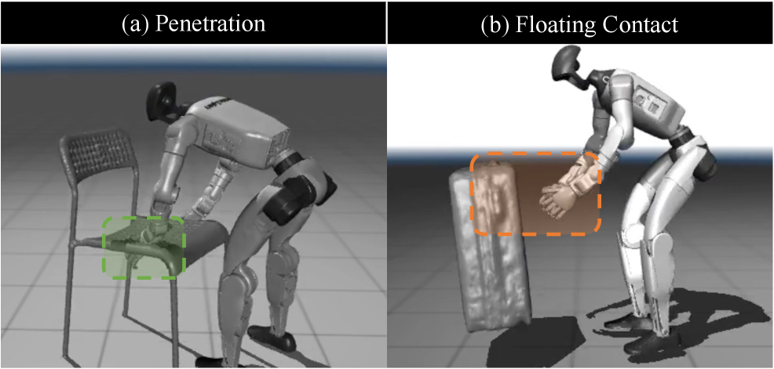
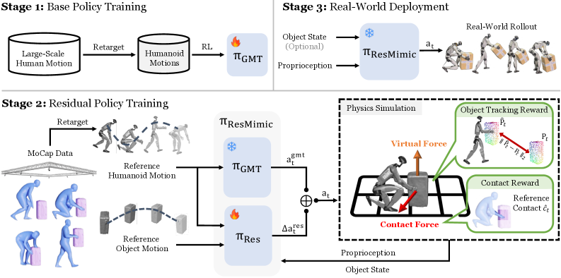

#论文AI速读 #AI回答 #alphaXiv 

以下总结来自 Gemini 3 Pro。

 - 论文：[[2510.05070v2] ResMimic: From General Motion Tracking to Humanoid Whole-body Loco-Manipulation via Residual Learning]( https://arxiv.org/abs/2510.05070v2 )
 - 项目：[ResMimic: From General Motion Tracking to Humanoid Whole-Body Loco-Manipulation via Residual Learning](https://resmimic.github.io/)

# ResMimic: From General Motion Tracking to Humanoid Whole-body Loco-Manipulation via Residual Learning

这篇论文提出了 **ResMimic**，一个针对人形机器人全身“移动 - 操作”（Loco-Manipulation）的两阶段残差学习框架 。其核心思想是利用大规模人体运动数据预训练一个通用的运动追踪策略，再通过残差策略学习特定任务的目标交互 。

## A) 核心动机与背景 (Motivation)
- **解决的具体痛点**：
    - **具身间隙 (Embodiment Gap)**：将人类动作捕捉数据直接重定向（Retargeting）到人形机器人时，由于肢体比例和动力学差异，常会出现“浮空接触”或“肢体穿透物体”的物理不一致现象 。
    - **通用性与精确性的矛盾**：现有的通用运动追踪（GMT）策略虽能模仿多样化动作，但缺乏物体感知能力 ；而特定的操作算法往往设计过于死板，缺乏全身协调的灵活性 。
- **本质区别**：不同于传统的端到端训练或分阶段控制器，ResMimic 采用了“预训练 + 残差微调”的范式 。它将稳健的运动先验（平衡、行走、伸展）与精细的任务修正解耦，通过残差网络补偿重定向带来的误差 。
    

## B) 方法论框架 (Methodology)

### 1. 模型结构与模块拆解

ResMimic 由两个核心网络组成 ：

- **Stage I: 通用运动追踪策略 ($\pi_{GMT}$)**
    - **输入 ($s_t^r, \hat{s}_t^r$)**：机器人本体状态（关节位置、根部速度等）及参考运动轨迹 。
    - **输出 ($a_t^{gmt}$)**：粗略的全身关节动作指令 。
    - **作用**：作为任务无关的基座，提供类似人类的自然运动逻辑 。
- **Stage II: 任务特定残差策略 ($\pi_{Res}$)**
    - **输入 ($s_t^r, s_t^o, \hat{s}_t^r, \hat{s}_t^o$)**：在 GMT 输入基础上增加物体状态 $s_t^o$（位置、姿态、速度）及物体参考轨迹 $\hat{s}_t^o$ 。
    - **输出 ($\Delta a_t^{res}$)**：29 维的关节角度修正量 。
    - **最终动作**：$a_t = a_t^{gmt} + \Delta a_t^{res}$ 。

### 2. 数学表达与核心损失函数

论文设计的奖励函数旨在平衡运动保真度与交互准确性：

- **点云物体追踪奖励 ($r_t^o$)**： 为了避免繁琐的位姿权重调优，作者采样物体表面的 $N$ 个点，计算当前点云 $P$ 与参考点云 $\hat{P}$ 的差异 ：
    $$
    r_{t}^{o} = \exp\left(-\lambda_{o} \sum_{i=1}^{N} ||P[i]_{t} - \hat{P}[i]_{t}||_{2}\right)
    $$

    **设计初衷**：该项能自动处理平移和旋转，提供比单纯欧氏距离更平滑的优化曲面 。

- **全身接触奖励 ($r_t^c$)**： 显式引导机器人利用躯干或手臂接触物体，而非仅靠末端执行器 ：
    $$
    r_{t}^{c} = \sum_{i} \hat{c}_{t}[i] \cdot \exp\left(-\frac{\lambda}{f_{t}[i]}\right)
    $$

    其中 $\hat{c}_t[i]$ 是来自人类演示的接触指示符，$f_t[i]$ 是特定部位的接触力 。

## C) 数据流水线 (Data Pipeline)
- **大规模预训练数据**：利用 AMASS 和 OMOMO 等开源数据集（约 42 小时，1.5 万个片段）训练 $\pi_{GMT}$ 。
- **任务演示数据**：使用 OptiTrack 系统同步采集人与物体的交互数据（如单膝跪地搬运、背负重物等） 。
- **预处理**：通过 **GMR (General Motion Retargeting)** 算法将人类骨骼运动映射到 Unitree G1 的 29 自由度模型上 。

## D) 训练与推理细节 (Training & Inference)
- **训练策略**：
    - **两阶段强化学习**：均采用 PPO 算法，在 IsaacGym 环境中进行大规模并行训练 。
    - **虚拟力课程学习 (Virtual Force Curriculum)**：在训练早期，通过 PD 控制器施加虚拟力引导物体跟随参考轨迹，随着训练进行逐渐减小虚拟力 。这能有效防止因重定向误差导致的物体翻倒，帮助策略跳出早期失败的局部最优 。
    - **残差网络初始化**：将 $\pi_{Res}$ 的输出层权重初始化为接近零，确保训练起始时机器人完全遵循 GMT 的稳健运动 。
- **部署表现**：在 Unitree G1 实机上实现了搬运 4.5kg 重物（超过其手部额定载荷 2.5kg），证明了全身接触策略的优越性 。

## E) 技术评价与启发

### 1. 局限性
- **感知依赖**：该框架目前主要依赖 MoCap 提供的物体状态 。虽然展示了“盲操作”能力，但在复杂、多变的环境下，缺乏实时视觉反馈可能会限制其动态避障能力 。
- **任务独立性**：残差策略 $\pi_{Res}$ 目前仍是每项任务单独训练的（Task-specific） 。

### 2. 工程迁移建议 (基于 Isaac Lab/AGX Orin)
- **点云计算效率**：在 Isaac Lab 环境中，物体表面采样点不宜过多（如 N=100~200 已足够），否则会显著拖慢并行仿真速度 。
- **接触力反馈**：将算法部署到实机（如 AGX Orin）时，由于 G1 等机器人可能缺乏全机身的力传感器，建议通过电流环估算接触力，或通过视觉估计的接触状态来近似替代奖励函数中的 $f_t[i]$ 。
- **早期终止条件**：在仿真中必须严格设置物体偏离参考轨迹过大的早期终止条件（Early Termination），否则残差策略容易学到“消极避开物体”的错误策略 。
    
# Q&A
## 点云物体追踪奖励具体的用途是用来干什么的？当前点云指的是什么的点云？ 参考点云是指的什么点云？
在 ResMimic 框架中，**点云物体追踪奖励（Point-cloud-based Object Tracking Reward, $r_t^o$ ）** 是实现精准操作的核心机制。它通过几何对比来评估机器人对物体的控制精度。

以下是针对您问题的详细拆解：

### 1. 点云物体追踪奖励的具体用途
这个奖励函数的主要用途是**衡量并引导机器人操作的准确性**，具体体现在以下几个方面：
- **提供平滑的优化曲面**：相比于直接计算物体中心点的位姿差异（Pose Difference），点云对比能提供更平滑的数学梯度，有助于强化学习算法（PPO）更快地收敛 。
- **统一衡量位姿误差**：传统方法需要分别对物体的“位置偏差”和“旋转偏差”设置不同的权重（例如 $w_{pos}$ 和 $w_{rot}$），这通常需要大量的人工调优 。而点云对比能**同时捕捉平移和旋转的差异**，无需任务特定的权重调优 。
- **鼓励任务达成**：通过最小化当前物体与参考轨迹之间的点云距离，强制机器人学会如何通过全身协调来驱动物体沿着预设的轨迹运动 。

### 2. “当前点云” ($P_t$) 指的是什么？
**当前点云**是指在**物理仿真环境（如 IsaacGym 或 MuJoCo）中**，当前时刻 $t$ 被机器人操控的物体的点云数据 。
- **数据来源**：它是从仿真中物体的 **网格表面（Mesh Surface）** 随机采样出的 $N$ 个 3D 坐标点组成的集合 。
- **物理物理意义**：它反映了在当前策略执行下，物体在虚拟物理世界里的**真实空间状态**（位置和姿态） 。

### 3. “参考点云” ($\hat{P}_t$) 指的是什么？
**参考点云**是指来自**人类专家演示数据（MoCap Data）**中，对应时刻 $t$ 的物体点云数据 。
- **数据来源**：在训练前，研究者利用 OptiTrack 等动作捕捉系统记录了人类真实搬运物体时的轨迹数据 。同样地，从这个参考轨迹的物体网格表面采样出 $N$ 个点 。
- **物理物理意义**：它代表了任务的**“标准答案”或“目标状态”** 。机器人学习的目标就是让“当前点云”尽可能地重合在“参考点云”之上 。

### 数学表达直观化
其核心公式为：
$$
r_{t}^{o} = \exp\left(-\lambda_{o} \sum_{i=1}^{N} ||P[i]_{t} - \hat{P}[i]_{t}||_{2}\right)
$$

- **$P[i]_t$**：仿真里物体的第 $i$ 个点 。
- **$\hat{P}[i]_t$**：专家演示里对应的第 $i$ 个点 。
- **含义**：如果两个点云完全重合，奖励值最大（接近 1）；如果物体被撞飞或偏离轨道，奖励值会随着点云距离的增大而迅速衰减 。