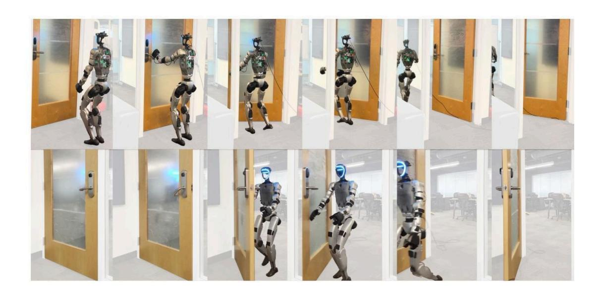
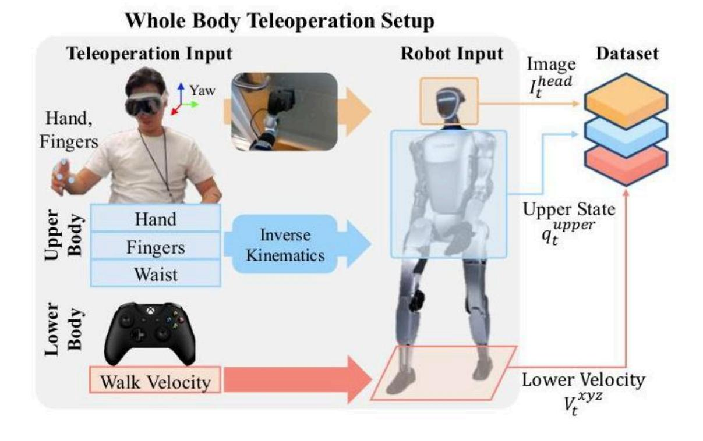
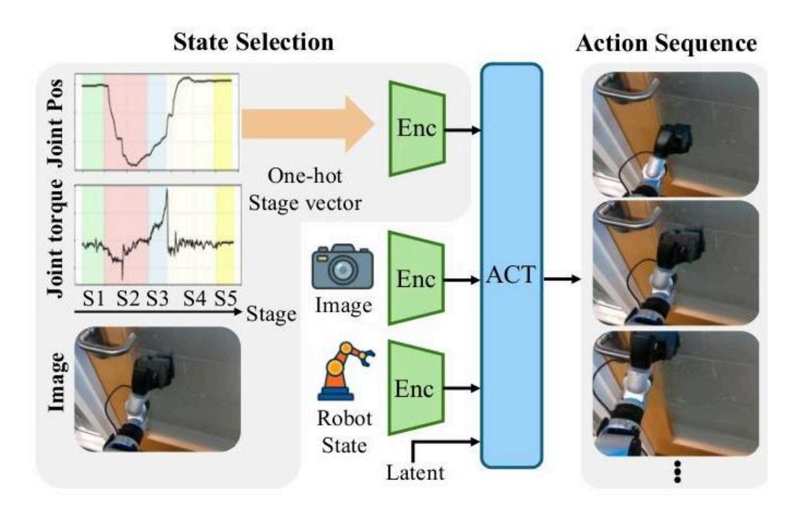
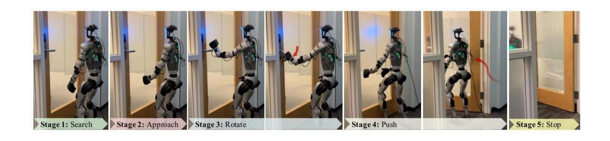
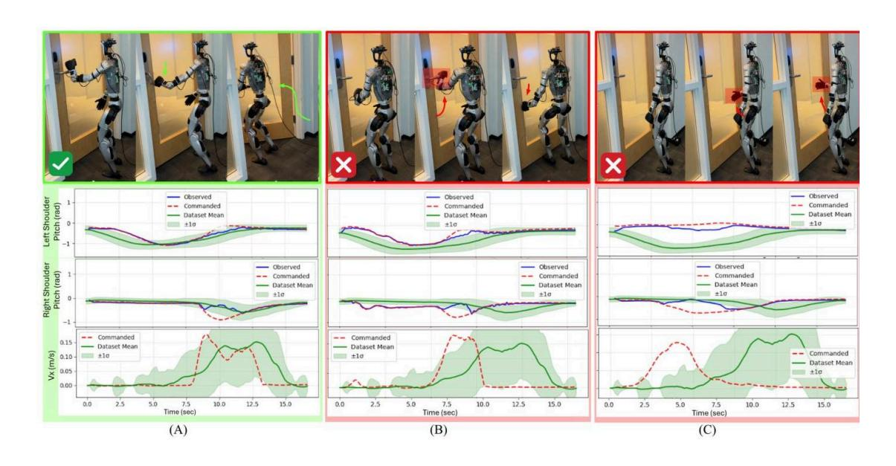

# StageACT: 阶段条件模仿实现仿人机器人鲁棒开门

#具身智能 #manipulation #alphaXiv

[toc]

# 摘要

FieldAI 研究人员开发了 StageACT,一个阶段条件模仿学习框架,使优必选 G1 人形机器人能够在真实的办公环境中自主开门,在未见过的门上实现了 55% 的成功率,是基线性能的两倍多。该框架展示了强大的故障恢复能力,并能够通过明确的阶段提示引导机器人行为。

# 1. 概述

StageACT 引入了一个阶段条件模仿学习框架,使人形机器人在真实世界的办公环境中自主开门。 这项研究解决了一个机器人学中的基本挑战: 使人形系统能够执行复杂的、⻓周期任务,这些任 务需要运动与操作之间紧密耦合,而无需依赖外部传感器或关于环境的特权信息。

图 1: 完整的开门序列,展示了人形机器人自主执行所有五个阶段: 寻找门把手、接近门把手、旋转门把手、推开门,以及停在一个稳定的位置。

# 2. 问题与动机

开门是机器人学中一个典型的基准任务,它结合了多个具有挑战性的方面: 接触式操作、动态平 衡控制以及在部分可观察性下的推理。该任务本质上是非马尔可夫的,因为视觉上相似的观测可 能对应着完全不同的底层状态——例如,从机器人的角度来看,接近门把手和准备推开门可能看起 来相同,但需要截然不同的动作。

传统的模仿学习方法在这种任务上表现不佳,因为它们经常遭受 " 模式崩溃 ",即策略平均了来自不 同阶段的动作或以错误的顺序执行它们。这对于时间上下文对于正确动作选择至关重要的⻓周期 任务来说尤为成问题。之前的人形机器人开门演示主要依赖于远程操作或外部传感辅助 (如 AR 标 记),这限制了它们在非结构化环境中的适用性。

# 3. 技术方法

StageACT 框架建立在动作分块 Transformer (ACT) 架构之上,并通过明确的阶段条件扩展了它, 以为策略执行提供时间上下文。该方法由三个主要组件组成:

## 3.1. 数据收集系统

研究人员开发了一个复杂的全身远程操作系统,使用了配备 Dex-3 手的宇树 G1 人形机器人。远程 操作设置将控制分为 Apple Vision Pro 头戴式设备 (用于上半身操作) 和 Xbox 控制器 (用于运 动)。这种解耦方法显著减轻了操作员的负担,同时保持了操作和运动之间的有效协调。

图: 全身远程操作系统,展示了从人类操作员输入到机器人动作的映射,结合了基于视觉的上半 身控制和基于游戏手柄的运动指令

团队在两个不同的办公环境中收集了 135 次成功的开门演示,这些环境具有不同的照明条件和门 动态。每个轨迹⻓ 20-30 秒,包括来自机器人头部摄像头的 RGB 图像观测以及上半身关节状态。

## 3.2. 阶段条件策略架构

核心创新在于通过明确的阶段信息增强 ACT 策略。开门任务被分解为五个不同的阶段:

1. 搜索 (S1): 定位门把手

2. 接近 (S2): 将左臂移向门把手

3. 旋转 (S3): 向下按并旋转门把手

4. 推动 (S4): 用右臂推开门

5. 停止 (S5): 返回到稳定的静止位置

图:StageACT 架构,展示了阶段信息如何被编码为独热向量,并与视觉和本体感受观测相结合, 以条件化 ACT 策略

这些阶段被编码为独热向量,并与机器人的观测 (摄像头图像、关节状态和潜在变量) 拼接,作 为 Transformer 解码器的输入。阶段标签由人类专家在后处理阶段进行标注,他们同时使用了视觉 线索和本体感受信息 (如关节扭矩),这对于区分视觉上相似但功能上不同的阶段至关重要。

## 3.3. 训练与实现

该策略是使用条件变分自编码器 (CVAE) 框架训练的,其中编码器将机器人状态和演示动作映射 到一个潜在变量,而 Transformer 解码器根据当前观测和潜在变量生成未来的动作序列。阶段条件 作用提供了明确的时间上下文,有助于解决部分可观测状态下的歧义。

# 4. 关键发现

实验评估侧重于在一个以前从未见过的门上测试策略,该门的出现和动态与训练数据不同。结果 表明阶段条件作用具有明显的优势:

图: 开门的五个阶段,以及每个阶段对应的机器人配置和动作

性能提升:StageACT 的成功率为 55%,而标准 ACT 为 20%,带有观测历史的 ACT 为 10%。阶段条 件策略也以更快的速度 (平均 20.7 秒) 完成任务,并具有更低的跟踪误差,这表明对演示行为的 执行更高效、更忠实。

关键阶段分析: 最显著的改进发生在 " 接近 " 阶段 (S2),在该阶段,接近和推动动作之间的视觉模 糊性导致基线策略失败。StageACT 在 19 次尝试中成功完成了该阶段 17 次,而 ACT 在 20 次尝试中仅 成功了 7 次。

图: 阶段标注过程,展示了关节位置和扭矩等本体感受线索如何帮助消除视觉上相似阶段的歧义

恢复能力: 一个特别重要的发现是 StageACT 能够实现训练数据中不存在的恢复行为。当失败后给 出明确的阶段提示时,机器人可以返回到早期阶段并重试有问题的动作,展示了增强的鲁棒性和 适应性。

# 5. 意义与启示

这项工作对人形机器人和模仿学习做出了几项重要贡献。首先,它展示了第一个无需外部传感或 特权信息即可运行的自主人形开门系统,标志着机器人能够在非结构化人类环境中运行迈出了重 要一步。

图:StageACT 与基线方法的比较,显示了成功执行 (A) 与失败模式 (B、C),其中基线策略表 现出模式崩溃和过早的动作执行

阶段条件方法为⻓周期任务中的部分可观测性提供了一种可推广的解决方案,解决了模仿学习中 的一个基本挑战。通过提供明确的时间上下文,该方法使策略能够消除视觉上相似状态的歧义, 并按正确的顺序执行动作,这在开门之外具有广泛的应用。

所示的恢复能力代表了实际部署的一个关键进展,在实际部署中,机器人必须处理意外情况和执 行失败。通过阶段提示引导行为的能力还提供了一种分层控制形式,这对于适应训练期间未见过 的新颖场景可能很有价值。

展望未来,这项工作为更复杂的移动操作任务奠定了基础,并为构建人形机器人的大规模通用策 略指明了道路。阶段条件框架有可能利用视觉语言模型实现自动化,从而实现可扩展的数据收集 和学习,适用于更广泛的复杂行为。这项研究使人形机器人显著地更接近于在人类生活和工作的 复杂、动态环境中自主且可靠地运行。

# 6. 相关引用

#### 利用低成本硬件学习细粒度双手操作

本文介绍了动作分块 Transformer (ACT),这是一个核心的模仿学习框架,本文提出的 StageACT 方法正是明确构建在此基础之上。StageACT 通过引入阶段条件 (stage-conditioning) 扩展了 ACT,旨在解决开门任务中部分可观测性和⻓周期性的问题。

T. Z. Zhao, V. Kumar, S. Levine, and C. Finn, "Learning fine-grained bimanual manipulation with low-cost hardware," arXiv preprint arXiv:2304.13705, 2023.

#### DARPA 机器人挑战赛决赛: 结果与展望

这篇引用是基础性的,因为它自 2015 年 DARPA 机器人挑战赛以来,便将开门确立为人形机器人的 一项经典基准任务。它提供了历史背景和动机,解释了为何自主开门在该领域仍然是一个重要且 困难的问题。

E. Krotkov, D. Hackett, L. Jackel, M. Perschbacher, J. Pippine, J. Strauss, G. Pratt, and C. Orlowski, "The DARPA robotics challenge finals: Results and perspectives," in The DARPA robotics challenge finals: Humanoid robots to the rescue. Springer, 2018, pp. 1–26.

#### 基于分层模仿学习的多阶段电缆布线

本文被引作一个将⻓时程任务分解为特定阶段策略的层次框架的关键例子。它与 StageACT 方法形 成直接对比,后者使用一个基于阶段输入的单一通用策略,而非依赖多个专门化组件。

J. Luo, C. Xu, X. Geng, G. Feng, K. Fang, L. Tan, S. Schaal, and S. Levine, "Multistage cable routing through hierarchical imitation learning," IEEE Transactions on Robotics, vol. 40, pp. 1476–1491, 2024.

#### FALCON: 学习力自适应的人形移动操作

这项工作被引用为最近在遥操作环境下进行的类人机器人开门演示。它具有高度相关性,因为它 突出了主论文贡献的新颖之处,即在没有人类操作员的情况下实现了完全自主的开门。

Y. Zhang, Y. Yuan, P. Gurunath, T. He, S. Omidshafiei, A.-A. Agha-Mohammadi, M. Vazquez-Chanlatte, L. Pedersen, and G. Shi, "FALCON: Learning force-adaptive humanoid locomanipulation," arXiv preprint arXiv:2505.06776, 2025.