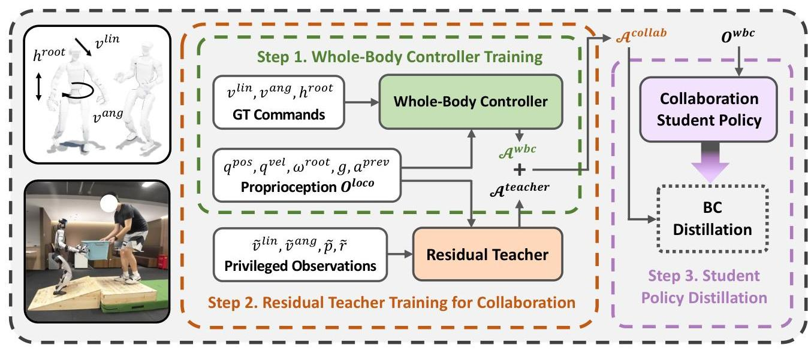
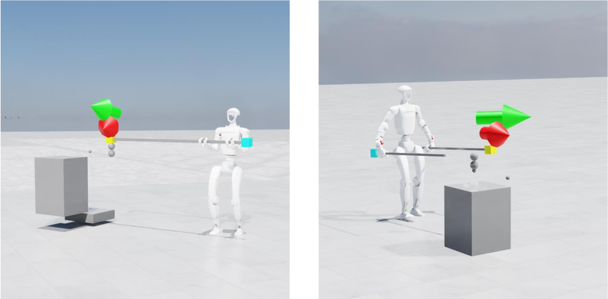

# COLA: Learning Human-Humanoid Coordination for Collaborative Object Carrying
- 文章：[[2510.14293v1] Learning Human-Humanoid Coordination for Collaborative Object Carrying](https://arxiv.org/abs/2510.14293v1)
- 项目：[COLA: Learning Human-Humanoid Coordination for Collaborative Object Carrying](https://yushi-du.github.io/COLA/)

#VLA #强化学习

## 动机

现有方法来进行人机协作，依赖预定义的启发式规则，人类意图模型或者外部传感器，不好处理动态交互。

COLA 引入了一个三步训练流程，旨在仅使用本体感受反馈实现兼容且协调的人 - 人形机器人协作。该方法建立在两个关键见解之上：

- 关节状态与其目标状态之间的偏差可以用来估算交互力
- 被搬运物体的状态蕴含了诸如稳定性与协调性等协作所需的约束条件

## 三阶段训练

### 阶段 1： 全身控制策略（WBC）训练
#### 目的

训练用于控制整个身体的控制算法

#### 做法

在模拟器中训练全身控制策略。输入 $O^{wbc}$ 为历史的关节位置（29 维），关节速度（29 维），机器人基座朝向（4 维），重力加速度（3 维），以及历史中机器人之前执行的动作（n 维）

输出为机器人下肢的线速度，角速度，高度参数和上肢末端的姿态。

整体采用 PD 控制。使用 PPO 训练。训练过程中对仿真中机器人的末端还施加外部力。

### 阶段 2：残差教师策略训练
#### 目的

训练一个残差教师策略实现系统协同工作，这里残差教师有特权

#### 做法

使用上一步的 WBC 作为预训练，做一个叠加在上面的残差模型。输入为 $O^{wbc}$ 和特权信息。

特权信息为：历史时间窗口中搬运目标物的的角速度，线速度，位姿

输出为：机器人下肢的线速度，角速度，高度参数和上肢末端的姿态的修正调整

该阶段放置了一个模拟人的盒子来使得机器人可以以协作的姿态运动

### 阶段 3：学生策略蒸馏
#### 目的

将教师策略中专业知识转化成能实用的学生策略。使用行为克隆来学习，模仿教师策略。

学生策略输入 $O^{wbc}$ ，输出机器人下肢的线速度，角速度，高度参数和上肢末端的姿态。

损失函数是 L2.

## 实现细节

单卡 4090D，IsaacLab，PPO，4096 个并行环境，WBC 中 Actor 和 Critic 都是 3 层 MLP（512，256，128）. 残差教师和残差学生为 5 层 MLP。 WBC 训练 350K step，残差教师 250K，学生策略阵列柜 250K

## 参考
1. <https://mp.weixin.qq.com/s/-Cks7fr-MKU0l3-FUyRQaA>
2. <https://mp.weixin.qq.com/s/Hk3Qgq236gqyjEu3qAgrwQ>