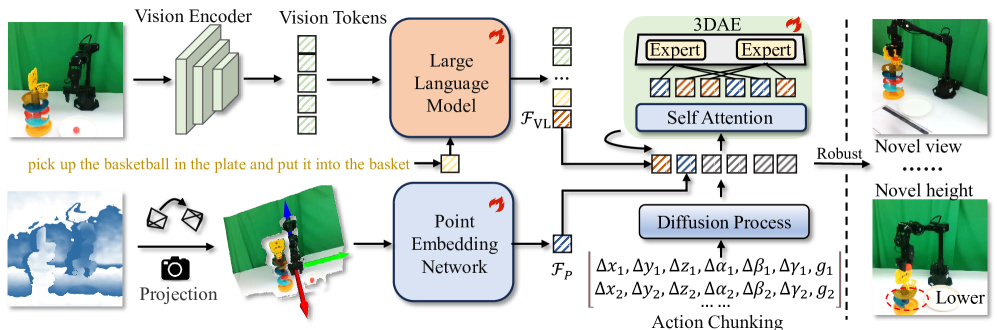
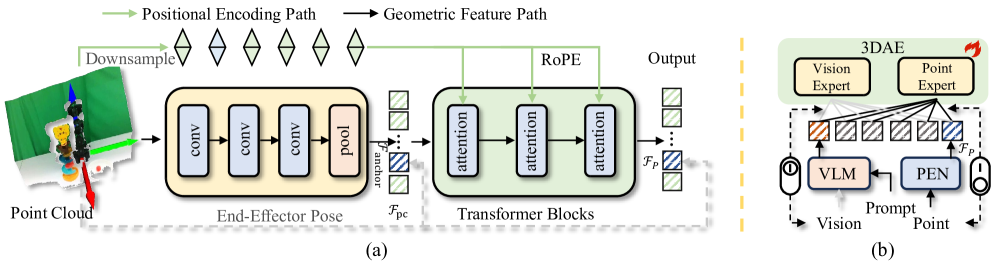

#具身智能 #3D点云  #VLA 

# GeoVLA: Empowering 3D Representations in Vision-Language-Action Models
- 论文：[[2508.09071] GeoVLA: Empowering 3D Representations in Vision-Language-Action Models](https://arxiv.org/abs/2508.09071)
- 代码：[GeoVLA](https://linsun449.github.io/GeoVLA/)

## 动机

多数 VLA 处理 2D 图像，对 3D 感知不行。对于深度和物体之间 3D 关系理解不行，相机视角变化时表现也不好，不同尺寸高度物体不好处理，需要精确 3D 定位的任务表现差。

PointVLA 采用两阶段训练，对点云的利用不够，端到端的 3D 点云引入还是需要进一步探索。

LLARVA 强调了将体素或点云表示纳入现有视觉语言结构的困难，并求助于抽象的二维视觉轨迹以保持兼容性。

## 细节

文章的 action 参数化使用 eef 的变化量和夹爪的绝对指令。

## 模型结构

> 带有语言指令的 RGB 图像由 VLM 处理以产生视觉 - 语言特征 $\mathcal{F}_{VL}$ ，而深度图被重投影为点云并由 PEN 编码为几何特征 $\mathcal{F}_{P}$ 。两种模态在 3DAE 中结合，逐步生成机器人动作。

这里的 VLM 使用 Primatic。

### 点云嵌入网络 PEN

先将 RealSense 的原始点云转换成以 TCP 位置为原点的点云。

这里编码器用双路架构：

- 几何特征路径：使用多层大卷积和局部池化的 CNN 把点云变成几何 token $\mathcal{F}_{\mathrm{pc}} \in \mathbb{R}^{N \times C}$ 
- 位置编码路径：原始点云下采样以匹配 $\mathcal{F}_{\mathrm{pc}}$ 的大小，并通过旋转位置编码（RoPE）（Su 等，2024）引导位置信息。 

图中蓝色方块 $\mathcal{F}_{\mathrm{anchor}}$ 为点云中 TCP 所在在位置对应的 token

### 3D 增强动作专家

这里使用的 DiT 来生成动作，在 FFN 中使用了 MoE 架构。

### 路由策略
1. VLM 是预训练，点云是初始化，动态路由会导致模型偏向 VLM 分支，故而采用静态路由策略。即训练过程中，每次随机丢弃一个模态，来控制专家的激活。

## 训练配方

8xA100，使用 FSDP 训练，32batch/gpu，adamW，lr=2e-5，启用混合精度训练，数据集使用 TFDS 加载，随机缓冲大小 10000. 训练过程中无数据增强，action chunk=16