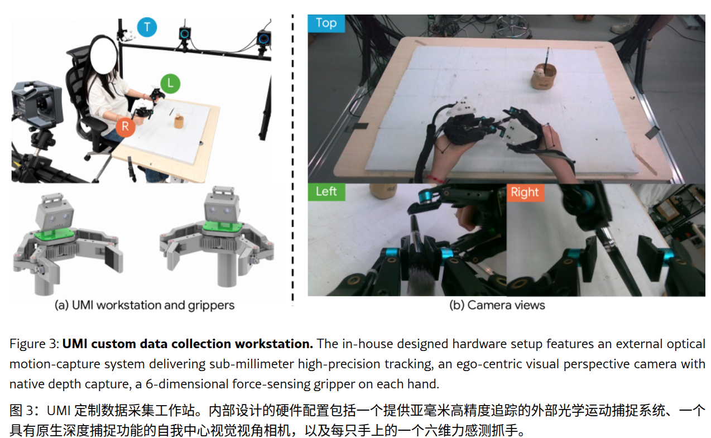
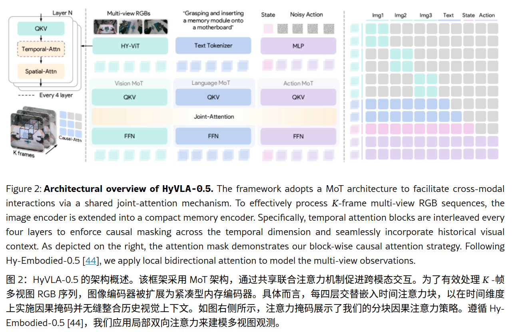
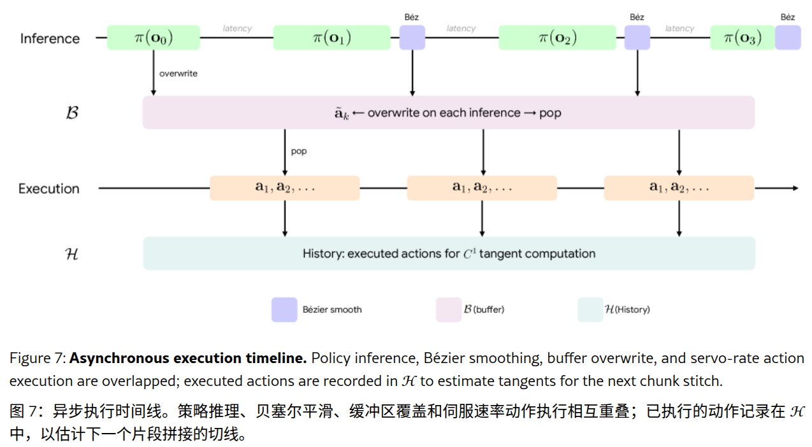

#VLA 

# Hy-Embodied-0.5-VLA: From Vision-Language-Action Models to a Real-World Robot Learning Stack
- 论文：<https://arxiv.org/abs/2606.14409>
- 代码：<https://github.com/Tencent-Hunyuan/Hy-Embodied-0.5-VLA>

# 关键信息

**数据：** 定制了一个 UMI 设备，配合光学动补使用，UMI 的夹爪支持力反馈驱动，数据采集了深度，但目前没用。

**模型：** 在具身语料库上预训练 4 B VLM，添加 FM，预测 EEF 的 delta

**微调上：** 使用 10 小时 UMI 预训练上述的模型 HyVLA-0.5，再进行特定任务微调。SFT 任务有两：1 是同体适配，2 是近使用 UMI 进行跨体迁移，不用遥操数据

**RL 后训练：** 用 [FlowPRO](https://arxiv.org/abs/2606.05468) 

**部署：** 通过生产者 - 消费者架构以及三次贝塞尔曲线来做平滑

## 模型结构

### 模型输入输出
- 视觉：多相机多历史，实际实验就用了当前帧，编码器用了视频编码器
- 语言
- 本体感知：末端 EEF 的位姿
- 动作输出：Action chunk，长度 H=50，用的增量，每个 action chunk 的增量是相对当前 status 的
#### EEF 动作表示

3 维 xyz+ [6D 表示法的末端姿态](../../DL_knowlege/空间相关/6D法切向量表示法.md) +1 维归一化的夹爪，动作使用增量块

### 具体模型模块
- 视觉编码：原生分辨率视觉编码，使用 Hy-ViT 2.0，后面换成了视频编码器，待细看 Pi-MEM
- 模态交互：[MoT](../../DL_knowlege/MoT.md) 架构，图像用双向，语言用因果
- 其他：去噪 10 步，

### 预训练细节

VLM 和 action expert 同架构，action expert 370 M 参数，随机初始化。用 3 相机，224 x 320 10 Hz 的推理输入。

预训练使用 1 W 小时 UMI 数据。先以与片段长度成正比的概率从完整语料库中采样一个片段，然后从该片段中均匀采样一个帧作为当前帧，最后以 10 Hz 的块大小 H=50 获取未来动作序列作为真实动作块。

本体状态和动作使用数据集范围的 std 和 mean 归一化。  
Batchsize=1024，lr=5 e-5，200 k step，warmup 1 k，160 K 衰减成 1/10，adamW 优化

### 后训练细节 SFT

输入包括当前帧 + 历史 5 帧数据，50 Hz 采样动作，action chunk 50，batchsize=32，lr=2.5 e-5，step 60 K，40 K 衰减

## 部署

三个组件：1. 平台映射器 2. 异步推理执行循环 3.三次贝塞尔拼接器

### 平台映射器

策略输出双臂 10 维 chunk，（3+6+1）\*2

### 异步推理执行

线程安全的生产 - 消费

## UMI 数据转换到机器人

**算法 1：从 UMI 夹爪姿态到底盘坐标系下全身目标姿态的启发式映射** (Algorithm 1: Heuristic Mapping from UMI Gripper Poses to Whole-Body Targets in the Chassis Frame)

**输入 (Input) ：**

- $T_L^W, T_R^W \in SE(3)$ $\quad/*\text{ 世界坐标系 } W \text{ 下的 UMI 夹爪姿态 }*/$

1. $L \quad/*\text{ 机械臂完全伸展的标称 reach (单位：米) }*/$
    
2. $h_0 \quad/*\text{ 底盘-肩部连线的标称站立高度 }*/$
    
3. $\alpha \in [0, 1] \quad/*\text{ 水平向后偏移量（占 } L \text{ 的比例）}*/$
    
4. $\Delta z_C \quad/*\text{ 用于底盘定位的净垂直偏移量 }*/$
    
5. $\theta_0 \quad/*\text{ 恒定的躯干前倾俯仰角 (pitch) }*/$
    
6. $\delta \in [0, 1] \quad/*\text{ 手部高度与 } h_0 \text{ 之间的融合因子 }*/$
    
7. $R_{\text{align}} \quad/*\text{ 固定的 UMI}\rightarrow\text{机器人夹爪轴向旋转矩阵 }*/$
    
8. $T_H^T \quad/*\text{ 固定的躯干到头部校准变换矩阵 }*/$

**输出 (Output)：** 底盘坐标系下的目标姿态 $T_L^C, T_R^C, T_T^C, T_H^C$

$\quad/*\text{ 步骤 1：对齐 UMI 夹爪轴向与机器人夹爪轴向 }*/$

9. $T_L^W \leftarrow T_L^W R_{\text{align}}$

10. $T_R^W \leftarrow T_R^W R_{\text{align}}$

$\quad/*\text{ 步骤 2：双手中心点与水平朝向矢量 }*/$

11. $m^W \leftarrow \frac{1}{2} (t(T_L^W) + t(T_R^W)) \quad/*\text{ 双手平移位置的平均值 }*/$

12. $f^W \leftarrow \Pi_{xy}(m^W) / \Vert{}\Pi_{xy}(m^W)\Vert{} \quad/*\text{ 世界坐标系 XY 平面内的单位向量 }*/$

13. **if** $\Vert{}\Pi_{xy}(m^W)\Vert{} < \varepsilon$ **then**

14. $\quad f^W \leftarrow \mathbf{e}_x \quad/*\text{ 退化情况下的备用方案 }*/$

15. **end**

$\quad/*\text{ 步骤 3：单次底盘定位（每集/Episode 缓存） }*/$

16. **if** $T_C^W \text{ 未被缓存}$ **then**

17. $\quad p_C^W \leftarrow m^W - \alpha L f^W + \Delta z_C \mathbf{e}_z \quad/*\text{ 后移 } + \text{ 垂直下降 }*/$

18. $\quad T_C^W \leftarrow (\mathbf{I}, p_C^W)$

19. $\quad \text{缓存 } T_C^W$

20. **end**

$\quad/*\text{ 步骤 4：在底盘坐标系下重新表示夹爪与辅助变量 }*/$

21. $T_L^C \leftarrow (T_C^W)^{-1} T_L^W$

22. $T_R^C \leftarrow (T_C^W)^{-1} T_R^W$

23. $m^C \leftarrow (T_C^W)^{-1} m^W$

24. $f^C \leftarrow R(T_C^W)^\top f^W$

$\quad/*\text{ 步骤 5：启发式躯干姿态 }*/$

25. $\psi \leftarrow \operatorname{atan2}(f_y^C, f_x^C) \quad/*\text{ 偏航角 (yaw) 与双手方向对齐 }*/$

26. $R_T^C \leftarrow R_z(\psi) R_y(\theta_0) \quad/*\text{ 先偏航，再施加恒定前倾俯仰角 }*/$

27. $p_T^C \leftarrow \left(0, 0, (1 - \delta) m_z^C + \delta h_0\right)^\top \quad/*\text{ 高度 } = \text{ 手部高度与站立高度的凸组合 }*/$

28. $T_T^C \leftarrow (R_T^C, p_T^C)$

$\quad/*\text{ 步骤 6：通过固定的躯干到头部变换计算头部姿态 }*/$

29. $T_H^C \leftarrow T_T^C T_H^T$

30. **return** $(T_L^C, T_R^C, T_T^C, T_H^C)$

或者通过 HoMMI 风格全身逆运动学求解器

在迁移 JAKA K 1 时，IK 过不去的筛掉，超出机器人的筛掉 IK 不过的