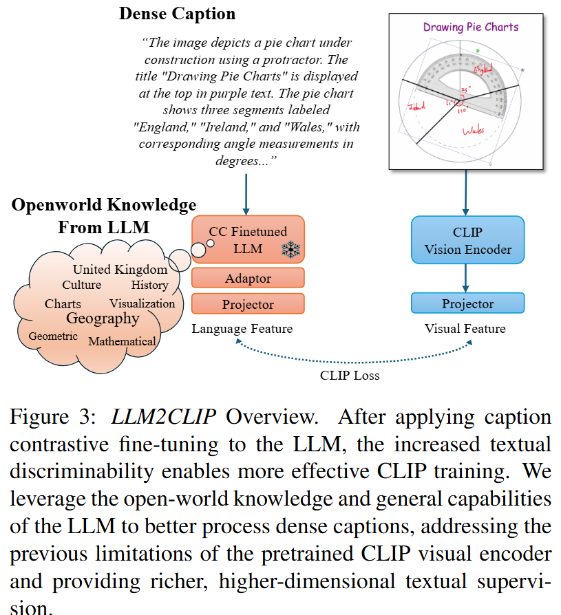
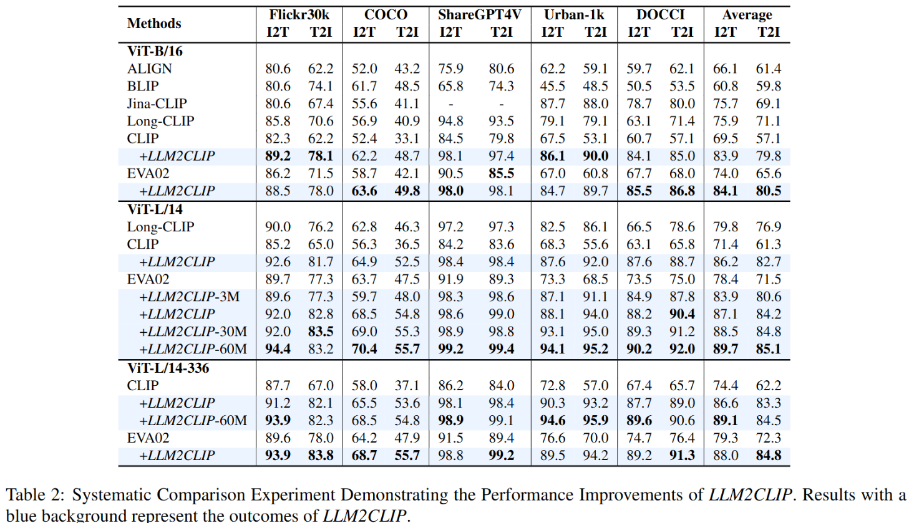
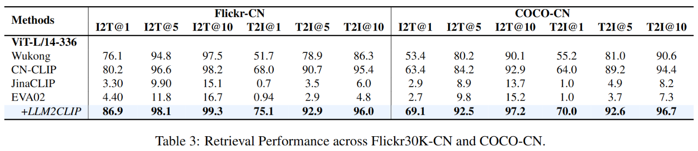
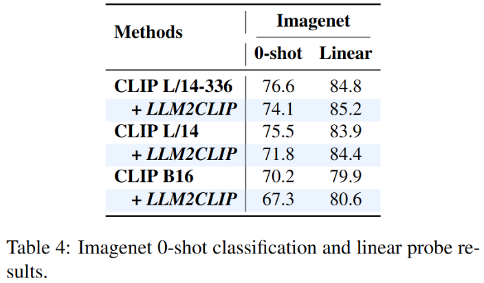
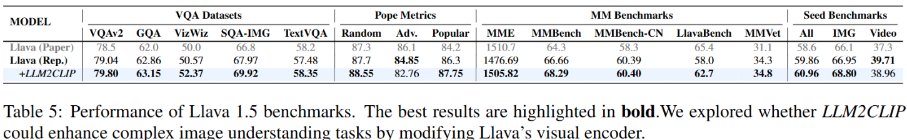
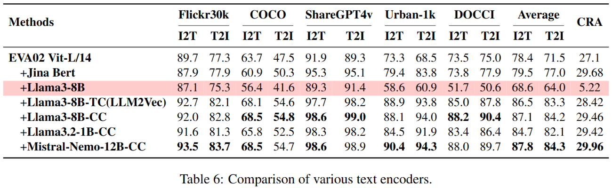
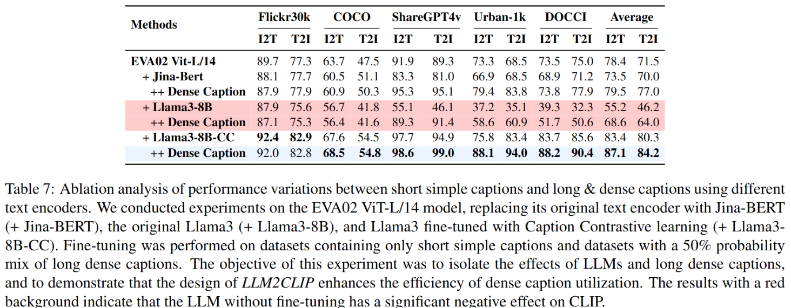
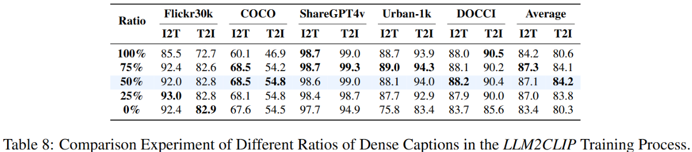
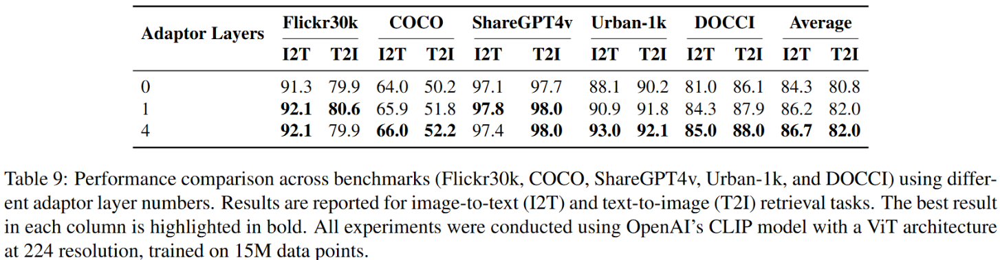
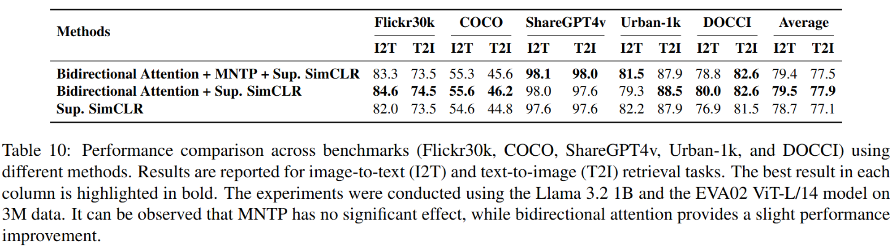

#多模态 #大模型 

# LLM2CLIP: Powerful Language Model Unlocks Richer Visual Representation
- 论文：<https://arxiv.org/abs/2411.04997v3>

## 引言

LLM 在 InternVL 中被引入到 CLIP 中，但是这种方法需要大规模重新训练。另外 **LLM 对不同文本的输出特征区分度不高**，直接用于 CLIP 会失败。

为此，本文设计了一种标题收缩 (Caption Contractive, CC) 微调策略。即使用 CC-3M 图像标题数据集，然后使用 LoRA 的方式对 ` Llama-3 8B ` 进行微调，损失使用 supervised SimCSE，使用原始标题和 ShareCaptioner 模型生成的标题作为正样本对，其他样本作为负样本，使正样本对尽量靠近，负样本和正样本远离。这样微调之后，` Llama-3 8B ` 的标题检索能力大幅提升。

基于以上实验。我们设计了 `LLM2CLIP`，其训练包括两个阶段：

- 先使用一个小型数据集对 LLM 进行 CC 微调，调整 LLM 的输出空间。
- 然后冻结 LLM，使用 LLM-CC 对 CLIP 的视觉编码器进行微调。
最终实验表面，仅使用 15 M 的数据训练也能显著提高 CLIP 的能力。

## 相关工作
1. LLM 的特征空间可分性很差。
2. CLIP 的文字嵌入很拉，只有 77 个 token。处理长文本的方法有将长标题总结为短标题，将标题分段和微调位置编码，但是这些都使权宜之计。

## 方法

训练主要两个阶段，第一阶段旨在提高 LLM 输出空间的可分性，第二阶段使用 LLM 作为 CLIP 文本编码来享受 LLM 的能力强大。

### Caption Contrastive Fine-tuning

具体实施时，本文遵循了 `LLM2Vec` 的训练方法，将 LLM 的注意力先扩展为双向注意力，应用 Masked Next Token Prediction（MNTP）来进行初始化。

MNTP 的实施方法是依据 LLM 特性，遮蔽后 M 个 token，然后预测遮蔽前一个 token。除开使用 CC-3M, 还用了 Wikitext-103 数据集来保持 LLM 的能力。

最后标题对比学习，使用 SimSCE 损失，将同一张图片标题拉近，不同图片标题推远。我们使用了两种 prompt："Given a caption, retrieve a detailed relevant caption" 和 "Given a detailed caption, retireve a short relevant caption"。我们将 prompt 添加到待查询标题之前，使之答案是对应的详细或者原始标题。我们还是用了 1.5 M 的通用文本来保持 LLM 在纯语言任务中的性能。

以上所有训练都是使用 LoRA 训练一个 epoch。我们发现使用标题对比学习对提升 LLM 的描述符可区分性影响最大。

### Use LLM to Finetuning

在微调阶段，我们冻住了 LLM，这样既可以节省算力（CLIP 训练时需要非常大的批量来保持负样本的有效性），也可以保持 LLM 所拥有的开放式世界知识。

为了补偿冻结的 LLM，加强 LLM 和 CLIP 的对齐，我们借鉴 FuseMix 和 APE，添加了一些新的线性层作为可学习参数作为适配器，同时还用了一个投影层来对齐视觉和文本编码器的维度。

### 效率讨论和概述

我们实验使用了 1 B 和 8 B 的 Llama 以及 12 B 的 Mistral-Nemo。由于仅使用了 LoRA 训练一个 epoch，因此我们的训练开销和微调原始 CLIP 差不多。

以下是一些细节：

1. LLM 对比微调阶段，12 B 的 LLM，使用 batchsize 为 512 训练仅需要 70 GB 显存。
2. LLM 2 CLIP 阶段，我们冻结了 LLM，仅训练适配器和视觉编码器以及两个投影器。额外可训练参数和原始 CLIP 中参数差不多。
3. 由于 LLM 是冻住的，为了进一步省算力，我们提前将训练数据的文本特征进行了提取并存储到磁盘内存中。
我们使用 Mistral-Nemo-12 B 与常用 EVA ViT-L/14-224 结合训练 LLM 2 CLIP，使用了 8 块 H 100，batchsize 为 4096，每个 GPU 显存仅使用了 30 GB，整个过程仅需 9 小时。

## 实验细节

**对比学习阶段**
所有训练参数遵循 LLM 2 Vec，适配器设计参照 FuseMix 使用了 inverted bottleneck MLP 架构。

**LLM 2 CLIP 微调阶段**
我们使用了三种实验数据集大小：
1. LLM 2 CLIP-3 M：仅使用 CC-3 M 数据集，轻量级设置。
2. LLM 2 CLIP-1 5 M: 结合 CC-3 M 和 CC-12 M，这是默认配置。
3. LLM 2 CLIP-60 M：使用了 CC-3 M，CC-12 M，YFCC-15 M 和从 Recaption-1 B 中随机选择的 30 M 子集。
所有数据集都使用了 MLLM 来重写长描述。CC-3 M，CC-12 M 和 YFCC 使用了 ShareCaptioner 重写，Recaption 数据使用 Llama-LLAVA 1.5 重写。默认情况下训练原始描述和重写的长描述各占一半。
以上每种配置训练 4 个 epoch，LLM 后添加了一个四层线性适配器，视觉和 LLM 之后都映入了两个投影层来对齐维度。
训练 CLIP ViT-L/14-224 在 8 xH 100 上，每块 GPU 使用约 30 G 显存，在 3 M，15 M 和 60 M 数据集上各训练了 2，9 和 45 小时。我们使用了 AdamW 优化器，batchsize 4096，学习率 `1e-5`, 余弦衰减为 0.05.
语言模型，我们测试了 Jina-Embeddings-V 2, Llama 3.2 1 B, Llama 3 8 B, Mistral-Nemo 12 B.视觉编码器使用 EVA 02 ViT-L/14, 使用 Llama 3 8 B 作为默认语言模型.
## 结果分析

### 短文本和长文本检索

短文本检索, 我们使用了 MSCOCO-5 K 测试集和 Flickr-1 K 测试集. 长文本检索, 我们使用了 LongCLIP 数据集, 包括 ShareGPT 4 V -1 K 子集, Urban 1 K 和 DOCCI 数据集.

ShareGPT4V-1M 数据集包含使用 GPT-4V 和 ShareCaptioner 生成的图像描述，覆盖来自 LAION、CC、SBU 和 MS COCO 的图像。Urban1K 包括 1,000 个城市场景图像的描述，每个图像都详细标注了丰富的描述信息。DOCCI 包含 1,500 张高分辨率图像，并附有人工标注的描述，用于检索评估。

### 跨语言检索

中文检索我们使用了 Flickr-CN 和 COCO-CN, 它们分别是 Flickr 30 K 和 MS COCO-1 K 的翻译版本.

这里 CLIP 的视觉编码器仅在英文文本上进行了训练.

### 零样本 ImageNet 分类

线性探针微调参数: batchsize 1024, 学习率 0.1, 动量 0.9, 权重衰减 0, 使用 SGD 训练 50 epoch.

相比线性探针, 零样本分类表现下降. 推测是数据对齐不足, 导致某些类别种单词频率很低, 另外 LLM 在区分短描述方面能力有限.

### 多模态

遵从 LLAVA 1.5, 我们使用 OpenAI CLIP-ViT-L-336 作为视觉编码器, 通过一个 MLP 头将其连接到 Vicuna-7 B.预训练使用了 558 K 的图片文本对和 665 K 的视觉指令样本. 然后我们使用 LLM 2 CLIP 对 LLAVA 1.5 编码器进行微调评估.

### 结论
- 直接使用普通 LLM 替换 CLIP 的文本编码器不行, 如表 6, 表 7.
- 提高 LLM 输出特征的可区分性是将 LLM 与 CLIP 集成的关键.
- LLM 内置知识有益于 CLIP.
- LLM 提高了 CLIP 处理长描述的能力.
- 更大 LLM 可以得到更好的性能.

### 消融实验

密集文本占训练数据 50%~75% 性能最佳, 100% 性能不佳可能是因为通过 ShareCaptioner 生成的描述存在噪声和分布差异.

更大训练数据集总能带来积极的影响.

添加适配器是有益的, 四层适配器带来收益有限, 如表 9.

一阶段对比微调, MNTP 几乎没啥用, 双向注意力能有积极作用, 主要作用还是应用 SimCSE 进行对比学习.

## 局限和未来工作

LLM 虽然拥有开放世界知识, 但是在 CLIP 种充分释放潜力可能需要特定数据.