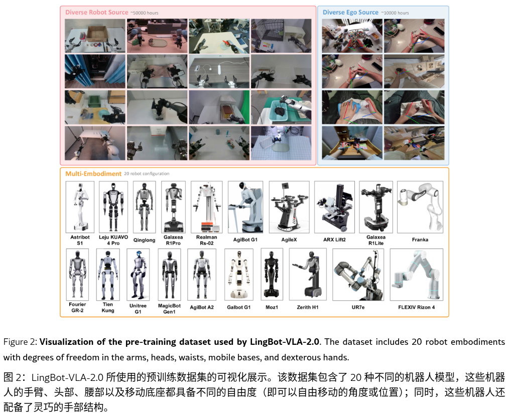

#具身智能 #VLA 

# From Foundation to Application: Improving VLA Models in Practice
- 论文： <https://arxiv.org/html/2607.06403v1>
- 代码： <https://github.com/robbyant/lingbot-vla-v2>

# 关键信息

## 数据

5 w 真机（20 种机器人）+1 w 人 ego 数据，真机搜集了 9 w，保留 5 w。Ego 搜集 2 w，保留 1 w

## 数据清洗方式
### 真机

计算 action 和 status 的三阶有限差分值（third-order finite difference jerk）,速度（一阶导数）和加速度（二阶导数），评估平滑度，超过阈值的丢弃。

不动的时间段超过 95%，也丢弃。

### Ego 数据

VLM （Qwen 3.6-27 B）视频去掉非第一人称的，去除非操作者手部出现的。

有轨迹标签的做标准化对齐，没有的用第一人称 SLAM 估计相机内外参。应用手部姿态估计来恢复相机坐标系下的 MANO 参数，然后转换到世界坐标系。

去除手部姿态小于 20% 帧数的轨迹，去除轨迹不稳定的等等。

**存储的时候轨迹为世界坐标系下，训练时为采样帧 t 相机坐标系下。**

## 跨平台动作表示

位姿用四元数。总共 55 维，7 臂关节\*2+7 eef \*2 +1 gripper \*2+ 手 joint 6\*2+ 腰 4+ 头 2+ 底盘 3+4 保留
