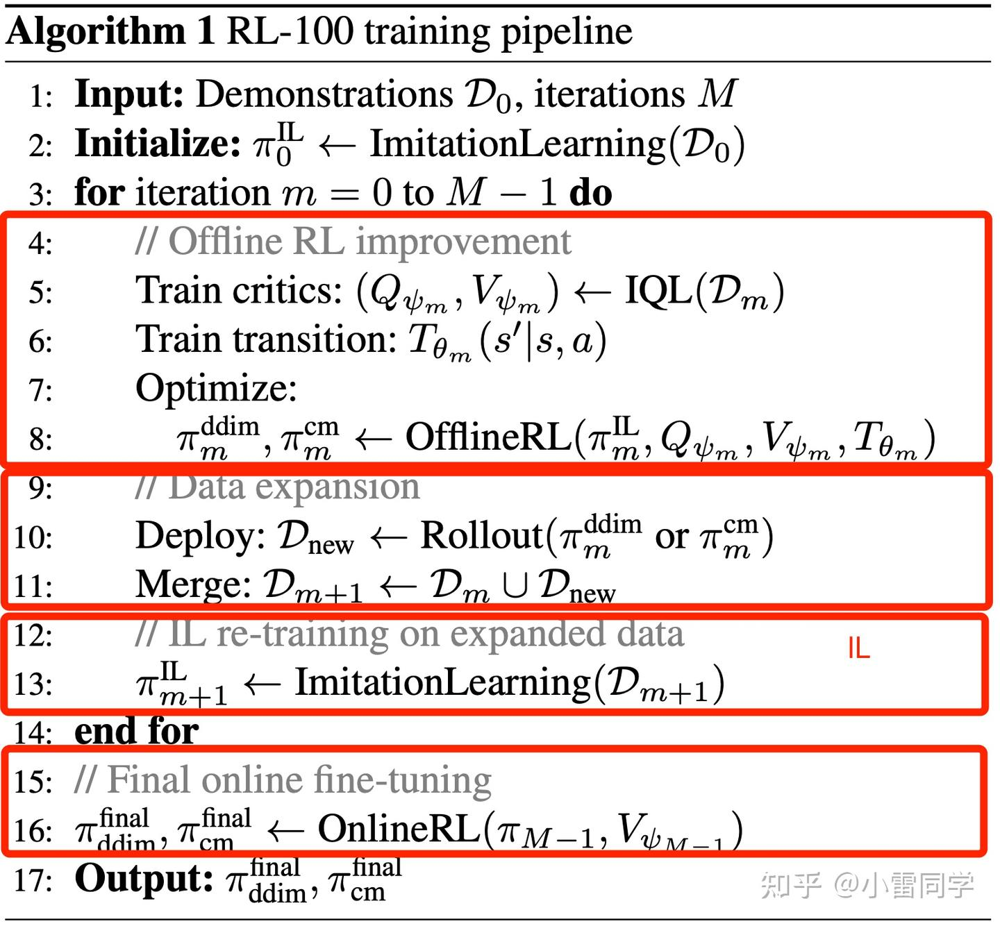

# RL-100: Performant Robotic Manipulation with Real-World Reinforcement Learning
- 论文：<https://arxiv.org/abs/2510.14830v3>
- 项目：[RL-100](https://lei-kun.github.io/RL-100/)
- 视频：[【RLChina论文研讨会】第142期 雷坤 RL-100: Performant Robotic Manipulation with Real-World R_哔哩哔哩_bilibili](https://www.bilibili.com/video/BV1UurLBoEJK/?vd_source=c6acf7e2d08361599bddd176f227d590)
- Alphaxiv：[RL-100: Performant Robotic Manipulation with Real-World Reinforcement Learning | alphaXiv](https://www.alphaxiv.org/overview/2510.14830)
- 靠谱解析：
	- [RL-100——基于真实世界RL的高性能灵巧操作：先基于人类演示做模仿学习预训练，再做迭代式离线RL，最后真机在线RL_rl100论文-CSDN博客](https://blog.csdn.net/v_JULY_v/article/details/158211856?spm=1001.2014.3001.5502)
	- [(16 封私信) 超越人类水平的机器人时代即将来临 - 知乎](https://zhuanlan.zhihu.com/p/1961019618517836122)

## 算法流程

5 的训练参见 [IQL](../../DL_knowlege/RL概念/IQL.md)

6 的训练参见 [环境动力学模型 (Transition Model, $\hat{T}$ ) 训练方法](#环境动力学模型%20(Transition%20Model,%20$%20hat{T}$%20)%20训练方法)

8 和 13 都是 PPO，只不过 8 中优势函数使用 IQL 计算出来的 Q 和 V，13 中的优势函数是 GAE，另外 8 中更新还需使用 AM-Q 来进行门控，只有策略真的有效的时候才真的更新策略

# 阶段

RL-100 包含三个阶段，各自承担不同的角色与代价：

模仿学习（IL）预训练阶段：基于遥操作演示进行训练，提供一个低方差、性能稳定的基础，就像蛋糕的海绵层，为后续学习打下基础。

迭代离线强化学习后训练阶段：在不断扩充的策略交互数据缓冲上进行离线更新，带来主要的性能提升（成功率与效率），相当于添加奶油层。

在线强化学习后训练阶段：针对离线学习后仍残留的罕见失败模式，进行“最后一公里”优化，是“点缀在顶上的樱桃”。然而，这一阶段对真实硬件的资源需求高（需调参、重置与人工批准），因此我们将大部分学习预算分配给离线迭代阶段，仅保留少量、针对性的在线训练，用以将成功率从高水平（如 95%）推向接近完美（如 99%+）。

# 补充
## AM-Q 算法

这一部分是 Uni-O4 算法的核心创新点之一。**AM-Q (Approximate Model and fitted Q evaluation)** 是一种**离线策略评估 (OPE)** 方法。

在 Uni-O4 中，它的主要作用是充当“裁判员”或“安全阀”。当策略在纯离线环境下通过 PPO 进行多步更新时，AM-Q 用来判断当前的策略更新是否真的比上一个版本的策略更好。如果评估结果显示有提升，才允许更新参考策略（Behavior Policy），从而实现安全的多步策略改进。

以下是 AM-Q 的详细技术解析：

### 1. AM-Q 的核心逻辑与定义

AM-Q 的核心思想是结合**学习到的环境模型（Approximate Model, AM）**和**离线训练的 Q 函数（Fitted Q, Q）**来估算一个策略 $\pi$ 的期望回报。

其计算公式（目标函数）为：

$$ \hat{J}_{\tau}(\pi) = \mathbb{E}_{(s,a)\sim(\hat{T},\pi)} \left[ \sum_{t=0}^{H-1} \hat{Q}_{\tau}(s_t, a_t) \right] $$

*   **含义**：在学习到的虚拟环境模型 $\hat{T}$ 中，使用策略 $\pi$ 进行 $H$ 步的推演（Rollout），并将路径上所有状态 - 动作对的 Q 值进行累加，作为该策略的性能评分。

### 2. 输入与输出
*   **输入**：
    *   **当前待评估的策略 (Target Policy, $\pi$)**：即刚刚通过 PPO 更新过的策略网络。
    *   **初始状态 ($s_0$)**：从离线数据集 $\mathcal{D}$ 中采样的起始状态。
    *   **预训练组件**：环境动力学模型 $\hat{T}$ 和 价值函数 $\hat{Q}_{\tau}$。
*   **输出**：
    *   **标量评分 ($\hat{J}_{\tau}(\pi)$)**：代表该策略在当前模型下的预估性能值。

### 3. 核心模块与预训练（监督学习阶段）

在进行 AM-Q 评估之前，Uni-O4 首先在一个“监督学习阶段”训练好 AM-Q 所需的两个核心组件。这两个组件在后续的离线策略优化过程中保持**冻结（Fixed）**，不参与更新。

#### 模块一：环境动力学模型 (Transition Model, $\hat{T}$)
*   **功能**：模拟环境。给定当前状态和动作，预测下一个状态。
*   **输入**：$(s_t, a_t)$
*   **输出**：$s_{t+1}$
*   **损失函数/学习目标**：通常使用监督学习（MSE Loss）在离线数据集 $\mathcal{D}$ 上训练。

    $$ \mathcal{L}_{model} = \mathbb{E}_{(s,a,s') \sim \mathcal{D}} || \hat{T}(s, a) - s' ||^2 $$

#### 模块二：价值函数 (Fitted Q-function, $\hat{Q}_{\tau}$)
*   **功能**：评估动作的好坏。它必须在离线数据的支持集（Support）内是准确的。
*   **输入**：$(s, a)$
*   **输出**：$Q(s, a)$ 值
*   **损失函数/学习目标**：
    论文中提到使用类似 IQL (Implicit Q-Learning) 的方式训练，利用 expectile regression 来学习值函数，以确保在数据集分布内的估计是保守且稳健的。具体的损失函数基于以下形式（基于论文公式 3）：

    $$ L_Q(\theta) = \mathbb{E}_{(s,a,s')\sim \mathcal{D}} [L_2^\tau(Q_\theta(s,a) - (r + \gamma V(s')))] $$

    其中 $L_2^\tau$ 是 expectile loss。这确保了 Q 值不会像传统的 Bellman 更新那样在未见过的动作上发生严重的过估计（Overestimation）。

### 4. AM-Q 的具体执行流程（算法细节）

当进入**离线多步优化阶段（Offline Multi-Step Optimization）**时，AM-Q 按以下步骤执行：

1.  **策略更新（PPO Update）**：
    Agent 首先基于当前的参考策略（Behavior Policy $\pi_k$）进行若干步的 PPO 梯度更新，得到一个新的候选策略 $\pi$。
2.  **触发评估（Checkpoint）**：
    每经过 $C$ 次迭代（例如每几十步），触发一次 AM-Q 评估。
3.  **虚拟推演（Rollout in Model）**：
    * 从数据集 $\mathcal{D}$ 中采样一批初始状态 $s_0$。
    * 使用候选策略 $\pi$ 和冻结的环境模型 $\hat{T}$ 进行 $H$ 步的推演：
        *   $a_0 \sim \pi(\cdot|s_0)$
        *   $s_1 = \hat{T}(s_0, a_0)$
        *   $a_1 \sim \pi(\cdot|s_1)$
        *   … 直到 $s_{H-1}$。

4.  **计算累计价值（Summation）**：
    对这条虚拟轨迹上的所有 $(s_t, a_t)$ 代入冻结的 Q 网络 $\hat{Q}_{\tau}$ 计算价值并求和：

    $$ \text{Score} = \sum_{t=0}^{H-1} \hat{Q}_{\tau}(s_t, a_t) $$

    对所有采样的轨迹求平均，得到 $\hat{J}_{\tau}(\pi)$。

5.  **比较与决策（Comparison & Replacement）**：
    * 计算旧的参考策略 $\pi_k$ 的分数 $\hat{J}_{\tau}(\pi_k)$。
    *   **判断准则**：

        $$ \text{If } \hat{J}_{\tau}(\pi) > \hat{J}_{\tau}(\pi_k) $$

    *   **结果**：
        * 如果条件满足（新策略更好）：更新参考策略 $\pi_k \leftarrow \pi$，这意味着我们“安全地”迈出了一大步，基准线提高了。
        * 如果条件不满足：保留 $\pi_k$ 不变，策略 $\pi$ 继续基于旧的 $\pi_k$ 优化或回滚。

### 5. 总结：AM-Q 解决了什么问题？

在传统的离线 RL 中，由于无法与环境交互，很难知道策略更新后是变好了还是变坏了（OOD 问题）。

*   **BPPO 算法**需要在线（Online）评估来决定是否更新策略，这违反了纯离线（Offline）的设定。
*   **Uni-O4 的 AM-Q** 用“学习到的模型”替代了“真实环境”，用“学习到的 Q 值”替代了“真实奖励回报”。

它构建了一个**全离线的仿真验证环境**，使得算法可以像在线学习一样进行多步迭代（Multi-step improvement），同时利用 Q 值函数的泛化能力和模型的预测能力来保证更新的单调性和安全性。

## 环境动力学模型 (Transition Model, $\hat{T}$ ) 训练方法

根据 Uni-O4 论文的描述，环境动力学模型 $\hat{T}$ 是通过**监督学习（Supervised Learning）** 在离线数据集上训练得到的。

它的训练过程非常简单直接，并没有使用复杂的概率集成模型（Probabilistic Ensembles，如 MOPO 或 MBPO 中常用的做法），而是追求高效和确定性。

以下是具体的训练细节：

### 1. 训练目标与损失函数

模型 $\hat{T}$ 的目标是最小化**预测的下一个状态**与**真实的下一个状态**之间的均方误差（Mean Squared Error, MSE）。

具体的损失函数（论文中的 **公式 5**）为：

$$ \mathcal{L}(\phi) = \mathbb{E}_{(s,a,s') \sim \mathcal{D}} \left[ \| \hat{T}_{\phi}(s, a) - s' \|_2^2 \right] $$

*   **$\mathcal{D}$**: 固定的离线数据集。
*   **$(s, a, s')$**: 从数据集中采样得到的三元组（当前状态，当前动作，真实下一状态）。
*   **$\hat{T}_{\phi}$**: 由参数 $\phi$ 参数化的神经网络模型（通常是一个多层感知机 MLP）。
*   **$\|\cdot\|_2^2$**: L2 范数（即欧几里得距离的平方）。

### 2. 输入与输出
*   **输入**: 当前状态 $s$ 和 当前动作 $a$。
*   **输出**: 预测的下一个状态 $\hat{s}'$（或者预测状态的变化量 $\Delta s$，即 $\hat{s}' = s + \Delta s$，这在动力学建模中是常见做法，以增加数值稳定性）。

### 3. 训练阶段

这一步发生在**监督学习阶段（Supervised Learning Stage）**，也就是在真正的策略优化（Policy Optimization）开始之前。

*   **Pre-training**: 模型 $\hat{T}$ 在第一阶段就训练至收敛。
*   **Frozen**: 在后续的 AM-Q 评估和 PPO 更新过程中，这个模型参数 $\phi$ 是**冻结（Fixed）**的，不再更新。

### 4. 为什么这么简单？（与 MOPO 等方法的区别）

很多基于模型的离线强化学习（Model-based Offline RL，如 MOPO）会训练一组概率模型（Ensemble of Probabilistic Models）来估计模型的不确定性（Uncertainty），并用这个不确定性来惩罚奖励，防止策略进入模型未知的区域。

**Uni-O4 没有这样做**，它的设计哲学不同：

1.  **分工明确**: 它把“保守性（Conservatism）”和“OOD（Out-of-Distribution）处理”交给了 **价值函数 $\hat{Q}_{\tau}$**（通过 expectile regression 训练得到的 IQL 风格的 Q 值）。
2.  **模型仅用于推演**: 动力学模型 $\hat{T}$ 只需要负责尽可能准确地预测状态转移。如果模型预测到了一个离群状态，保守的 Q 函数自然会给出一个低分，从而阻止策略选择这条路径。

因此，Uni-O4 可以使用这种计算成本最低的**确定性 MSE 回归**来训练环境模型。

## 本文 offlineRL 和 onlineRL 区别

是的，你的理解非常准确。论文的核心贡献之一就是使用了一个统一的 **PPO-style 目标函数** 来贯穿整个 Offline-to-Online 的训练流程。 

这两种阶段在策略更新的基础公式上完全一致，最核心的差异确实在于**优势函数（Advantage Function）的计算方式**： <alphaxiv-paper-citation paper="2510.14830" title="Advantage Distinction" page="4" first="The key distinction" last="in advantage estimation:" />

1. **Offline RL 阶段**：优势函数 $A^{off} = Q(s, a) - V(s)$。这里的 $Q$ 和 $V$ 是提前在离线数据集上通过 IQL（Implicit Q-Learning）算法预训练出来的。由于无法与环境交互，只能依赖静态数据集来估计动作的相对价值。
2. **Online RL 阶段**：优势函数使用的是原版 PPO 中的 **GAE（Generalized Advantage Estimation）**。因为此时机器人可以直接与环境交互，所以可以通过真实的奖励信号（Rewards）结合当前拟合的价值函数 $V$ 来计算广义优势，从而在方差和偏差之间取得平衡。 <alphaxiv-paper-citation paper="2510.14830" title="Online GAE" page="7" first="and compute advantages" last="balance variance and bias." />

不过，除了优势函数的计算差异外，为了适应扩散模型和离线学习的特性，这个算法框架在细节上相比“原版 PPO”还有两个重要的特殊设计：

*   **Offline RL 独有的“OPE 门控机制”**：单纯在离线数据上跑 PPO 容易因为分布偏移（Distribution Shift）导致策略崩溃。因此，作者在 Offline RL 阶段加了一个**离线策略评估（OPE）**。每次用 PPO 算出更新后的候选策略后，必须用 AM-Q 转移模型对其进行评估，只有评估得分确实高于当前策略时，才会“接受”这次 PPO 更新。 <alphaxiv-paper-citation paper="2510.14830" title="OPE Gating" page="7" first="We accept the" last="iteration only if" />
*   **作用于扩散去噪步的 PPO 目标**：在传统的 PPO 中，策略输出一次动作就计算一次重要性采样比例（Importance Ratio）。但在这里，因为策略是一个需要多步去噪（K steps）的扩散模型，所以论文将 PPO 的目标函数**累加在了 $K$ 个去噪步骤上**。环境反馈的同一个优势函数 $A_t$ 会被共享，用于指导这 $K$ 步里的每一次去噪更新。这个特性在 Offline 和 Online 阶段都是适用的。 

## 本文扩散去噪中，将 PPO 累加到 K 个去噪步骤如何理解？

就是类似 DPPO 的思路？

这是一个非常好的问题。因为扩散模型（Diffusion Model）的生成过程比较特殊，直接套用 PPO 会遇到“怎么定义动作概率”的问题。

我们可以通过一个 **“画画”的比喻**来直观理解这个过程，不需要深究复杂的数学公式。

### 1. 直观比喻：一次成画 vs. 多笔润色

*   **传统的策略（Standard Policy）**：
    就像一个画家，看了一眼题目（状态 $s$），然后**“啪”地一下**直接把整幅画（动作 $a$）印在纸上。
    *   **PPO 怎么做？** 评委看这幅画好不好（优势 $A_t$），如果好，就鼓励画家下次还这么“印”。

*   **扩散策略（Diffusion Policy）**：
    画家不是一次画完的。他先拿出一张全是噪点的纸，然后分 **$K$ 步（比如 100 步）**，每一步都擦掉一点噪点、加上一点细节。经过 $K$ 次修改后，才变成最后的画（动作 $a$）。
    *   **问题来了**：评委只能看到最后那幅画好不好，但画家其实做了 $K$ 个微小的决定。我们该怎么奖励这 $K$ 个步骤呢？

### 2. 论文的具体做法（累加 K 步目标）

论文的核心思想是：**既然最终结果好，那导致这个结果的每一步“微操作”都值得被奖励。**

具体做法可以拆解为以下三步：

#### 第一步：把“生成动作”看作 $K$ 个小决策

在扩散模型中，从完全噪声 $x_K$ 到最终动作 $x_0$ 的过程，被看作是一个微型的马尔可夫决策过程（MDP）。

* 第 $k$ 步的“动作”不是输出最终的机械臂指令，而是**“如何从当前的噪声 $x_k$ 去除一点噪声变成 $x_{k-1}$”**。
* 策略网络 $\pi_\theta(x_{k-1} | x_k, s)$ 就是在做这个小决策。

#### 第二步：共享优势函数 $A_t$

环境只会在机器人执行完最终动作 $x_0$ 后，给出一个反馈（比如“成功抓取”）。这个反馈计算出的优势值 $A_t$ 代表了“这个最终动作有多好”。

论文做了一个关键假设：**如果最终动作 $x_0$ 是好的（$A_t > 0$），那么产出它的这 $K$ 个去噪步骤都应该被认为是好的。**

所以，这 $K$ 个小步骤共享同一个优势值 $A_t$。 <alphaxiv-paper-citation paper="2510.14830" title="Shared Advantage" page="7" first="share the same" last="all K denoising" />

#### 第三步：PPO 损失函数的累加

在传统的 PPO 中，我们最大化“概率比率 $\times$ 优势”。在这里，作者把这个公式应用到了每一步去噪上，然后**加起来**。

数学形式简写如下（对应论文公式 18）：

$$
J(\pi) = \mathbb{E} \left[ \sum_{k=1}^{K} \text{PPO\_Objective} \left( \frac{\pi_{new}(x_{k-1}|x_k)}{\pi_{old}(x_{k-1}|x_k)}, \ A_t \right) \right]
$$

这意味着：

1.  算出第 1 步去噪的概率比率 $r_1$，计算 $L_1 = \min(r_1 A_t, \text{clip}(r_1) A_t)$。
2.  算出第 2 步去噪的概率比率 $r_2$，计算 $L_2 = \min(r_2 A_t, \text{clip}(r_2) A_t)$。
3.  …
4.  算出第 $K$ 步去噪的概率比率 $r_K$，计算 $L_K = \min(r_K A_t, \text{clip}(r_K) A_t)$。
5.  **总损失 = $L_1 + L_2 + \dots + L_K$。** <alphaxiv-paper-citation paper="2510.14830" title="Summation Objective" page="7" first="summation across all" last="denoising steps k:" />

### 3. 为什么要这样做？

这种做法有两个巨大的好处：

1.  **信号更密集（Dense Signals）**：
    如果我们只看最终动作的概率 $P(x_0|s)$，数学上它是一个非常复杂的积分，很难直接优化。但如果我们把它拆解成 $K$ 个小概率的乘积，并对每个小概率分别进行优化，梯度传播会更加直接和稳定。 <alphaxiv-paper-citation paper="2510.14830" title="Dense Signals" page="7" first="providing dense learning" last="denoising process" />
2.  **结构统一**：
    这使得扩散模型的每一步更新都像是在做一个标准的 RL 动作选择，从而可以无缝套用 PPO 的 Clipping（截断）机制来保证训练稳定性，防止某一步去噪发生剧烈突变导致整个生成过程崩溃。

**总结：**

并不是只在最后算一次账，而是拿着最终的评分表（$A_t$），去逐一检查并奖励这 $K$ 步里的每一个去噪操作。如果结果好，每一步的去噪方向都会被加强。
