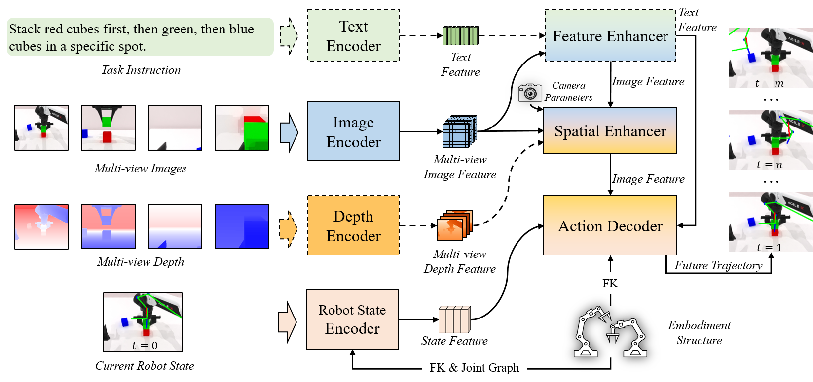
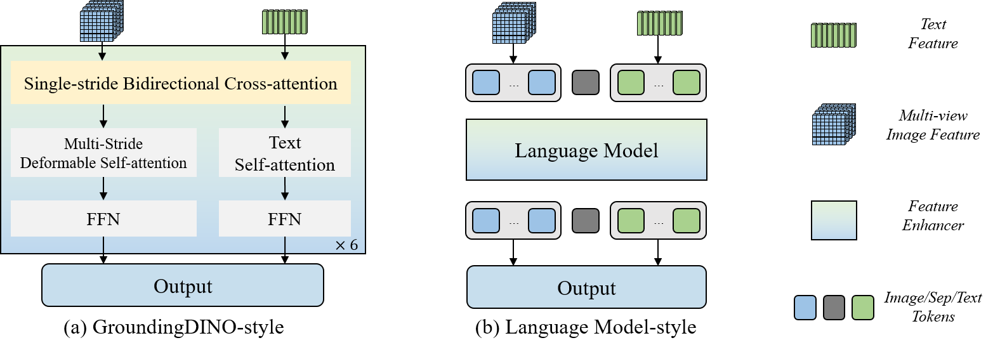
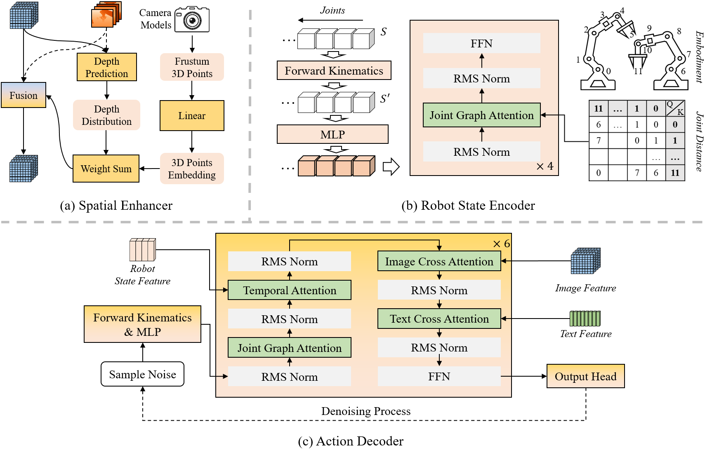

#VLA

# SEM: Enhancing Spatial Understanding for Robust Robot Manipulation
- 论文：< <https://arxiv.org/html/2505.16196v2>
- 代码：<https://github.com/HorizonRobotics/RoboOrchardLab/tree/master/projects/sem/robotwin>



> 图 1. SEM 的整体架构，其中虚线表示即插即用组件。SEM 将图像、深度、当前机器人状态和指令作为输入，并对未来的关节位置进行端到端预测。SEM 可以充分利用相机和本体参数来提升模型性能和泛化能力。



>  图 2. Feature enhancer 的两种架构



> 图 3 空间增强器、机器人状态编码器和动作解码器的网络结构。

## Spatial Enhancer

依据代码配置：

- 图像输入尺寸：`320×256`
- 使用 3 个尺度：stride `8/16/32`
- 图像特征维度 `C=256`
- 深度特征维度 `C_d=32`
- 离散深度候选数 `D=128`，范围 `0.01–1.2 m`
- 启用原始深度特征融合与深度监督，见 [config_sem_robotwin.py](tauri://localhost/data/workspaces/RoboOrchardLab/projects/sem/robotwin/config_sem_robotwin.py:305)。

## 输入与输出

训练时空间增强器的主要输入为：

- `feature_maps`：RGB backbone + neck 输出的多尺度图像特征，形状可理解为  
  `B × V × 256 × H_l × W_l`。
- `feature_3d`：深度图经过独立的 ResNet-34 + neck 得到的多尺度深度特征，形状为  
  `B × V × 32 × H_l × W_l`。
- `image_wh`：输入图像宽高。
- `projection_mat`：每个相机从目标坐标系到像素齐次坐标的 `4×4` 投影矩阵。
- 训练时额外有 `depth_prob_gt`，作为离散深度分布监督。

这里目标坐标系被明确设为机器人 `base` 坐标系，投影矩阵为：

$$
P = K \cdot T_{\text{world}\rightarrow\text{cam}} \cdot T_{\text{base}\rightarrow\text{world}}
$$

见 [config_sem_robotwin.py](/data/workspaces/RoboOrchardLab/projects/sem/robotwin/config_sem_robotwin.py:489) 和 `GetProjectionMat` 的配置行 [config_sem_robotwin.py](/data/workspaces/RoboOrchardLab/projects/sem/robotwin/config_sem_robotwin.py:506)。

输出是：

- 增强后的多尺度图像特征，尺寸与输入 `feature_maps` 相同，即每层仍是 `B × V × 256 × H_l × W_l`；
- `depth_prob`：每个特征位置对应的 `128` 维离散深度概率；
- 训练时可选的 `loss_depth`。

在 ONNX 推理路径中，多尺度特征先展平并拼接为 `B × V × N × C`，其中

$$
N=\sum_l H_lW_l
$$

对于 `320×256` 和三个 stride，通常是 `40×32 + 20×16 + 10×8 = 1680` 个位置/相机。

## 计算过程

### 1. 为每个 feature token 生成像素坐标与深度假设

代码对每个特征尺度生成规则像素网格。注意：这里坐标使用的是原图坐标系中的网格位置，而不是特征图上的 `(i,j)` 索引，ONNX 路径见 [misc.py](/data/workspaces/RoboOrchardLab/projects/sem/robotwin/onnx_scripts/misc.py:52)。解析参见 1 

随后对每一个像素位置 `(u,v)` 采样 128 个均匀分布的候选深度：

$$
d_k \in [0.01, 1.2],\quad k=1,\ldots,128
$$

构造相机投影空间中的齐次点：

$$
\tilde p_{k}=(u d_k,\ v d_k,\ d_k,\ 1)
$$

代码即 [export_onnx.py](/data/workspaces/RoboOrchardLab/projects/sem/robotwin/onnx_scripts/export_onnx.py:202) 中的：

```python
pts = pixels * depths
pts = torch.cat([pts, depths, torch.ones_like(depths)], dim=-1)
```

这正是由像素射线和候选深度恢复 3D 点的常见写法。

### 2. 通过相机模型反投影到机器人 base 坐标系

对每个相机，代码用投影矩阵逆矩阵把上述点变换回 3D：

$$
X_{v,n,k}=P_v^{-1}\tilde p_{n,k}
$$

最终保留三维坐标 `(x,y,z)`。ONNX 中预先计算 `projection_mat_inv`，然后矩阵相乘，见 [export_onnx.py](/data/workspaces/RoboOrchardLab/projects/sem/robotwin/onnx_scripts/export_onnx.py:212)。

关键点是：每个相机自己的图像 token 都被映射到同一个机器人 base 坐标系。因此即使来自不同视角，坐标编码也具有可比较的几何语义。

### 3. 预测该 token 的离散深度分布

这里不要把“采样的深度候选”与输入深度图混为一谈：

- 候选深度 `d_k`：固定的 128 个几何假设；
- 输入深度图：经深度 backbone 变成 `feature_3d`，用于帮助判断哪一个候选深度更可信。

当前 `with_depth=True` 时，深度分布的预测为：

$$
h_d = W_{\text{pre}}f_{2d}
$$

$$
q = \operatorname{Softmax}(
\operatorname{MLP}([h_d; f_{3d}]))
$$

其中：

- `f_2d ∈ R^{256}`；
- `W_pre` 将其压到 `32` 维；
- 与 `f_3d ∈ R^{32}` 拼接为 `64` 维；
- 两层 MLP 输出 `128` 个 logits；
- Softmax 得到 `q ∈ R^{128}`。

对应代码在 [export_onnx.py](/data/workspaces/RoboOrchardLab/projects/sem/robotwin/onnx_scripts/export_onnx.py:185)。

所以，深度特征不是直接拿来作为坐标，而是用于推断“此图像特征最可能位于哪一个深度 bin”。

### 4. 将所有候选 3D 坐标编码并按深度概率求期望

每个候选 3D 点通过线性层编码：

$$
e_{n,k}=W_{\text{pts}}X_{n,k}+b,\quad e_{n,k}\in R^{32}
$$

然后以预测深度分布加权求和：

$$
e^{3d}_{n}=\sum_{k=1}^{128}q_{n,k}e_{n,k}
$$

这产生一个每 token 的 32 维“软 3D 位置编码”。实现正是：

```python
pts_feature = se.pts_fc(pts)
pts_feature = (
    depth_prob.unsqueeze(dim=-1) * pts_feature
).sum(dim=-2)
```

见 [export_onnx.py](/data/workspaces/RoboOrchardLab/projects/sem/robotwin/onnx_scripts/export_onnx.py:194)。

它不是选择最大概率深度，而是做可微的概率期望；训练时能稳定地把动作任务和深度监督的梯度传回深度概率预测器。

### 5. 融合 RGB、深度和几何位置

最后拼接三种信息：

$$
z=[f_{2d}; f_{3d}; e^{3d}]
\in R^{256+32+32}=R^{320}
$$

经过融合 MLP 后，保留 RGB 特征残差并进行 LayerNorm：

$$
f_{\text{out}}=
\operatorname{LayerNorm}(\operatorname{FusionMLP}(z)+f_{2d})
$$

对应 [export_onnx.py](/data/workspaces/RoboOrchardLab/projects/sem/robotwin/onnx_scripts/export_onnx.py:196)。

残差意味着模块从原始视觉语义开始，只学习补充深度和空间几何；最终维度仍是 256，因此下游动作解码器无需改变接口。

## 深度监督如何得到

训练预处理会把真实深度图转换为每个 feature patch 的 `128` 维软标签：真实深度落在相邻两个 bin 间时，通过线性插值得到两个 bin 的权重；再对同一 feature patch 覆盖的像素做聚合。配置在 [config_sem_robotwin.py](/data/workspaces/RoboOrchardLab/projects/sem/robotwin/config_sem_robotwin.py:171)。

增强器对预测的 `depth_prob` 与该标签计算辅助 `loss_depth`。推理阶段不生成该标签，也不计算此损失。

概括来说，这不是“把深度图直接拼到 RGB 特征”而已：它先用 RGB + 深度预测每个 token 的深度不确定性，再将相机反投影获得的 3D 射线候选压缩成一个概率加权的位置表征，最后与两种视觉特征融合。这样输出的每个 token 同时携带语义、局部深度线索和统一 base 坐标系下的空间位置。

# 1

特征图上的 `(i,j)` 只是下采样后的数组索引，不能直接代入相机内参；相机模型使用的是输入图像像素坐标 `(u,v)`。

以输入图像 `320×256`、该层 stride 为 `8` 为例：

$$
H_l=256/8=32,\quad W_l=320/8=40
$$

特征图 token `(i,j)` 对应原图中的一个 `8×8` 感受野/patch。代码将它映射为：

$$
u=j\times 8,\qquad v=i\times 8
$$

例如特征图位置 `(i=5,j=10)`，对应原图坐标：

$$
(u,v)=(80,40)
$$

代码生成的正是这种原图尺度网格： $u=0,8,\ldots,312$ ， $v=0,8,\ldots,248$ 。当前实现以每个 patch 的左上角为代表点；有些实现也会选择中心点 $(j+0.5)s,(i+0.5)s$ ，但这里没有这样做。

原因在于反投影公式依赖相机内参：

$$
X_{\rm cam}=d K^{-1}[u,v,1]^T
$$

其中 `K` 的焦距、主点都以原始（此处是 resize 后的 `320×256`）像素单位定义。如果把 `(i,j)` 直接传入，等价于把像素位置缩小了 `8` 倍，反投影射线方向会错误，得到的 3D 点也就不对。

所以可以这样理解：

$$
\text{feature token }(i,j)
\rightarrow
\text{该 token 覆盖的原图 patch}
\rightarrow
\text{用 patch 的代表像素 }(u,v)
\rightarrow
\text{沿该像素射线采样多个深度并反投影}
$$

多尺度时也是相同逻辑：stride 16 的 token 间隔为 16 个原图像素，stride 32 的 token 间隔为 32 个原图像素；它们都使用同一套相机内参和同一个原图坐标系。

# 2

可以把它理解成：**一个像素 `(u,v)` 只确定一条从相机出发的射线；再给它一个深度假设 `d_k`，这条射线上才确定一个具体的 3D 点。**

但代码不会先显式算出相机坐标系中的 `(X,Y,Z)`，而是构造一个适合直接乘（或求逆）投影矩阵的“投影空间齐次向量”：

$$
\tilde p_k=(u d_k,\ v d_k,\ d_k,\ 1)
$$

## 从针孔相机模型开始

针孔模型的二维投影是：

$$
u=f_x\frac{X}{Z}+c_x,\qquad
v=f_y\frac{Y}{Z}+c_y
$$

其中：

- `(X,Y,Z)`：三维点在相机坐标系中的坐标；
- `(u,v)`：它投影到图像上的像素坐标；
- `f_x,f_y`：焦距；
- `c_x,c_y`：主点坐标；
- `Z`：点沿相机光轴方向的深度。

若已知一个像素 `(u,v)` 和深度 `Z=d`，普通的反投影写法是：

$$
X=\frac{u-c_x}{f_x}d,\qquad
Y=\frac{v-c_y}{f_y}d,\qquad
Z=d
$$

这才是大家通常想到的相机系 3D 点。

## 为什么代码不是直接构造 `(X,Y,Z)`？

因为代码把内参 `K` 和外参都合入了 `projection_mat`。齐次投影矩阵写法中，三维点投到图像时，矩阵的输出不是 `(u,v,1)`，而是：

$$
\begin{bmatrix}
uZ\\
vZ\\
Z\\
1
\end{bmatrix}
=
\begin{bmatrix}
f_xX+c_xZ\\
f_yY+c_yZ\\
Z\\
1
\end{bmatrix}
$$

也就是说，图像中的 `(u,v)` 实际是经过“除以深度”后得到的：

$$
u=\frac{uZ}{Z},\qquad v=\frac{vZ}{Z}
$$

因此，若已知像素和深度，要喂给投影矩阵逆变换的量应当是：

$$
(uZ,\ vZ,\ Z,\ 1)
$$

在代码中将 \(Z\) 写为候选深度 \(d_k\)，便得到：

$$
\tilde p_k=(u d_k,\ v d_k,\ d_k,\ 1)
$$

这不是最终的欧氏 3D 坐标，而是“**该 3D 点投影后的、尚未做透视除法的齐次表示**”。

## 一个数值例子

设相机内参为：

$$
f_x=f_y=100,\quad c_x=160,\quad c_y=128
$$

现在某个 feature token 对应原图像素：

$$
(u,v)=(260,128)
$$

空间增强器对它假设某个深度 bin 为：

$$
d_k=0.5 \text{ m}
$$

代码构造：

$$
\tilde p_k=(260\times0.5,\ 128\times0.5,\ 0.5,\ 1)
=(130,64,0.5,1)
$$

对该向量施加投影矩阵的逆（这里先只考虑内参逆），得到：

$$
X=\frac{260-160}{100}\times0.5=0.5
$$

$$
Y=\frac{128-128}{100}\times0.5=0
$$

$$
Z=0.5
$$

所以该候选点在相机坐标系中是：

$$
(X,Y,Z)=(0.5,0,0.5)
$$

它位于图像中心右边的那条视线方向上，距离相机光轴深度为 0.5 m。

反过来验证：

$$
u=100\times\frac{0.5}{0.5}+160=260,\qquad
v=100\times\frac{0}{0.5}+128=128
$$

确实又回到了原像素。

## 最后的 `1` 有什么意义？

最后一维 `1` 是齐次坐标中的平移分量。它使同一个 `4×4` 矩阵可同时表示：

- 相机内参投影；
- 相机的旋转；
- 相机相对于机器人 base 的平移。

因此代码可直接做：

$$
X_{\text{base}}
=
P^{-1}(u d_k,\ v d_k,\ d_k,\ 1)^T
$$

并取前三维，得到机器人 base 坐标系中的候选 3D 点。

## 与空间增强器的关系

对每个 token，模块不会预先知道真实深度，而是构造：

$$
d_1,d_2,\ldots,d_{128}
$$

从而得到该像素射线上 128 个候选 3D 点：

$$
X_1,X_2,\ldots,X_{128}
$$

接着网络预测每个候选点的概率 \(q_k\)，并加权汇总它们的 3D 编码：

$$
e^{3d}=\sum_k q_k \cdot \operatorname{MLP}(X_k)
$$

所以本质上是：**“这个图像 token 对应哪条空间射线”由 `(u,v)` 确定；“它在射线上的哪个位置”由深度概率分布决定。**

# 3

`K` 是相机内参矩阵（camera intrinsic matrix）。它描述相机自身的成像几何：相机坐标系中的一个点，如何换算到图像上的像素坐标。

在该项目中，`K` 来自每个相机的 `intrinsic_cv`，并扩展成 `4×4` 齐次矩阵；经过 resize 后配置使用的是：

$$
K=
\begin{bmatrix}
358.6422 & 0 & 160 & 0\\
0 & 382.5517 & 128 & 0\\
0 & 0 & 1 & 0\\
0 & 0 & 0 & 1
\end{bmatrix}
$$

见 [config_sem_robotwin.py](/data/workspaces/RoboOrchardLab/projects/sem/robotwin/config_sem_robotwin.py:490)。

其中：

$$
K_{3\times 3}=
\begin{bmatrix}
f_x & 0 & c_x\\
0 & f_y & c_y\\
0 & 0 & 1
\end{bmatrix}
$$

- \(f_x=358.6422\)：x 方向焦距，单位是像素；
- \(f_y=382.5517\)：y 方向焦距，单位是像素；
- \(c_x=160\)、\(c_y=128\)：主点，即相机光轴与图像平面的交点；
- 左上角的零表示此相机模型假定像素轴没有 skew（斜切）。

对于相机坐标系中的点 \((X,Y,Z)\)，`K` 对应的像素投影是：

$$
u=f_x\frac{X}{Z}+c_x,\qquad
v=f_y\frac{Y}{Z}+c_y
$$

所以，在完整矩阵

$$
P=K\cdot T_{\text{world}\rightarrow\text{cam}}\cdot T_{\text{base}\rightarrow\text{world}}
$$

中：

- 两个 \(T\) 将机器人 base 系的 3D 点转换到相机坐标系；
- \(K\) 将相机系 3D 点转换为图像的齐次投影坐标；
- 最后再做透视除法，得到图像像素位置 `(u,v)`。