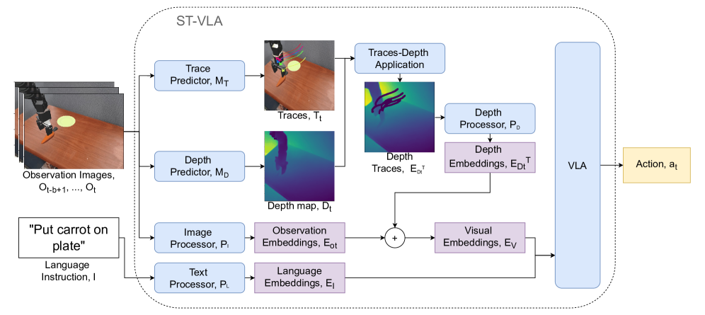

#具身智能 #VLA

# Spatial Traces: Enhancing VLA Models with Spatial-Temporal Understanding
- 论文：[[2508.09032] Spatial Traces: Enhancing VLA Models with Spatial-Temporal Understanding](https://arxiv.org/abs/2508.09032)
- 项目：[ampiromax.github.io/ST-VLA/](https://ampiromax.github.io/ST-VLA/)

## 动机

目前没有工作能同时将空间深度信息和时间关键点轨迹结合起来，本文提出了空间轨迹（Spatial Traces）方法，将两者结合了起来

## 相关工作

SpatialVLA [16] 将深度和自参考几何整合到模型的内部架构中，而 SEM [24] 利用多视角深度图以实现全面的空间理解。

RoboTAP [25] 通过 TAPIR [26] 跟踪关键点以引导代理导航。TraceVLA [21] 在 RGB 图像上叠加来自 CoTracker [27] 的视觉轨迹，增强了对时间理解，同时也提供了原始观察。RT-Trajectories [20] 预测操作器轨迹并将它们可视地嵌入到当前观察中，而 RT-Affordance [22] 可视化识别交互区域。同时，基础模型如 Magma [28] 被训练以预测数字和物理环境中的动作和交互，在统一架构中结合视觉和时间的定位。

## 结构

> 该模型接收一个文本指令和 30 个先前观察的序列作为输入，并预测一个相对于当前位置的动作在三维空间中的相对位移。

### Spatial Traces Algorithm 步骤

符号表示：初始化语言指令 $I$ ,缓冲区大小 $b$ ，以及 $b$ 个 observation $[o_{t-b+1},…,o_t]$ ，新动作 $a_t$ 

1. 预测观测的嵌入 $E_{o_t}:= P_I(o_t)$ 
2. 预测轨迹关键点 $T_t=M_T([o_{t-b+1},…,o_t])$ 
3. 预测深度图 $D_t:=P_D(o_t)$ 
4. 将轨迹应用于深度图上 $D_t^T=D_t \leftarrow T_t$ 
5. 预测深度图嵌入 $E_{D_t^T} = P_D(D_t^T)$ 
6. 汇总视觉嵌入 $E_V = E_{O_t} + E_{D_t^T}$ 
7. 使用 VLA 预测下一步 $a_t = \text{VLA}(E_V, E_t)$ 

## 细节
### 模型细节

使用的图像处理器 $P_I$ 是 Siglip[29]，轨迹预测器 $M_T$ 是 Co-Tracker[30]。深度估计模型 $M_D$ 是 ZoeDepth[31]。以下深度处理器 $P_D$ 是 SpatialVLA 中引入的 Ego3D 位置编码器。机器人操作的动作预测模型基于 PaliGemma2 视觉 - 语言模型 [32]，从 SpatialVLA 实验中使用的检查点初始化。Co-Tracker 模型使用缓冲图像构建关键点轨迹。需要注意的是，Co-Tracker 需要有明显图像差异才好找到点来跟踪，而有时一开始机器人动作缓慢，可能不一定能找到合适跟踪的点，所以在最初的 5 步，我们不进行跟踪。

### 训练细节

使用了 Bridge 数据集，52 个轨迹。对模型所有线性层使用 LoRA，lr=5e-5，batchsize=1，epoch=2，LoRA r=32，使用 AdamW，训练硬件是 TITAN RTX。在 SpatialVLA 上 train 的。

## 评价方式

指标用了目标条件成功率（Goal Condition Success ，GCS）和成功率（Success Rate ，SR）。GCS 是衡量到达任务中某个节点的成功率，SR 则要求完成整个流程才算成功。

## 结论
1. 将关键点轨迹整合道深度图中，可以提点但不多
2. 时间缓冲区越大，结果相对略稳定
3. 轨迹整合到深度图时，轨迹渲染的深度若使用和执行器一样的深度直觉上就好，但是实际不如将轨迹渲染成距离最近物体的深度，因为前者可能导致模型将痕迹认为时操作器一部分导致性能下降。