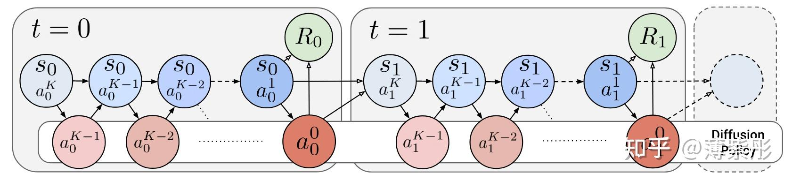

#强化学习 #AI回答 

# 算法理解
## Q

文章是不是将 diffusion 模型每个去噪步骤之后生成的机械臂带噪声的动作指令也视为是 RL 中的一个 action，对于内循环来说，收集到的强化学习数据，a 是当前时间的去噪之后带噪声的 action，s 不变，若当前时间是最后一步去噪，那么奖励就是实际的环境奖励，否则奖励就是 0？

注意这里为了体现 RL 中的探索，diffusion 实际输出的是一个高斯的均值，std 很可能是一个可学习的 `nn.parameter` 或者直接是设定好的固定值。

至于 diffusion 每步去噪的概率比，计算可以参见 [扩散模型如何将每步去噪的比率计算出来用于RL](../../DL_knowlege/扩散模型/扩散模型如何将每步去噪的比率计算出来用于RL.md)

## A

是的，你的理解非常准确。DPPO 的核心思想确实是将 Diffusion Policy 的去噪过程（Denoising Process）本身建模为一个 MDP，并将其嵌入到环境的 MDP 中。

以下是针对你提到的三个关键点的详细确认和细微补充：

### 1. 关于动作 (Action)

是的。在 DPPO 定义的 "Diffusion Policy MDP" 中，每一步去噪的输出确实被视为强化学习中的一个 **Action**。

* 具体来说，在去噪步骤 $k$（从噪声 $a_k$ 到 $a_{k-1}$），策略的输出（即去噪后的动作 $a_{k-1}$）就是这个 MDP 步骤中的 Action 。

### 2. 关于状态 (State)

你的理解基本正确，但有一点细微的区别：虽然**环境状态**（Environment State, $s_t$）在去噪过程中保持不变，但 **Diffusion MDP 的状态**（记为 $\bar{s}$）是变化的。

* 论文将 Diffusion MDP 的状态定义为 $\bar{s} = (s, a_k, k)$。
* 这意味着，虽然环境观测 $s$ 没有变，但随着去噪过程的进行，当前的“噪声动作” $a_k$ 和时间步 $k$ 都在变，因此强化学习的 Policy 输入状态也是在不断变化的。

### 3. 关于奖励 (Reward)

完全正确。这是一种稀疏奖励（Sparse Reward）的设置：

*   **中间步骤 ($k > 0$)**：所有的中间去噪步骤获得的奖励确实都是 **0**。
*   **最后一步 ($k = 0$)**：只有当去噪完成，生成最终动作 $a_0$ 并将其作用于真实环境时，才会获得来自环境的真实奖励 $R(s, a_0)$ 。

### 总结

DPPO 这种设计的精妙之处在于，它利用这种特殊的 MDP 结构，使得我们可以直接计算每一步去噪的似然度（Gaussian Likelihood），从而使用标准的 Policy Gradient 方法（如 PPO）来端到端地微调整个 Diffusion 模型，而不需要像以前的方法那样只把 Diffusion 当作一个生成器 。

## 靠谱参考

