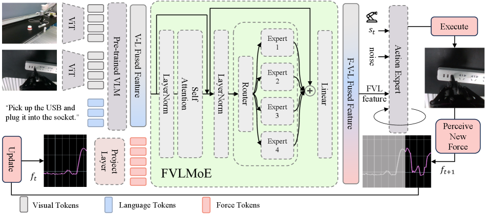
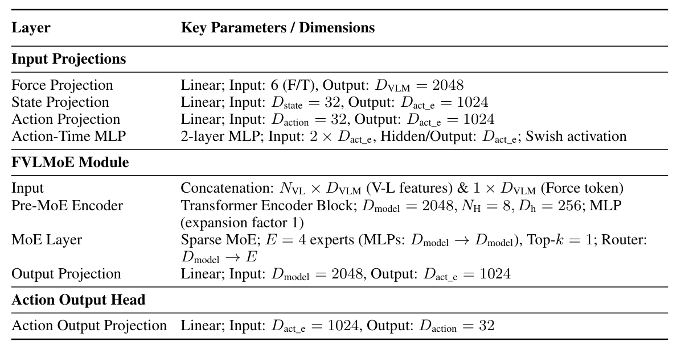

# ForceVLA: Enhancing VLA Models with a Force-aware MoE for Contact-rich Manipulation
## 架构解释

论文中说法：

整个框架依托 pi0 来改，VL 经过 VLM ，force 经过 mlp 编码，最终输出 N+1 个 token，N 为 VL 的数量，然后经过 FVLMoE（专家 4 选 1）.

将 FVLMoE 出来的 token 选最后 action chunk 个和 noise 还有 S_t 逐个元素相加。

这里疑点是论文说是这样，但是 pi0 的结构，suffix 是 action chunk+1 个 token，因为 state 是拼在 1 维上的一个 token，不知道它这里是如何对齐数量的。

# 一些细节
### 数据表示方式

用的 TCP 位姿和夹爪宽度，其中都用绝对值，位姿是欧拉角，六维力也是用世界坐标系表达

### 数采

用 Quest3

### 硬件配置

夹爪：Dahuan 自适应夹爪

机械臂：flexiv rizon 7 自由度

视觉：：一个静态第三人称视角（RealSenseD435，分辨率 1280x720，30FPS）和一个腕部相机（RealSenseD415，分辨率 640x480，30FPS）提供第一人称视角

### 数据集信息

ForceVLA-Data 包含：

244 条轨迹，共计 140 万个同步时间步。图像 640x480，像素做了归一化。包含：瓶装抽吸、插头插入、USB 驱动器插入、白板擦拭，和黄瓜去皮

### 训练细节

8x4090，251RAM，adam ( $\beta_1=0.9,\beta_2=0.95$ ), 峰值 lr=2.5e-5，30000 衰减到 2.5e-6. 多任务用的 2GPUtrain，batchsize 16，然后用梯度累积到 2048. 双 GPU 训练耗时 12 小时，单任务单 GPU10000 步耗时 9 小时，两者使用 bf16 和梯度裁剪（$\|\nabla\| = 1.0$）