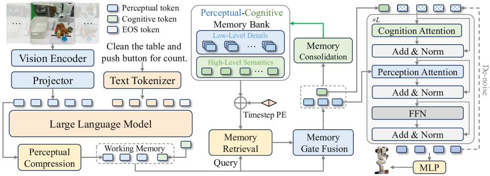
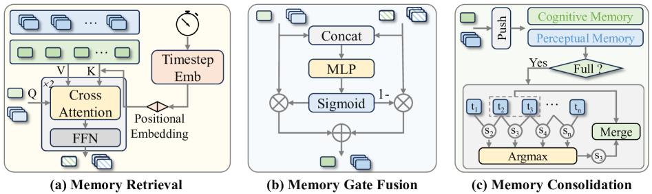

#VLA #具身智能

# MemoryVLA: Perceptual-Cognitive Memory in Vision-Language-Action Models for Robotic Manipulation
- 论文：[[2508.19236] MemoryVLA: Perceptual-Cognitive Memory in Vision-Language-Action Models for Robotic Manipulation](https://arxiv.org/abs/2508.19236)

# 动机

主流 VLA 模型都是走马尔可夫性质的，没有兼顾时间建模。直接讲连续帧作为输入连接 VLM 有两个关键限制：

1. 自注意力机制计算量大
2. 顺序帧输入和模型单帧预测在分布上不匹配

# 相关工作

Octo（Mees 等，2024）、RoboVLMs（刘等，2025a）和 Interleave-VLA（Fan 等，2025）将 VLM 范式应用于以交错图像 - 文本格式建模机器人视频数据。虽然概念上优雅，但这种格式实现复杂且计算成本高昂，阻碍了其广泛应用。

RoboFlamingo（Li 等，2023）将视觉 - 语言表示压缩为潜在标记并通过 LSTM（Hochreiter & Schmidhuber，1997）传播。潜在表示以相对粗略的方式获得，而细粒度的感知历史被大量丢弃。

TraceVLA（Zheng 等，2024b）采取不同的路线，将历史状态绘制为当前帧上的轨迹，但丢弃了丰富的语义细节。

UniVLA（Bu 等，2025b）将过去动作纳入输入提示中，在时间建模方面做出了初步尝试。

# 大体框架

> 图 2：MemoryVLA 的整体架构。RGB 观察和语言指令被一个 7B VLM 编码成感知（perceptual token）和认知标记 (cognitive token)，形成短期工作记忆。工作记忆查询感知 - 认知记忆库（PCMB）以检索相关历史上下文，包括高级语义和低级视觉细节，自适应地将它们与当前标记融合，并通过合并最相似的邻居来巩固 PCMB。记忆增强的标记随后条件化扩散变换器以预测一系列未来动作。

> 图 3：内存模块细节。（a）检索：当前感知和认知标记通过跨注意力机制与时间步长位置编码查询 PCMB，以获取相关历史特征。（b）门控融合：当前和检索到的标记通过门控机制进行自适应融合。（c）巩固：融合的标记被更新到 PCMB 中。当 PCMB 达到其容量时，我们计算相邻条目之间的相似度，并将最相似的配对合并以保持紧凑性。

这里 VLM 就是 OpenVLA 同款 Prismatic VLM-7B。视觉编码是 DINOv2 和 SigLIP，然后拼接通过 SE-bottleneck 压缩标记数量到 256 个，把这个作为（），然后通过投影层到 hidden dim 长度，然后与语言拼接输入到 LLaMA-7B。使用句尾 EOS token 的输出作为认知标记（cognitive token）。

图中 Timestep PE 使用的是正弦嵌入。

当 memory bank 满的时候，使用余弦计算两两相似度，然后取相似度最高的求向量数值上的平局来减少冗余。

动作专家使用 DiT+DDIM，用 10 个去噪步骤来实现轨迹生成。Xz

# 细节

使用相对平移、相对旋转（欧拉角）和二进制夹爪状态来表示动作。

# 实验

测试基准仿真使用了 3 个：

- SimpleEnv-Bridge 与 WidowX
- SIMPLER-Fractal 与 Google Robot
-  LIBERO 与 Franka
真机使用了 Franka 和 WidowX 机器人。

## 训练细节

FSDP，8xA100，gpu batch 32, 全局 batch 256，lr=2e-5，输入单相机单帧 RGB 224x224，语言指令，输出 7 自由度动作，LLM 参数 7B，扩散动作专家 300M。推理时使用 DDIM 进行 10 次采样，使用无分类器引导（CFG），引导比例 1.5.

最大 grad 裁剪 1.0，perceptual token 的通道数为 256，action chunk 16.

#### 仿真训练细节

SimplerEnv-Bridge 实验，使用 Bridge v2 上训练 50k，每 2.5k 验证一次。

SimplerEnv-Fractal 实验，RT1 上训练 80K，5k 验证一次。

#### 真机训练细节

它们都使用固定前视安装的 Intel RealSense D435 RGB 相机。图像在 640×480
 下捕获并下采样到 224×224。系统通过 ROS 集成。对于通用套件，每个任务使用 50-150 个演示，并从随机初始状态进行评估。挑选不同水果包含五个变体，每个变体 5 次试验（总共 25 次）；其他通用任务使用 15 次试验。对于长期时序套件，每个任务使用 200-300 个演示，并使用逐步评分进行 10-15 次试验，以反映对子目标的进展。训练运行大约为 5k-20k 步，具体取决于任务和数据大小。