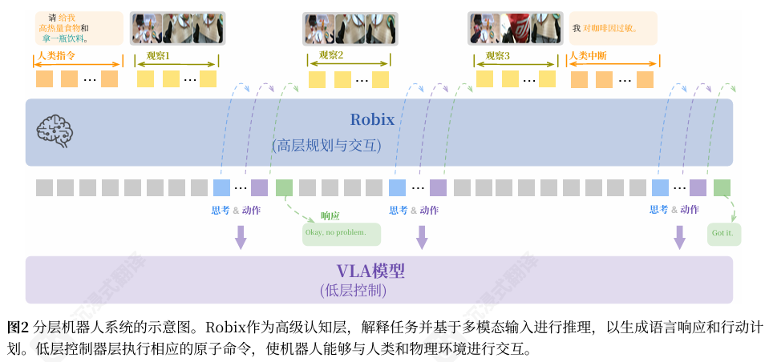
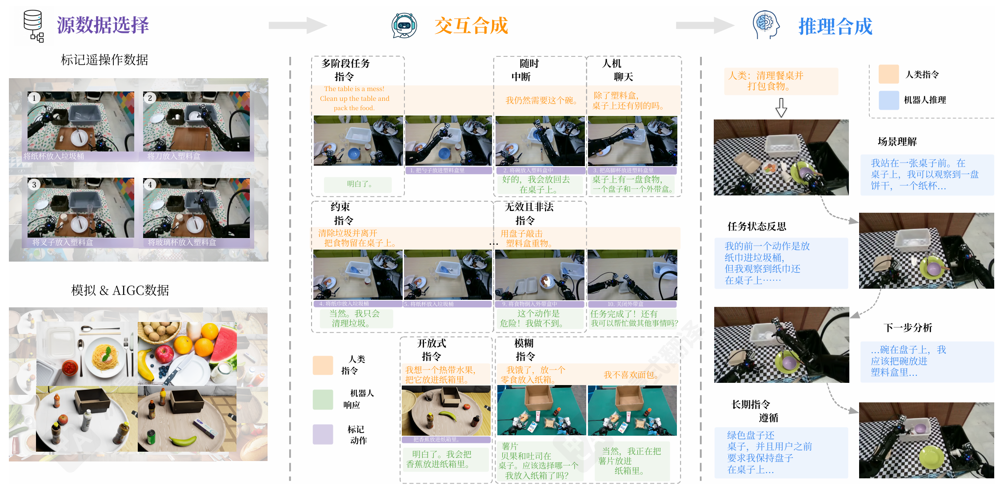

# Robix: A Unified Model for Robot Interaction, Reasoning and Planning

- 项目地址: [Robix | ByteDance Seed](https://robix-seed.github.io/robix/)
# 动机

手工设计的推理规划工作流脆弱。提出了 Robix，在单个模型内无缝集成推理，任务规划和自然语言交互，为交互式任务设计。

# 架构

# 训练

用 Qwen2.5VL-7B 和 32B，200B 的 token 量。

三阶段训练方式：

## 通用 VLM 持续预训练

构建一个涵盖多种机器人相关任务的超大规模数据集，增强其 3D 空间理解，视觉定位和任务推理能力

### 3D 空间理解数据构建

如上图，基本是从 ScanNet，ScanNet++，3RScan，CA-1M，SUN RGB-D，ARKitScenes 派生来的

### 视觉定位

包含 2D 边界框标注、点标注、计数和视觉提示。将所有坐标值归一化到范围 [0,1000],，从而允许在不同图像分辨率下进行一致的 grounding 预测。我们的数据集包含超过 5000 万个指令对（约 70B 标记）

### 任务中心推理

包括 AgiBot,BridgeData V2, Droid, Egodex, RoboVQA,HoloAssist, 和 Ego4D 等公开数据集，超过约 10B 的 token，500 万个示例。其中为了丰富推理过程，进一步使用了 seed-1.5-vl-thinking 来生成思维轨迹。

### 通用多模态推理

超过 600 万多模态指令图像对（10B 个 token），包括：

1. STEM 推理数据：数学、物理、化学和生物中的多模态问题解决示例，结合文本问题与图表、方程式和视觉内容。
2. 多模态代理数据：基于 GUI 的代理演示，涉及逐步规划、错误纠正和反思性推理。 
3. 视觉推理数据：需要基于视觉的推理的任务，包括识别配对图像之间的差异以及根据用户界面截图生成 HTML/CSS 代码

### 通用多模态理解

超过 5000 万个图像文本对 (80B 个 token)，包括：

1. VQA：一组多样化的基于图像和视频的问答任务，涵盖视觉感知、事实知识、grounding、时间推理、空间理解和计数。
2. 图像描述： 图像和视频的密集描述，支持模型对静态场景和多帧时间动态的理解。
3. 光学字符识别：为了提高文本识别能力，我们包含大规模的标注和合成数据集，涵盖场景文本、文档、表格、图表和流程图

### 指令微调数据集

100 万示例。使用 seed-1.5-VL 进行质量过滤

### 参数
- Lr: 1e-5~1e-6
- Warmup: 前 10% 线性
- Voc size：32768
- Batch size: 7B 模型 1536，32B 模型 3008
- Optimizer：adamw， $\beta_1=0.9,\beta_2=0.99$ 
- Weight decay：0.01

这阶段依然预训练两次，第一次全参。第二次使用指令微调数据集，冻结 V，lr 固定 1e-6，优化器保持状态不变。

## 监督微调

设计了一个数据合成的 pipeline，主要来生成多样化的人机交互和高质量的推理轨迹。

#### 真实数据

采用了 GR-3 和 AGIBot 数据集，然后人工标注片段，每个片段对应一个原子动作，选至少 10 个原子动作以上的轨迹。原子动作之间不重叠

#### 合成数据

模拟器生成的场景使用 LLM 来生成指令，然后用 seedream2.0 来在模拟器数据中加入一些模拟器不支持的物品。

#### 随时中断数据

在任务流程中随机注入中断。抓之前注入，那么机器人停止或调整计划；抓之后注入，机器人把东西放回桌子并重新规划。

#### 无效指令

操作场景中不存在的物品，进行物理上不可能动作，超出机器人能力范围，危险指令这些都属于无效指令。
#### 模糊指令
构建了一些未指明物体的指令，让机器人可以追问

#### 聊天指令

## 强化学习

进一步优化推理能力，增强推理和动作之间一致性