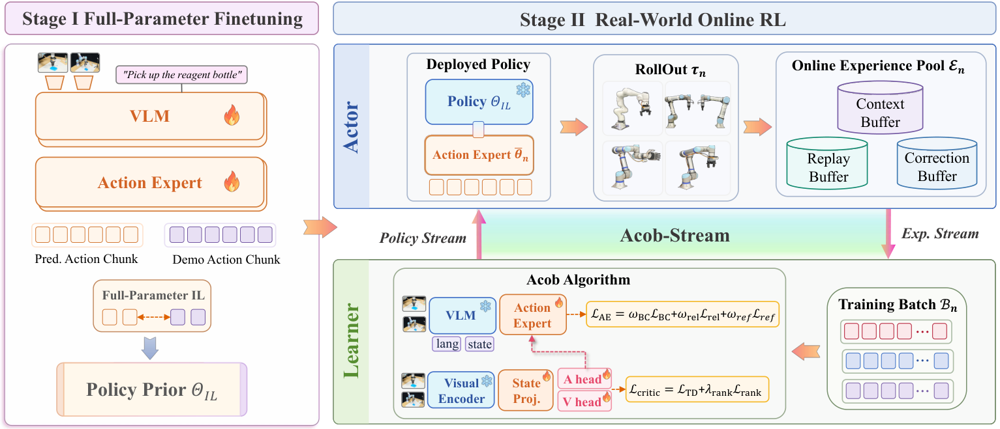
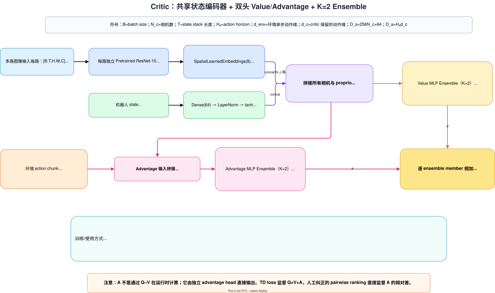

---
tags:
  - "#VLA"
  - "#强化学习"
---

[toc]

# VLA-Precision: Asymmetric Co-Bootstrapping for Efficient Real-World Online RL of Vision-Language-Action Models
- 论文：<https://arxiv.org/abs/2609.04355v2> 

## 动机

真机 RL 的 VLA 两个瓶颈：

- 不可靠 value 信号可能导致策略漂移（提出非对称协同自举 Asymmetric Co-Bootstrapping,ACoB）
- 大型 VLA 开销吞吐量和样本效率（提出 ACoB-Stream 解决）
## 相关工作
### 基于仿真的 VLA RL 后训练
- RIPT-VLA: 将动态推演采样于留一法优势估计相结合
- VLA-RL：结合了轨迹积极强化学习与过程奖励
- SimpleVLA-RL：结合 VLA 专用采样和并行渲染
- PiRL：构建了可处理的死然来用于流策略
- RL-Co：利用真实演示对基于仿真的 RL 进行正则化
- WoVR：控制想象动力学提升跨机器人平台的成功率
### 真机 RL 后训练
- HIL-SERL
- ConRFT: 在 Octo 表征上采用离线到在线强化学习，但 Q 值最大化牺牲了先验性能并引发了策略漂移
- Robo-Dopamine: ConRFT 基础上添加基于进度的大型奖励模型
- RL-100: 将离线到在线的强化学习应用于扩散网络，但收敛缓慢
- PI 06*: 平均任务需要 1 K 次以上真机 rollout
- RLT： 关键阶段吞吐提升了 3 X，但每个任务人需要 400~1000 回合
- EXPO-FT： 优化残差动作编辑，避免将 RL 梯度反传给 VLA

## 方法

> VLA-Precision 的两阶段后训练流程。在阶段 I 中，基于演示数据的全参数模仿学习建立了特定任务的策略先验 $\Theta_{\mathrm{IL}}$ 。以 $\Theta_{\mathrm{IL}}$ 进行初始化，阶段 II 中的真实世界在线强化学习被形式化为异步 actor–learner 过程下的闭环经验–策略优化问题，其中 rollout 生成在线经验，learner 优化产生动作专家更新以供重新部署。

### Asymmetric Co-Bootstrapping

可靠的价值学习既需要长时程回报估计，也需要细粒度的信用分配。前者捕捉累积的行为后果，而后者则强化了策略改进信号。

即： 

$$
\mathcal{L}_{\text{critic}} = \mathcal{L}_{\text{TD}} + \lambda_{\text{rank}}\mathcal{L}_{\text{rank}} \tag{10}
$$ 

为了联合学习这两种信号，ACoB 将价值模型实例化为包含 K 个任务特定的 Critic 的集成。每个 critic 估计价值 Q=V+A。其中 V 为状态价值，只看当前视觉和机器人状态，A 为动作优势，看当前状态和候选动作。

#### 全局回报

就是求一个动作块的 TD，典型如原始公式 7:

$$
 \mathcal{L}_{\mathrm{TD}}(\phi) = \mathbb{E}_{\mathcal{B}_n^{\mathrm{RL}}} \left[ \frac{1}{K} \sum_{k} \left( Q_{\phi_k}(\omega_t, \hat{a}_t^{\mathrm{exec}}) - \mathrm{sg}(y_t) \right)^2 \right], \tag{7} $$
这里 $\omega_{t+1} = (o_{t+1}, q_{t+1}) = \text{proj}_{o,q}(s_{t+1})$ 就是观测+本体感受， $\hat{a}_t^{\mathrm{exec}}$ 是 OpenPI 归一化的 action，且排除了未激活的动作维度。
$$

\begin{aligned} \hat{a}_{t+1}^{\theta_n} &= \mathcal{C}\left(\widetilde{G}_{\psi, \theta_n}(z_{t+1}, \epsilon)\right), \quad \epsilon \sim \mathcal{N}(0, I), \\ y_t &= R_t^{(H)} + \bar{\gamma}(1 - d_t) \min_k Q_{\bar{\phi}_k}(\omega_{t+1}, \hat{a}_{t+1}^{\theta_n}). \end{aligned} \tag{6}

$$
$\hat a_{t+1}^{\theta_n}$ 为 learner policy $\theta_n$  t+1 时刻生成的去除了未激活动作维度的 action。
$\hat a_t^{\mathrm{exec}}$ 为动作 policy 在 t 时刻指定的 action chunk。公式 7 中 sg 表示不对生成 y 的 critic 更新参数。

#### 局部回报
形式化公式如下：
$$

\begin{aligned} 

\mathcal{L}_{\mathrm{rank}}(\phi) &= \mathbb{E}_{\xi_t \sim \mathcal{B}_n^{\mathrm{RL}} \mid c_t = 1} \left[ \frac{1}{K} \sum_{k=1}^K \left[ m_c - \Delta A_{t,k}^{\mathrm{pair}} \right]_+^2 \right], \\ \Delta A_{t,k}^{\mathrm{pair}} &= A_{\phi_k}(\omega_t, \hat{a}_t^{\mathrm{exec}}) - A_{\phi_k}(\omega_t, \hat{a}_t^{\mathrm{prop}}), 

\end{aligned} \tag{9}

$$
实际实现中使用了 2个critic，critic的结构如下：

$m_c=0.05$ ,即实际执行的时，只有“有效人工介入，并且修正动作确实不同于原 policy 动作”的样本，才会对论文公式（9）的 $L_{\mathrm{rank}}$ 产生非零贡献。

### 相对优势策略改进
整个 action expert的损失为：
$$

\mathcal{L}_{\mathrm{AE}} = w_{\mathrm{BC}} \mathcal{L}_{\mathrm{BC}} + w_{\mathrm{rel}} \mathcal{L}_{\mathrm{rel}} + w_{\mathrm{ref}} \mathcal{L}_{\mathrm{ref}}, \tag{15}

$$

 $\mathcal{L}_{\mathrm{rel}}$ 、 $\mathcal{L}_{\mathrm{BC}}$ 和 $\mathcal{L}_{\mathrm{ref}}$ 分别表示相对优势强化学习、行为克隆以及参考正则化。

####  相对优势强化学习
$$

\mathcal{L}_{\text{rel}}(\theta) = \mathbb{E}_{\xi_t \sim \mathcal{B}_n^{\text{RL}}, \epsilon}\left[\kappa \operatorname{softplus}\left(\frac{m_\pi - \Delta A_t}{\kappa}\right)\right], \quad (12)

$$

$$

\begin{aligned} 

b_{t,k} &= A_{t,k}^{\text{ref}} + c_t \left[ A_{t,k}^{\text{prop}} - A_{t,k}^{\text{ref}} \right]_+, \\ \Delta A_t &= \min_k \left[ A_{t,k}^{\theta} - \text{sg}(b_{t,k}) \right]. 

\end{aligned} \quad (11)

$$

$softplus(x)=log(1+e^x)$ 
这里 $A_{t,k}^{prop}$ 是采样出的样本中当时VLA提出的动作优势， $A_{t,k}^{ref}$ 是当前被冻结的VLA输出的动作的优势， $A_{t,k}^\theta$ 是当前正训练的VLA提出的动作优势。人类有效纠偏的时候 $c_t=1$ 否则为 0。
#### 参考正则化 
$$

 \mathcal{L}_{ref}(\theta)=\mathbb{E}_{\xi_t\sim\mathcal{B}_n,\epsilon}\left[\frac{1}{Hd_b}\Vert{}P_b(\tilde{a}_{t,0:H}^\theta - \tilde{a}_{t,0:H}^{ref})\Vert{}_F^ 2\right]  \quad (14)

$$
$\tilde{a}_{t,0:H}^\theta$ 是正在训练VLA的动作类似 $A_{t,k}^\theta$ ， $\tilde{a}_{t,0:H}^{ref}$ 是冻结策略生成的动作类似 $A_{t,k}^{ref}$ ，H是action chunk 长度， $d_b$ 是筛选完的单个动作的维度， $P_b$ 就是个mask用来屏蔽不需要的动作维度。

### ACoB-Stream 架构
用了重放缓冲区 $\mathcal{R}$ 、校正缓冲区 $\mathcal{C}$ 和上下文缓冲区 $\mathcal{K}$ 来保存数据。训练的时候 VLM 是冻结的，所以直接缓存了 observation 的 KV cache 到上下文缓冲区 ,注意这里将序列中无信息的 Padding Token都删除了。

系统根据当前主机 CPU 物理内存中能够容纳的 **Linux Page-Cache（系统页缓存）容量上限**，划定一个时间上的“滑动窗口” 。Replay Buffer 采样时，**只在这个活跃窗口的索引范围内进行重放** 。

### State-action 表征
状态使用相较回合开始的 TCP 位姿，TCP 速度，力和力矩，夹爪状态。
动作指令使用 相较上一步TCP 变化量。（同构的指令会转成 TCP 增量）
统一用 15 Hz 采集记录。

### 控制
UR 5 e 和 franka自己实现了力阻抗模式下的笛卡尔控制

## 关于动作指令的参考系
文中动作指令用了两种方法：
- 步进增量（step-wise Deltas）
-  块级增量（action chunk deltas）
#### 步进增量
原理： 每个控制指令都是相较上个时间步的增量
优势：位移小，目标值分布紧凑有界好学
缺点：有累计误差，每次执行的步数越多误差越大，文中从 3 增加到 6，成功率从 58 掉到 6.7

#### 块级增量
原理：每个控制指令是相较于 action chunk 开始时的增量
优势：误差控制好
缺点：难学一些，尤其 action chunk 大的时候

## 关键信息
1. 通过 LoRA 来调的 pi 05
2. 长序列柔顺交互基于同构摇操，姿态变化基于键盘摇操（笛卡尔增量）。（同构摇操直接输出关节映射）