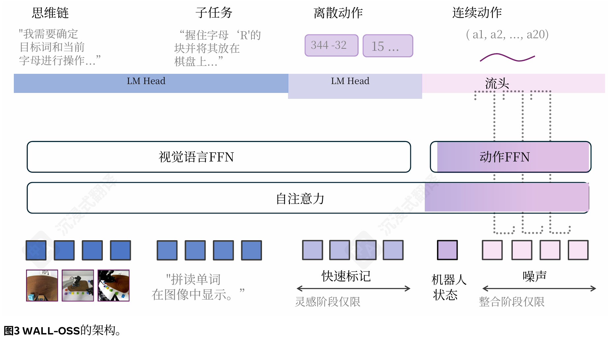
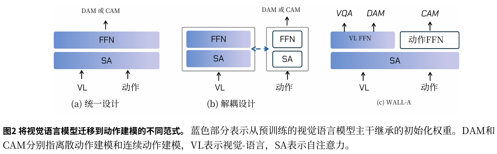

#VLA #具身智能 

# Igniting VLMs toward the Embodied Space
- 代码：[X-Square-Robot/wall-x: Building General-Purpose Robots Based on Embodied Foundation Model](https://github.com/X-Square-Robot/wall-x)

# 动机

VLA 中间存在的问题：

1. 简单动作头附加到 VLM 会导致严重的权重漂移，使用 pi0.5 那种结合自回归和扩散的松散结构实际上不利于语义和控制的绑定
2. VLM 本身对三维空间能力就差
3. 子任务和具体动作通常抽象成单独文本指令，不好跨模态关联
4. 基于管道工作流的智能体，其接口不可微分且存在误差累积，长时序任务成功率不行
5. 使用 3D 数据的方法，其基础 3D 模型如 VGGT 和 pi3 的精度仍然不够

# 架构

主干使用 QwenVL2.5-3B，输入包括视觉和文本。

## 训练阶段
### 灵感阶段 (Inspiration Stage)

重用预训练 VLM 的 FFN，然后使用 FAST token 化动作。训练任务包括思维链推理，子任务预测和离散动作预测，前两者提供具身空间理解能力，后者提供粗粒度动作理解。

### 整合阶段 (Integration Stage)

分两阶段：

1. 冻结 VL 模型，将 FAST 替换成 flow matching，仅训练 flow matching 部分的 FFN
2. 解冻 VL，进行联合优化。

二阶段联合优化目标为：

$$
\min_{\theta} \mathbb{E}_{(v, x, c, a)} \left[ \ell_{\text{act}}(F_{\theta}(v, x, c), a_{1:T}) + \lambda \ell_{\text{VQA}}(H_{\theta}(v, x), y) \right],
$$

其中 $v$ 为视觉输入， $x$ 为语言指令， $c$ 为可选思维链， $a_{1:T} \in \mathbb{R}^{T \times d}$ 为目标动作轨迹，联合 CoT 会训练一个具有路径丢弃目标的统一预测器 $F_{\theta}$ 。 $H_{\theta}$ 为具有监督信号 $y$ 的具身感知问答头。

# 训练数据集

超过 10000 小时。

构建了一个用于细粒度步骤标注的多模型管道，并支持人工抽查。

我们强制执行多传感器时间戳同步、异常值过滤、低质量/空闲帧移除、基于规则的验证以及人工审核和自动增强（光照/背景）。

### 一些数据集处理方法
#### 标准化

为了实现跨异构来源的稳定关节预训练，我们强制执行统一规范：

1. 坐标系和单位（位置使用米；角度使用弧度）；
2. 通过具有掩码/占位符以处理单臂/双臂、轮式和人形平台缺失关节的最大表达自由度模板进行形态归一化；
3. 通过统一内参/外参和时间戳、重采样帧率/分辨率以及通道对齐多视角视频来实现感知对齐；
4. 通过标准化控制频率并将轨迹重采样/插值到流匹配网格来进行动作时间基准归一化。此协议减少了跨来源摩擦并提高了优化稳定性。

# 一些经验
## 现有 VLA 架构范式

Pi0 就是典型解耦设计，但是这种设计 VL 仅作为动作生成辅助信号，削弱了动作指令跟随能力。