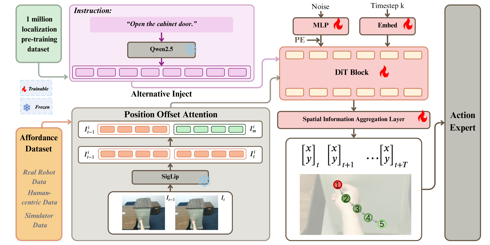

#具身智能 #VLA 

# A0: An Affordance-Aware Hierarchical Model for General Robotic Manipulation

机器人操作核心难点是解决物体在哪和如何夹的问题。

## 架构

视觉编码器 siglip 和文本编码器 qwen2.5-7b ，然后两者通过 crossattention 进行整合，作为 diffusion 的条件。输入有两张连续帧，然后用下一帧减去上一帧的图像 token，然后再和上一帧在 token 维度上拼起来。然后添加正弦位置嵌入，用来帮助模型依据时间步长和视点来区分图像。

## 推理

使用分成结构，Dit 输出固定摄像头上的轨迹点，然后将轨迹点进行用 graspNet 生成动作

## 训练
### 预训练

使用 pixmo-one-point 训练 A0 通用物体定位能力。仅使用本帧图像通过视觉编码器，然后预测第一个路径点。损失使用 MSE

### 监督训练

使用语言指令和图像作为输入，dit 输出路径点

# 解读参考

[(27 封私信 / 2 条消息) 中山大学最新！A0：一种用于通用机器人操作的功能感知分层模型 - 知乎](https://zhuanlan.zhihu.com/p/1897835035593250206)
